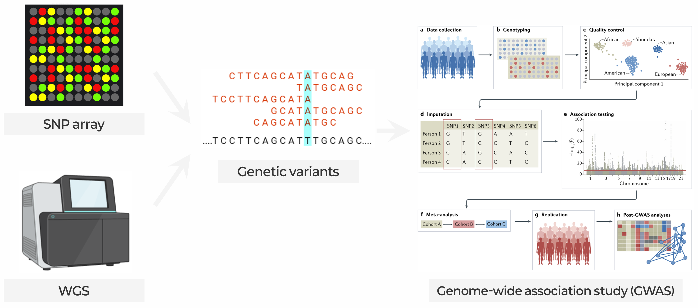

::: {.callout-note collapse="true"}
## 🎯 학습목표

이 장을 마치면 다음을 할 수 있어야 합니다.

-   인간 유전 변이의 종류와 각 변이를 검출할 수 있는 플랫폼을 설명한다.
-   Variant call이 관찰값이 아니라 확률적 주장인 이유를 설명한다.
-   Manhattan plot, QQ plot, regional association plot을 읽는다.
-   연관불평형(linkage disequilibrium) 때문에 GWAS hit가 단일 변이가 아닌 *영역*을 가리키는 이유를 설명한다.
-   가장 가까운 유전자가 흔히 원인 유전자가 아닌 이유와 fine-mapping의 역할을 설명한다.
-   Polygenic risk score가 할 수 있는 일과 할 수 없는 일을 포함해 정직하게 해석한다.
-   유전학 연구 결과가 과장되는 경우를 알아본다.
:::

> 🤔 **출발 질문**
>
> 두 사람의 유전체는 대략 400만–500만 위치에서 다릅니다. 그중 어떤 차이가 질병을 일으킬까요?



------------------------------------------------------------------------

# 1. 인간 유전 변이 🧬 {#w2-s1}

## 1) 변이의 종류 {#w2-s1-1}

일반적인 인간 유전체를 참조서열과 비교하면(🔗 [W1 §2.3](w1_intro.qmd#w1-s2-3)) 다음 변이가 있습니다.

-   **약 400만–500만 개**의 단일염기변이와 짧은 indel
-   **약 20,000–25,000개**의 구조 변이(structural variant)

⚠️ 두 번째 숫자는 훨씬 작지만 구조 변이가 영향을 주는 **전체 염기 수**는 모든 SNV의 합보다 많습니다. 개수와 영향이 반대 방향을 가리키며, 이 차이가 필요한 기술을 결정합니다.

{fig-align="center"}

### ① SNV와 짧은 indel {#w2-s1-1-1}

-   **SNV** — 염기 하나가 바뀐 변이
-   **Indel** — 짧은 삽입 또는 결실
-   사람들이 보통 “변이”라고 부르는 것으로, array·exome·표준 short-read 파이프라인이 잘 검출합니다.

💡 용어: **SNP**의 P는 *polymorphism*으로 흔한 변이에 주로 쓰고, **SNV**는 체세포·희귀 변이를 포함한 모든 단일염기 변화를 뜻합니다. 다만 문헌에서 일관되게 구분하지는 않습니다.

### ② 구조 변이와 copy number {#w2-s1-1-2}

약 50 bp보다 큰 결실, 중복, 삽입, 역위, 전좌를 통틀어 구조 변이라고 합니다. 이 중 **CNV**는 copy number, 즉 용량을 바꾸는 변이입니다.

⚠️ **Short read는 구조 변이를 잘 검출하지 못합니다.**

-   150 bp 리드는 10 kb 결실 전체를 가로지를 수 없습니다.
-   → Short read의 SV calling은 비정상적인 read-pair 거리, coverage 감소, split read 같은 간접 신호로 추론합니다.
-   → 위양성률이 높습니다.
-   → Long read가 필요한 가장 강력한 이유입니다(🔗 [W1 §2.1③](w1_intro.qmd#w1-s2-1-3)).

### ③ Tandem repeat {#w2-s1-1-3}

-   짧은 서열이 머리에서 꼬리 방향으로 반복되며 사람마다 copy number가 다릅니다.
-   반복서열 확장은 Huntington disease, fragile X와 점점 더 많은 신경계 질환을 일으킵니다.
-   ⚠️ 표준 short-read 파이프라인에서는 거의 보이지 않습니다. 흔한 질병에 대한 기여도 이제야 체계적으로 평가되고 있습니다.

::: {.callout-warning collapse="true"}
## 모든 기술에는 사각지대가 있습니다

“유전자 X에서 유의한 변이가 없다”는 말의 정확한 의미는 **이 분석법이 검출할 수 있는 유형의 변이가 없다**는 것입니다.

Exome 결과가 음성이어도 다음 변이에 대해서는 아무것도 말할 수 없습니다.

-   Intron 변이
-   구조 변이
-   반복서열 확장
:::

------------------------------------------------------------------------

## 2) 대립유전자 빈도: 흔한 변이와 희귀 변이 {#w2-s1-2}

**대립유전자 빈도(allele frequency)**는 한 집단의 염색체 중 특정 allele을 가진 비율입니다.

-   **흔한 변이** — minor allele frequency(MAF)가 1–5% 이상
-   **희귀 변이** — 그 미만

이 숫자 하나가 연구 설계의 거의 모든 것을 결정합니다. **빈도와 효과 크기는 역관계**이고 여기에는 이유가 있습니다.

-   해로운 효과가 강한 변이는 자연선택으로 제거됩니다.
-   → 흔하면서 손상 효과도 큰 변이라면 이미 제거되었거나 수십 년 전에 발견되었을 것입니다.

{fig-align="center"}

이 그림은 분야의 역사이기도 합니다.

-   **1980–1990년대** 가족 linkage 연구 → 왼쪽 위(Mendelian disease)
-   **2007년 이후** GWAS → 오른쪽 아래(흔한 변이, 매우 작은 효과)
-   **가운데 영역** → 촘촘한 imputation과 biobank 규모 표본이 모두 필요했고 아직 채워지는 중입니다.

💡 **참조 자료** — [gnomAD](https://gnomad.broadinstitute.org/)는 수십만 exome과 수만 genome의 대립유전자 빈도를 ancestry별로 제공합니다. “이 변이가 희귀한가?”라는 질문에는 반드시 *어느 집단에서*인지가 따라야 합니다.

------------------------------------------------------------------------

## 3) Germline과 somatic {#w2-s1-3}

| | Germline | Somatic |
|---|---|---|
| 존재하는 곳 | 모든 세포 | 일부 세포 |
| 유전 여부 | 유전됨 | 유전되지 않음 |
| Allele fraction | 약 0.5 또는 1.0 | 0.01 미만부터 1.0까지 가능 |
| 필요한 대조군 | 참조 유전체 | **같은 사람의 matched normal tissue** |
| 대표 depth | 30× | 100–500×, 때로는 그 이상 |

분석상의 결과는 다음과 같습니다.

-   **Germline caller** — 50/50 또는 100/0처럼 뚜렷한 allele fraction을 기대합니다.
-   **Somatic caller** — 세포 3%의 실제 돌연변이와 리드 3%의 시퀀싱 오류를 구분해야 합니다.
-   → 종양 시퀀싱에 훨씬 높은 depth와 matched normal이 모두 필요한 이유입니다.

------------------------------------------------------------------------

# 2. 리드에서 변이까지 🔬 {#w2-s2}

## 1) 개념적 파이프라인 {#w2-s2-1}

```         
FASTQ  →  참조서열에 정렬  →  BAM
       →  시료별 variant calling
       →  코호트 전체 joint genotyping
       →  품질 필터링
       →  VCF
```

두 단계는 따로 살펴볼 가치가 있습니다.

-   **Joint calling** — 시료를 하나씩 보지 않고 모두 함께 분석합니다.
    -   “이 위치가 homozygous reference”인 경우와 “이 위치에 coverage가 없음”을 구분합니다.
    -   → 단일 시료 VCF에서는 보이지 않는 차이입니다(🔗 [W1 §2.2③](w1_intro.qmd#w1-s2-2-3)).
-   **Filtering** — 판단이 가장 많이 개입하는 단계입니다.
    -   Caller는 실제 변이보다 훨씬 많은 후보를 만듭니다.
    -   Coverage, strand balance, mapping quality, 리드 내 위치 등을 기준으로 거릅니다.
    -   ⚠️ 같은 데이터도 필터 설정에 따라 변이 집합이 의미 있게 달라집니다.

## 2) ⚠️ Variant call은 확률입니다 {#w2-s2-2}

::: {.callout-warning collapse="true"}
## 이 절에서 가장 중요한 개념

VCF는 사실의 목록처럼 보이지만 실제로는 각각 신뢰도가 붙은 **추론의 목록**입니다. 신뢰도는 유전체 위치에 따라 크게 달라집니다.

**정확도가 높은 곳** — 고유하고 coverage가 충분한 서열

**정확도가 급격히 떨어지는 곳** —

-   반복서열과 segmental duplication
-   Capture나 amplification이 잘 되지 않는 극단적인 GC 영역
-   Homopolymer run(indel 오류)
-   HLA처럼 다형성이 큰 locus. 참조서열과 다른 haplotype의 리드가 잘 정렬되지 않습니다.

→ [Genome in a Bottle](https://www.nist.gov/programs-projects/genome-bottle) 같은 benchmark가 필요한 이유는 “정확도”가 하나의 숫자가 아니기 때문입니다. **정확도는 지도입니다.**
:::

## 3) 플랫폼 선택 {#w2-s2-3}

{fig-align="center"}

| | WGS | WES | Array |
|---|---|---|---|
| 포괄하는 유전체 | 약 100% | 약 1–2%(coding) | 약 0.02%(선정된 위치) |
| 새로운 변이 검출 | ✅ | ✅(coding만) | ❌ |
| 구조 변이 | 부분적(long read는 우수) | 좋지 않음 | 큰 CNV만 |
| Non-coding 조절 변이 | ✅ | ❌ | Imputation을 통해서만 |
| 시료당 상대 비용 | 높음 | 중간 | 매우 낮음 |
| 대표 용도 | 심층 분석, 희귀질환, SV | 희귀질환, 임상 panel | GWAS, biobank |

::: {.callout-tip collapse="true"}
## Array가 여전히 GWAS의 주력인 이유

Array는 미리 선정한 위치만 측정하므로 새로운 것을 직접 발견할 수 없습니다. 그래도 집단유전학의 주력입니다.

-   GWAS에서는 완전한 유전체보다 **수십만 명의 표본**이 훨씬 중요합니다.
-   Array가 측정하지 않은 위치는 통계적으로 복원할 수 있습니다.

→ 이것이 imputation입니다.
:::

## 4) Imputation {#w2-s2-4}

**전제** — 가까운 변이들은 하나의 block으로 함께 유전됩니다([§3.6](#w2-s3-6)). 한 변이를 측정하면 이웃 변이에 대해서도 많은 것을 알 수 있습니다.

**방법** — Array로 측정한 약 50만 위치의 genotype과 촘촘하게 시퀀싱한 참조 패널을 이용해 측정하지 않은 수천만 위치의 genotype을 통계적으로 추론합니다.

-   **참조 패널** — 1000 Genomes, HRC, TOPMed. 더 크고 다양한 패널일수록, 특히 더 희귀한 변이에서 imputation이 좋아집니다.
-   **품질 점수** — INFO 또는 *r*². 관례적으로 0.3–0.8 미만의 변이를 제거합니다.

::: {.callout-warning collapse="true"}
## Imputation 품질은 균일하지 않습니다

**잘 작동하는 경우** — 흔한 변이, 참조 패널에 충분히 포함된 집단

**잘 작동하지 않는 경우** — 희귀 변이, 참조 패널에서 과소대표된 ancestry. 역사적으로 세계 인구 대부분이 이에 해당합니다.

Imputed genotype은 **예측값**입니다. 예측을 측정값으로 취급하면 잘못된 연관성이 문헌에 들어옵니다.

🗺️ 가장 중요한 형태의 **참조 편향**입니다(🔗 [W1 §2.3③](w1_intro.qmd#w1-s2-3-3)).
:::

------------------------------------------------------------------------

# 3. 전장유전체연관분석(GWAS) 📈 {#w2-s3}

## 1) 연구 설계 {#w2-s3-1}

| 설계 | Outcome | 설명 |
|---|---|---|
| **Case–control** | 이분형(질병/비질병) | 효과를 odds ratio로 보고 |
| **Quantitative trait** | 연속형(BMI, 혈압, 지질 수치) | 일반적으로 시료당 검정력이 더 높음 |
| **Biobank/PheWAS** | 수천 phenotype을 동시에 분석 | 한 genotype 집합으로 여러 outcome 분석([§6](#w2-s6)) |

어떤 설계에서도 핵심 논리는 같습니다. **각 변이에서 genotype이 phenotype과 연관되는지 묻고 이를 수백만 번 반복합니다.**

## 2) 집단 구조와 ancestry {#w2-s3-2}

### ① Genotype PCA {#w2-s3-2-1}

-   집단 사이의 allele frequency가 체계적으로 다르기 때문에 genotype matrix의 PCA는 ancestry를 거의 완벽하게 복원합니다.
-   → 상위 PC를 집단 구조를 설명하고 보정하는 표준 방법으로 사용합니다.

{fig-align="center"}

### ② 교란요인으로서의 ancestry {#w2-s3-2-2}

🔗 [W1 §4.3](w1_intro.qmd#w1-s4-3)에서 본 교란이 유전학에서 나타나는 대표적인 형태입니다.

-   Case와 control의 ancestry가 다릅니다.
-   → **두 ancestry 사이에서 빈도가 다른 모든 변이가 연관성을 보입니다.**
-   → 원인 관계가 전혀 없어도 발생합니다.

**표준 방어 방법**은 다음과 같습니다.

-   상위 genotype PC 약 10개를 공변량으로 포함하거나
-   유전적 relatedness를 직접 반영하는 mixed model을 사용합니다.

⚠️ 어느 방법도 완벽하지 않습니다. 특히 한 국가 안의 미세한 구조 같은 잔여 집단 구조는 여전히 해결 중인 문제입니다.

::: {.callout-warning collapse="true"}
## 인간 유전학의 유럽 중심 편향

현재까지 GWAS 참여자의 대다수는 세계 인구 비율과 맞지 않게 유럽계에 치우쳐 있습니다. 그 결과는 누적됩니다.

-   참조 패널은 비유럽계 유전체를 더 부정확하게 imputation합니다.
-   발견된 연관성은 유럽계 LD pattern으로 tag되어 다른 집단에 그대로 이전되지 않습니다.
-   Polygenic score는 ancestry가 달라지면 정확도의 상당 부분을 잃습니다([§5.3③](#w2-s5-3-3)).
-   임상 변이 데이터베이스는 연구가 부족한 집단에서 흔하고 양성인 변이를 잘못 분류합니다.

이는 형평성만의 문제가 아니라 **타당성 문제**입니다. 한 집단에 기반한 과학은 일반화되지 않으며, 직접 시험하기 전에는 오류의 크기도 알 수 없습니다.

💡 최신 수치는 [GWAS Diversity Monitor](https://gwasdiversitymonitor.com/)에서 확인할 수 있습니다.
:::

## 3) 연관성 검정 {#w2-s3-3}

각 변이에 독립적으로 다음과 비슷한 모형을 적합합니다.

$$
\text{phenotype} \sim \text{genotype} + \text{age} + \text{sex} + \text{PC}_1 + \dots + \text{PC}_{10}
$$

-   Genotype을 effect allele의 개수인 **0/1/2**로 코딩하므로 **additive model**을 가정합니다.
-   대체로 합리적이며 거의 항상 사용하는 가정입니다.
-   ⚠️ 열성 효과를 효율적으로 검출하지 못한다는 뜻이기도 합니다.

**현대의 표준**인 linear mixed model(BOLT-LMM, SAIGE, REGENIE)은:

-   Relatedness와 집단 구조를 함께 처리하고
-   Biobank에서 흔한 극도로 불균형한 case-control 비율에서도 더 잘 보정됩니다.

## 4) 두 가지 표준 그림 읽기 {#w2-s3-4}

### ① Manhattan plot {#w2-s3-4-1}

{fig-align="center"}

다음 순서로 확인합니다.

1.  **탑이 있는가?** → 선 위에 홀로 떨어진 점은 발견보다 인공물일 가능성이 큽니다.
2.  **탑이 얼마나 넓은가?** → 진짜 신호에는 함께 지지하는 변이들의 어깨가 있습니다.
3.  **어느 염색체인가?** → chr6 약 30 Mb의 hit는 다른 영역과 다르게 작동하는 HLA 영역입니다.
4.  **잡음의 바닥이 평평한가?** → baseline이 올라가면 inflation을 의심하고 QQ plot을 확인합니다.

### ② QQ plot {#w2-s3-4-2}

관찰 p-value와 기대 p-value를 비교합니다. 귀무가설 아래에서는 점들이 대각선을 따릅니다.

{fig-align="center"}

**λ, genomic inflation factor**는 관찰된 검정통계량 중앙값을 기대값으로 나눈 것입니다.

-   λ ≈ 1 → 잘 보정됨
-   λ > 1.1 → 모형에 포함하지 않은 집단 구조, 숨은 relatedness, 기술적 배치 효과를 의심

::: {.callout-tip collapse="true"}
## 항상 QQ plot을 요청하세요

Manhattan plot만 있고 QQ plot이 없다면 눈여겨볼 필요가 있습니다.

-   Manhattan plot으로는 p-value가 잘 보정되었는지 알 수 없습니다.
-   Inflation이 있는 연구는 **아무것도 아닌 신호로 가득 찬 아름다운 Manhattan plot**을 만듭니다.
:::

## 5) 5×10⁻⁸은 어디에서 왔는가 {#w2-s3-5}

임의로 정한 숫자가 아닙니다.

-   유럽계 유전체에는 실질적으로 독립적인 흔한 변이가 약 **100만 개** 있습니다.
-   실제 변이는 수백만 개지만 block 안에서 상관되어 독립 검정 수는 훨씬 적습니다.
-   Bonferroni 보정을 적용하면:

$$
\alpha = \frac{0.05}{10^6} = 5 \times 10^{-8}
$$

학생들이 흔히 놓치는 두 가지 의미가 있습니다.

-   FDR이 아니라 **Bonferroni** 보정입니다. 후속 연구 비용이 매우 커서 GWAS는 hit 하나하나에 높은 확실성을 요구합니다(🔗 [W1 §4.2](w1_intro.qmd#w1-s4-2)).
-   ⚠️ 이 기준은 **유럽계** LD 구조에 맞춰졌습니다. 아프리카계 유전체는 LD block이 더 짧아 독립 검정 수가 많으므로 더 엄격한 역치가 적절하지만 흔히 조정하지 않습니다.

## 6) 연관불평형(Linkage disequilibrium) {#w2-s3-6}

**LD**는 가까운 locus의 allele들이 무작위가 아닌 방식으로 함께 나타나는 현상입니다. 염색체 조각이 함께 유전되고 recombination에 의해 점차 잘리는 과정이 남긴 통계적 흔적입니다.

LD는 GWAS를 가능하게 하는 동시에 해석을 어렵게 만듭니다.

-   ✅ 50만 위치를 genotyping해도 각 변이가 이웃을 tag하므로 사실상 수백만 위치를 조사할 수 있습니다.
-   ⚠️ 신호가 나타나면 **block 안의 모든 변이가 함께 신호를 보이므로** 연관성 통계만으로는 원인 변이와 상관된 이웃을 구분할 수 없습니다.

------------------------------------------------------------------------

# 4. 연관성에서 기능으로 🔎 {#w2-s4}

## 1) Lead SNP는 대개 원인이 아닙니다 {#w2-s4-1}

{fig-align="center"}

-   **Lead SNP** — p-value가 가장 작은 변이
-   = 우연히 가장 잘 측정되고 가장 잘 tag된 변이
-   = 탑의 꼭대기일 뿐, **반드시 원인은 아님**

⚠️ 현실적인 조건에서는 원인 변이가 lead SNP가 아닌 경우가 흔합니다.

## 2) Fine-mapping과 credible set {#w2-s4-2}

**Fine-mapping의 질문**은 연관성 통계와 국소 LD 구조가 주어졌을 때 이 영역의 각 변이가 원인일 사후확률은 얼마인가입니다.

**결과는 credible set**입니다. 예를 들어 원인 변이를 95% 확률로 포함하는 가장 작은 변이 집합입니다. Lead SNP 하나를 고르는 방식과 달리 불확실성을 정직하게 보여줍니다.

-   **유리한 경우**(강한 신호, 약한 국소 LD, 다양한 코호트) → 변이 1–5개
-   **불리한 경우** → 수백 개. 이는 *현재 데이터로 이 locus를 분해할 수 없다*는 유용한 정보입니다.
-   **Cross-ancestry fine-mapping**은 집단마다 LD pattern이 달라 교집합을 크게 줄일 수 있습니다.

## 3) ⚠️ 반복되는 두 가지 오류 {#w2-s4-3}

::: {.callout-warning collapse="true"}
## “Hit가 유전자 X 안에 있습니다”

**GWAS 연관성의 약 90%는 protein-coding 서열 밖**, 즉 enhancer, promoter, UTR 등에 있습니다.

→ W3에서 후성유전체학을 한 장 전체로 다루는 이유입니다.

Non-coding hit는 약한 발견이라는 뜻이 아니라 **조절 기전으로 작동한다**는 뜻입니다.
:::

::: {.callout-warning collapse="true"}
## “그러면 가장 가까운 유전자가 원인입니다”

Enhancer는 중간 유전자를 건너뛰고 멀리 있는 표적 유전자에 작용할 수 있습니다.

**대표 사례는 *FTO* 비만 locus입니다.**

-   연관 변이는 *FTO*의 intron 안에 있습니다.
-   기능 연구에서는 *IRX3*와 *IRX5*에 작용해 효과를 만드는 것으로 나타났습니다.
-   두 유전자는 수백 kb 떨어져 있습니다.

→ 가장 가까운 유전자는 합리적인 **사전가설(prior)**이지 결론이 아닙니다.
:::

## 4) 변이에서 유전자로 가는 도구 {#w2-s4-4}

| 접근법 | 질문 | 한계 |
|---|---|---|
| **eQTL mapping** | 어떤 변이가 어떤 유전자의 발현과 연관되는가? | 조직·세포 유형 특이적이므로 올바른 조직이 필요 |
| **Colocalization** | GWAS와 eQTL 신호가 같은 원인 변이를 공유하는가? | 공통 원인과 우연을 통계적으로 구분하지만 검정력이 낮음 |
| **TWAS** | 예측된 발현이 trait와 연관되는 유전자는 무엇인가? | 효율적인 선별법이지만 인과성을 확립하지 못함 |
| **Chromatin contact** | 이 enhancer가 어느 promoter와 물리적으로 접촉하는가? | 접촉이 곧 기능은 아님(🔗 [W3 §4.3](w3_epigenomics.qmd#w3-s4-3)) |
| **CRISPR perturbation** | 이 element를 편집하면 유전자가 변하는가? | 가장 강한 근거지만 처리량이 낮음 |

💡 [Open Targets Genetics](https://genetics.opentargets.org/)는 이 정보 대부분을 locus별 한 화면에 모아줍니다. 어떤 hit를 보든 좋은 출발점입니다.

------------------------------------------------------------------------

# 5. 유전력과 예측 🧮 {#w2-s5}

## 1) Twin heritability와 SNP heritability {#w2-s5-1}

**유전력(heritability, h²)**은 한 집단에서 phenotype 분산 중 유전적 분산으로 설명되는 비율입니다.

두 가지를 꼭 기억하세요.

-   ⚠️ 개인이 아니라 **집단**의 양입니다. “키의 유전력이 80%”라는 말은 *내* 키의 몇 퍼센트가 유전 때문인지 말해주지 않습니다.
-   ⚠️ **맥락 의존적**입니다. 환경이 균일하면 올라가고 다양하면 내려갑니다. 같은 trait도 집단이나 시대에 따라 유전력이 달라질 수 있습니다.

| 추정치 | 계산 자료 | 일반적 특징 |
|---|---|---|
| **Twin h²** | 일란성·이란성 쌍둥이의 유사도 비교 | 가장 높음. 모든 유전 변이를 포함하며 공유환경 가정이 틀리면 과대 추정 |
| **SNP h²** | 서로 무관한 사람들의 전장유전체 relatedness | 더 낮음. 흔한 SNP가 tag하는 부분만 포착 |
| **Genome-wide significant hit의 h²** | 유의한 locus의 효과 합산 | 압도적으로 가장 낮음 |

## 2) 사라진 유전력(Missing heritability) {#w2-s5-2}

키를 예로 들면:

-   쌍둥이 연구 → 약 80%
-   SNP 기반 추정 → 약 50%
-   GWAS 초기의 genome-wide significant locus → 수 퍼센트

이 차이를 **missing heritability problem**이라 부르며 10년 넘게 연구했습니다. 현재는 상당 부분 설명되었습니다.

-   **훨씬 많고 작은 효과** — 표본이 수백만 명까지 늘며 수천 locus가 발견되었습니다. 변이는 원래 존재했지만 검출 역치 아래에 있었습니다.
-   **희귀 변이** — array로 충분히 tag되지 않습니다.
-   **과대 추정된 twin heritability** — 공유환경의 영향을 유전 효과로 잘못 돌렸습니다.

그 결과 나타난 그림이 **polygenicity**입니다. 흔한 trait는 수천–수만 변이의 영향을 받고, 대부분은 개별적으로 의미를 부여하기 어려울 만큼 효과가 작습니다.

**Omnigenic model**은 여기서 더 나아갑니다.

-   관련 세포 유형에서 발현되는 거의 모든 유전자가 조절 network를 통해 복합 trait에 작은 영향을 줄 수 있습니다.
-   → 소수의 핵심 pathway 유전자보다 넓게 퍼진 주변부가 architecture를 지배합니다.

## 3) Polygenic risk score {#w2-s5-3}

### ① PRS를 만드는 방법 {#w2-s5-3-1}

$$
\text{PRS}_i = \sum_{j} \hat{\beta}_j \cdot g_{ij}
$$

대규모 외부 GWAS에서 얻은 각 변이의 효과 크기 $\hat{\beta}_j$와 그 사람의 genotype $g_{ij}$를 곱해 합산합니다.

방법론적 핵심은 다음과 같습니다.

-   상관된 변이를 반복해서 세지 않도록 LD를 처리
-   잡음이 많은 효과 추정치를 shrinkage
-   → LDpred2, PRS-CS, lassosum이 하는 일입니다.

### ② 숫자가 뜻하는 것 {#w2-s5-3-2}

{fig-align="center"}

-   AUC 약 0.65는 흔한 복합질환에서 **좋은** PRS의 전형적인 수준입니다.
-   동시에 두 분포가 거의 완전히 겹친다는 뜻입니다. 대부분의 case와 control은 특별하지 않은 점수를 가집니다.

→ **PRS는 집단 수준의 위험 층화 도구이지 진단검사가 아닙니다.**

::: {.callout-warning collapse="true"}
## PRS 성능이 과장되는 방식

다음 세 가지를 주의하세요.

-   **극단 decile 비교** — “상위 10%는 하위 10%보다 위험이 7배 높다”와 “AUC 0.67”은 같은 score를 설명하지만 앞 문장만 임상적으로 쓸 수 있어 보입니다.
-   **절대위험 없는 상대위험** — 기저 유병률 0.1%인 질병의 위험이 3배가 되어도 0.3%입니다.
-   **발견 집단 안에서 평가** — 독립 코호트에서는 성능이 항상 떨어지고 ancestry가 달라지면 더 크게 떨어집니다.
:::

### ③ ⚠️ 이식 가능성(Portability) {#w2-s5-3-3}

한 ancestry에서 만든 score를 다른 ancestry에 적용하면 정확도가 크게 감소합니다. 아프리카계 개인에서는 원래 성능의 일부만 유지되는 경우가 흔합니다.

원인은 누적됩니다.

-   다른 allele frequency
-   다른 LD pattern → tag SNP가 더는 tag하지 못함
-   다른 effect size
-   다른 환경 맥락

⚠️ 이 문제를 해결하지 않고 유럽계에서 만든 PRS를 임상에 적용하면 **건강 불평등을 체계적으로 확대**할 수 있습니다. PRS의 임상 번역에서 가장 중요한 미해결 문제입니다.

------------------------------------------------------------------------

# 6. 임상 유전체학 🏥 {#w2-s6}

## 1) 간단히 보는 암 유전체학 {#w2-s6-1}

암은 **체세포 유전질환**이므로 질문도 달라집니다.

-   **Driver와 passenger** — 종양 유전체에는 수천 돌연변이가 있지만 증식을 일으키는 변이는 소수이고 나머지는 방관자입니다. Driver는 배경 돌연변이율이 예측하는 것보다 여러 환자에서 더 자주 반복된다는 통계적 성질로 구분합니다.
-   **Mutational signature** — UV, 담배, APOBEC, mismatch repair deficiency 같은 돌연변이 과정은 특징적인 pattern을 남깁니다. 종양의 spectrum을 [COSMIC signature](https://cancer.sanger.ac.uk/signatures/)로 분해하면 원인과 때로는 치료 취약성을 찾을 수 있습니다.
-   **Biomarker로서 TMB와 MSI** — 종양이 제시하는 neoantigen의 양을 반영하며, 면역관문억제제 반응을 예측해 암종과 무관한 regulatory approval의 근거가 되었습니다.

## 2) 한 페이지로 보는 Mendelian randomization {#w2-s6-2}

**문제** — 관찰 역학은 인과성과 교란, 역인과를 분리하기 어렵습니다.

**도구 변수** — 유전 변이입니다. Allele은 수정 시점에 배정되고 생활습관이나 질병 상태에 의해 바뀌지 않으므로, *유전적으로 예측된* exposure와 outcome의 연관성은 교란만으로 설명하기 어렵습니다.

**필요한 세 가지 가정:**

1.  변이가 exposure에 실제로 영향을 준다.
2.  Exposure–outcome 관계의 교란요인과 연관되지 않는다.
3.  ⚠️ Outcome에는 exposure를 **통해서만** 영향을 준다. 하나의 변이가 여러 trait에 영향을 주는 **pleiotropy** 때문에 가장 자주 실패하는 가정입니다.

**지금까지의 성과:**

-   ✅ LDL cholesterol과 관상동맥질환처럼 이후 임상시험이 확인한 인과관계를 뒷받침하고 정량화한 경우 가장 설득력이 있습니다.
-   ⚠️ 가정 ③을 의심할 만한 경우에는 설득력이 가장 낮습니다.

## 3) 💊 신약 개발을 위한 유전학 {#w2-s6-3}

**문제** — 대부분의 약물 후보는 임상 개발 중 실패하며 가장 흔한 원인은 효능 부족, 즉 **표적이 질병의 원인이 아니었다는 것**입니다.

**유전학의 기여** — 바로 그 질문에 관한 근거를 제공합니다.

-   개발 파이프라인 분석에서 인간 유전학 근거가 있는 표적은 성공 확률이 **대략 2배**입니다.
-   → 제약업계 전반의 표적 선정 방식을 바꾸었습니다.
-   → 대규모 GWAS 투자가 계속되는 중요한 이유입니다.

**후향적 검증 사례:**

-   *PCSK9* loss-of-function 보인자 → 낮은 LDL, 낮은 심혈관 위험 → PCSK9 inhibitor를 예측
-   *HMGCR* 변이 → statin의 효과를 재현

------------------------------------------------------------------------

# 📝 요약

-   일반적인 유전체는 참조서열과 400만–500만 위치에서 다릅니다. SV는 수가 적지만 더 많은 염기에 영향을 주며 short read는 이를 잘 검출하지 못합니다.
-   Allele frequency와 effect size는 역관계이고 이 관계가 연구 설계를 결정합니다.
-   VCF는 유전체 영역에 따라 신뢰도가 달라지는 확률적 추론의 집합입니다.
-   GWAS에서는 완전성보다 표본 수가 중요해 array와 imputation을 사용합니다. ⚠️ Imputation 품질은 참조 패널의 ancestry에 좌우됩니다.
-   ⚠️ Ancestry는 대표적인 교란요인입니다. PC나 mixed model이 필수이며 유럽계 편중은 형평성뿐 아니라 **타당성 문제**입니다.
-   5×10⁻⁸은 유럽계 LD에서 독립적인 흔한 변이 약 100만 개에 대한 Bonferroni 기준입니다.
-   ⚠️ LD 때문에 GWAS hit는 단일 변이가 아니라 *영역*입니다. Lead SNP는 대개 원인이 아니고 hit의 약 90%는 non-coding이며 가장 가까운 유전자가 흔히 잘못된 후보입니다.
-   Fine-mapping은 credible set을, eQTL과 colocalization은 후보 유전자를, CRISPR은 기능적 확인을 제공합니다.
-   복합 trait는 매우 polygenic합니다. Missing heritability의 상당 부분은 검출 역치 아래의 작은 효과였습니다.
-   ⚠️ AUC 0.65인 PRS는 집단을 층화하지만 개인을 진단하지 못하며 ancestry가 달라지면 성능이 떨어집니다.
-   인간 유전학 근거는 약물 표적의 성공 확률을 대략 두 배로 높입니다.

------------------------------------------------------------------------

# 🔑 핵심 용어

| 용어 | 한 줄 정의 |
|---|---|
| SNV/SNP | 참조서열과 비교해 염기 하나가 바뀐 변이 |
| Structural variant | 약 50 bp보다 큰 변이 |
| Copy number variant | 비정상적인 용량으로 존재하는 유전체 영역 |
| Allele frequency(MAF) | 한 allele을 가진 염색체의 비율 |
| Germline/somatic | 유전되는 변이/살아가며 획득한 변이 |
| Imputation | 측정하지 않은 genotype을 통계적으로 추론하는 것 |
| Linkage disequilibrium | 가까운 allele 사이의 비무작위 연관 |
| GWAS | 수백만 변이와 phenotype의 연관성을 검정하는 연구 |
| Genomic inflation(λ) | 검정통계량 중앙값을 귀무가설 기대값으로 나눈 값 |
| Lead SNP | 한 locus에서 p-value가 가장 작은 변이 |
| Fine-mapping | 한 영역에서 어떤 변이가 원인인지 확률을 추정하는 것 |
| Credible set | 정해진 확률로 원인 변이를 포함하는 가장 작은 변이 집합 |
| eQTL | 유전자 발현과 연관된 변이 |
| Colocalization | 두 신호가 원인 변이를 공유하는지 검정하는 것 |
| Heritability(h²) | 집단의 phenotype 분산 중 유전적인 몫 |
| Polygenicity | 매우 많은 작은 효과 변이가 trait에 영향을 주는 성질 |
| Polygenic risk score | 유전체 전체 위험 allele의 가중합 |
| Mendelian randomization | 인과 추론을 위해 genotype을 도구 변수로 사용하는 방법 |

------------------------------------------------------------------------

# ➕ 참고문헌

### 변이와 variant calling

[gnomAD browser](https://gnomad.broadinstitute.org/) · [Genome in a Bottle](https://www.nist.gov/programs-projects/genome-bottle)\
1000 Genomes Project Consortium. [*A global reference for human genetic variation.*](https://doi.org/10.1038/nature15393) Nature. 2015.\
Collins RL, et al. [*A structural variation reference for medical and population genetics.*](https://pubmed.ncbi.nlm.nih.gov/?term=A+structural+variation+reference+for+medical+and+population+genetics) Nature. 2020.

### GWAS

[GWAS Catalog (EMBL-EBI)](https://www.ebi.ac.uk/gwas/) · [GWAS Diversity Monitor](https://gwasdiversitymonitor.com/)\
Uffelmann E, et al. [*Genome-wide association studies.*](https://doi.org/10.1038/s41576-019-0127-1) Nat Rev Methods Primers. 2021.\
Visscher PM, et al. [*5 years of GWAS discovery: biology, function, translation.*](https://pubmed.ncbi.nlm.nih.gov/?term=5+years+of+GWAS+discovery%3A+biology%2C+function%2C+translation) Am J Hum Genet. 2017.\
Martin AR, et al. [*Clinical use of current polygenic risk scores may exacerbate health disparities.*](https://pubmed.ncbi.nlm.nih.gov/?term=Clinical+use+of+current+polygenic+risk+scores+may+exacerbate+health+disparities) Nat Genet. 2019.

### 변이에서 기능으로

[Open Targets Genetics](https://genetics.opentargets.org/)\
Schaid DJ, Chen W, Larson NB. [*From GWAS to causal variants and genes.*](https://pubmed.ncbi.nlm.nih.gov/?term=From+GWAS+to+causal+variants+and+genes) Nat Rev Genet. 2018.\
Claussnitzer M, et al. [*FTO obesity variant circuitry and adipocyte browning in humans.*](https://pubmed.ncbi.nlm.nih.gov/?term=FTO+obesity+variant+circuitry+and+adipocyte+browning+in+humans) N Engl J Med. 2015.\
GTEx Consortium. [*The GTEx Consortium atlas of genetic regulatory effects across human tissues.*](https://doi.org/10.1126/science.aaz1776) Science. 2020.

### 유전력, polygenicity, PRS

Boyle EA, Li YI, Pritchard JK. [*An expanded view of complex traits: from polygenic to omnigenic.*](https://pubmed.ncbi.nlm.nih.gov/?term=An+expanded+view+of+complex+traits%3A+from+polygenic+to+omnigenic) Cell. 2017.\
Choi SW, Mak TS, O'Reilly PF. [*Tutorial: a guide to performing polygenic risk score analyses.*](https://pubmed.ncbi.nlm.nih.gov/?term=Tutorial%3A+a+guide+to+performing+polygenic+risk+score+analyses) Nat Protoc. 2020.\
[PGS Catalog](https://www.pgscatalog.org/)

### 임상 유전체학

[COSMIC mutational signatures](https://cancer.sanger.ac.uk/signatures/)\
Nelson MR, et al. [*The support of human genetic evidence for approved drug indications.*](https://pubmed.ncbi.nlm.nih.gov/?term=The+support+of+human+genetic+evidence+for+approved+drug+indications) Nat Genet. 2015.\
Davies NM, Holmes MV, Davey Smith G. [*Reading Mendelian randomisation studies.*](https://pubmed.ncbi.nlm.nih.gov/?term=Reading+Mendelian+randomisation+studies) BMJ. 2018.
