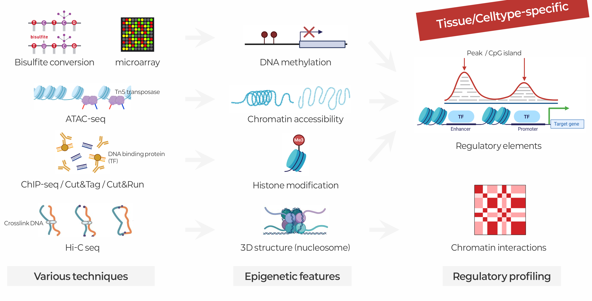
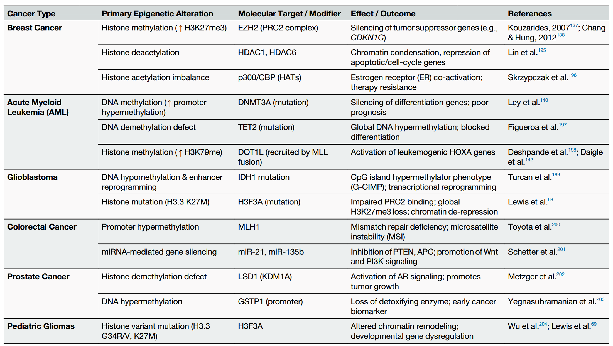

::: {.callout-note collapse="true"}
## 🎯 학습목표

이 장을 마치면 다음을 할 수 있어야 합니다.

-   후성유전체의 네 가지 층과 각 층을 측정하는 assay를 말할 수 있습니다.
-   ⚠️ 이 층들 사이에 선형적인 분자적 순서가 없는 이유를 설명할 수 있습니다.
-   ATAC-seq에는 접근성이 필요하지만 ChIP-seq에는 필요하지 않은 이유를 말할 수 있습니다.
-   H3K4me3, H3K27ac, H3K4me1, H3K27me3가 각각 무엇을 나타내며, 단일 마크보다 조합이 더 중요한 이유를 설명할 수 있습니다.
-   QC 수치로 ATAC 또는 ChIP 실험의 성공 여부를 판단할 수 있습니다.
-   유전체 브라우저 트랙 패널을 읽고 어떤 종류의 조절 요소인지 추론할 수 있습니다.
-   ⚠️ 조직 메틸화 연구에서 세포 유형 조성이 가장 큰 교란요인임을 알아볼 수 있습니다.
-   후성유전체학이 비암호화 GWAS hit에서 기전으로 이어지는 다리인 이유를 설명할 수 있습니다.
:::

> 🤔 **출발 질문**
>
> 우리 몸의 모든 세포는 같은 유전체를 가집니다. 그런데 왜 신경세포는 간세포가 아닐까요? 그리고 GWAS hit의 90%가 유전자 밖에 있다는 사실을 해석할 때 이것이 왜 중요할까요?



------------------------------------------------------------------------

# 1. 후성유전체란 무엇인가 🎛️ {#w3-s1}

## 1) 네 가지 층, 네 가지 assay {#w3-s1-1}

-   **유전체(genome)** — 고정된 텍스트
-   **후성유전체(epigenome)** — 바로 지금, 이 세포에서 그 텍스트의 어느 부분을 읽을지 결정하는 모든 것

{fig-align="center"}

| 층 | 무엇인가 | 표준 assay | 절 |
|------------------|------------------|------------------|------------------|
| **염색질 접근성** | DNA가 물리적으로 얼마나 열려 있는가 | ATAC-seq | [§2](#w3-s2) |
| **히스톤 변형** | 히스톤 꼬리의 화학적 마크 | ChIP-seq, CUT&RUN | [§3](#w3-s3) |
| **3차원 구조** | 어떤 영역끼리 물리적으로 접촉하는가 | Hi-C, Micro-C | [§4](#w3-s4) |
| **DNA 메틸화** | 보통 CpG의 cytosine에 붙는 methyl group | Bisulfite sequencing, EPIC array | [§5](#w3-s5) |

## 2) 같은 유전체, 다른 세포 {#w3-s1-2}

신경세포와 간세포는 이 층 거의 모두에서 서로 다릅니다. 그리고 바로 그 차이가 두 세포를 서로 다른 세포로 만듭니다.

::: {.callout-important collapse="true"}
## 사람마다 하나가 아니라 세포 유형마다 하나의 후성유전체

-   **유전체 서열** — 어느 조직에서 채취해도 동일합니다.
-   **후성유전체** — 세포 유형마다 다릅니다.

→ 모든 후성유전체 측정값은 실제로 측정한 세포에 특이적입니다.\
→ 조직을 측정하면 그 안에 섞여 있던 **여러 세포의 평균**을 측정한 것입니다.

이 한 가지 사실에서 [§5.3②](#w3-s5-3-2)와 이 분야 재현성 문제의 대부분이 발생합니다.
:::

## 3) ⚠️ 선형적인 분자적 순서는 없습니다 {#w3-s1-3}

자연스럽게 이런 질문이 생깁니다. 어느 층이 먼저일까요? 메틸화가 염색질을 닫을까요, 아니면 닫힌 염색질이 메틸화될까요?

**정직한 답은 각 층이 서로를 강화한다는 것입니다. 인과관계는 양방향으로 작동합니다.**

```         
   CpG 메틸화 → MeCP2 / MBD 단백질 → NuRD, HDAC → 응축
   H3K9me3 → HP1 → DNMT 모집 → 메틸화
   H3K36me3 → DNMT3B 모집
        ↑↓  어느 방향으로 읽어도 같은 되먹임 고리
   TF 결합 → TET 모집 → 탈메틸화 → 더 많은 TF 결합
   Pioneer factor (FOXA1, GATA, OCT4/SOX2)
        → nucleosome에 감긴 DNA / 닫힌 DNA에 먼저 결합
        → remodeler 모집 → 염색질 개방
```

-   “TF 결합은 접근성의 원인인가, 결과인가?”는 **이 분야의 미해결 질문**이지 확립된 사실이 아닙니다.
-   ⚠️ 이 장의 순서를 포함한 어떤 선형적 배열도 **교육을 위한 선택**일 뿐, 분자적 순서를 주장하는 것이 아닙니다.

**이 장의 배열 원리는 조절 논리입니다.** 접근성이 문을 열고 → 그 자리에 어떤 요소가 있는지 보고 → 그 요소가 어느 promoter에 닿는지 살핀 뒤 → 마지막으로 고유한 측정 문제를 가진 DNA 수준의 층을 다룹니다.

## 4) 무엇이 유전되고 무엇이 유전되지 않는가 {#w3-s1-4}

“후성유전적(epigenetic)”이라는 말에는 여러 의미가 따라다닙니다. 서로 매우 다른 두 주장이 흔히 뒤섞입니다.

-   ✅ **유사분열 유전(mitotic heritability)** — 세포분열 때 메틸화 패턴이 딸세포에 복사됩니다. 잘 확립되어 있으며 세포 정체성의 기반입니다.
-   ⚠️ **세대 간 후성유전(transgenerational epigenetic inheritance)** — 부모가 획득한 마크가 자녀와 손자 세대에 전달된다는 주장입니다.
    -   식물과 *C. elegans*에서는 실제로 일어납니다.
    -   포유류에서는 논쟁 중이고 기전도 불명확합니다. 생식계열은 거의 완전한 후성유전적 재프로그래밍을 **두 번** 거칩니다.

💡 “후성유전적 유전”이라는 표현을 읽으면 두 주장 중 어느 것을 말하는지 확인하세요.

------------------------------------------------------------------------

# 2. 염색질 접근성: ATAC-seq 🔓 {#w3-s2}

## 1) 원리 {#w3-s2-1}

**ATAC-seq**은 sequencing adapter가 미리 결합된 과활성 Tn5 transposase를 사용합니다.

-   Tn5는 DNA가 **nucleosome에 감겨 있지 않은** 곳, 즉 조절 단백질이 염색질을 활발히 열린 상태로 유지하는 곳에 우선 삽입됩니다.
-   절편화와 adapter ligation이 **한 단계**에서 일어나므로 실험이 빠르고 적은 세포로도 가능합니다.

::: {.callout-important collapse="true"}
## 접근성은 이 assay에서만 실제 선행 조건입니다

-   ATAC은 **온전한 핵**에서 수행합니다. Tn5가 *in situ* 상태의 DNA에 물리적으로 도달해야 합니다.
-   → 따라서 닫힌 염색질은 ATAC의 원리상 보이지 않습니다.

항체가 염색질을 만나기 **전에 절편화**하는 ChIP([§3.2](#w3-s3-2))와 비교해 보세요. 이 차이는 반드시 기억할 가치가 있습니다. ATAC과 ChIP이 서로 다른 것을 보는 이유이며, 설명이 반대로 제시되는 경우도 많습니다.
:::

## 2) 자연스러운 첫 assay인 이유 {#w3-s2-2}

-   **항체가 필요 없습니다.** 따라서 항체 품질 문제가 없고 표적을 미리 고를 필요도 없습니다.
-   한 번의 실험으로 어떤 factor를 pull-down할지에 대한 사전 가설 없이 세포 유형의 조절 지도를 먼저 그릴 수 있습니다.
-   Promoter, 활성 enhancer, TF 결합 부위를 한꺼번에 볼 수 있습니다.

⚠️ 다만 발견한 요소가 *어떤 종류*인지는 알려주지 않습니다. 열린 영역은 promoter, enhancer, insulator 또는 억제되어 있지만 준비된 요소일 수 있습니다. 이것은 [§3](#w3-s3)에서 다룹니다.

## 3) QC — 반드시 요구해야 할 두 그림 {#w3-s2-3}

{fig-align="center"}

-   **절편 크기 분포(fragment size distribution)**
    -   ✅ 약 100 bp 아래의 nucleosome-free peak와 그 뒤에 mono-, di-, tri-nucleosome에서 오는 약 200 bp 주기성이 보여야 합니다.
    -   ❌ 특징 없이 매끈한 곡선은 transposition 실패를 뜻합니다.
-   **TSS 농축도(TSS enrichment)**
    -   Promoter는 거의 모든 세포 유형에서 열려 있으므로 TSS의 날카로운 peak는 새로운 발견이 아니라 **최소 기대 조건**입니다.
    -   ❌ 평평한 TSS profile은 특이한 생물학이 아니라 assay 실패입니다.
-   **미토콘드리아 분율(mitochondrial fraction)**
    -   mtDNA에는 nucleosome이 없으므로 Tn5가 매우 적극적으로 공격합니다.
    -   처리하지 않은 protocol은 read의 절반 이상을 chrM에 낭비할 수 있습니다. Omni-ATAC과 유사한 개선법은 이를 줄여 줍니다.

## 4) Footprinting과 그 한계 {#w3-s2-4}

-   결합한 전사인자는 자기 결합 부위를 Tn5로부터 보호하므로 더 큰 접근 가능 영역 안에 작은 골짜기가 생깁니다.
-   원리상 ChIP 없이도 특정 factor의 위치를 찾을 수 있습니다.

⚠️ 실제로는 많은 factor에서 신뢰하기 어렵습니다.

-   Tn5 자체의 **서열 삽입 편향**이 footprint와 비슷한 모양을 만듭니다.
-   체류 시간이 짧은 factor는 보호 흔적을 전혀 남기지 않습니다.

→ Footprint 기반 factor 판정은 가설로 취급하세요.

------------------------------------------------------------------------

# 3. 히스톤 변형: ChIP-seq과 CUT&RUN 🧵 {#w3-s3}

열린 영역을 찾았습니다. 이것은 어떤 종류의 요소일까요? 히스톤 마크가 답을 줍니다.

## 1) 각 마크의 의미 {#w3-s3-1}

수십 가지가 있지만 유전체학에서는 다섯 가지가 대부분의 역할을 합니다.

| 마크 | 의미 | 신호 모양 |
|------------------------|------------------------|------------------------|
| **H3K4me3** | 활성 promoter | TSS의 날카로운 신호 |
| **H3K27ac** | 활성 promoter **또는** enhancer | 요소 양옆의 비교적 날카로운 신호 |
| **H3K4me1** | 준비 상태 또는 활성 enhancer | 넓은 신호 |
| **H3K27me3** | Polycomb에 의해 억제됨 | 넓은 domain |
| **H3K9me3** | 구성적 이질염색질(constitutive heterochromatin) | 반복서열에 걸친 매우 넓은 신호 |

**해석의 핵심은 단일 마크로는 요소를 식별할 수 없고 조합으로 식별한다는 것입니다.**

-   H3K4me3 + H3K27ac → **활성 promoter**
-   H3K4me1 + H3K27ac → **활성 enhancer**
-   H3K4me1 단독 → **준비 상태 enhancer(primed enhancer)** — 준비는 되었지만 작동하지 않는 상태
-   H3K4me3 + H3K27me3 → **이중가(bivalent)** — 줄기세포에서 발달 유전자를 작동 준비 상태로 유지

## 2) ⚠️ ChIP에는 접근성이 필요하지 않습니다 {#w3-s3-2}

흔한 오해이므로 명확히 짚고 넘어가겠습니다.

```         
ATAC   온전한 핵 → Tn5가 in situ에서 DNA에 도달해야 함
                    → 접근성이 필요함

ChIP   crosslink (formaldehyde)
       → 염색질을 shear / MNase-digest
       → 항체가 용액 속 절편을 만남
                    → 접근성이 필요하지 않음
```

→ 바로 이 때문에 ChIP은 핵에서 가장 단단히 닫힌 염색질을 정의하는 **H3K9me3와 H3K27me3**를 지도화할 수 있습니다. ATAC으로는 전혀 볼 수 없는 영역입니다.

두 assay는 중복되는 것이 아니라 상호보완적입니다.

## 3) Assay와 반드시 필요한 대조군 {#w3-s3-3}

두 가지 실패 요인이 지배적입니다.

-   ⚠️ **항체 품질** — ChIP-seq은 항체 실험입니다. 히스톤 변형에 대한 특이성은 일정하지 않고 **lot마다 달라집니다**. 어떤 분석으로도 복구할 수 없는 wet-lab 문제입니다.
-   ⚠️ **Input control** — 염색질은 균일하게 절편화되지 않습니다.
    -   열린 영역이 더 쉽게 잘립니다.
    -   Copy number가 다릅니다.
    -   → 짝지은 **input**(항체 없이 sonication한 염색질) 또는 **IgG** 대조군이 없으면 농축 신호와 artifact를 구분할 수 없습니다.

## 4) Peak calling과 QC {#w3-s3-4}

**Peak calling**은 신호를 대조군과 비교해 유의하게 농축된 영역을 찾는 과정입니다. MACS2와 그 후속 도구가 표준적으로 사용됩니다.

-   Parameter 선택이 중요합니다. H3K4me3처럼 점 형태의 마크에는 **narrow** mode, H3K27me3처럼 domain을 이루는 마크에는 **broad** mode를 사용합니다.

유용한 QC 수치는 다음과 같습니다.

-   **FRiP**(fraction of reads in peaks) — 전체 sequencing 중 배경이 아니라 신호에 들어간 비율입니다. FRiP가 낮으면 IP가 약합니다.
-   **Cross-correlation**(NSC / RSC) — strand가 이동한 신호에 예상되는 구조가 나타나는지 봅니다.
-   **Library complexity** — 서로 다른 절편과 PCR duplicate의 비율을 봅니다.

## 5) CUT&RUN과 CUT&Tag {#w3-s3-5}

ChIP의 문제는 많은 세포가 필요하고 배경 신호가 많다는 것입니다.

**해결책**은 절단 효소(MNase 또는 Tn5)를 항체에 직접 연결해 표적 영역만 방출하거나 tag하는 것입니다.

-   수백만 개가 아니라 **수천 개**의 세포만으로 훨씬 높은 signal-to-noise를 얻습니다.
-   이 기술 덕분에 단일세포 염색질 profiling이 실용화되었습니다(🔗 W5).

## 6) 트랙을 함께 읽기 {#w3-s3-6}

{fig-align="center"}

후성유전체학 논문에서 가장 흔히 보는 그림입니다. 위에서 아래로 읽은 뒤 가로로 비교하는 것이 구체적인 독해 기술입니다.

1.  **ATAC peak가 있는가?** → 이곳에 열린 무언가가 있습니다([§2](#w3-s2)).
2.  **H3K4me3가 우세한가?** → promoter입니다. **H3K4me1이 우세한가?** → enhancer입니다.
3.  그 위에 **H3K27ac가 있는가?** → 단순히 존재하는 것이 아니라 **이 세포 유형에서 활성화된** 요소입니다.
4.  **H3K27me3 domain이 있는가?** → 다른 신호와 관계없이 억제된 상태입니다.
5.  **Input과 비교하세요.** “Peak”가 input에도 있다면 peak가 아닙니다.

------------------------------------------------------------------------

# 4. 3차원 유전체: Hi-C 🔗 {#w3-s4}

활성 enhancer를 찾았습니다. 실제로 어느 promoter를 조절할까요?

## 1) Assay {#w3-s4-1}

**Hi-C**는 염색질을 crosslink하고 → 절단한 뒤 → 물리적으로 가까이 있는 말단끼리 ligation하고 → 그 접합부를 sequencing합니다.

출력은 모든 유전체 bin 쌍 사이의 접촉 빈도를 나타낸 행렬입니다.

{fig-align="center"}

## 2) 행렬이 보여주는 것 {#w3-s4-2}

-   **A/B compartment** — megabase 규모에서 활성(A) 염색질과 비활성(B) 염색질이 분리된 구조입니다.
-   **TAD**(topologically associating domain) — 1 megabase보다 작은 블록으로, 내부 접촉이 빈번하고 CTCF가 결합한 날카로운 경계가 있습니다.
    -   경계는 **세포 유형 사이에서 대체로 보존됩니다.**
-   **Loop** — 특정 enhancer와 promoter 사이의 접촉입니다.
    -   세포 유형 사이에 보존되지 **않습니다.**
    -   → 변이 해석에 실제로 필요한 것은 이 loop입니다.

## 3) ⚠️ 접촉이 곧 기능은 아닙니다 {#w3-s4-3}

-   Loop는 두 영역이 서로 가까이 있다는 뜻입니다.
-   해당 enhancer가 그 promoter를 조절한다는 뜻은 아닙니다.

→ 기능을 확립하려면 조절 요소에 CRISPRi를 적용하는 것과 같은 교란 실험이 필요합니다.

------------------------------------------------------------------------

# 5. DNA 메틸화 🔵 {#w3-s5}

DNA 수준의 층이며 임상 및 역학 연구에서 가장 많이 사용되는 층입니다.

-   Cytosine의 5번 탄소에 methyl group이 붙으며, 압도적으로 **CpG** dinucleotide에서 일어납니다.
-   유전체 CpG의 약 70–80%가 메틸화되어 있습니다.
-   예외는 **CpG island**에 모여 있습니다. 대부분의 promoter에 존재하며 유전자가 활성 상태일 때는 보통 메틸화되어 있지 않습니다.

## 1) 측정 {#w3-s5-1}

### ① Bisulfite sequencing {#w3-s5-1-1}

Sodium bisulfite는 메틸화되지 않은 C를 U로 바꾸고(sequencing에서는 T로 읽음), 메틸화된 C는 보호되어 그대로 C로 읽힙니다. Sequencing 후 참조서열과 비교하면 C로 남은 염기를 메틸화되었다고 판정합니다.

-   **WGBS** — 모든 CpG를 단일 염기 해상도로 봅니다. 비용이 많이 들며 변환 후 서열 복잡도가 낮아지기 때문에 깊은 coverage가 필요합니다.
-   **RRBS** — 효소 절단으로 CpG가 밀집된 영역을 농축합니다. 훨씬 저렴하지만 편향된 일부 영역만 봅니다.

⚠️ Bisulfite에는 두 가지 한계가 있습니다.

-   DNA를 **분해합니다.**
-   **5mC와 5-hydroxymethylcytosine(5hmC)을 구분하지 못합니다.** 5hmC는 뇌에 풍부하고 생물학적 의미도 다릅니다.

대안으로는 DNA를 분해하지 않는 효소 변환법인 **EM-seq**이 있습니다. **Long-read 플랫폼**은 별도 변환 없이 원시 신호에서 변형을 직접 판정합니다(🔗 [W1 §2.1③](w1_intro.qmd#w1-s2-1-3)).

### ② Array {#w3-s5-1-2}

Illumina **EPIC**은 고정된 CpG 패널입니다. v1은 약 850,000개, 즉 전체 CpG의 약 3%를 포함하며 promoter, enhancer, 알려진 질병 locus에 치우쳐 있습니다.

Genotyping array(🔗 [W2 §2.3](w2_genomics.qmd#w2-s2-3))와 같은 trade-off가 있습니다.

-   ❌ 패널 밖에서는 아무것도 발견할 수 없습니다.
-   ✅ 수천 개 시료에 적용할 만큼 저렴하므로 대규모 역학 메틸화 연구는 거의 모두 array를 사용합니다.

## 2) β value와 M value {#w3-s5-2}

{fig-align="center"}

-   **β value** — 직관적인 양으로, 한 위치에서 메틸화된 DNA 분자의 비율이며 0에서 1 사이입니다.

$$
\beta = \frac{M}{M + U + \alpha}
$$

-   **M value** — β의 logit 변환인 $\log_2(\beta / (1-\beta))$입니다.

왜 변환할까요?

-   β는 0과 1 사이로 **경계가 정해져** 있어 양 극단에서 분산이 압축됩니다. 그런데 대부분의 CpG가 바로 이 극단에 있습니다.
-   → 선형모형의 가정을 위반합니다.
-   M은 범위 제한이 없고 대체로 등분산성을 보입니다.

💡 **관례는 M value로 검정하고 β value로 보고하고 그리는 것입니다.**\
⚠️ β ≈ 0.02인 CpG에서 β value에 직접 t-test를 적용하는 논문은 통계적으로 의심할 만합니다.

## 3) 차등 메틸화 {#w3-s5-3}

### ① DMP와 DMR {#w3-s5-3-1}

-   **DMP**(differentially methylated position) — 집단 사이에 차이가 있는 단일 CpG입니다.
-   **DMR**(differentially methylated region) — 서로 인접한 여러 CpG가 함께 변하는 영역입니다.

DMR이 더 신뢰할 만합니다. 인접 CpG는 생물학적으로 상관되어 있으므로 일관된 영역 변화가 우연이나 불량 probe 하나로 생길 가능성이 더 낮습니다.

⚠️ 주변 영역은 평평한데 CpG 하나만 유의하다면 의심해야 합니다.

### ② ⚠️ 세포 유형 조성 {#w3-s5-3-2}

이 장에서 가장 중요한 소절입니다.

{fig-align="center"}

::: {.callout-warning collapse="true"}
## 세포 조성은 가장 큰 교란요인입니다

**기전:**

-   메틸화는 **세포 유형 사이에서** 매우 크게 다릅니다. 같은 세포 유형 안에서 개인 또는 질병 상태 사이의 차이보다 훨씬 큽니다.
-   → 환자군과 대조군의 세포 혼합 비율이 조금만 달라도
-   → 수천 개의 CpG가 “차등 메틸화”된 것처럼 보입니다.
-   → **개별 세포에서는 아무것도 변하지 않았는데도** 이런 결과가 생깁니다.

가상의 문제가 아닙니다. 질병, 감염, 약물, 나이, 흡연은 모두 혈액 세포 비율을 바꿉니다.

→ 세포 조성을 보정하지 않은 혈액 메틸화 연구는 대략적으로 말하면 **세포 수를 연구한 것**입니다.

**대응 방법:**

-   ✅ 가능하면 세포 수를 직접 측정하고(CBC, flow cytometry) 공변량으로 포함합니다.
-   ✅ 그렇지 않으면 **참조 기반 deconvolution**(Houseman method와 후속 방법)로 메틸화 자료 자체에서 비율을 추정한 뒤 보정합니다.
-   ✅ 참조 패널이 없는 조직에는 reference-free 방법(RefFreeEWAS, ReFACTor, SVA)을 사용할 수 있지만 실제 신호까지 제거할 위험이 있습니다.
-   ✅ **정확히 무엇을 했는지 명시하세요.** 구체적인 설명 없이 “세포 조성을 보정했다”고만 해서는 충분하지 않습니다.

🔗 [W1 §4.3](w1_intro.qmd#w1-s4-3)에서 다룬 교란의 흐름이 이 장 전체에 걸쳐 나타난 형태입니다. [W4 §7.2](w4_transcriptomics.qmd#w4-s7-2)에서는 bulk 조직 deconvolution으로, [W5 §6.3](w5_singlecell.qmd#w5-s6-3)에서는 differential abundance로 다시 등장합니다.
:::

## 4) 후성유전 시계 ⏳ {#w3-s5-4}

{fig-align="center"}

나이에 따라 메틸화가 변하는 CpG 수백 개를 선택하고 → 실제 연령에 대해 penalised regression을 적합하면 → 수년 이내의 오차로 나이를 예측할 수 있습니다.

{fig-align="center"}

**연령 가속(age acceleration)**은 잔차입니다. 출생증명서의 나이보다 후성유전적으로 얼마나 더 늙거나 젊어 보이는지를 뜻합니다.

-   사망, 심혈관질환 및 매우 다양한 노출과 연관되어 있습니다.

::: {.callout-warning collapse="true"}
## 시계 연구를 믿기 전에 확인할 세 가지

**① 어떤 시계인가?**

-   **1세대**(Horvath, Hannum) — *실제 연령*을 예측하도록 학습했기 때문에 설계상 생물학적 노화를 탐지하면 **불이익을 받습니다.**
-   **2세대**(PhenoAge, GrimAge) — 임상 biomarker와 사망을 목표로 학습하여 건강 결과를 훨씬 더 잘 예측합니다.
-   → 서로 바꾸어 쓸 수 없고 한 시계의 결과가 다른 시계로 그대로 이전되지 않습니다.

**② 다시 세포 조성입니다.** 혈액 시계의 신호 일부는 나이에 따라 면역세포 비율이 변하기 때문에 생깁니다. 이를 보정했나요?

**③ 기전이 아니라 연관성입니다.** 연령 가속은 biomarker입니다. 시계만으로 메틸화가 노화를 *일으키는지*, 아니면 단지 기록하는지 알 수 없습니다.
:::

------------------------------------------------------------------------

# 6. 모두 연결하기 🏥 {#w3-s6}

## 1) 전사인자 motif 분석 {#w3-s6-1}

Peak 집합이 있을 때 배경 집합보다 과대표현된 TF 결합 motif가 무엇인지 찾습니다. HOMER, MEME suite, chromVAR(단일세포) 등의 도구를 사용합니다.

⚠️ 고질적인 문제가 두 가지 있습니다.

-   **배경 선택이 답을 결정합니다.** GC 함량과 접근성을 맞춘 배경이 반드시 필요합니다. 무작위 유전체 영역을 쓰면 모든 신호가 부풀려집니다.
-   **Motif 유사성** — 같은 family 구성원은 구분할 수 없습니다. “AP-1 motif”라는 결과만으로 FOS, JUN 또는 그 밖의 여러 친척 중 누구인지 알 수 없습니다.

## 2) 염색질 상태와 참조 atlas {#w3-s6-2}

**ChromHMM**은 반복적으로 나타나는 마크 조합을 학습해 모든 유전체 구간에 상태(“active TSS”, “weak enhancer”, “heterochromatin”)를 부여합니다. 잡음이 많은 다섯 트랙을 해석 가능한 하나의 annotation으로 바꿉니다.

| 자료원 | 포함 내용 |
|------------------------------------|------------------------------------|
| [**ENCODE**](https://www.encodeproject.org/) | 수백 개 세포 유형의 ChIP, ATAC, RNA를 동일한 방법으로 처리한 자료와 candidate cis-regulatory element(cCRE) |
| [**Roadmap Epigenomics**](http://www.roadmapepigenomics.org/) | 127개 일차 조직 및 세포 유형의 염색질 상태 |
| [**UCSC**](https://genome.ucsc.edu/) / [**WashU**](https://epigenomegateway.wustl.edu/) browser | 위 자료를 관심 locus에서 함께 확인하는 곳 |

🗺️ 이 atlas 역시 **참조 편향** 문제를 가집니다(🔗 [W1 §2.3③](w1_intro.qmd#w1-s2-3-3)).

-   관심 세포 유형이 ENCODE에 없다면 그 대신 다른 세포에서 얻은 annotation을 물려받게 됩니다.
-   → 관심 세포에서만 활성인 요소는 **보이지 않습니다.**

## 3) 비암호화 GWAS hit에서 기전으로 {#w3-s6-3}

GWAS 연관성의 약 90%는 비암호화 영역에 있다는 사실을 기억해 보세요(🔗 [W2 §4.3](w2_genomics.qmd#w2-s4-3)). 유전자 사이 공간의 변이는 그 자체로 해석할 수 없습니다. 후성유전체학이 빠진 annotation을 제공합니다.

```         
① GWAS 신호를 fine-mapping하여 credible set 구성         (W2 §4.2)
② 질병 관련 세포 유형의 ATAC / H3K27ac peak와
   credible-set 변이가 겹치는지 확인                     (§2, §3)
③ 위험 대립유전자가 어느 TF motif를 방해하는가?          (§6.1)
④ 해당 enhancer는 어느 promoter와 접촉하는가?            (§4)
⑤ 표적 유전자의 발현이 변하는가?                          (eQTL, W4)
⑥ 요소를 제거하거나 편집했을 때 변화가 생기는가?          (CRISPR)
```

**분할 유전력(partitioned heritability)** 분석(LDSC-SEG, stratified LD score regression)은 같은 논리를 locus별이 아니라 전체 신호를 모아 적용합니다.

-   어떤 세포 유형의 조절 annotation에 형질의 유전력이 농축되어 있는가?
-   → 질병이 어느 조직에서 작동하는지에 관한 가장 강력한 근거가 되기도 합니다. 예를 들어 Alzheimer disease에서는 microglia, autoimmune disease에서는 특정 T cell subset이 해당합니다.

## 4) ⚠️ 핵심 문제: 어느 세포인가? {#w3-s6-4}

::: {.callout-warning collapse="true"}
## 잘못된 세포 유형에서 얻은 정확한 annotation은 쓸모가 없습니다

-   간세포에서 활성인 enhancer는 lymphoblastoid cell line에서 보이지 않습니다.
-   Credible set을 잘못된 세포 유형의 peak와 겹치면 아무것도 찾지 못합니다.
-   → **“겹침 없음”과 “잘못된 참조”는 구분할 수 없습니다.**

이 때문에 이 분야는 단일세포 염색질 profiling(🔗 W5)으로 빠르게 이동했습니다. 어떤 ENCODE 세포 유형을 사용할지 선택하는 일은 **기술적 기본값이 아니라 과학적 결정**입니다.
:::

## 5) 이미 임상에서 사용되는 후성유전학 {#w3-s6-5}

-   **메틸화 기반 종양 분류** — methylation array를 사용하는 중추신경계 종양 분류기는 일부 종양에서 조직병리보다 뛰어나며 일상 진단에 사용되고 있습니다.
-   **Cell-free DNA** — 혈장 DNA 메틸화에는 조직 기원 신호가 담겨 있어 다중암 조기진단 assay의 기반이 됩니다.
-   **후성유전 약물** — DNMT 억제제(azacitidine, decitabine)와 HDAC 억제제는 혈액암에서 승인되었고, EZH2 억제제는 특정 lymphoma와 sarcoma에서 승인되었습니다.
-   **각인 질환(imprinting disorder)** — Prader-Willi syndrome과 Angelman syndrome은 메틸화 검사로 진단합니다.

{fig-align="center"}

------------------------------------------------------------------------

# 📝 요약

-   측정 가능한 네 가지 층이 있습니다. 유전체와 달리 후성유전체는 **세포 유형마다 다릅니다.**
-   ⚠️ **선형적인 분자적 순서는 없습니다.** 각 층은 서로를 강화하며, 이 장의 순서는 인과관계가 아니라 조절 논리에 따른 것입니다.
-   **ATAC-seq** — 온전한 핵에서 Tn5를 사용하므로 접근성이 실제 선행 조건입니다. 항체가 필요 없고 자연스러운 첫 assay입니다.
-   ⚠️ **ChIP-seq은 절편화된 염색질에서 작동하므로** 접근성이 필요하지 않습니다. 이 때문에 닫힌 염색질의 마크를 지도화할 수 있습니다.
-   단일 히스톤 마크로는 요소를 식별하지 못합니다. **조합이 식별합니다.** H3K4me3 + H3K27ac는 활성 promoter, H3K4me1 + H3K27ac는 활성 enhancer입니다.
-   ChIP에는 input control과 검증된 항체가 필요합니다. ATAC의 핵심 QC는 절편 사다리와 TSS 농축도입니다.
-   Hi-C는 compartment, TAD, loop를 보여줍니다. 경계는 세포 유형 사이에서 공유되지만 loop는 그렇지 않습니다. ⚠️ 접촉 ≠ 기능입니다.
-   β value로 보고하고 M value로 검정합니다.
-   ⚠️ 조직 메틸화 연구에서 **세포 유형 조성은 가장 큰 교란요인**입니다. 이를 측정하거나 추정한 뒤 보정해야 합니다.
-   후성유전 시계에서는 잔차가 연구 대상이며 1세대와 2세대 시계는 서로 다른 것을 측정합니다.
-   후성유전체학은 비암호화 GWAS hit를 기전으로 이어 줍니다. 단, **올바른 세포 유형의 자료가 있어야 합니다.**

------------------------------------------------------------------------

# 🔑 핵심 용어

| 용어 | 한 줄 설명 |
|------------------------------------|------------------------------------|
| ATAC-seq | Tn5를 이용해 열린 염색질을 지도화하는 방법 |
| TSS enrichment | 전사 시작점의 신호로, 핵심 ATAC QC 지표 |
| Footprint | 결합한 단백질이 절단으로부터 보호한 흔적 |
| ChIP-seq | 단백질 또는 마크가 DNA의 어디에 있는지 지도화하는 방법 |
| Input control | 항체 없이 sonication한 염색질 대조군 |
| Peak calling | 대조군보다 농축된 영역을 찾는 과정 |
| FRiP | Peak 안에 포함되는 read의 비율 |
| CUT&RUN / CUT&Tag | 항체에 효소를 연결해 배경과 필요 세포 수를 줄이는 방법 |
| Bivalent domain | H3K4me3 + H3K27me3 조합으로 준비 상태의 발달 유전자를 나타냄 |
| ChromHMM | 유전체를 염색질 상태로 구획하는 도구 |
| TAD | 경계가 뚜렷하고 내부끼리 상호작용하는 유전체 블록 |
| CpG island | 주로 promoter에 있는 CpG 밀집 영역 |
| Bisulfite conversion | 메틸화되지 않은 C를 T로 읽게 만드는 화학적 변환 |
| β value | 한 위치에서 메틸화된 분자의 비율 |
| M value | 통계 검정에 사용하는 β의 logit 변환값 |
| DMP / DMR | 집단 사이에 차이가 있는 단일 CpG / 영역 |
| Deconvolution | Bulk 자료에서 세포 유형 비율을 추정하는 과정 |
| Epigenetic clock | 메틸화 기반 연령 예측 모델 |
| Age acceleration | 예측 연령에서 실제 연령을 뺀 값 |
| Partitioned heritability | 어떤 annotation이 형질의 유전 신호를 담는지 평가하는 방법 |

------------------------------------------------------------------------

# ➕ 참고문헌

### 종설

Stricker SH, Köferle A, Beck S. [*From profiles to function in epigenomics.*](https://pubmed.ncbi.nlm.nih.gov/?term=From+profiles+to+function+in+epigenomics) Nat Rev Genet. 2017.\
Klemm SL, Shipony Z, Greenleaf WJ. [*Chromatin accessibility and the regulatory epigenome.*](https://doi.org/10.1038/s41576-018-0089-8) Nat Rev Genet. 2019.\
Zhu H, Wang G, Qian J. [*Transcription factors as readers and effectors of DNA methylation.*](https://pubmed.ncbi.nlm.nih.gov/?term=Transcription+factors+as+readers+and+effectors+of+DNA+methylation) Nat Rev Genet. 2016.

### 염색질 접근성

Buenrostro JD, et al. [*Transposition of native chromatin for fast and sensitive epigenomic profiling.*](https://doi.org/10.1038/nmeth.2688) Nat Methods. 2013.\
Corces MR, et al. [*An improved ATAC-seq protocol reduces background and enables interrogation of frozen tissues.*](https://doi.org/10.1038/nmeth.4396) Nat Methods. 2017. (Omni-ATAC)\
Grandi FC, et al. [*Chromatin accessibility profiling by ATAC-seq.*](https://doi.org/10.1038/s41596-022-00692-9) Nat Protoc. 2022.

### 히스톤 변형

Park PJ. [*ChIP-seq: advantages and challenges of a maturing technology.*](https://doi.org/10.1038/nrg2641) Nat Rev Genet. 2009.\
Landt SG, et al. [*ChIP-seq guidelines and practices of the ENCODE and modENCODE consortia.*](https://doi.org/10.1101/gr.136184.111) Genome Res. 2012.\
Skene PJ, Henikoff S. [*An efficient targeted nuclease strategy for high-resolution mapping of DNA binding sites.*](https://pubmed.ncbi.nlm.nih.gov/?term=An+efficient+targeted+nuclease+strategy+for+high-resolution+mapping+of+DNA+binding+sites) eLife. 2017. (CUT&RUN)

### 3차원 유전체

Rao SSP, et al. [*A 3D map of the human genome at kilobase resolution reveals principles of chromatin looping.*](https://pubmed.ncbi.nlm.nih.gov/?term=A+3D+map+of+the+human+genome+at+kilobase+resolution+reveals+principles+of+chromatin+looping) Cell. 2014.\
Dekker J, Mirny L. [*The 3D genome as moderator of chromosomal communication.*](https://pubmed.ncbi.nlm.nih.gov/?term=The+3D+genome+as+moderator+of+chromosomal+communication) Cell. 2016.

### DNA 메틸화

Michels KB, et al. [*Recommendations for the design and analysis of epigenome-wide association studies.*](https://pubmed.ncbi.nlm.nih.gov/?term=Recommendations+for+the+design+and+analysis+of+epigenome-wide+association+studies) Nat Methods. 2013.\
Houseman EA, et al. [*DNA methylation arrays as surrogate measures of cell mixture distribution.*](https://pubmed.ncbi.nlm.nih.gov/?term=DNA+methylation+arrays+as+surrogate+measures+of+cell+mixture+distribution) BMC Bioinformatics. 2012.\
Horvath S, Raj K. [*DNA methylation-based biomarkers and the epigenetic clock theory of ageing.*](https://doi.org/10.1038/s41576-018-0004-3) Nat Rev Genet. 2018.\
Capper D, et al. [*DNA methylation-based classification of central nervous system tumours.*](https://pubmed.ncbi.nlm.nih.gov/?term=DNA+methylation-based+classification+of+central+nervous+system+tumours) Nature. 2018.

### Atlas와 통합 분석

[ENCODE](https://www.encodeproject.org/) · [Roadmap Epigenomics](http://www.roadmapepigenomics.org/) · [WashU Epigenome Browser](https://epigenomegateway.wustl.edu/)\
ENCODE Project Consortium. [*Perspectives on ENCODE.*](https://pubmed.ncbi.nlm.nih.gov/?term=Perspectives+on+ENCODE) Nature. 2020.\
Finucane HK, et al. [*Heritability enrichment of specifically expressed genes identifies disease-relevant tissues and cell types.*](https://pubmed.ncbi.nlm.nih.gov/?term=Heritability+enrichment+of+specifically+expressed+genes+identifies+disease-relevant+tissues+and+cell+types) Nat Genet. 2018.
