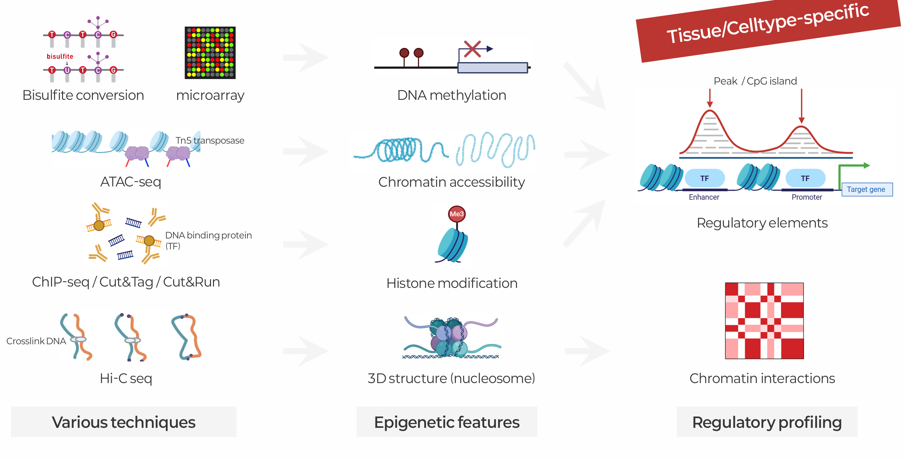
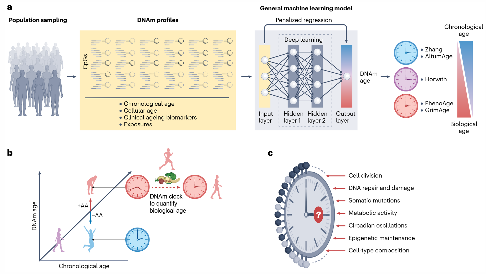
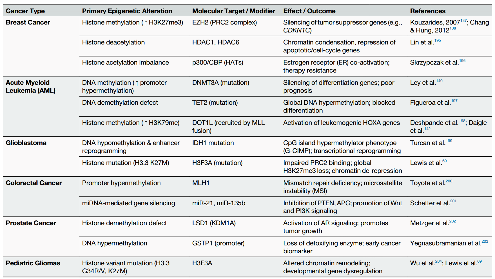

::: {.callout-note collapse="true"}
## 🎯 학습목표

이 장을 마치면:

-   후성유전체의 네 가지 층과 각 층을 측정하는 assay
-   ⚠️ 이 층들 사이에 선형적인 분자적 순서가 없는 이유
-   ATAC-seq에는 접근성이 필요하고 ChIP-seq에는 필요 없는 이유
-   히스톤 마크를 조합으로 읽기 (활성 promoter, 활성 enhancer, 억제)
-   유전체 브라우저 트랙 패널을 읽고 어떤 종류의 조절 요소인지 추론
-   ⚠️ 조직 메틸화 연구의 가장 큰 교란요인 = 세포 유형 조성
-   후성유전체학이 비암호화 GWAS hit에서 기전으로 이어지는 다리인 이유
:::

> 🤔 **출발 질문**\
> 우리 몸의 모든 세포 = 같은 유전체\
> → 그런데 왜 신경세포는 간세포가 아닌가? 그리고 GWAS hit의 90%가 유전자 밖에 있다는 사실을 해석할 때 이것이 왜 중요한가?



💡 각 절의 본문 = 꼭 알아야 할 기초. **🔍 더 알아보기**는 관심 있을 때 펼쳐 보는 심화 내용

------------------------------------------------------------------------

# 1. 후성유전체란 무엇인가 🎛️ {#w3-s1}

> 🔑 **핵심** — 유전체는 모든 세포에서 동일. 후성유전체가 그중 어느 부분을 읽을지 결정 → 세포 유형마다 다르고, 그 차이가 신경세포를 신경세포로 만듦

## 1) 네 가지 층, 네 가지 assay {#w3-s1-1}

-   **유전체(genome)** — 고정된 텍스트
-   **후성유전체(epigenome)** — 바로 지금, 이 세포에서 그 텍스트의 어느 부분을 읽을지 결정하는 모든 것

{fig-align="center"}

| 층 | 무엇인가 | 표준 assay | 절 |
|------------------|------------------|------------------|------------------|
| **염색질 접근성** | DNA가 물리적으로 얼마나 열려 있는가 | ATAC-seq | [§2](#w3-s2) |
| **히스톤 변형** | 히스톤 꼬리의 화학적 마크 | ChIP-seq, CUT&RUN | [§3](#w3-s3) |
| **3차원 구조** | 어떤 영역끼리 물리적으로 접촉하는가 | Hi-C, Micro-C | [§4](#w3-s4) |
| **DNA 메틸화** | 보통 CpG의 cytosine에 붙는 methyl group | Bisulfite sequencing, EPIC array | [§5](#w3-s5) |

## 2) 같은 유전체, 다른 세포 {#w3-s1-2}

-   신경세포와 간세포 → 이 층 거의 모두에서 서로 다름
-   → 바로 그 차이가 두 세포를 서로 다른 세포로 만듦
-   ⚠️ 후성유전체는 사람마다 하나가 아니라 **세포 유형마다** 다름

::: {.callout-important collapse="true"}
## 사람마다 하나가 아니라 세포 유형마다 하나의 후성유전체

-   **유전체 서열** — 어느 조직에서 채취해도 동일
-   **후성유전체** — 세포 유형마다 다름

→ 모든 후성유전체 측정값 = 실제로 측정한 세포에 특이적\
→ 조직을 측정하면 그 안에 섞여 있던 **여러 세포의 평균**을 측정한 것

이 한 가지 사실에서 [§5.3②](#w3-s5-3-2)와 이 분야 재현성 문제의 대부분이 발생
:::

## 3) ⚠️ 선형적인 분자적 순서는 없음 {#w3-s1-3}

-   어느 층이 먼저인가? 메틸화가 염색질을 닫나, 닫힌 염색질이 메틸화되나?
-   **정직한 답 — 각 층이 서로를 강화. 인과관계는 양방향**
-   ⚠️ 이 장의 순서를 포함한 어떤 선형적 배열도 **교육을 위한 선택**일 뿐, 분자적 순서에 대한 주장 x

::: {.callout-note collapse="true" icon=false}
## 🔍 더 알아보기 — 층 사이의 되먹임 고리

```
   CpG 메틸화 → MeCP2 / MBD 단백질 → NuRD, HDAC → 응축
   H3K9me3 → HP1 → DNMT 모집 → 메틸화
   H3K36me3 → DNMT3B 모집
        ↑↓  어느 방향으로 읽어도 같은 되먹임 고리
   TF 결합 → TET 모집 → 탈메틸화 → 더 많은 TF 결합
   Pioneer factor (FOXA1, GATA, OCT4/SOX2)
        → nucleosome에 감긴 DNA / 닫힌 DNA에 먼저 결합
        → remodeler 모집 → 염색질 개방
```

-   “TF 결합은 접근성의 원인인가, 결과인가?” = **이 분야의 미해결 질문**, 확립된 사실 x
-   **이 장의 배열 원리 = 조절 논리** — 접근성이 문을 열고 → 그 자리에 어떤 요소가 있는지 → 그 요소가 어느 promoter에 닿는지 → 마지막으로 고유한 측정 문제를 가진 DNA 수준의 층
:::

## 4) 무엇이 유전되고 무엇이 유전되지 않는가 {#w3-s1-4}

“후성유전적(epigenetic)”이라는 말에 따라붙는 여러 의미 — 서로 매우 다른 두 주장이 흔히 뒤섞임

-   ✅ **유사분열 유전(mitotic heritability)** — 세포분열 때 메틸화 패턴이 딸세포에 복사됨. 잘 확립됨, 세포 정체성의 기반
-   ⚠️ **세대 간 후성유전(transgenerational epigenetic inheritance)** — 부모가 획득한 마크가 자녀·손자 세대에 전달된다는 주장. 포유류에서는 논쟁 중
-   💡 “후성유전적 유전”이라는 표현 → 두 주장 중 어느 것인지 확인

::: {.callout-note collapse="true" icon=false}
## 🔍 더 알아보기 — 포유류에서 세대 간 유전이 논쟁 중인 이유

-   식물과 *C. elegans*에서는 실제로 일어남
-   포유류: 논쟁 중, 기전 불명확 — 생식계열이 거의 완전한 후성유전적 재프로그래밍을 **두 번** 거침
:::

------------------------------------------------------------------------

# 2. 염색질 접근성: ATAC-seq 🔓 {#w3-s2}

> 🔑 **핵심** — ATAC-seq = DNA가 **열려 있는** 곳을 찾는 방법. 항체 x, 표적을 미리 고를 필요 x → 세포 유형의 조절 영역을 그리는 자연스러운 첫 지도

## 1) 원리 {#w3-s2-1}

-   **ATAC-seq** — sequencing adapter가 미리 결합된 과활성 Tn5 transposase(DNA를 자르는 효소) 사용
-   Tn5는 DNA가 **nucleosome에 감겨 있지 않은** 곳(nucleosome = DNA가 감기는 히스톤 덩어리), 즉 조절 단백질이 염색질을 활발히 열어 둔 곳에 우선 삽입
-   절편화와 adapter ligation이 **한 단계**에서 → 실험이 빠르고 적은 세포로도 가능

::: {.callout-important collapse="true"}
## 접근성 = 이 assay에서만 실제 선행 조건

-   ATAC은 **온전한 핵**에서 수행. Tn5가 *in situ* 상태의 DNA에 물리적으로 도달해야 함
-   → 닫힌 염색질은 ATAC의 원리상 보이지 않음

항체가 염색질을 만나기 **전에 절편화**하는 ChIP([§3.2](#w3-s3-2))과 비교 → ATAC과 ChIP이 서로 다른 것을 보는 이유. 꼭 기억할 것 — 설명이 반대로 제시되는 경우도 많음
:::

## 2) 자연스러운 첫 assay인 이유 {#w3-s2-2}

-   **항체 불필요** → 항체 품질 문제 x, 표적을 미리 고를 필요 x
-   한 번의 실험 → promoter, 활성 enhancer, TF 결합 부위를 한꺼번에. 어떤 factor를 pull-down할지 사전 가설 없이 세포 유형의 조절 지도를 먼저 그림
-   ⚠️ 다만 발견한 요소가 *어떤 종류*인지는 모름 — promoter, enhancer, insulator, 또는 억제되어 있지만 준비된 요소? → [§3](#w3-s3)

## 3) QC — 반드시 요구해야 할 두 그림 {#w3-s2-3}

{fig-align="center"}

-   **절편 크기 분포(fragment size distribution)** — ✅ 사다리 모양: nucleosome-free peak, 이후 약 200 bp 간격의 계단. ❌ 특징 없이 매끈한 곡선 → 실패
-   **TSS 농축도(TSS enrichment)** — ✅ 전사 시작점(TSS)에서 날카로운 peak. ❌ 평평함 → assay 실패
-   💡 ATAC 결과를 믿기 전에 두 그림을 모두 요구할 것

::: {.callout-note collapse="true" icon=false}
## 🔍 더 알아보기 — QC 수치 자세히 읽기

-   **절편 크기 분포**
    -   ✅ 약 100 bp 아래의 nucleosome-free peak + mono-, di-, tri-nucleosome에서 오는 약 200 bp 주기성
    -   ❌ 특징 없이 매끈한 곡선 → transposition 실패
-   **TSS 농축도**
    -   Promoter는 거의 모든 세포 유형에서 열려 있음 → TSS의 날카로운 peak = 새로운 발견이 아니라 **최소 기대 조건**
    -   ❌ 평평한 TSS profile → 특이한 생물학이 아니라 assay 실패
-   **미토콘드리아 분율(mitochondrial fraction)**
    -   mtDNA에는 nucleosome x → Tn5가 매우 적극적으로 공격
    -   처리하지 않은 protocol은 read의 절반 이상을 chrM에 낭비할 수 있음. Omni-ATAC 등 개선법으로 감소
:::

## 4) Footprinting과 그 한계 {#w3-s2-4}

-   결합한 전사인자 → 자기 결합 부위를 Tn5로부터 보호 → 더 큰 접근 가능 영역 안에 작은 골짜기(**footprint**)
-   원리상 ChIP 없이도 특정 factor의 위치를 찾을 수 있음
-   ⚠️ 실제로는 많은 factor에서 신뢰하기 어려움 → footprint 기반 factor 판정은 **가설**로 취급

::: {.callout-note collapse="true" icon=false}
## 🔍 더 알아보기 — footprint가 오해를 부르는 이유

-   Tn5 자체의 **서열 삽입 편향** → footprint와 비슷한 모양을 만듦
-   체류 시간이 짧은 factor → 보호 흔적을 전혀 남기지 않음
:::

------------------------------------------------------------------------

# 3. 히스톤 변형: ChIP-seq과 CUT&RUN 🧵 {#w3-s3}

> 🔑 **핵심** — 열린 영역을 찾음. 어떤 종류의 요소인가? → 히스톤 마크가 답. 마크 하나가 아니라 **조합**으로 읽기

## 1) 각 마크의 의미 {#w3-s3-1}

수십 가지가 있지만 유전체학에서 대부분의 역할 = 다섯 가지

| 마크 | 의미 | 신호 모양 |
|------------------------|------------------------|------------------------|
| **H3K4me3** | 활성 promoter | TSS의 날카로운 신호 |
| **H3K27ac** | 활성 promoter **또는** enhancer | 요소 양옆의 비교적 날카로운 신호 |
| **H3K4me1** | 준비 상태 또는 활성 enhancer | 넓은 신호 |
| **H3K27me3** | Polycomb에 의해 억제됨 | 넓은 domain |
| **H3K9me3** | 구성적 이질염색질(constitutive heterochromatin) | 반복서열에 걸친 매우 넓은 신호 |

**해석의 핵심 — 단일 마크로는 요소 식별 불가. 조합으로 식별:**

-   H3K4me3 + H3K27ac → **활성 promoter**
-   H3K4me1 + H3K27ac → **활성 enhancer**

::: {.callout-note collapse="true" icon=false}
## 🔍 더 알아보기 — 준비 상태(primed)와 이중가(bivalent)

-   H3K4me1 단독 → **준비 상태 enhancer(primed enhancer)** — 준비는 되었지만 작동하지 않는 상태
-   H3K4me3 + H3K27me3 → **이중가(bivalent)** — 줄기세포에서 발달 유전자를 작동 준비 상태로 유지
:::

## 2) ⚠️ ChIP에는 접근성 불필요 {#w3-s3-2}

흔한 오해 → 명확히 짚고 넘어갈 것

```
ATAC   온전한 핵 → Tn5가 in situ에서 DNA에 도달해야 함
                    → 접근성이 필요함

ChIP   crosslink (formaldehyde)
       → 염색질을 shear / MNase-digest
       → 항체가 용액 속 절편을 만남
                    → 접근성이 필요하지 않음
```

-   → 바로 이 때문에 ChIP은 핵에서 가장 단단히 닫힌 염색질을 정의하는 **H3K9me3와 H3K27me3**를 지도화 가능. ATAC으로는 전혀 볼 수 없는 영역
-   💡 두 assay = 중복이 아니라 상호보완

## 3) Assay와 반드시 필요한 대조군 {#w3-s3-3}

지배적인 두 가지 실패 요인:

-   ⚠️ **항체 품질** — ChIP-seq = 항체 실험. 히스톤 변형에 대한 특이성은 일정하지 않고 **lot마다 다름** → 어떤 분석으로도 복구할 수 없는 wet-lab 문제
-   ⚠️ **Input control** — 짝지은 **input**(항체 없이 sonication한 염색질) 또는 **IgG** 대조군이 없으면 → 농축 신호와 artifact 구분 불가

::: {.callout-note collapse="true" icon=false}
## 🔍 더 알아보기 — 대조군이 필요한 이유

-   염색질은 균일하게 절편화되지 않음:
    -   열린 영역이 더 쉽게 잘림
    -   Copy number가 다름
:::

## 4) Peak calling과 QC {#w3-s3-4}

-   **Peak calling** — 신호를 대조군과 비교 → 유의하게 농축된 영역(peak) 찾기. MACS2와 그 후속 도구가 표준
-   Parameter 선택이 중요: H3K4me3처럼 점 형태의 마크 → **narrow** mode, H3K27me3처럼 domain을 이루는 마크 → **broad** mode
-   핵심 QC 수치: **FRiP**(fraction of reads in peaks) — FRiP가 낮으면 IP(면역침강)가 약함

::: {.callout-note collapse="true" icon=false}
## 🔍 더 알아보기 — 그 밖의 QC 수치

-   **FRiP** — 전체 sequencing 중 배경이 아니라 신호에 들어간 비율
-   **Cross-correlation**(NSC / RSC) — strand가 이동한 신호에 예상되는 구조가 나타나는지
-   **Library complexity** — 서로 다른 절편 vs PCR duplicate의 비율
:::

## 5) CUT&RUN과 CUT&Tag {#w3-s3-5}

-   ChIP의 문제: 많은 세포 필요, 배경 신호 많음
-   **해결책** — 절단 효소(MNase 또는 Tn5)를 항체에 직접 연결 → 표적 영역만 방출하거나 tag
-   → 수백만 개가 아니라 **수천 개**의 세포만으로 훨씬 높은 signal-to-noise
-   이 기술 덕분에 단일세포 염색질 profiling이 실용화(🔗 W5)

## 6) 트랙을 함께 읽기 {#w3-s3-6}

{fig-align="center"}

후성유전체학 논문에서 가장 흔히 보는 그림. 위에서 아래로 읽은 뒤 가로로 비교:

1.  **ATAC peak가 있는가?** → 이곳에 열린 무언가가 있음([§2](#w3-s2))
2.  **H3K4me3가 우세한가?** → promoter. **H3K4me1이 우세한가?** → enhancer
3.  그 위에 **H3K27ac가 있는가?** → 단순히 존재하는 것이 아니라 **이 세포 유형에서 활성화된** 요소
4.  **H3K27me3 domain이 있는가?** → 다른 신호와 관계없이 억제된 상태
5.  **Input과 비교** — “Peak”가 input에도 있다면 peak가 아님

------------------------------------------------------------------------

# 4. 3차원 유전체: Hi-C 🔗 {#w3-s4}

> 🔑 **핵심** — 활성 enhancer를 찾음. 실제로 어느 promoter를 조절하나? → Hi-C가 물리적으로 맞닿은 영역을 보여줌. ⚠️ 단, 접촉 ≠ 기능

## 1) Assay {#w3-s4-1}

-   **Hi-C** — 염색질 crosslink → 절단 → 물리적으로 가까운 말단끼리 ligation → 접합부 sequencing
-   출력 = 모든 유전체 bin(유전체 구간) 쌍 사이의 접촉 빈도 행렬

{fig-align="center"}

## 2) 행렬이 보여주는 것 {#w3-s4-2}

-   **A/B compartment** — 활성(A) 염색질과 비활성(B) 염색질이 분리된 구조
-   **TAD** — 내부 접촉이 빈번하고 경계가 날카로운 블록. 경계는 **세포 유형 사이에서 대체로 보존됨**
-   **Loop** — 특정 enhancer와 promoter 사이의 접촉. 세포 유형 사이에 보존되지 **않음** → 변이 해석에 실제로 필요한 것은 이 loop

::: {.callout-note collapse="true" icon=false}
## 🔍 더 알아보기 — 규모와 경계

-   **A/B compartment** — megabase 규모에서 활성·비활성 염색질이 분리
-   **TAD**(topologically associating domain) — 1 megabase보다 작은 블록, CTCF가 결합한 날카로운 경계
:::

## 3) ⚠️ 접촉이 곧 기능은 아님 {#w3-s4-3}

-   Loop = 두 영역이 서로 가까이 있다는 뜻
-   해당 enhancer가 그 promoter를 조절한다는 뜻은 아님
-   → 기능 확립에는 교란 실험 필요 (예: 조절 요소에 CRISPRi 적용)

------------------------------------------------------------------------

# 5. DNA 메틸화 🔵 {#w3-s5}

> 🔑 **핵심** — DNA 수준의 층, 임상·역학 연구에서 가장 많이 쓰는 층. 가장 큰 함정 = **세포 유형 조성**

-   Cytosine의 5번 탄소에 methyl group이 붙음. 압도적으로 **CpG** dinucleotide(C 다음에 G)에서
-   유전체 CpG의 약 70–80%가 메틸화
-   예외는 **CpG island**에 모여 있음 — 대부분의 promoter에 존재, 유전자가 활성일 때는 보통 메틸화 x

## 1) 측정 {#w3-s5-1}

두 가지 경로: **bisulfite sequencing**, 또는 고정된 CpG 패널을 쓰는 **array**

### ① Bisulfite sequencing {#w3-s5-1-1}

-   Sodium bisulfite → 메틸화되지 않은 C를 U로 바꿈(sequencing에서는 T로 읽힘). 메틸화된 C는 보호되어 그대로 C
-   → sequencing 후 참조서열과 비교: C로 남은 염기 = 메틸화된 것
-   **WGBS** — 모든 CpG, 단일 염기 해상도, 비쌈. **RRBS** — 효소 절단으로 CpG 밀집 영역만 농축, 훨씬 저렴하지만 편향된 일부

::: {.callout-note collapse="true" icon=false}
## 🔍 더 알아보기 — bisulfite의 한계와 대안

-   WGBS에 깊은 coverage가 필요한 이유: 변환 후 서열 복잡도가 낮아짐

⚠️ Bisulfite의 두 가지 한계:

-   DNA를 **분해**
-   **5mC와 5-hydroxymethylcytosine(5hmC) 구분 불가** — 5hmC는 뇌에 풍부, 생물학적 의미도 다름

대안: DNA를 분해하지 않는 효소 변환법 **EM-seq**. **Long-read 플랫폼**은 별도 변환 없이 원시 신호에서 변형을 직접 판정(🔗 [W1 §2.1③](w1_intro.qmd#w1-s2-1-3))
:::

### ② Array {#w3-s5-1-2}

-   Illumina **EPIC** — 고정된 CpG 패널. v1은 약 850,000개(전체 CpG의 약 3%), promoter·enhancer·알려진 질병 locus에 치우침
-   Genotyping array(🔗 [W2 §2.3](w2_genomics.qmd#w2-s2-3))와 같은 trade-off:
    -   ❌ 패널 밖에서는 아무것도 발견 불가
    -   ✅ 수천 개 시료에 적용할 만큼 저렴 → 대규모 역학 메틸화 연구는 거의 모두 array 사용

## 2) β value와 M value {#w3-s5-2}

{fig-align="center"}

-   **β value** — 직관적인 양: 한 위치에서 메틸화된 DNA 분자의 비율, 0에서 1 사이
-   **M value** — β의 logit 변환, 통계 검정에 더 적합
-   💡 **관례 — M value로 검정, β value로 보고하고 그림**

::: {.callout-note collapse="true" icon=false}
## 🔍 더 알아보기 — 왜 β를 변환하나

$$
\beta = \frac{M}{M + U + \alpha}
$$

-   **M value** = $\log_2(\beta / (1-\beta))$
-   β는 0과 1 사이로 **경계가 정해져** 있음 → 양 극단에서 분산 압축 → 그런데 대부분의 CpG가 바로 이 극단에 있음
-   → 선형모형의 가정 위반
-   M은 범위 제한 x, 대체로 등분산성
-   ⚠️ β ≈ 0.02인 CpG에서 β value에 직접 t-test를 적용한 논문 → 통계적으로 의심할 만함
:::

## 3) 차등 메틸화 {#w3-s5-3}

집단 사이에 어느 CpG가 다른가? → 단위(①)와 세포 구성(②)을 확인

### ① DMP와 DMR {#w3-s5-3-1}

-   **DMP**(differentially methylated position) — 집단 사이에 차이가 있는 단일 CpG
-   **DMR**(differentially methylated region) — 서로 인접한 여러 CpG가 함께 변하는 영역
-   ✅ DMR이 더 신뢰할 만함 — 인접 CpG는 생물학적으로 상관 → 일관된 영역 변화는 우연이나 불량 probe 하나로 생기기 어려움
-   ⚠️ 주변 영역은 평평한데 CpG 하나만 유의 → 의심할 것

### ② ⚠️ 세포 유형 조성 {#w3-s5-3-2}

이 장에서 가장 중요한 소절

{fig-align="center"}

-   메틸화는 **세포 유형 사이에서** 매우 크게 다름 — 같은 세포 유형 안에서 개인·질병 상태 사이의 차이보다 훨씬 큼
-   → 환자군과 대조군의 세포 혼합 비율이 조금만 달라도 → 수천 개의 CpG가 “차등 메틸화”된 것처럼 보임 → **개별 세포에서는 아무것도 변하지 않았는데도**
-   ✅ 세포 조성을 측정하거나 추정한 뒤 보정

::: {.callout-warning collapse="true"}
## 세포 조성 = 가장 큰 교란요인

가상의 문제 x. 질병, 감염, 약물, 나이, 흡연 모두 혈액 세포 비율을 바꿈

→ 세포 조성을 보정하지 않은 혈액 메틸화 연구 = 대략적으로 말하면 **세포 수를 연구한 것**

**대응 방법:**

-   ✅ 가능하면 세포 수를 직접 측정(CBC, flow cytometry) → 공변량으로 포함
-   ✅ 그렇지 않으면 **참조 기반 deconvolution**(Houseman method와 후속 방법) → 메틸화 자료 자체에서 비율 추정 후 보정
-   ✅ 참조 패널이 없는 조직 → reference-free 방법(RefFreeEWAS, ReFACTor, SVA). 단, 실제 신호까지 제거할 위험
-   ✅ **정확히 무엇을 했는지 명시.** 구체적인 설명 없이 “세포 조성을 보정했다”만으로는 불충분

🔗 [W1 §4.3](w1_intro.qmd#w1-s4-3)에서 다룬 교란의 흐름이 이 장 전체에 걸쳐 나타난 형태. [W4 §7.2](w4_transcriptomics.qmd#w4-s7-2)에서는 bulk 조직 deconvolution으로, [W5 §6.3](w5_singlecell.qmd#w5-s6-3)에서는 differential abundance로 다시 등장
:::

## 4) 후성유전 시계 ⏳ {#w3-s5-4}

-   **후성유전 시계** — 나이에 따라 메틸화가 변하는 CpG 수백 개 → 수년 이내의 오차로 나이 예측
-   **연령 가속(age acceleration)** — 잔차: 예측 연령 − 실제 연령. 출생증명서의 나이보다 후성유전적으로 얼마나 더 늙거나 젊어 보이는지
-   사망, 심혈관질환 및 매우 다양한 노출과 연관

{fig-align="center"}

::: {.callout-warning collapse="true"}
## 시계 연구를 믿기 전에 확인할 세 가지

**① 어떤 시계인가?**

-   **1세대**(Horvath, Hannum) — *실제 연령*을 예측하도록 학습 → 설계상 생물학적 노화를 탐지하면 **불이익**
-   **2세대**(PhenoAge, GrimAge) — 임상 biomarker와 사망을 목표로 학습 → 건강 결과를 훨씬 더 잘 예측
-   → 서로 바꾸어 쓸 수 없음. 한 시계의 결과가 다른 시계로 그대로 이전되지 않음

**② 다시 세포 조성** — 혈액 시계 신호 일부는 나이에 따른 면역세포 비율 변화 때문. 보정했나?

**③ 기전이 아니라 연관성** — 연령 가속 = biomarker. 시계만으로는 메틸화가 노화를 *일으키는지*, 단지 기록하는지 알 수 없음
:::

::: {.callout-note collapse="true" icon=false}
## 🔍 더 알아보기 — 시계를 만드는 방법

{fig-align="center"}

-   나이에 따라 메틸화가 변하는 CpG 수백 개 선택 → 실제 연령에 대해 **penalised regression** 적합 → 수년 이내 오차의 연령 예측 모델
:::

------------------------------------------------------------------------

# 6. 모두 연결하기 🏥 {#w3-s6}

> 🔑 **핵심** — 후성유전체학 = 비암호화 GWAS hit를 검증 가능한 기전으로 이어 주는 다리. 단, **올바른 세포 유형의 자료**가 있어야 함

## 1) 전사인자 motif 분석 {#w3-s6-1}

-   Peak 집합 → 배경 집합보다 과대표현된 TF 결합 motif(TF가 알아보는 짧은 DNA 서열)는?
-   도구: HOMER, MEME suite, chromVAR(단일세포)
-   ⚠️ 배경 집합이 답을 좌우하고, 같은 family의 TF는 motif가 거의 같음 → 결과 해석 주의

::: {.callout-note collapse="true" icon=false}
## 🔍 더 알아보기 — 고질적인 두 가지 문제

-   **배경 선택이 답을 결정.** GC 함량과 접근성을 맞춘 배경이 반드시 필요. 무작위 유전체 영역을 쓰면 모든 신호가 부풀려짐
-   **Motif 유사성** — 같은 family 구성원은 구분 불가. “AP-1 motif”라는 결과만으로는 FOS, JUN 또는 그 밖의 여러 친척 중 누구인지 알 수 없음
:::

## 2) 염색질 상태와 참조 atlas {#w3-s6-2}

-   **염색질 상태(chromatin state)** — 여러 마크 트랙을 합쳐 유전체 구간마다 붙인 이름표 (“active TSS”, “weak enhancer”, “heterochromatin”)

::: {.callout-note collapse="true" icon=false}
## 🔍 더 알아보기 — ChromHMM

-   **ChromHMM** — 반복적으로 나타나는 마크 조합을 학습 → 모든 유전체 구간에 상태 부여
-   잡음이 많은 다섯 트랙 → 해석 가능한 하나의 annotation
:::

공개 atlas에 수백 개 세포 유형의 자료가 이미 있음:

| 자료원 | 포함 내용 |
|------------------------------------|------------------------------------|
| [**ENCODE**](https://www.encodeproject.org/) | 수백 개 세포 유형의 ChIP, ATAC, RNA를 동일한 방법으로 처리한 자료와 candidate cis-regulatory element(cCRE) |
| [**Roadmap Epigenomics**](http://www.roadmapepigenomics.org/) | 127개 일차 조직 및 세포 유형의 염색질 상태 |
| [**UCSC**](https://genome.ucsc.edu/) / [**WashU**](https://epigenomegateway.wustl.edu/) browser | 위 자료를 관심 locus에서 함께 확인하는 곳 |

-   🗺️ 이 atlas 역시 **참조 편향** 문제(🔗 [W1 §2.3③](w1_intro.qmd#w1-s2-3-3)) — 관심 세포 유형이 ENCODE에 없으면 다른 세포에서 얻은 annotation을 물려받음 → 관심 세포에서만 활성인 요소는 **보이지 않음**

## 3) 비암호화 GWAS hit에서 기전으로 {#w3-s6-3}

-   복습: GWAS 연관성의 약 90%는 비암호화 영역(🔗 [W2 §4.3](w2_genomics.qmd#w2-s4-3)) → 유전자 사이 공간의 변이는 그 자체로 해석 불가
-   후성유전체학이 빠진 annotation을 단계별로 제공:

```
① GWAS 신호를 fine-mapping하여 credible set 구성         (W2 §4.2)
② 질병 관련 세포 유형의 ATAC / H3K27ac peak와
   credible-set 변이가 겹치는지 확인                     (§2, §3)
③ 위험 대립유전자가 어느 TF motif를 방해하는가?          (§6.1)
④ 해당 enhancer는 어느 promoter와 접촉하는가?            (§4)
⑤ 표적 유전자의 발현이 변하는가?                          (eQTL, W4)
⑥ 요소를 제거하거나 편집했을 때 변화가 생기는가?          (CRISPR)
```

::: {.callout-note collapse="true" icon=false}
## 🔍 더 알아보기 — 분할 유전력(partitioned heritability)

**분할 유전력** 분석(LDSC-SEG, stratified LD score regression) = 같은 논리를 locus별이 아니라 전체 신호를 모아 적용

-   어떤 세포 유형의 조절 annotation에 형질의 유전력이 농축되어 있는가?
-   → 질병이 어느 조직에서 작동하는지에 관한 가장 강력한 근거가 되기도 함. 예: Alzheimer disease → microglia, autoimmune disease → 특정 T cell subset
:::

## 4) ⚠️ 핵심 문제: 어느 세포인가? {#w3-s6-4}

-   간세포에서 활성인 enhancer → lymphoblastoid cell line에서는 안 보임
-   ⚠️ 어떤 ENCODE 세포 유형을 쓸지 = **기술적 기본값이 아니라 과학적 결정**

::: {.callout-warning collapse="true"}
## 잘못된 세포 유형에서 얻은 정확한 annotation = 쓸모 없음

-   Credible set을 잘못된 세포 유형의 peak와 겹침 → 아무것도 못 찾음
-   → **“겹침 없음”과 “잘못된 참조”는 구분 불가**

이 때문에 이 분야가 단일세포 염색질 profiling(🔗 W5)으로 빠르게 이동
:::

## 5) 이미 임상에서 사용되는 후성유전학 {#w3-s6-5}

-   **메틸화 기반 종양 분류** — methylation array를 쓰는 중추신경계 종양 분류기 → 일부 종양에서 조직병리보다 뛰어남, 일상 진단에 사용 중
-   **Cell-free DNA** — 혈장 DNA 메틸화에 조직 기원 신호 → 다중암 조기진단 assay의 기반
-   **후성유전 약물** — DNMT·HDAC·EZH2 억제제 승인
-   **각인 질환(imprinting disorder)** — Prader-Willi syndrome, Angelman syndrome → 메틸화 검사로 진단

{fig-align="center"}

::: {.callout-note collapse="true" icon=false}
## 🔍 더 알아보기 — 승인된 후성유전 약물

-   DNMT 억제제(azacitidine, decitabine)와 HDAC 억제제 → 혈액암에서 승인
-   EZH2 억제제 → 특정 lymphoma와 sarcoma에서 승인
:::

------------------------------------------------------------------------

# 📝 요약

-   유전체는 모든 세포에서 동일, 후성유전체는 **세포 유형마다 다름** — 측정 가능한 네 가지 층
-   ⚠️ **선형적인 분자적 순서는 없음.** 각 층이 서로를 강화. 이 장의 순서 = 인과관계가 아니라 조절 논리
-   **ATAC-seq** — 온전한 핵에서 Tn5 → 접근성이 실제 선행 조건. 항체 불필요, 자연스러운 첫 assay
-   ⚠️ **ChIP-seq은 절편화된 염색질에서 작동** → 접근성 불필요 → 닫힌 염색질의 마크도 지도화. Input control과 검증된 항체 필요
-   단일 히스톤 마크로는 요소 식별 불가. **조합으로 식별** — H3K4me3 + H3K27ac = 활성 promoter, H3K4me1 + H3K27ac = 활성 enhancer
-   Hi-C = 어떤 영역끼리 맞닿는지 (compartment, TAD, loop). ⚠️ 접촉 ≠ 기능
-   메틸화: β value로 보고, M value로 검정
-   ⚠️ 조직 메틸화 연구에서 **세포 유형 조성 = 가장 큰 교란요인** → 측정하거나 추정한 뒤 보정
-   후성유전 시계: 연구 대상은 잔차(연령 가속). 1세대와 2세대 시계는 서로 다른 것을 측정
-   후성유전체학은 비암호화 GWAS hit를 기전으로 이어 줌. 단, **올바른 세포 유형의 자료**가 있어야 함

------------------------------------------------------------------------

# 🔑 핵심 용어

| 용어 | 한 줄 설명 |
|------------------------------------|------------------------------------|
| ATAC-seq | Tn5를 이용해 열린 염색질을 지도화하는 방법 |
| ChIP-seq | 단백질 또는 마크가 DNA의 어디에 있는지 지도화하는 방법 |
| Input control | 항체 없이 sonication한 염색질 대조군 |
| Peak calling | 대조군보다 농축된 영역을 찾는 과정 |
| CUT&RUN / CUT&Tag | 항체에 효소를 연결해 배경과 필요 세포 수를 줄이는 방법 |
| TAD | 경계가 뚜렷하고 내부끼리 상호작용하는 유전체 블록 |
| CpG island | 주로 promoter에 있는 CpG 밀집 영역 |
| Bisulfite conversion | 메틸화되지 않은 C를 T로 읽게 만드는 화학적 변환 |
| β value | 한 위치에서 메틸화된 분자의 비율 |
| M value | 통계 검정에 사용하는 β의 logit 변환값 |
| DMP / DMR | 집단 사이에 차이가 있는 단일 CpG / 영역 |
| Deconvolution | Bulk 자료에서 세포 유형 비율을 추정하는 과정 |
| Epigenetic clock | 메틸화 기반 연령 예측 모델 |
| Age acceleration | 예측 연령에서 실제 연령을 뺀 값 |

::: {.callout-note collapse="true" icon=false}
## 🔍 더 알아보기 — 심화 용어

| 용어 | 한 줄 설명 |
|------------------------------------|------------------------------------|
| TSS enrichment | 전사 시작점의 신호로, 핵심 ATAC QC 지표 |
| Footprint | 결합한 단백질이 절단으로부터 보호한 흔적 |
| FRiP | Peak 안에 포함되는 read의 비율 |
| Bivalent domain | H3K4me3 + H3K27me3 조합, 준비 상태의 발달 유전자 |
| ChromHMM | 유전체를 염색질 상태로 구획하는 도구 |
| Partitioned heritability | 어떤 annotation이 형질의 유전 신호를 담는지 평가하는 방법 |
:::

------------------------------------------------------------------------

# ➕ 참고문헌

### 종설

Stricker SH, Köferle A, Beck S. [*From profiles to function in epigenomics.*](https://pubmed.ncbi.nlm.nih.gov/?term=From+profiles+to+function+in+epigenomics) Nat Rev Genet. 2017.\
Klemm SL, Shipony Z, Greenleaf WJ. [*Chromatin accessibility and the regulatory epigenome.*](https://doi.org/10.1038/s41576-018-0089-8) Nat Rev Genet. 2019.\
Zhu H, Wang G, Qian J. [*Transcription factors as readers and effectors of DNA methylation.*](https://pubmed.ncbi.nlm.nih.gov/?term=Transcription+factors+as+readers+and+effectors+of+DNA+methylation) Nat Rev Genet. 2016.

### 염색질 접근성

Buenrostro JD, et al. [*Transposition of native chromatin for fast and sensitive epigenomic profiling.*](https://doi.org/10.1038/nmeth.2688) Nat Methods. 2013.\
Corces MR, et al. [*An improved ATAC-seq protocol reduces background and enables interrogation of frozen tissues.*](https://doi.org/10.1038/nmeth.4396) Nat Methods. 2017. (Omni-ATAC)\
Grandi FC, et al. [*Chromatin accessibility profiling by ATAC-seq.*](https://doi.org/10.1038/s41596-022-00692-9) Nat Protoc. 2022.

### 히스톤 변형

Park PJ. [*ChIP-seq: advantages and challenges of a maturing technology.*](https://doi.org/10.1038/nrg2641) Nat Rev Genet. 2009.\
Landt SG, et al. [*ChIP-seq guidelines and practices of the ENCODE and modENCODE consortia.*](https://doi.org/10.1101/gr.136184.111) Genome Res. 2012.\
Skene PJ, Henikoff S. [*An efficient targeted nuclease strategy for high-resolution mapping of DNA binding sites.*](https://pubmed.ncbi.nlm.nih.gov/?term=An+efficient+targeted+nuclease+strategy+for+high-resolution+mapping+of+DNA+binding+sites) eLife. 2017. (CUT&RUN)

### 3차원 유전체

Rao SSP, et al. [*A 3D map of the human genome at kilobase resolution reveals principles of chromatin looping.*](https://pubmed.ncbi.nlm.nih.gov/?term=A+3D+map+of+the+human+genome+at+kilobase+resolution+reveals+principles+of+chromatin+looping) Cell. 2014.\
Dekker J, Mirny L. [*The 3D genome as moderator of chromosomal communication.*](https://pubmed.ncbi.nlm.nih.gov/?term=The+3D+genome+as+moderator+of+chromosomal+communication) Cell. 2016.

### DNA 메틸화

Michels KB, et al. [*Recommendations for the design and analysis of epigenome-wide association studies.*](https://pubmed.ncbi.nlm.nih.gov/?term=Recommendations+for+the+design+and+analysis+of+epigenome-wide+association+studies) Nat Methods. 2013.\
Houseman EA, et al. [*DNA methylation arrays as surrogate measures of cell mixture distribution.*](https://pubmed.ncbi.nlm.nih.gov/?term=DNA+methylation+arrays+as+surrogate+measures+of+cell+mixture+distribution) BMC Bioinformatics. 2012.\
Horvath S, Raj K. [*DNA methylation-based biomarkers and the epigenetic clock theory of ageing.*](https://doi.org/10.1038/s41576-018-0004-3) Nat Rev Genet. 2018.\
Capper D, et al. [*DNA methylation-based classification of central nervous system tumours.*](https://pubmed.ncbi.nlm.nih.gov/?term=DNA+methylation-based+classification+of+central+nervous+system+tumours) Nature. 2018.

### Atlas와 통합 분석

[ENCODE](https://www.encodeproject.org/) · [Roadmap Epigenomics](http://www.roadmapepigenomics.org/) · [WashU Epigenome Browser](https://epigenomegateway.wustl.edu/)\
ENCODE Project Consortium. [*Perspectives on ENCODE.*](https://pubmed.ncbi.nlm.nih.gov/?term=Perspectives+on+ENCODE) Nature. 2020.\
Finucane HK, et al. [*Heritability enrichment of specifically expressed genes identifies disease-relevant tissues and cell types.*](https://pubmed.ncbi.nlm.nih.gov/?term=Heritability+enrichment+of+specifically+expressed+genes+identifies+disease-relevant+tissues+and+cell+types) Nat Genet. 2018.
