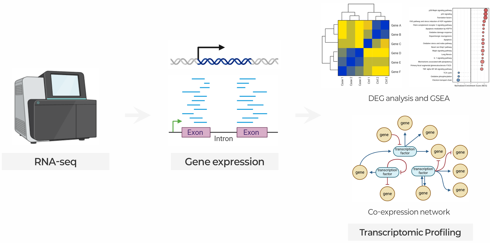

::: {.callout-note collapse="true"}
## 🎯 학습목표

이 장을 마치면 다음을 할 수 있어야 합니다.

-   RNA-seq이 무엇을 측정하고 무엇을 측정하지 않는지 말할 수 있습니다.
-   연구 질문에 따라 poly(A) selection과 rRNA depletion 중 하나를 선택할 수 있습니다.
-   Raw count를 직접 비교할 수 없는 이유와 각 정규화 방법이 보정하는 대상을 설명할 수 있습니다.
-   Count 자료에 t-test가 아니라 negative binomial model이 필요한 이유를 설명할 수 있습니다.
-   Volcano plot과 MA plot을 읽고 어느 것이 더 나은 진단 도구인지 말할 수 있습니다.
-   ORA와 GSEA를 구분하고 enrichment analysis에서 가장 흔한 세 가지 오용을 말할 수 있습니다.
-   ⚠️ “차등 발현” 결과가 실제로는 세포 조성의 변화인 경우를 알아볼 수 있습니다.
:::

> 🤔 **출발 질문**
>
> Knockout에서 표현형이 나타났습니다. RNA-seq 결과 847개의 차등 발현 유전자가 나왔습니다. 그중 무엇이 실제로 의미가 있을까요?

------------------------------------------------------------------------

# 1. RNA-seq이 측정하는 것 📏 {#w4-s1}

## 1) 합성량이 아니라 정상상태 존재량 {#w4-s1-1}

RNA-seq은 **시료를 용해한 바로 그 순간에 존재하던** transcript의 수를 셉니다.

-   그 수는 **전사**와 **분해**라는 두 속도의 균형으로 결정됩니다.
-   ⚠️ 이 assay는 두 과정을 분리할 수 없습니다.
-   → 전사가 두 배 증가한 유전자와 mRNA 반감기가 두 배 늘어난 유전자는 **똑같이 보입니다.**

이 차이가 연구 가설에 중요하다면 다른 assay가 필요합니다.

-   **신생 전사(nascent transcription)** — GRO-seq, TT-seq
-   **대사 표지(metabolic labelling)** — SLAM-seq
-   **번역** — ribosome profiling

## 2) ⚠️ RNA는 단백질이 아닙니다 {#w4-s1-2}

-   유전자 전체에서 transcript와 단백질 존재량의 상관은 **r ≈ 0.4**입니다.
-   실제 상관은 있지만 개별 유전자에서 mRNA를 단백질의 대리값으로 취급하기에는 턱없이 부족합니다.

RNA-seq으로는 번역 효율, 단백질 반감기, 번역 후 조절을 알 수 없습니다. 🔗 W6에서 이를 제대로 다룹니다.

## 3) 혼합물의 한순간을 찍은 사진 {#w4-s1-3}

초반에 반드시 짚어야 할 한계가 두 가지 더 있습니다.

-   ⚠️ **하나의 시점** — 전사 반응은 동적입니다. 한 번의 채취로 효과를 완전히 놓칠 수도 있고, 일시적인 반응을 정상상태로 오해할 수도 있습니다.
-   ⚠️ **세포의 혼합물** — bulk RNA-seq은 tube 안의 모든 세포를 평균냅니다. [§7.2](#w4-s7-2)에서는 이것이 얼마나 심각한 오해를 만드는지 설명하고, 🔗 W5에서는 그 대안을 다룹니다.

{fig-align="center"}

------------------------------------------------------------------------

# 2. 결과를 바꾸는 실험적 선택 ⚙️ {#w4-s2}

## 1) Poly(A) selection과 rRNA depletion {#w4-s2-1}

Ribosomal RNA는 세포 내 전체 RNA의 약 80–90%입니다. Total RNA를 그대로 sequencing하면 예산 대부분이 rRNA를 읽는 데 쓰입니다. 모든 protocol은 두 가지 방법 중 하나로 rRNA를 제거합니다.

{fig-align="center"}

-   **Poly(A) selection** — oligo-dT bead로 poly(A) tail이 있는 transcript를 포획합니다. 깨끗하고 저렴하며 DE 연구의 기본 방법입니다.
-   **rRNA depletion** — 상보적인 probe로 rRNA를 제거하고 나머지를 모두 남깁니다. 비polyadenylated transcript, 새로 전사되어 splicing되지 않은 RNA, 분해된 절편을 포함합니다.

::: {.callout-tip collapse="true"}
## 선택 기준

-   표준 mRNA DE, 품질이 좋은 RNA → **poly(A)**
-   FFPE 또는 분해된 RNA → **rRNA depletion**. 분해된 transcript는 tail을 잃었으므로 poly(A) selection이 실패합니다.
-   lncRNA, circRNA, histone mRNA, 신생 전사 → **rRNA depletion**

⚠️ 실험실에서 결정되는 선택이며 **분석 단계에서 되돌릴 수 없습니다.**
:::

## 2) Stranded와 unstranded {#w4-s2-2}

-   Stranded protocol은 원래 transcript가 어느 strand에서 왔는지 기록합니다.
-   유전체의 약 10–20%에서는 양쪽 strand의 전사가 겹칩니다. Strand 정보가 없으면 이런 read를 모호하게 또는 잘못 배정합니다.
-   → 이제 **stranded가 표준**이며 사용하지 않을 이유가 거의 없습니다.

## 3) Read 길이, 깊이, paired-end {#w4-s2-3}

| 선택 | 중요한 경우 |
|------------------------------------|------------------------------------|
| **더 긴 read** (2×150 vs 1×50) | Isoform과 splice junction 분석. 단순 gene-level counting에서는 이점이 적음 |
| **Paired-end** | Isoform, fusion 탐지, 새로운 transcript. Gene-level DE에는 single-end로 충분한 경우가 많음 |
| **깊이** | [§5.4](#w4-s5-4) 참고 — 예상보다 훨씬 일찍 포화됨 |

## 4) 생물학적 반복과 기술적 반복 {#w4-s2-4}

-   **기술적 반복(technical replicate)** — 같은 RNA를 두 번 sequencing합니다.
-   **생물학적 반복(biological replicate)** — 서로 다른 동물, 환자 또는 독립적으로 배양한 dish를 사용합니다.

⚠️ RNA-seq의 기술적 변이는 작지만 생물학적 변이는 작지 않습니다.

-   한 시료를 두 번 sequencing해도 새로 얻는 정보가 거의 없습니다.
-   → **n은 생물학적 반복만 셉니다.**
-   같은 날 같은 passage를 나누어 만든 flask 세 개는 방법 부분에서 무엇이라 부르든 생물학적 반복보다 기술적 반복에 가깝습니다.

## 5) ✅ 연구 설계 체크리스트 {#w4-s2-5}

시료가 실험실을 떠나기 전에 확인하세요(🔗 [W1 §5.3](w1_intro.qmd#w1-s5-3)).

-   ✅ **Batch에 걸쳐 무작위화하세요.** 추출 날짜, library 제작 batch, sequencing run을 고려해야 합니다. 모든 환자군이 batch 1이고 모든 대조군이 batch 2라면 복구할 수 없습니다.
-   ✅ **RIN을 기록**하고 공변량으로 다루세요. RNA 품질은 측정값을 체계적으로 바꿉니다.
-   ✅ 나이, 성별, 조직 위치, 채취 시각처럼 나중에 보정할 가능성이 있는 **다른 모든 정보도 기록하세요.**
-   ✅ 시작 전에 **n을 결정하세요**([§5.4](#w4-s5-4)).
-   ✅ **균형 잡힌 설계를 유지하세요.** 불균형 설계도 분석할 수 있지만 검정력이 빠르게 떨어집니다.

------------------------------------------------------------------------

# 3. Read에서 count까지 🔢 {#w4-s3}

## 1) Spliced alignment {#w4-s3-1}

**문제** — read는 성숙한 mRNA에서 왔지만 genome에 정렬합니다. Exon–exon junction을 가로지르는 read는 끊김 없이 정렬되지 않습니다.

**해결책** — spliced aligner(STAR, HISAT2)는 알려진 junction 또는 새로운 junction에서 큰 gap을 허용합니다.

새로운 transcript, splicing, fusion, allele-specific expression 또는 genome browser에서 확인할 분석처럼 read의 **위치**가 중요할 때 이 경로를 사용합니다.

## 2) Pseudo-alignment {#w4-s3-2}

**Salmon**과 **kallisto**는 염기 수준의 alignment를 생략합니다. 각 read가 어느 transcript와 *호환되는지*만 확인하고, 전체 read를 이용해 배정을 통계적으로 해결합니다.

-   ✅ 약 10배 빠르고 메모리를 훨씬 적게 사용합니다.
-   ✅ 정량 목적에서는 최소한 동일한 수준으로 정확한 transcript-level 추정값을 제공합니다.
-   ❌ BAM 파일이 없으므로 alignment를 직접 확인할 수 없습니다.
-   ❌ Annotation에 이미 있는 transcript만 정량할 수 있습니다.

## 3) Gene level과 transcript level {#w4-s3-3}

-   대부분의 유전자는 여러 isoform을 만듭니다.
-   Transcript-level 정량은 정보가 더 많지만 잡음도 큽니다. Isoform 사이에 공유되는 read를 확률적으로 배정해야 하기 때문입니다.

💡 **실용적인 표준**은 transcript level에서 정량한 다음 **gene level로 합산**하는 `tximport` 경로입니다. Gene-level 결과가 더 견고하며 나중에 isoform을 살펴볼 선택지도 남습니다.

## 4) Multi-mapping read {#w4-s3-4}

Paralogue, 반복서열, pseudogene처럼 여러 위치에 똑같이 잘 정렬되는 read는 어떤 방식으로든 처리해야 합니다.

-   **버리기** → gene family를 체계적으로 적게 셉니다.
-   **확률적으로 분배하기** → 더 낫지만 그 자체의 불확실성이 생깁니다.

⚠️ GEO에서 내려받는 모든 count matrix 안에 숨어 있는 보이지 않는 결정 중 하나입니다(🔗 [W1 §2.2④](w1_intro.qmd#w1-s2-2-4)).

------------------------------------------------------------------------

# 4. 정규화 ⚖️ {#w4-s4}

## 1) Raw count를 비교할 수 없는 이유 {#w4-s4-1}

Count는 생물학과 관계없는 세 가지 요인의 영향을 받습니다.

1.  **Library size(깊이)** — 두 배 깊게 sequencing하면 모든 유전자의 count가 두 배가 됩니다.
2.  **유전자 길이** — 몰 농도가 같아도 10 kb transcript는 1 kb transcript보다 더 많은 절편을 만듭니다.
3.  **Library 조성** — 눈에 잘 띄지 않지만 중요한 문제입니다.

{fig-align="center"}

## 2) ⚠️ 조성 효과 {#w4-s4-2}

**Sequencing은 절대량이 아니라 비율을 측정합니다.** 전체 read 수는 구매한 sequencing 양으로 고정됩니다.

-   한 유전자 또는 소수의 유전자가 한 조건에서 매우 많아집니다.
-   → 이들이 library의 더 큰 비율을 차지합니다.
-   → **다른 모든 유전자는 아무 변화가 없어도 비율이 낮아집니다.**
-   ⚠️ 변한 것은 깊이가 아니므로 단순 깊이 정규화(CPM)로는 해결할 수 없습니다.

**해결책** — TMM(edgeR)과 RLE / median-of-ratios(DESeq2)는 모두 대부분의 유전자가 차등 발현되지 *않는다*고 가정하고, 그 다수를 이용해 시료별 scaling factor를 추정합니다.

→ 이 때문에 differential expression에는 CPM이 아니라 이 방법들이 표준입니다.

::: {.callout-warning collapse="true"}
## TMM과 RLE의 가정

두 방법 모두 **대부분의 유전자가 변하지 않는다**고 가정합니다. 보통은 안전합니다.

**전체적인 전사 변화가 있으면 실패합니다.**

-   MYC amplification
-   전반적인 전사 억제
-   일부 약물 처리
-   매우 다른 조직끼리의 비교

→ 이런 경우에는 척도의 기준을 고정할 spike-in control(ERCC)이 필요합니다.
:::

## 3) 어떤 측정값을 언제 사용하는가 {#w4-s4-3}

| 방법 | 보정 대상 | 비교 가능 범위 | 용도 |
|------------------|------------------|------------------|------------------|
| **Raw count** | 보정 없음 | — | **DESeq2 / edgeR 입력값** — 미리 정규화하지 않음 |
| **CPM** | 깊이 | 시료 간 | 저발현 유전자 filtering |
| **RPKM / FPKM** | 깊이 + 길이 | 한 시료 안에서만 | 과거 방식. 비교에는 사용하지 않음 |
| **TPM** | 깊이 + 길이 | 한 시료 안 및 제한적인 시료 간 | 발현량 보고, heatmap |
| **TMM / RLE** | 깊이 + **조성** | 시료 간 | **Differential expression의 표준** |

::: {.callout-important collapse="true"}
## 정규화된 값을 DESeq2 또는 edgeR에 절대 넣지 마세요

-   이 도구들은 **raw count**를 model하고 내부에서 자체 size factor를 추정합니다.
-   TPM이나 CPM을 입력하면 분산 model이 깨집니다.
-   → p-value가 무효가 됩니다.

흔하지만 쉽게 드러나지 않는 오류입니다.
:::

------------------------------------------------------------------------

# 5. 차등 발현 📊 {#w4-s5}

## 1) Count에 negative binomial model이 필요한 이유 {#w4-s5-1}

-   **순수한 무작위 표본추출**이라면 count는 **Poisson 분포**를 따라 분산과 평균이 같습니다. 기술적 반복은 대체로 이렇게 행동합니다.
-   **생물학적 반복**은 훨씬 더 큰 변이를 보입니다. 즉 **과산포(overdispersion)**가 있으며 발현량이 클수록 추가 분산도 커집니다.

{fig-align="center"}

**Negative binomial 분포**는 dispersion parameter φ를 추가합니다.

$$
\text{Var}(Y) = \mu + \phi \mu^2
$$

-   φ = 0이면 Poisson 분포가 됩니다.
-   φ를 정직하게 추정하는 것이 타당한 분석과 지나치게 낙관적인 분석을 가릅니다.

## 2) Dispersion, shrinkage와 n = 3으로도 분석 가능한 이유 {#w4-s5-2}

**문제** — 값 세 개로는 분산을 매우 부정확하게 추정합니다. n = 3만으로 개별 유전자의 분산을 추정할 수 없습니다.

**해결책은 유전자 사이에서 정보를 빌리는 것입니다.**

-   **모든** 유전자를 이용해 평균 발현량에 따른 dispersion의 매끄러운 추세를 적합합니다.
-   각 유전자의 잡음 많은 개별 추정값을 이 추세 방향으로 shrink합니다.

💡 Bulk RNA-seq에서 가장 중요한 방법론적 아이디어입니다. 표준 도구가 작은 n에서 유전자별 t-test보다 압도적으로 좋은 성능을 내는 이유입니다.

## 3) 세 가지 표준 도구 {#w4-s5-3}

| 도구 | Model | 특징 |
|------------------------|------------------------|------------------------|
| **DESeq2** | Negative binomial. Dispersion과 log fold change를 모두 shrinkage | 보수적이고 좋은 기본 선택. 작은 n을 잘 처리함 |
| **edgeR** | Negative binomial. Empirical Bayes dispersion | 실제로 DESeq2와 매우 유사. Quasi-likelihood mode는 조금 더 보수적 |
| **limma-voom** | Count를 변환하고 precision weight를 model한 뒤 선형모형 적용 | 큰 n에서 가장 빠름. 복잡한 설계에 가장 유연함 |

💡 반복된 benchmark에서 세 도구는 효과가 큰 유전자에는 동의하고 경계에 있는 유전자에서 의견이 갈립니다.

→ **어느 도구를 사용했는지에 따라 결론이 달라진다면 아직 결론이 없는 것입니다.**

## 4) ⚠️ 표본 수 — 가장 약한 고리 {#w4-s5-4}

{fig-align="center"}

::: {.callout-warning collapse="true"}
## n = 3은 관례일 뿐 정당화가 아닙니다

세 반복으로는 크고 일관된 변화만 탐지할 수 있습니다. 실제 개인 간 변이가 있는 사람 조직에서는 보통 충분하지 않습니다.

대략적인 기준은 다음과 같습니다.

-   **Cell line, 명확한 perturbation** — n = 3–4가 허용될 수 있습니다.
-   **마우스 조직** — n = 5–8
-   **사람 조직 / 임상 시료** — 최소 n = 10–20, 표현형이 이질적이면 더 많이 필요합니다.

오른쪽 패널도 주목하세요. **깊이는 포화되지만 반복 수는 포화되지 않습니다.**

-   대부분의 DE 질문에는 시료당 20–30 M read로 충분합니다.
-   → 그 이상 깊게 읽는 비용은 **시료를 추가하는 데** 사용할 때 검정력이 더 높아집니다.
:::

## 5) 결과표 읽기 {#w4-s5-5}

{fig-align="center"}

-   **보정 p-value** — 거의 항상 Benjamini–Hochberg FDR입니다(🔗 [W1 §4.2](w1_intro.qmd#w1-s4-2)). “FDR < 0.05”는 이 목록에 있는 유전자의 약 5%가 거짓일 것으로 예상된다는 뜻입니다.
-   **log₂ fold change** — 1은 두 배 증가, −1은 절반으로 감소한 것입니다. 작은 n에서는 DESeq2의 **shrunken** LFC를 보고하세요. Count가 낮을 때 raw LFC는 매우 불안정합니다.
-   **Volcano plot** — 유의성과 효과 크기를 함께 표시합니다. ⚠️ 두 threshold line 모두 관례입니다.
-   **MA plot** — 효과 크기와 발현량을 함께 표시합니다. **더 나은 진단 도구**입니다. 제대로 통제되지 않은 분석처럼 hit가 낮은 count에 몰려 있는지를 보여줍니다.

::: {.callout-warning collapse="true"}
## 버려야 할 두 가지 습관

**① Fold change만으로 filtering하기**

-   log₂FC = 3이지만 padj = 0.4라면 발견이 아닙니다.
-   → 유의성 filtering 없이 fold-change threshold만 사용하면 “상위 20개 유전자” 목록은 재현되지 않습니다.

**② Threshold를 생물학적 경계로 취급하기**

-   padj = 0.049와 padj = 0.051은 구분할 수 없는 결과입니다.
-   → 잘라낸 목록만 보여주지 말고 순위가 있는 전체 목록을 보고하세요.
:::

------------------------------------------------------------------------

# 6. 유전자 목록에서 생물학적 의미 찾기 🧠 {#w4-s6}

이제 847개의 유전자가 있습니다. 목록 자체는 결과가 아닙니다. **이들의 공통점은 무엇일까요?**

## 1) ORA와 GSEA {#w4-s6-1}

{fig-align="center"}

-   **ORA**(over-representation analysis) — 유의한 유전자 목록을 선택하고, 배경 집합에 비해 특정 pathway가 과대표현되었는지 Fisher's exact test로 묻습니다.
-   **GSEA** — 어떤 통계량으로 순위를 매긴 *모든* 유전자를 사용해 pathway 구성원이 한쪽 끝에 몰려 있는지 묻습니다. **Threshold를 적용하지 않습니다.**

💡 **GSEA의 고유한 장점**은 유전자 50개가 각각 1.3배씩 변하는 pathway를 탐지한다는 것입니다. 함께 움직이고 생물학적으로 의미 있지만 **threshold 기반 방법에는 완전히 보이지 않는** 변화입니다.

## 2) 어떤 database를 사용할 것인가 {#w4-s6-2}

| 자료원 | 내용 | 주의점 |
|------------------------|------------------------|------------------------|
| **GO** | Biological process, molecular function, cellular component | 중복이 매우 많고 term의 구체성 수준이 크게 다름 |
| **KEGG** | 선별된 대사 및 신호전달 pathway | 수작업으로 선별하지만 갱신이 느림 |
| **Reactome** | 상세하고 계층적인 reaction-level pathway | KEGG보다 깊지만 요약하기 더 복잡함 |
| **MSigDB Hallmark** | 중복을 줄여 정제한 50개 gene set | 💡 중복을 줄이도록 설계되어 가장 좋은 출발점 |

## 3) ⚠️ 가장 흔한 세 가지 오용 {#w4-s6-3}

::: {.callout-warning collapse="true"}
## Enrichment analysis는 수행하기도 쉽고 잘못 수행하기도 쉽습니다

**① 잘못된 배경 집합**

-   조직에서 20,000개 중 12,000개 유전자만 발현되었다면 배경은 **12,000개**입니다.
-   전체 annotation을 사용하면 출력의 모든 p-value가 부풀려집니다.
-   → 문헌에서 가장 흔한 단일 오류입니다.

**② Threshold 민감도**

-   padj를 0.05에서 0.10으로 바꾸면 최상위 pathway가 완전히 달라질 수 있습니다.
-   → 핵심 결과가 이 변화에도 유지되지 않는다면 그 사실을 밝혀야 합니다.

**③ Enrichment는 기전이 아닙니다**

-   “면역 반응에 농축되었다”는 말은 유전자 목록을 설명할 뿐입니다. Driver, 방향, 원인을 식별하지 않습니다.
-   ⚠️ 면역, 대사, 세포주기처럼 큰 일반 범주는 수천 개의 유전자를 포함하므로 거의 모든 perturbation에서 농축됩니다.
:::

------------------------------------------------------------------------

# 7. 차등 발현을 넘어서 🌐 {#w4-s7}

## 1) 공발현 network {#w4-s7-1}

조건을 비교하는 대신 시료 전체에서 어떤 유전자들이 *함께* 변하는지 묻습니다.

-   **WGCNA**는 유전자를 발현 상관에 따라 module로 묶고 module 요약값을 형질과 연결합니다.
-   ✅ 명확한 두 집단 비교가 없을 때 유용하며 20,000개 유전자를 해석 가능한 module 열여 개로 줄일 수 있습니다.
-   ⚠️ 많은 시료가 필요합니다. 20개가 최소선이고 50개 이상이 더 좋습니다. 상관구조를 추정하는 분석이기 때문입니다.

## 2) ⚠️ Deconvolution — 다시 등장한 조성 문제 {#w4-s7-2}

{fig-align="center"}

::: {.callout-warning collapse="true"}
## “신경세포 유전자는 감소하고 microglia 유전자는 증가했다”

Bulk 발현은 존재하는 세포 유형의 **가중평균**입니다.

-   질병이 세포 혼합 비율을 바꿉니다. 신경세포 소실, 면역세포 침윤, 섬유화 등이 일어납니다.
-   → 일관되고 매우 유의한 “차등 발현”이 나타납니다.
-   → **개별 세포의 전사는 아무것도 변하지 않았는데도** 이런 결과가 나옵니다.

🔗 다른 assay에서 나타난 [W3 §5.3②](w3_epigenomics.qmd#w3-s5-3-2)의 교란과 정확히 같습니다. 수많은 bulk 조직 연구에서 세포 유형 marker 유전자가 최상위 hit로 보고되는 이유입니다.

**대응 방법:**

-   ✅ 계산적으로 세포 유형 비율을 추정하고(CIBERSORTx, MuSiC, BayesPrism — 모두 단일세포 참조가 필요함) 공변량으로 포함합니다.
-   ✅ 또는 단일세포를 직접 측정합니다(🔗 W5).
:::

## 3) Splicing과 isoform {#w4-s7-3}

-   **차등 발현** — 유전자의 전체 산출량이 변했는가?
-   **차등 splicing** — isoform의 *비율*이 변했는가?

첫 번째가 변하지 않아도 두 번째는 매우 중요할 수 있습니다.

DEXSeq(exon usage), rMATS와 LeafCutter(splicing event) 등의 도구를 사용합니다.

⚠️ 모두 gene-level DE보다 더 깊은 sequencing과 더 많은 반복이 필요합니다. Paired-end read가 큰 도움이 됩니다.

## 4) 유전 형질로서의 발현 {#w4-s7-4}

W2의 내용을 다시 가져오겠습니다.

-   **eQTL** — 유전자 발현량과 연관된 유전 변이입니다.
-   **GTEx** — 수백 명의 기증자에게서 얻은 54개 사람 조직의 eQTL 자료입니다.

→ 비암호화 GWAS hit에서 후보 유전자로 가는 주된 다리입니다(🔗 [W2 §4.4](w2_genomics.qmd#w2-s4-4)).

⚠️ 지금까지 세 장을 연결하는 주의점이 있습니다. **eQTL은 조직 및 세포 유형에 특이적입니다.** 전혈에서 측정한 eQTL만으로 변이가 신경세포에서 무엇을 하는지 거의 알 수 없습니다.

------------------------------------------------------------------------

# 📝 요약

-   RNA-seq은 한순간에 혼합된 세포 안에 존재하는 정상상태 RNA 양을 측정합니다. 합성 속도, 단백질, 개별 세포를 측정하지 않습니다.
-   Poly(A) selection이 기본이며 FFPE, non-coding RNA, 신생 전사에는 rRNA depletion이 필요합니다.
-   Pseudo-alignment는 정량에 빠르고 정확합니다. Read 위치가 중요할 때는 spliced alignment가 필요합니다.
-   Raw count는 깊이, 유전자 길이, **조성**의 영향을 받습니다. TMM과 RLE는 조성을 보정하므로 DE의 표준입니다.
-   ⚠️ **정규화된 값을 DESeq2 또는 edgeR에 절대 입력하지 마세요.**
-   Count에는 과산포가 있으므로 negative binomial model이 필요합니다. 유전자 사이의 shrinkage 덕분에 작은 n도 분석할 수 있습니다.
-   ⚠️ n = 3은 관례입니다. 깊이는 약 20–30 M read에서 포화되지만 반복 수는 포화되지 않습니다.
-   **MA plot**은 volcano plot보다 더 나은 진단 도구입니다.
-   GSEA는 순위가 있는 전체 목록을 사용하고 ORA는 나머지를 버립니다. ⚠️ 잘못된 배경 집합은 enrichment analysis에서 가장 흔한 오류입니다.
-   ⚠️ Bulk 발현 차이는 흔히 **조성 차이**입니다. Deconvolution하거나 단일세포로 측정해야 합니다.

------------------------------------------------------------------------

# 🔑 핵심 용어

| 용어               | 한 줄 설명                                       |
|-------------------------|-----------------------------------------------|
| Poly(A) selection  | Oligo-dT로 polyadenylated transcript를 포획하는 방법     |
| rRNA depletion     | Probe를 사용해 ribosomal RNA를 제거하는 방법                     |
| Stranded library   | Transcript가 어느 strand에서 왔는지 기록하는 library            |
| Spliced alignment  | Exon–exon junction의 gap을 허용하는 alignment             |
| Pseudo-alignment   | 염기 수준 alignment 없이 transcript 호환성을 판단하는 방법  |
| Count matrix       | 유전자 × 시료 형태의 read count 표                   |
| Library size       | 한 시료의 전체 read 수                               |
| Composition effect | 한 유전자의 증가가 다른 모든 유전자의 비율을 낮추는 현상        |
| CPM / TPM / FPKM   | 깊이 또는 길이를 보정한 발현량 단위          |
| TMM / RLE          | 조성을 고려한 size factor(edgeR / DESeq2)        |
| Overdispersion     | 분산이 Poisson 기대값을 초과하는 현상             |
| Dispersion (φ)     | Poisson 분산에 추가되는 분산 parameter                   |
| Shrinkage          | 잡음 많은 유전자별 추정값을 전체 추세 방향으로 당기는 방법 |
| log₂ fold change   | Log 척도로 나타낸 효과 크기                             |
| Volcano / MA plot  | 유의성 대 효과 크기 / 효과 크기 대 발현량        |
| ORA                | Threshold를 적용한 유전자 목록의 Fisher test                 |
| GSEA               | 순위가 있는 전체 목록에 대한 enrichment analysis                   |
| WGCNA              | 유전자를 공발현 module로 군집화하는 방법            |
| Deconvolution      | Bulk 자료에서 세포 유형 비율을 추정하는 방법        |
| eQTL               | 유전자 발현과 연관된 변이            |

------------------------------------------------------------------------

# ➕ 참고문헌

### 모범 사례와 pipeline

Conesa A, et al. [*A survey of best practices for RNA-seq data analysis.*](https://doi.org/10.1186/s13059-016-0881-8) Genome Biol. 2016.\
Stark R, Grzelak M, Hadfield J. [*RNA sequencing: the teenage years.*](https://doi.org/10.1038/s41576-019-0150-2) Nat Rev Genet. 2019.\
Soneson C, Love MI, Robinson MD. [*Differential analyses for RNA-seq: transcript-level estimates improve gene-level inferences.*](https://doi.org/10.12688/f1000research.7563.2) F1000Res. 2015. (tximport)

### 정량

Dobin A, et al. [*STAR: ultrafast universal RNA-seq aligner.*](https://doi.org/10.1093/bioinformatics/bts635) Bioinformatics. 2013.\
Patro R, et al. [*Salmon provides fast and bias-aware quantification of transcript expression.*](https://doi.org/10.1038/nmeth.4197) Nat Methods. 2017.\
Bray NL, et al. [*Near-optimal probabilistic RNA-seq quantification.*](https://doi.org/10.1038/nbt.3519) Nat Biotechnol. 2016. (kallisto)

### 정규화와 차등 발현

Robinson MD, Oshlack A. [*A scaling normalization method for differential expression analysis of RNA-seq data.*](https://doi.org/10.1186/gb-2010-11-3-r25) Genome Biol. 2010. (TMM)\
Love MI, Huber W, Anders S. [*Moderated estimation of fold change and dispersion for RNA-seq data with DESeq2.*](https://doi.org/10.1186/s13059-014-0550-8) Genome Biol. 2014.\
Robinson MD, McCarthy DJ, Smyth GK. [*edgeR: a Bioconductor package for differential expression analysis of digital gene expression data.*](https://doi.org/10.1093/bioinformatics/btp616) Bioinformatics. 2010.\
Law CW, et al. [*voom: precision weights unlock linear model analysis tools for RNA-seq read counts.*](https://doi.org/10.1186/gb-2014-15-2-r29) Genome Biol. 2014.

### 해석

Subramanian A, et al. [*Gene set enrichment analysis.*](https://doi.org/10.1073/pnas.0506580102) PNAS. 2005.\
Liberzon A, et al. [*The Molecular Signatures Database hallmark gene set collection.*](https://pubmed.ncbi.nlm.nih.gov/?term=The+Molecular+Signatures+Database+hallmark+gene+set+collection) Cell Syst. 2015.\
Timmons JA, Szkop KJ, Gallagher IJ. [*Multiple sources of bias confound functional enrichment analysis of global -omics data.*](https://pubmed.ncbi.nlm.nih.gov/?term=Multiple+sources+of+bias+confound+functional+enrichment+analysis+of+global+-omics+data) Genome Biol. 2015.\
Langfelder P, Horvath S. [*WGCNA: an R package for weighted correlation network analysis.*](https://doi.org/10.1186/1471-2105-9-559) BMC Bioinformatics. 2008.

### Deconvolution과 eQTL

Newman AM, et al. [*Determining cell type abundance and expression from bulk tissues with digital cytometry.*](https://doi.org/10.1038/s41587-019-0114-2) Nat Biotechnol. 2019. (CIBERSORTx)\
[GTEx Portal](https://gtexportal.org/) · GTEx Consortium. *The GTEx Consortium atlas of genetic regulatory effects across human tissues.* Science. 2020.
