::: {.callout-note collapse="true"}
## 🎯 학습목표

이 장을 마치면:

-   RNA-seq의 원리, 그리고 RNA-seq이 측정하는 것과 측정하지 않는 것 구분
-   연구 질문에 따라 poly(A) selection vs rRNA depletion 선택
-   QC 지표로 문제 있는 시료 알아보기
-   Raw count를 그대로 비교할 수 없는 이유와 정규화가 보정하는 것
-   VST와 PCA로 검정 전에 시료 전체를 살피고 batch effect 확인
-   Count 자료에 t-test가 아니라 negative binomial model이 필요한 이유, DESeq2의 design formula 읽기
-   Volcano plot과 MA plot 읽기
-   ORA vs GSEA 구분, enrichment analysis에서 가장 흔한 오용
-   ⚠️ "차등 발현" 결과가 실제로는 세포 조성 변화인 경우 알아보기
:::

> 🤔 **출발 질문**\
> Knockout에서 표현형 확인. RNA-seq 결과 차등 발현 유전자 847개\
> → 그중 실제로 의미 있는 것은?

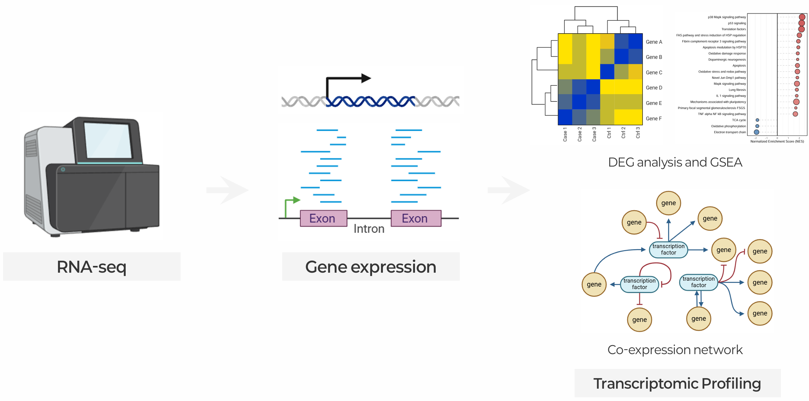

💡 각 절의 본문 = 꼭 알아야 할 기초. **🔍 더 알아보기**는 관심 있을 때 펼쳐 보는 심화 내용

------------------------------------------------------------------------

# 1. RNA-seq이란 🧬 {#w4-s1}

> 🔑 **핵심** — RNA를 cDNA로 바꿔 sequencing하고, read를 유전자별로 셈 → 많이 있던 RNA일수록 count가 큼

## 1) 원리 {#w4-s1-1}

-   세포 안 RNA의 대부분 = **rRNA**(ribosomal RNA, 약 80–90%). 보고 싶은 mRNA는 일부
-   mRNA 끝에는 **poly(A) tail**(A가 수십–수백 개 이어진 꼬리)이 있음 → T가 이어진 서열(oligo-dT)을 붙인 bead로 mRNA만 골라냄 = **poly(A) selection**
-   골라낸 RNA를 조각냄 → cDNA로 복사(reverse transcription) → 양 끝에 adapter 부착 → sequencing
-   Read를 유전체(또는 transcriptome)에 맞춰 보고 유전자마다 셈 → **유전자 × 시료 count 표**
-   💡 기본 논리 — tube에 많이 있던 RNA일수록 조각이 많음 → read가 많음 → count가 큼

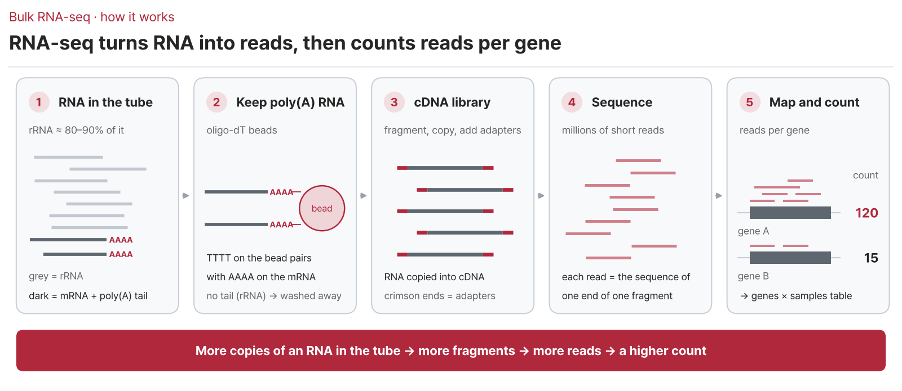{fig-align="center"}

::: {.callout-note collapse="true" icon=false}
## 🔍 더 알아보기 — poly(A) tail이 없는 RNA

-   Histone mRNA, 상당수의 lncRNA, circRNA, 아직 가공 전인 신생 RNA → poly(A) tail이 없거나 짧음
-   분해된 RNA → tail이 붙은 3′ 쪽 조각만 남음
-   → 이런 RNA가 중요하면 poly(A) selection 대신 rRNA만 지우는 rRNA depletion ([§2.1](#w4-s2-1))
:::

## 2) 합성량이 아니라 정상상태 존재량 {#w4-s1-2}

-   RNA-seq은 **시료를 용해한 바로 그 순간에 존재하던** transcript의 수를 셈
-   그 수 = **전사**(만들기)와 **분해**(없애기), 두 속도의 균형
-   ⚠️ 이 assay로는 두 과정 분리 불가 → 전사가 두 배 증가한 유전자와 mRNA 반감기가 두 배 늘어난 유전자가 **똑같이 보임**

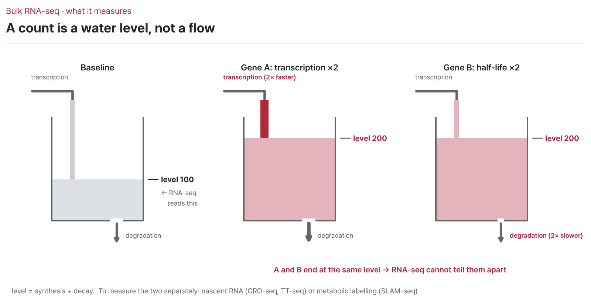{fig-align="center"}

::: {.callout-note collapse="true" icon=false}
## 🔍 더 알아보기 — 합성·번역을 따로 재는 assay

이 차이가 연구 가설에 중요하다면 다른 assay 필요:

-   **신생 전사(nascent transcription)** — GRO-seq, TT-seq
    -   몇 분 동안 새로 만들어진 RNA에만 표지(BrU, 4sU)를 붙임 → 표지된 RNA만 끌어내 sequencing
    -   → 쌓인 양이 아니라 **합성 속도**를 잼

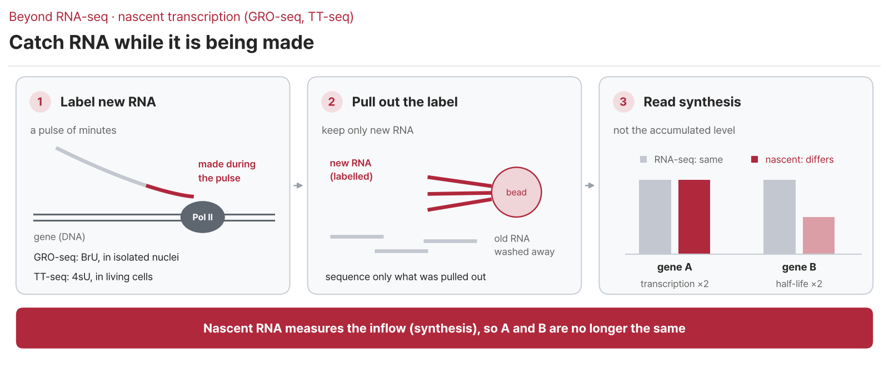{fig-align="center"}

-   **대사 표지(metabolic labelling)** — SLAM-seq
    -   4sU로 새 RNA를 표지 → 화학 처리하면 read에서 그 자리의 T가 C로 읽힘
    -   → 끌어내지 않고 한 library 안에서 새 RNA와 옛 RNA 구분. 시간에 따라 재면 **합성과 분해(반감기)**를 따로 추정

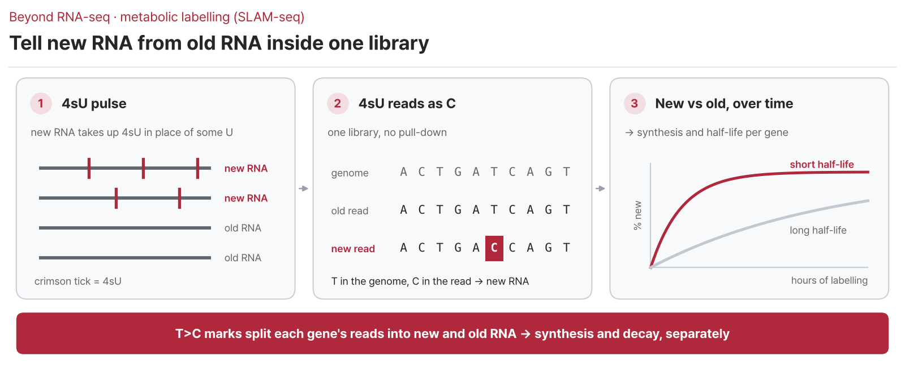{fig-align="center"}

-   **번역** — ribosome profiling(Ribo-seq)
    -   Ribosome을 mRNA 위에 멈춰 세움 → ribosome이 덮지 않은 RNA는 RNase로 잘라냄 → 덮여 있던 약 30 nt 조각(footprint)만 sequencing
    -   → mRNA마다 ribosome이 얼마나 붙어 있는지 = **번역**. RNA-seq과 나란히 재면 번역 효율(TE) 계산

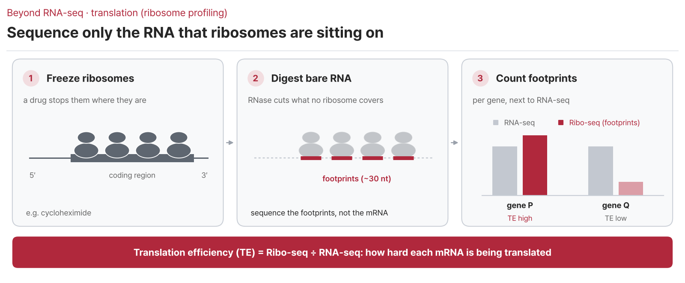{fig-align="center"}
:::

## 3) ⚠️ RNA ≠ 단백질 {#w4-s1-3}

-   유전자 전체에서 transcript와 단백질 존재량의 상관 = **r ≈ 0.4**
-   실제 상관은 있지만 → 개별 유전자에서 mRNA를 단백질의 대리값으로 쓰기엔 턱없이 부족

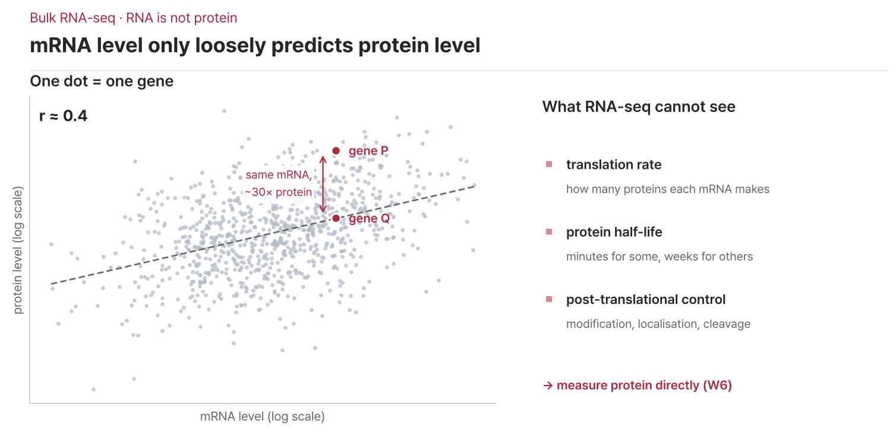{fig-align="center"}

-   RNA-seq으로 알 수 없는 것 (🔗 W6):
    -   **번역 효율** — mRNA 하나가 단백질을 몇 개 만드는지
    -   **단백질 반감기** — 몇 분 만에 사라지는 단백질도, 몇 주 남아 있는 단백질도 있음
    -   **번역 후 조절** — 인산화 같은 변형, 절단, 세포 안 위치 → 양이 같아도 활성이 다름

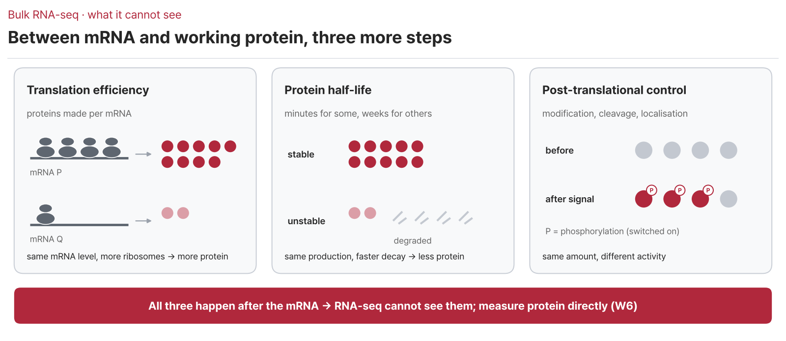{fig-align="center"}

## 4) 정리: 혼합물의 한순간을 찍은 snapshot {#w4-s1-4}

-   RNA-seq = 시료를 용해한 순간 tube 안에 있던 RNA 양의 **snapshot**. 합성 속도 x, 단백질 x, 개별 세포 x
-   ⚠️ **하나의 시점** — 전사 반응은 동적. 한 번의 채취로 효과를 완전히 놓치거나, 일시적인 반응을 정상상태로 오해할 수도
-   ⚠️ **세포의 혼합물** — bulk RNA-seq = tube 안 모든 세포의 평균 → 얼마나 심각한 오해를 만드는지는 [§6.2](#w4-s6-2), 대안은 🔗 W5

------------------------------------------------------------------------

# 2. Sequencing 전 고려할 점 ⚙️ {#w4-s2}

> 🔑 **핵심** — 실험실에서 내린 선택(library 종류, 반복, batch 배치)이 이후 모든 분석의 한계를 정함. 분석 단계에서 되돌리기 x

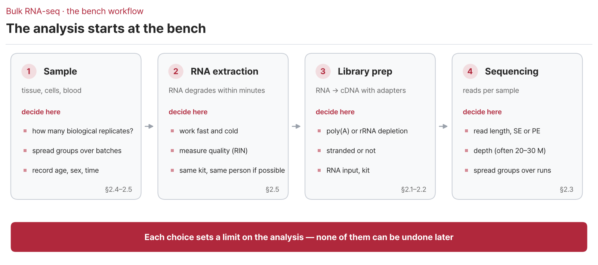{fig-align="center"}

## 1) Poly(A) selection vs rRNA depletion {#w4-s2-1}

-   rRNA를 지우는 방법은 두 가지 (🔗 [§1.1](#w4-s1-1))
-   **Poly(A) selection** — oligo-dT bead로 poly(A) tail이 있는 transcript 포획. 깨끗하고 저렴, DE 연구의 기본
-   **rRNA depletion** — 상보적인 probe로 rRNA만 제거, 나머지는 모두 남김: poly(A) tail이 없는 RNA, 새로 전사되어 splicing 전인 RNA, 분해된 절편

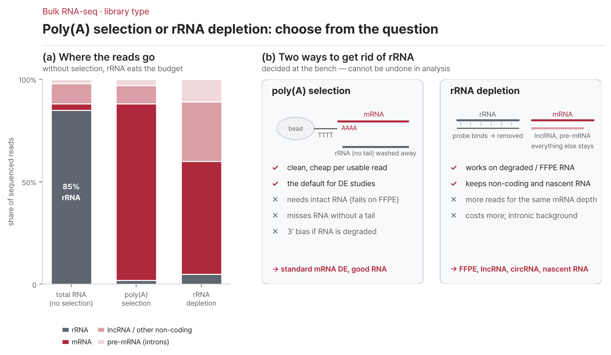{fig-align="center"}

⚠️ 실험실에서 결정 → **분석 단계에서 되돌릴 수 없음**

::: {.callout-tip collapse="true"}
## 선택 기준

-   표준 mRNA DE, 품질 좋은 RNA → **poly(A)**
-   FFPE 또는 분해된 RNA → **rRNA depletion**. 분해된 transcript는 tail을 잃었으므로 poly(A) selection 실패
-   lncRNA, circRNA, histone mRNA, 신생 전사 → **rRNA depletion**
:::

## 2) Stranded vs unstranded {#w4-s2-2}

-   Stranded library = 원래 transcript가 **어느 strand**에서 왔는지 기록
-   유전체의 약 10–20%는 양쪽 strand의 전사가 겹침 → strand 정보가 없으면 이런 read를 모호하게 또는 잘못 배정
-   → 이제 **stranded가 표준**. 쓰지 않을 이유가 거의 없음

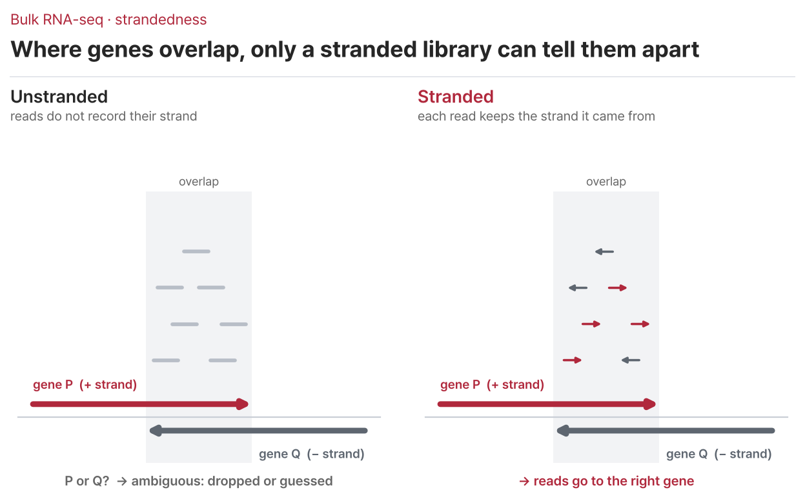{fig-align="center"}

## 3) Read 길이, 깊이, paired-end {#w4-s2-3}

-   **Single-end** = 조각의 한쪽 끝만 읽음, **paired-end** = 양쪽 끝을 읽음 (🔗 [W1 §2.1②](w1_intro.qmd#w1-s2-1-2))
-   단순 gene-level DE → single-end로 충분한 경우가 많음, 긴 read의 이점도 적음
-   Isoform, splice junction, fusion, 새로운 transcript → 더 긴 read, paired-end
-   💡 **Long read**(PacBio, Nanopore; 🔗 [W1 §2.1③](w1_intro.qmd#w1-s2-1-3)) → transcript 하나를 처음부터 끝까지 한 read로 읽음 → isoform과 fusion을 조각으로 짐작하지 않고 직접 확인
-   깊이는 예상보다 훨씬 일찍 포화 ([§4.3④](#w4-s4-3-4))

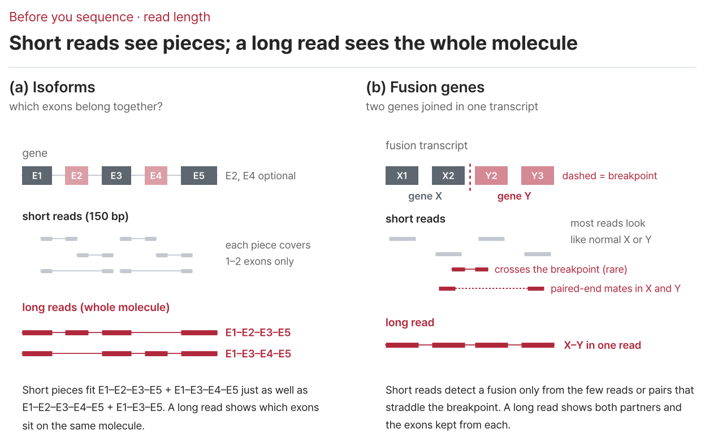{fig-align="center"}

::: {.callout-note collapse="true" icon=false}
## 🔍 더 알아보기 — read 길이·paired-end·깊이 한눈에 보기

| 선택 | 중요한 경우 |
|------------------------------------|------------------------------------|
| **더 긴 read** (2×150 vs 1×50) | Isoform과 splice junction 분석. 단순 gene-level counting에서는 이점이 적음 |
| **Paired-end** | Isoform, fusion 탐지, 새로운 transcript. Gene-level DE에는 single-end로 충분한 경우가 많음 |
| **Long read** (PacBio, Nanopore) | Full-length isoform, fusion, 새로운 transcript. Read 수가 적고 비쌈 → 유전자 정량(DE)은 아직 short read가 주류 |
| **깊이** | [§4.3④](#w4-s4-3-4) 참고 — 예상보다 훨씬 일찍 포화됨 |
:::

## 4) 생물학적 반복 vs 기술적 반복 {#w4-s2-4}

-   **기술적 반복(technical replicate)** — 같은 RNA를 두 번 sequencing
-   **생물학적 반복(biological replicate)** — 서로 다른 동물, 환자, 또는 독립적으로 배양한 dish
-   ⚠️ RNA-seq의 기술적 변이는 작지만 생물학적 변이는 작지 않음 → **n은 생물학적 반복만 셈**

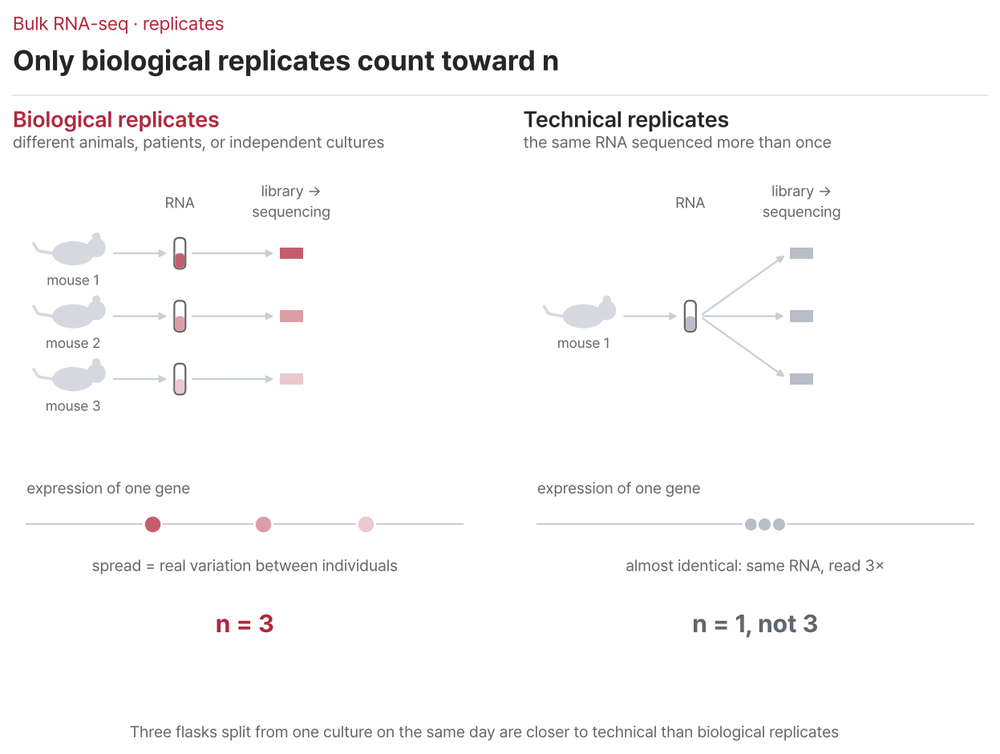{fig-align="center"}

::: {.callout-note collapse="true" icon=false}
## 🔍 더 알아보기 — 무엇이 진짜 생물학적 반복인가

-   한 시료를 두 번 sequencing → 새로 얻는 정보 거의 없음
-   같은 날 같은 passage를 나누어 만든 flask 세 개 → 방법 부분에서 무엇이라 부르든 생물학적 반복보다 기술적 반복에 가까움
:::

## 5) 연구 설계에서 고려할 점 {#w4-s2-5}

시료가 실험실을 떠나기 전 (🔗 [W1 §5.3](w1_intro.qmd#w1-s5-3)):

-   **Batch에 걸쳐 무작위화** — 모든 환자군이 batch 1, 모든 대조군이 batch 2 → 복구 불가. 섞여 있어야 분석에서 batch를 떼어 낼 수 있음 ([§3.4②](#w4-s3-4-2), [§4.4](#w4-s4-4))
-   **RIN 기록**(RNA 품질) + 나중에 보정할 가능성이 있는 다른 모든 정보 기록 — 나이, 성별, 조직 위치, 채취 시각
-   시작 전에 **n 결정**([§4.3④](#w4-s4-3-4)), **균형 잡힌 설계** 유지

::: {.callout-note collapse="true" icon=false}
## 🔍 더 알아보기 — 하나씩 자세히

-   **Batch** = 추출 날짜, library 제작 batch, sequencing run
-   **RIN** — RNA 품질이 측정값을 체계적으로 바꿈 → 공변량으로 다룸
-   **균형** — 불균형 설계도 분석은 가능하지만 검정력이 빠르게 떨어짐
:::

------------------------------------------------------------------------

# 3. Pre-processing 🔢 {#w4-s3}

> 🔑 **핵심** — QC로 시료 확인 → read를 유전자에 배정해 count matrix 만들기 → 정규화 → 검정 전에 시료 전체 살피기(EDA)

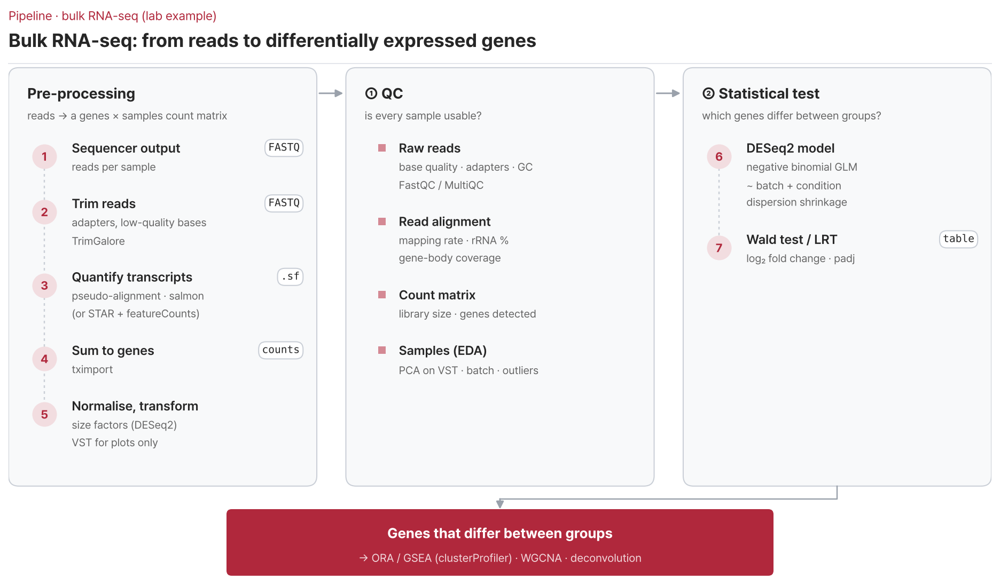{fig-align="center"}

## 1) QC {#w4-s3-1}

-   단계마다 따로 확인: raw read → alignment → count matrix (시료 전체의 모양은 EDA, [§3.4](#w4-s3-4))
-   💡 절대 기준보다 **같은 실험의 다른 시료와 비교**가 핵심

### ① Raw sequencing read {#w4-s3-1-1}

-   **FastQC** — base quality, adapter 잔여, GC 분포, 과다 반복 서열 확인 → 여러 시료는 MultiQC로 한 번에
-   Adapter와 quality 낮은 염기 → trimming (TrimGalore, cutadapt)
-   ⚠️ Duplication — RNA-seq에서는 발현이 높은 유전자에서 자연스럽게 높음 → 그것만으로 read 제거 x

### ② Read alignment {#w4-s3-1-2}

-   **Mapping rate** — 유전체(또는 transcriptome)에 정렬된 read 비율
-   **Read가 떨어진 곳** — exon, intron, intergenic, rRNA 비율 → 한 시료만 튀면 의심
-   **Gene-body coverage** — transcript의 5′에서 3′까지 read가 고르게 깔려야 정상. ⚠️ 3′ 쪽으로 쏠림 = RNA 분해(낮은 RIN)의 신호 (poly(A) library)
-   **Strandedness** — 실험 기록과 맞는지

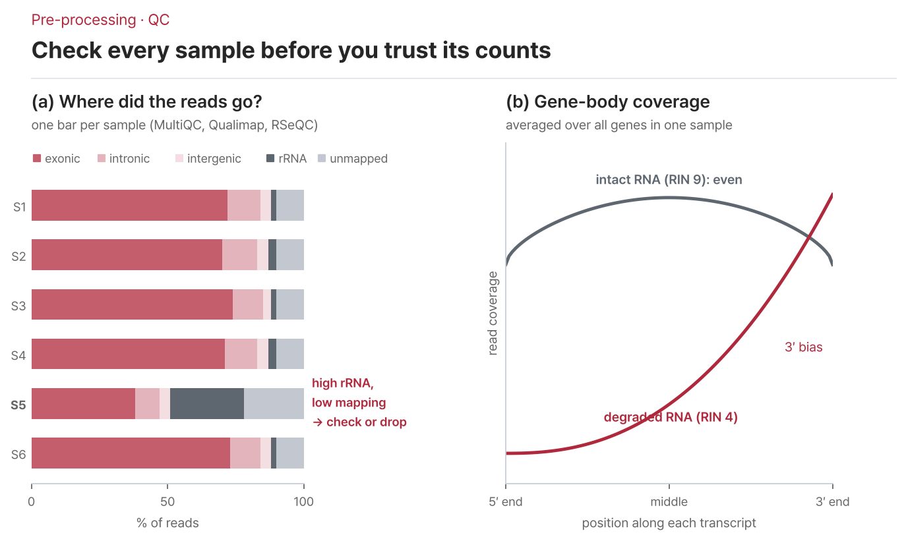{fig-align="center"}

💡 salmon(pseudo-alignment)은 mapping rate만 알려줌 → read 분포와 gene-body coverage는 유전체 alignment(STAR 등) 결과를 RSeQC·Qualimap으로 확인

### ③ Count matrix {#w4-s3-1-3}

-   **Library size**(시료의 총 count), **검출된 유전자 수** → 다른 시료보다 크게 적으면 의심
-   소수 유전자가 count를 독차지하지 않는지 (예: 전혈 시료의 hemoglobin 유전자)
-   시료 전체의 모양 → EDA ([§3.4](#w4-s3-4))

::: {.callout-note collapse="true" icon=false}
## 🔍 더 알아보기 — 단계별 QC 지표 한눈에 보기

| 단계 | 지표 | 문제 신호 |
|------------------------|------------------------|------------------------|
| **Raw read** | Base quality | Read 끝으로 갈수록 급격히 떨어짐 → trimming |
| **Raw read** | Adapter 잔여 | 많음 → 절편이 짧음, trimming 필요 |
| **Raw read** | Duplication | RNA-seq에서는 높아도 정상일 수 있음 |
| **Alignment** | Mapping rate | 다른 시료보다 확연히 낮음 → 오염, 다른 종, adapter |
| **Alignment** | Exonic / intronic 비율 | Poly(A) library인데 intron 비율이 높음 → 핵 RNA나 DNA 오염 |
| **Alignment** | rRNA 비율 | 다른 시료보다 높음 → 제거 실패 |
| **Alignment** | Gene-body coverage | 3′ 쏠림 → 분해 |
| **Alignment** | Strandedness | 기록과 다름 → counting 설정 오류 |
| **Count matrix** | Library size, 검출 유전자 수 | 다른 시료보다 크게 적음 |

-   도구: FastQC, MultiQC, RSeQC, Qualimap. nf-core/rnaseq 같은 pipeline이 한 번에 실행
:::

## 2) Alignment와 정량 {#w4-s3-2}

-   Read를 유전자에 배정하고 셈 → 유전자 × 시료 count matrix
-   ⚠️ 모든 count matrix 안에는 이 과정에서 내린 보이지 않는 결정 네 가지가 숨어 있음 (①–④)

### ① Spliced alignment {#w4-s3-2-1}

-   **문제** — read는 성숙한 mRNA(intron 제거됨)에서 왔지만 genome에 정렬 → exon–exon junction을 가로지르는 read는 끊김 없이 정렬 x
-   **해결** — spliced aligner(STAR, HISAT2)는 알려진 junction 또는 새로운 junction에서 큰 gap 허용
-   Read의 **위치**가 중요할 때 이 경로: 새로운 transcript, splicing, fusion, allele-specific expression, genome browser에서 확인

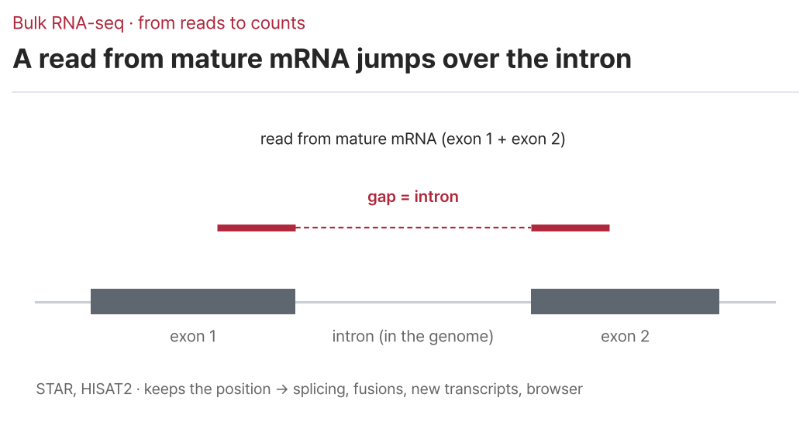{fig-align="center"}

### ② Pseudo-alignment {#w4-s3-2-2}

-   **Salmon**, **kallisto** — 염기 수준 alignment 생략 → 각 read가 어느 transcript와 *호환되는지*만 확인
-   ✅ 약 10배 빠르고 메모리를 훨씬 적게 사용
-   ❌ BAM 파일 없음 → alignment 직접 확인 불가

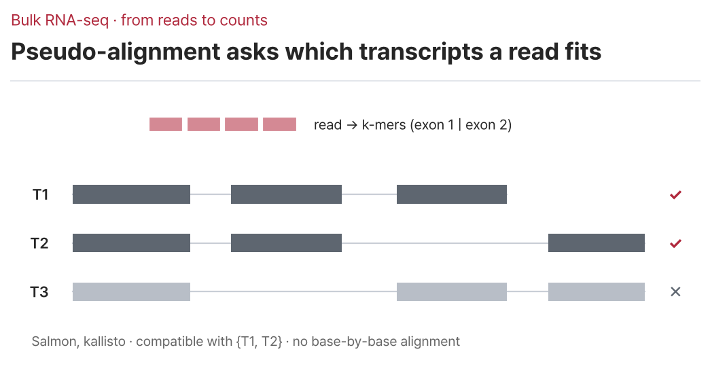{fig-align="center"}

::: {.callout-note collapse="true" icon=false}
## 🔍 더 알아보기 — pseudo-alignment 자세히

-   여러 transcript와 호환되는 read → 전체 read를 이용해 배정을 **통계적으로** 해결
-   ✅ 정량 목적에서는 transcript-level 추정값도 최소한 동일한 수준으로 정확
-   ❌ Annotation에 이미 있는 transcript만 정량 가능
:::

### ③ Gene level vs transcript level {#w4-s3-2-3}

-   대부분의 유전자 → 여러 isoform(같은 유전자에서 나온 서로 다른 transcript) 생성
-   💡 **실용적인 표준** — transcript level에서 정량 → **gene level로 합산** (`tximport` 경로)

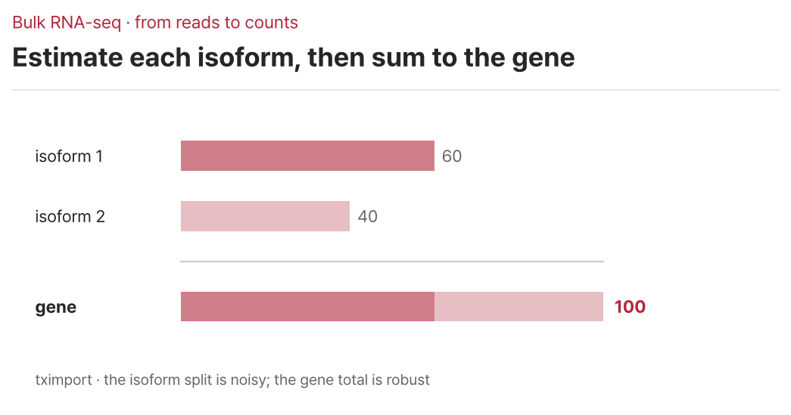{fig-align="center"}

::: {.callout-note collapse="true" icon=false}
## 🔍 더 알아보기 — 왜 gene level로 합산하나

-   Transcript-level 정량 → 정보는 많지만 잡음도 큼: isoform 사이에 공유되는 read를 확률적으로 배정해야 하므로
-   Gene-level 결과가 더 견고 + 나중에 isoform을 살펴볼 선택지도 남음
:::

### ④ Multi-mapping read {#w4-s3-2-4}

-   Paralogue, 반복서열, pseudogene처럼 여러 위치에 똑같이 잘 정렬되는 read 존재
-   ⚠️ 이를 어떻게 처리했는지 = GEO에서 내려받는 모든 count matrix 안에 숨어 있는 보이지 않는 결정 중 하나 (🔗 [W1 §2.2④](w1_intro.qmd#w1-s2-2-4))

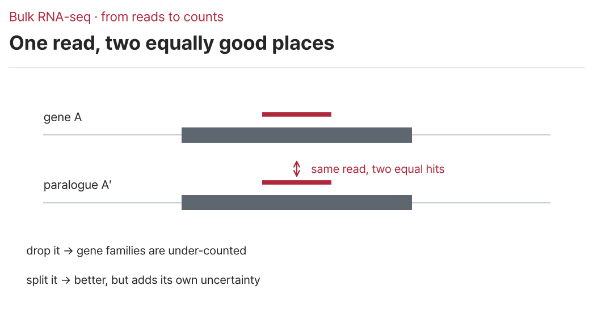{fig-align="center"}

::: {.callout-note collapse="true" icon=false}
## 🔍 더 알아보기 — 버릴까, 나눌까

-   **버리기** → gene family를 체계적으로 적게 셈
-   **확률적으로 분배하기** → 더 낫지만 그 자체의 불확실성 발생
:::

## 3) 정규화 {#w4-s3-3}

-   Raw count = 생물학 + sequencing 깊이 + 유전자 길이 + library 조성 → 시료를 비교하기 전 정규화 필요

### ① 깊이, 유전자 길이, 조성 {#w4-s3-3-1}

Count에 영향을 주는, 생물학과 무관한 세 가지 요인:

1.  **Library size(깊이)** — 두 배 깊게 sequencing → 모든 유전자의 count가 두 배
2.  **유전자 길이** — 몰 농도가 같아도 10 kb transcript가 1 kb transcript보다 더 많은 절편 생성
3.  **Library 조성** — 눈에 잘 띄지 않지만 중요한 문제 ([②](#w4-s3-3-2))

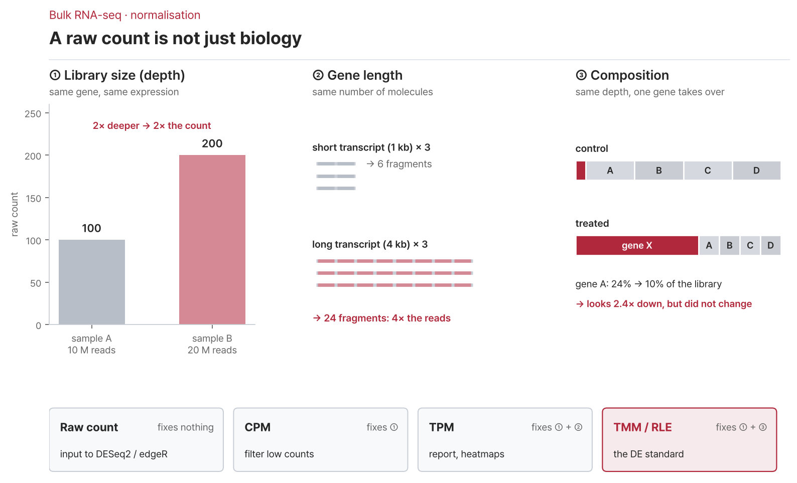{fig-align="center"}

### ② ⚠️ 조성 효과 {#w4-s3-3-2}

-   **Sequencing은 절대량이 아니라 비율을 측정** — 전체 read 수는 구매한 sequencing 양으로 고정
-   한 유전자(또는 소수의 유전자)가 한 조건에서 매우 많아짐 → library에서 더 큰 비율 차지 → **다른 모든 유전자는 아무 변화가 없어도 비율 감소**
-   ⚠️ 변한 것은 깊이가 아니므로 단순 깊이 정규화(CPM)로는 해결 x
-   ✅ **TMM**(edgeR)과 **RLE**(DESeq2)는 조성까지 보정 → differential expression의 표준

::: {.callout-note collapse="true" icon=false}
## 🔍 더 알아보기 — TMM과 RLE의 원리

-   TMM(edgeR)과 RLE / median-of-ratios(DESeq2) 모두 대부분의 유전자가 차등 발현되지 *않는다*고 가정
-   → 그 다수를 이용해 시료별 scaling factor 추정
-   → 그래서 differential expression의 표준은 CPM이 아니라 이 방법들
:::

::: {.callout-warning collapse="true"}
## TMM과 RLE의 가정

두 방법 모두 **대부분의 유전자가 변하지 않음**을 가정. 보통은 안전

**전체적인 전사 변화가 있으면 실패:**

-   MYC amplification
-   전반적인 전사 억제
-   일부 약물 처리
-   매우 다른 조직끼리의 비교

→ 이런 경우 척도의 기준을 고정할 spike-in control(ERCC) 필요
:::

### ③ 발현 단위 {#w4-s3-3-3}

-   **Raw count** → DESeq2 / edgeR 입력값. 미리 정규화 x
-   **TPM** → 발현량 보고, heatmap
-   **TMM / RLE** → differential expression의 표준
-   ⚠️ **정규화된 값(TPM, CPM)을 DESeq2·edgeR에 넣기 x**

::: {.callout-important collapse="true"}
## 정규화된 값을 DESeq2 또는 edgeR에 절대 넣지 말 것

-   이 도구들은 **raw count**를 model하고 내부에서 자체 size factor를 추정
-   TPM이나 CPM 입력 → 분산 model이 깨짐
-   → p-value 무효

흔하지만 쉽게 드러나지 않는 오류
:::

::: {.callout-note collapse="true" icon=false}
## 🔍 더 알아보기 — 발현 단위 전체 비교

| 방법 | 보정 대상 | 비교 가능 범위 | 용도 |
|------------------|------------------|------------------|------------------|
| **Raw count** | 보정 없음 | — | **DESeq2 / edgeR 입력값** — 미리 정규화하지 않음 |
| **CPM** | 깊이 | 시료 간 | 저발현 유전자 filtering |
| **RPKM / FPKM** | 깊이 + 길이 | 한 시료 안에서만 | 과거 방식. 비교에는 사용하지 않음 |
| **TPM** | 깊이 + 길이 | 한 시료 안 및 제한적인 시료 간 | 발현량 보고, heatmap |
| **TMM / RLE** | 깊이 + **조성** | 시료 간 | **Differential expression의 표준** |
:::

## 4) 탐색적 자료 분석(EDA) {#w4-s3-4}

-   유전자 하나하나를 검정하기 전에 **시료 전체**를 먼저 봄
-   확인할 것: 반복끼리 비슷한가? 두 집단이 갈리나? 혼자 튀는 시료(outlier)가 있나? batch가 보이나?

### ① 변환: VST와 rlog {#w4-s3-4-1}

-   Raw count나 log₂(count + 1)를 그대로 PCA에 넣으면 → count가 적은 유전자의 잡음이 결과를 좌우
-   DESeq2의 **VST**(variance stabilizing transformation)와 **rlog**(regularized log) → 발현량과 상관없이 퍼짐을 비슷하게 맞춤
-   ⚠️ **그림과 EDA 전용**. 차등 발현 검정에는 여전히 raw count 입력 ([§3.3③](#w4-s3-3-3))

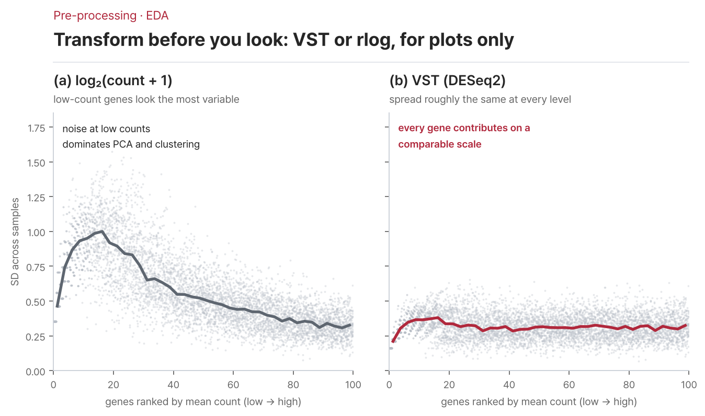{fig-align="center"}

::: {.callout-note collapse="true" icon=false}
## 🔍 더 알아보기 — VST vs rlog, 그리고 코드

-   **VST** `vst()` — 빠름. 시료가 많을 때(약 30개 이상) 기본 선택
-   **rlog** `rlog()` — 시료가 적고 시료마다 깊이 차이가 클 때 조금 더 나음. 대신 느림
-   둘 다 log₂ 척도로 출력 → 발현이 높은 유전자에서는 log₂ 정규화 count와 거의 같음
-   `blind = TRUE`(기본) — 실험 설계를 모르는 채로 변환 → QC 목적에 맞음. 집단 차이가 매우 큰 실험이면 `blind = FALSE`

``` r
vsd <- vst(dds, blind = TRUE)                        # 또는 rlog(dds)
plotPCA(vsd, intgroup = c("condition", "batch"))     # PCA
dist(t(assay(vsd)))                                  # 시료 사이 거리 → heatmap
```
:::

### ② PCA와 batch effect {#w4-s3-4-2}

-   **PCA** — 수천 개 유전자의 변동을 시료 사이 차이를 가장 크게 보여주는 축 몇 개로 요약 (🔗 [W2 §3.2②](w2_genomics.qmd#w2-s3-2-2))
-   ✅ 기대하는 모습 — PC1에서 집단이 갈리고, 같은 집단의 반복은 모여 있음
-   ⚠️ **Batch effect** — 시료가 생물학이 아니라 처리 날짜, library batch, sequencing run에 따라 갈림 (🔗 [§2.5](#w4-s2-5), [W1 §4.3](w1_intro.qmd#w1-s4-3))
-   대응 — count를 고치지 않고 batch를 **design formula에 넣음** → 모형이 batch 몫을 따로 떼어 냄 ([§4.2②](#w4-s4-2-2), [§4.4](#w4-s4-4))

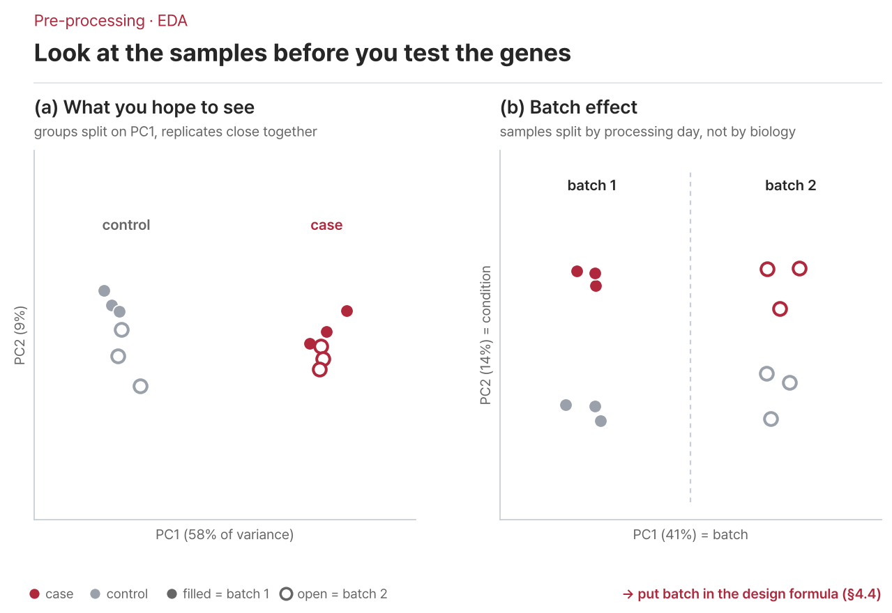{fig-align="center"}

::: {.callout-warning collapse="true"}
## Batch를 지운 값은 그림에만

-   `limma::removeBatchEffect()` 등으로 batch를 지운 값 → **PCA·heatmap 그림 전용**
-   검정에는 raw count + `~ batch + condition`. 지운 값을 다시 검정하면 보정의 불확실성이 빠져 p-value가 지나치게 낙관적
-   ⚠️ Batch와 조건이 완전히 겹치면(환자군 = batch 1, 대조군 = batch 2) → 어떤 모형으로도 분리 불가 ([§2.5](#w4-s2-5))
-   혼자 튀는 시료 → QC 지표([§3.1](#w4-s3-1))로 돌아가 원인 확인. 이유 없이 빼지 말 것
:::

------------------------------------------------------------------------

# 4. 분석: 차등 발현 검정 📊 {#w4-s4}

> 🔑 **핵심** — 유전자마다 "집단 사이 차이가 잡음보다 큰가?"를 검정. DESeq2 = count에 맞춘 회귀모형(negative binomial GLM) + 유전자 사이에서 정보 빌리기. 그래도 충분한 생물학적 반복을 대신하지는 못함

## 1) DEG {#w4-s4-1}

-   **DEG**(differentially expressed gene) = 조건(예: case vs control) 사이에서 발현이 유의하게 달라진 유전자
-   어려움 — 관찰한 발현에는 생물학적 신호, 기술적 잡음, 개인 간 차이가 섞여 있음
-   → 목표: 전체 변동에서 **생물학적 신호만** 골라내기 = 집단 사이 차이가 집단 안 퍼짐보다 충분히 큰가?

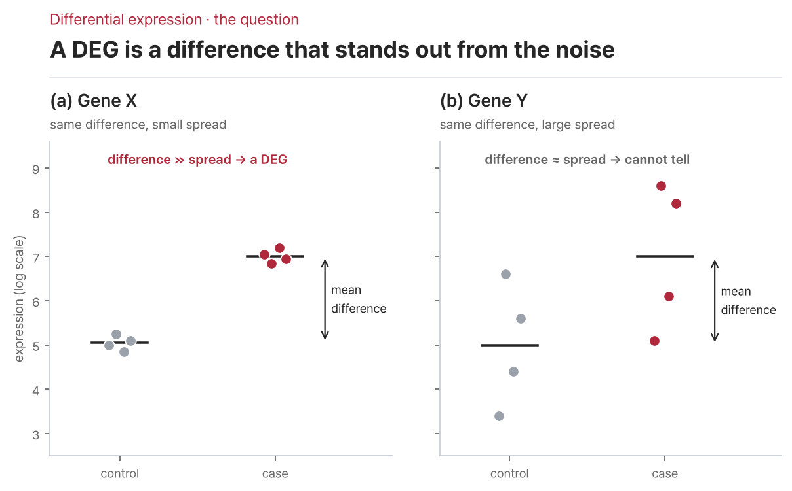{fig-align="center"}

## 2) 회귀분석 {#w4-s4-2}

### ① 선형 회귀 {#w4-s4-2-1}

-   조건을 숫자로 바꿈(control = 0, case = 1) → 발현 = **평균 부분** + **잡음 부분**

$$
y = \beta_0 + \beta_1 x + \varepsilon, \qquad \varepsilon \sim N(0, \sigma^2)
$$

-   β₀ = control 평균, **β₁ = 조건 효과**(검정 대상), ε = 잡음
-   ⚠️ 선형 회귀의 가정: 분산 σ²가 어디서나 같음 → count 자료에서는 깨짐 ([§4.3①](#w4-s4-3-1))

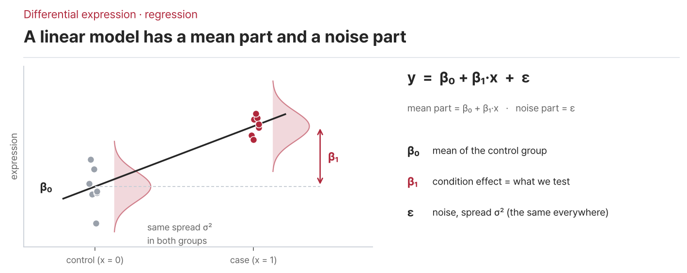{fig-align="center"}

### ② 분산 분해 {#w4-s4-2-2}

-   통계 = 변동이 어디서 왔는지 따라가는 일

$$
\text{전체 변동} = \textbf{조건} + \textbf{batch} + \text{잔차}
$$

-   **조건** — 실제 생물학적 효과
-   **Batch** — 통제할 수 있는 체계적 잡음(날짜, 기기, 실험자)
-   **잔차(residual)** — 설명되지 않는 무작위 오차
-   → 전략: batch를 모형에 넣어 따로 떼어 냄 → 조건 신호가 드러남 (🔗 [§3.4②](#w4-s3-4-2))

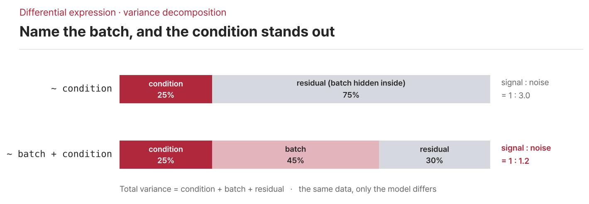{fig-align="center"}

## 3) DESeq2의 통계 모형 {#w4-s4-3}

-   선형 회귀의 틀은 그대로, count에 맞게 두 군데를 바꿈: **분포**(정규 → negative binomial)와 **척도**(log)
-   💡 이 장은 DESeq2 기준. edgeR, limma-voom도 표준 도구 → 큰 효과에는 동의하고 경계에 있는 유전자에서 갈림 → **어느 도구를 썼는지에 따라 결론이 달라진다면 아직 결론이 없는 것**

::: {.callout-note collapse="true" icon=false}
## 🔍 더 알아보기 — 세 도구의 차이

| 도구 | Model | 특징 |
|------------------------|------------------------|------------------------|
| **DESeq2** | Negative binomial. Dispersion과 log fold change를 모두 shrinkage | 보수적이고 좋은 기본 선택. 작은 n을 잘 처리함 |
| **edgeR** | Negative binomial. Empirical Bayes dispersion | 실제로 DESeq2와 매우 유사. Quasi-likelihood mode는 조금 더 보수적 |
| **limma-voom** | Count를 변환하고 precision weight를 model한 뒤 선형모형 적용 | 큰 n에서 가장 빠름. 복잡한 설계에 가장 유연함 |
:::

### ① Count 자료의 특징 {#w4-s4-3-1}

-   0을 포함한 **정수**, 음수 없음
-   **순수한 무작위 표본추출**이라면 → count는 **Poisson 분포**: 분산 = 평균. 기술적 반복은 대체로 이렇게 행동
-   **생물학적 반복** → 훨씬 큰 변이 = **과산포(overdispersion)**. 발현량이 클수록 추가 분산도 커짐
-   → 분산이 일정하다는 선형 회귀 가정이 깨짐. count에 t-test → 위양성

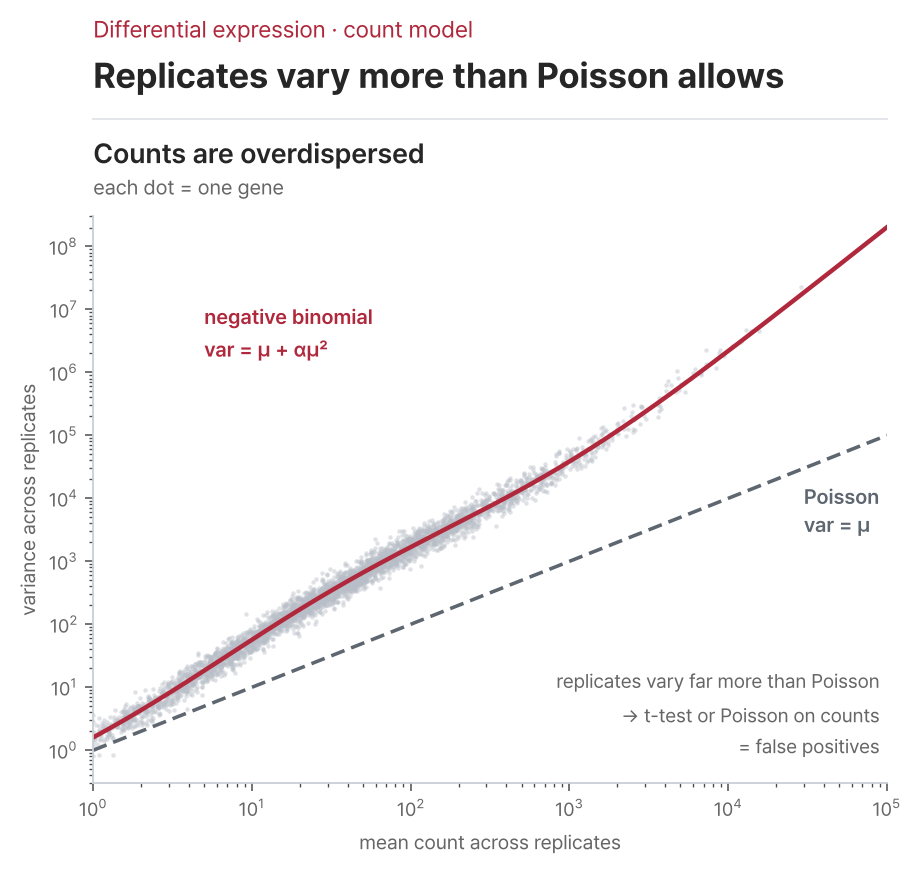{fig-align="center"}

### ② Negative binomial 분포 {#w4-s4-3-2}

-   Poisson에 dispersion α 하나를 더함:

$$
\text{Var}(Y) = \mu + \alpha \mu^2
$$

-   μ = 표본추출 잡음(Poisson 몫), αμ² = 생물학적 반복 사이의 추가 변이

::: {.callout-note collapse="true" icon=false}
## 🔍 더 알아보기 — α 읽는 법

-   α = 0 → Poisson 분포
-   발현이 높으면 √α ≈ 반복 사이 변동계수(CV). 예: α = 0.04 → 생물학적 변동 약 20%
-   α를 정직하게 추정하는지가 타당한 분석과 지나치게 낙관적인 분석을 가름
:::

### ③ GLM {#w4-s4-3-3}

-   평균은 log 척도에서 선형:

$$
\log_2 \mu = \beta_0 + \beta_1 \cdot \text{condition} + \beta_2 \cdot \text{batch} + \cdots
$$

-   = **일반화 선형모형(GLM)**: 선형 회귀의 틀 + count에 맞는 분포(negative binomial) + log 척도
-   선형 회귀와 달리 **분산이 유전자마다 다름** (유전자마다 α가 따로)
-   시료별 size factor([§3.3](#w4-s3-3))는 모형 안에서 깊이 보정으로 들어감 → 그래서 입력은 raw count

### ④ Dispersion 추정과 shrinkage {#w4-s4-3-4}

-   ⚠️ 값 세 개로는 분산을 매우 부정확하게 추정 → n = 3만으로 개별 유전자의 α 추정 불가
-   ✅ 해결 = **유전자 사이에서 정보 빌리기**(shrinkage):
    1.  유전자마다 α 추정 (잡음 많음)
    2.  모든 유전자로 평균 발현량에 따른 추세선 적합
    3.  각 유전자의 추정값을 추세선 쪽으로 당김
-   💡 Bulk RNA-seq에서 가장 중요한 방법론적 아이디어 → 작은 n에서 표준 도구가 유전자별 t-test보다 압도적으로 좋은 성능을 내는 이유

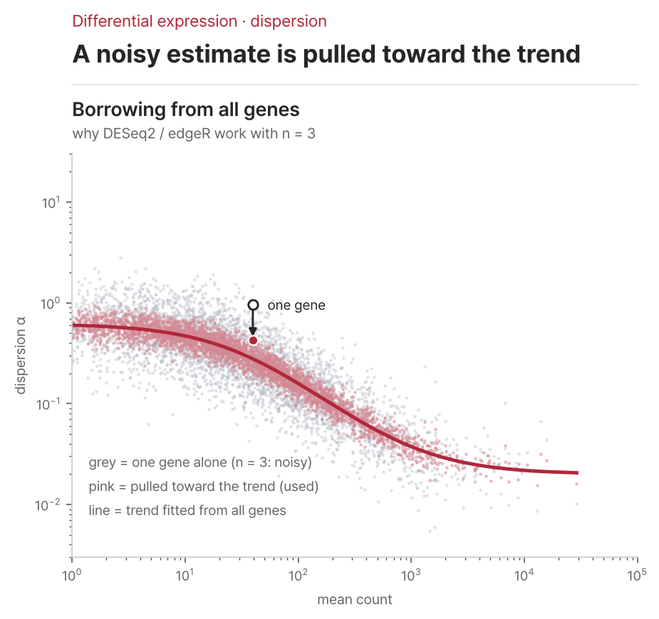{fig-align="center"}

::: {.callout-note collapse="true" icon=false}
## 🔍 더 알아보기 — shrinkage 자세히

-   얼마나 당길지 = 그 유전자의 추정이 얼마나 불확실한가에 따라. 반복이 많을수록 덜 당김
-   추세보다 훨씬 위에 있는 유전자(진짜로 변동이 큰 유전자)는 당기지 않고 그대로 둠 → 위양성 방지
-   `plotDispEsts(dds)`로 직접 확인
:::

::: {.callout-warning collapse="true"}
## 표본 수 — n = 3은 관례일 뿐

-   Shrinkage 덕분에 n = 3으로도 분석은 됨 → 하지만 크고 일관된 변화만 탐지
-   **깊이는 포화되지만 반복 수는 포화되지 않음** (오른쪽 패널) → 대부분의 DE 질문에는 시료당 20–30 M read로 충분
-   → 그 이상 깊게 읽는 비용은 **시료 추가**에 쓸 때 검정력이 더 높아짐

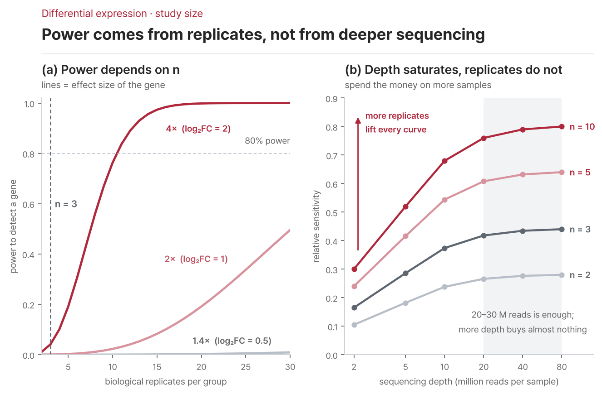{fig-align="center"}

실제 개인 간 변이가 있는 사람 조직에서는 세 반복으로 보통 부족. 대략적인 기준:

-   **Cell line, 명확한 perturbation** — n = 3–4 허용 가능
-   **마우스 조직** — n = 5–8
-   **사람 조직 / 임상 시료** — 최소 n = 10–20, 표현형이 이질적이면 더 많이 필요
:::

### ⑤ LFC와 통계 검정 {#w4-s4-3-5}

-   **β₁ = log₂ fold change(LFC)** = log₂(μ~case~ / μ~control~). 1 = 두 배, −1 = 절반
-   **Wald test** — z = β₁ / SE(β₁) → p-value. 두 집단 비교의 기본
-   **LRT**(likelihood ratio test) — 변수를 뺀 모형과 비교. 셋 이상의 집단, 시간 경과(time course)
-   유전자 수만큼 검정 → 다중검정 보정 → **padj** (🔗 [W1 §4.2](w1_intro.qmd#w1-s4-2))

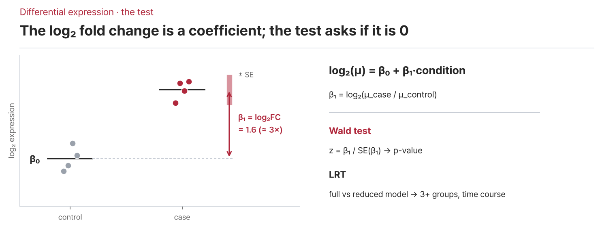{fig-align="center"}

::: {.callout-note collapse="true" icon=false}
## 🔍 더 알아보기 — LFC shrinkage

-   Count가 낮은 유전자 → β₁ 추정이 크게 흔들림 → 우연히 큰 LFC가 순위 맨 위로
-   `lfcShrink()`(예: `type = "apeglm"`) → 불확실한 LFC를 0 쪽으로 당김 → 순위 매기기와 그림에 사용
-   p-value와 padj는 그대로. 바뀌는 것은 효과 크기 추정
:::

## 4) Design matrix {#w4-s4-4}

-   시료 정보 표 → **design formula** → 0과 1로 된 **design matrix** → 열마다 계수(β) 하나
-   예: `~ batch + condition` → condition 열(case = 1, control = 0)의 계수 β₁ = batch를 보정한 log₂ fold change
-   **보정할 변수(batch, 교란요인)를 앞에, 관심 변수(condition)를 맨 뒤에** → `results()`의 기본값이 마지막 변수
-   기준 집단(reference) 지정: `relevel()`로 미리, 또는 `results(contrast = ...)`로

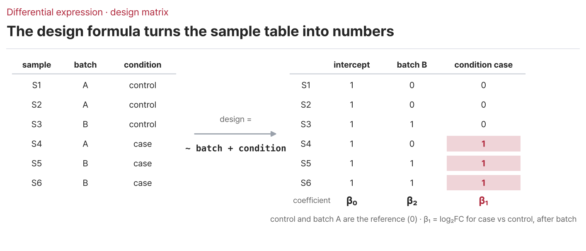{fig-align="center"}

::: {.callout-note collapse="true" icon=false}
## 🔍 더 알아보기 — DESeq2 코드

``` r
library(DESeq2)
dds <- DESeqDataSetFromMatrix(countData = counts,    # raw count (정규화 x)
                              colData   = coldata,   # 시료 정보 표
                              design    = ~ batch + condition)
dds$condition <- relevel(dds$condition, ref = "control")
dds <- DESeq(dds)                                    # size factor → dispersion → Wald test
res <- results(dds, contrast = c("condition", "case", "control"))
```
:::

::: {.callout-note collapse="true" icon=false}
## 🔍 더 알아보기 — 더 복잡한 설계

| 상황 | 예 | Design formula |
|------------------------|------------------------|------------------------|
| **짝지은 시료** | 같은 환자의 tumor vs normal, 치료 전후 | `~ patient + treatment` |
| **상호작용** | 질병 아형에 따라 약물 반응이 다른가 | `~ subtype + drug + subtype:drug` |
| **시간 경과** | 여러 시점 | `~ time`, LRT로 검정 |
| **랜덤 효과** | 한 사람에게서 여러 조직 | DESeq2로는 불가 → limma-voom |
| **기록되지 않은 batch** | 숨은 변동 | `sva`로 surrogate variable 추정 → `~ SV1 + SV2 + condition` |
:::

::: {.callout-warning collapse="true"}
## 공선성(collinearity): 함께 넣을 수 없는 변수

-   짝지은 설계 `~ patient + condition`에 나이·성별 추가 x → 환자 안에서 변하지 않으므로 patient가 이미 모두 설명
-   Batch와 condition이 완전히 겹침 → design matrix의 두 열이 같아짐 → 둘을 분리할 수 없음 (🔗 [§2.5](#w4-s2-5))
:::

## 5) 결과표와 시각화 {#w4-s4-5}

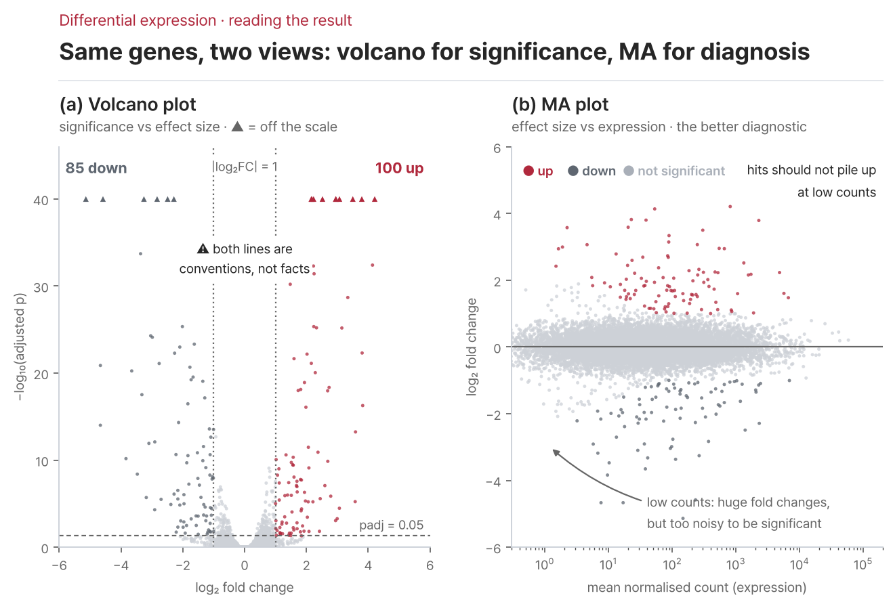{fig-align="center"}

-   **보정 p-value(padj)** — "FDR < 0.05" → 이 목록에 있는 유전자의 약 5%가 거짓일 것으로 예상 (🔗 [W1 §4.2](w1_intro.qmd#w1-s4-2))
-   **log₂ fold change** — 1 = 두 배 증가, −1 = 절반으로 감소
-   **Volcano plot** — 유의성 vs 효과 크기
-   **MA plot** — 효과 크기 vs 발현량 → **더 나은 진단 도구**

::: {.callout-note collapse="true" icon=false}
## 🔍 더 알아보기 — 숫자와 그림을 더 꼼꼼히 읽기

-   보정 p-value = 거의 항상 Benjamini–Hochberg FDR
-   작은 n에서는 DESeq2의 **shrunken** LFC 보고. Count가 낮을 때 raw LFC는 매우 불안정
-   ⚠️ Volcano plot의 두 threshold line은 모두 관례일 뿐
-   MA plot이 더 나은 진단 도구인 이유: hit가 낮은 count에 몰려 있는지 보여줌 — 제대로 통제되지 않은 분석의 모습
:::

::: {.callout-warning collapse="true"}
## 버려야 할 두 가지 습관

**① Fold change만으로 filtering하기**

-   log₂FC = 3이지만 padj = 0.4 → 발견 x
-   → 유의성 filtering 없이 fold-change threshold만 쓰면 "상위 20개 유전자" 목록은 재현되지 않음

**② Threshold를 생물학적 경계로 취급하기**

-   padj = 0.049와 padj = 0.051은 구분할 수 없는 결과
-   → 잘라낸 목록만이 아니라 순위가 있는 전체 목록을 보고
:::

------------------------------------------------------------------------

# 5. Downstream analysis: 유전자 목록에서 생물학적 의미 찾기 🧠 {#w4-s5}

> 🔑 **핵심** — 유전자 847개의 목록 ≠ 결과. Enrichment analysis = **이들의 공통점** 찾기. 목록을 설명할 뿐 기전을 보여주지는 못함

## 1) ORA vs GSEA {#w4-s5-1}

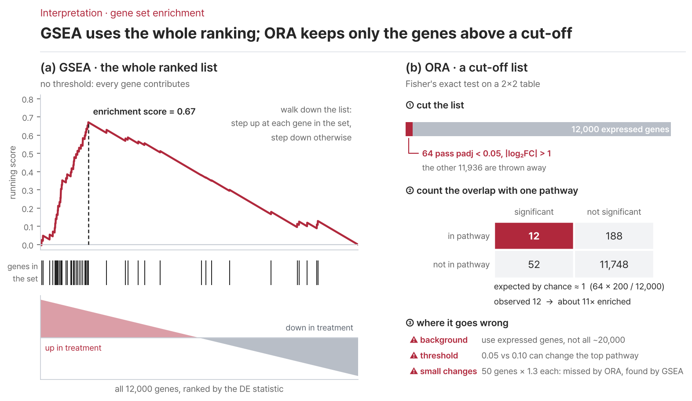{fig-align="center"}

-   **ORA**(over-representation analysis) — 유의한 유전자 목록 선택 → 배경 집합에 비해 특정 pathway가 과대표현되었는가? (Fisher's exact test)
-   **GSEA** — 어떤 통계량으로 순위를 매긴 *모든* 유전자 사용 → pathway 구성원이 한쪽 끝에 몰려 있는가? **Threshold 적용 x**
-   💡 **GSEA의 고유한 장점** — 유전자 50개가 각각 1.3배씩 변하는 pathway 탐지. 함께 움직이고 생물학적으로 의미 있지만 **threshold 기반 방법에는 완전히 안 보이는** 변화

## 2) 어떤 database를 쓰나 {#w4-s5-2}

-   Gene set은 선별된 database에서 가져옴: **GO**, **KEGG**, **Reactome**, **MSigDB Hallmark**
-   💡 **MSigDB Hallmark** = 가장 좋은 출발점. 중복을 줄여 정제한 gene set 50개

::: {.callout-note collapse="true" icon=false}
## 🔍 더 알아보기 — database별 내용과 주의점

| 자료원 | 내용 | 주의점 |
|------------------------|------------------------|------------------------|
| **GO** | Biological process, molecular function, cellular component | 중복이 매우 많고 term의 구체성 수준이 크게 다름 |
| **KEGG** | 선별된 대사 및 신호전달 pathway | 수작업으로 선별하지만 갱신이 느림 |
| **Reactome** | 상세하고 계층적인 reaction-level pathway | KEGG보다 깊지만 요약하기 더 복잡함 |
| **MSigDB Hallmark** | 중복을 줄여 정제한 50개 gene set | 💡 중복을 줄이도록 설계되어 가장 좋은 출발점 |
:::

## 3) ⚠️ 가장 흔한 세 가지 오용 {#w4-s5-3}

-   ① **잘못된 배경 집합** — 배경 = 전체 annotation이 아니라 내 조직에서 발현된 유전자
-   ② **Threshold 민감도** — padj 기준을 바꾸면 최상위 pathway가 달라질 수 있음
-   ③ **Enrichment ≠ 기전** — 유전자 목록을 설명할 뿐. Driver, 방향, 원인 식별 x

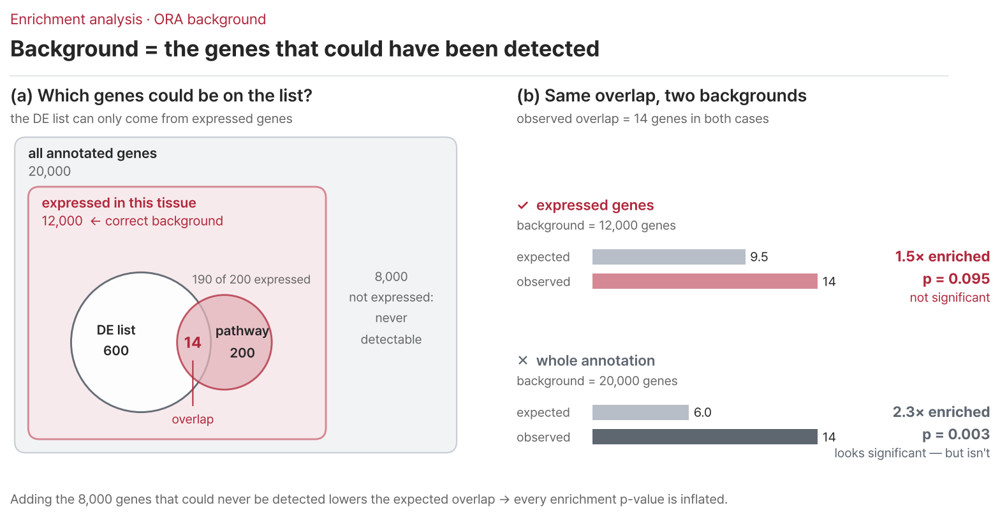{fig-align="center"}

::: {.callout-warning collapse="true"}
## Enrichment analysis = 하기도 쉽고 잘못하기도 쉬움

**① 잘못된 배경 집합**

-   조직에서 20,000개 중 12,000개 유전자만 발현 → 배경은 **12,000개**
-   전체 annotation 사용 → 출력의 모든 p-value가 부풀려짐
-   → 문헌에서 가장 흔한 단일 오류

**② Threshold 민감도**

-   padj를 0.05 → 0.10으로 바꾸면 최상위 pathway가 완전히 달라질 수 있음
-   → 핵심 결과가 이 변화에도 유지되지 않으면 그 사실을 밝힐 것

**③ Enrichment ≠ 기전**

-   "면역 반응에 농축"이라는 말 = 유전자 목록 설명일 뿐. Driver, 방향, 원인 식별 x
-   ⚠️ 면역, 대사, 세포주기처럼 큰 일반 범주는 수천 개의 유전자를 포함 → 거의 모든 perturbation에서 농축
:::

------------------------------------------------------------------------

# 6. 차등 발현을 넘어서 🌐 {#w4-s6}

> 🔑 **핵심** — 같은 자료로 다른 질문도 가능: 유전자 module, 세포 조성, splicing, 유전 변이. ⚠️ Bulk "차등 발현"은 흔히 세포 조성의 변화

## 1) 공발현 network {#w4-s6-1}

-   조건 비교 대신 → 시료 전체에서 어떤 유전자들이 *함께* 변하는지 질문
-   **WGCNA** — 발현 상관에 따라 유전자를 module로 묶고, module 요약값을 형질과 연결
-   ⚠️ 많은 시료 필요 — 20개가 최소선, 50개 이상이 더 좋음

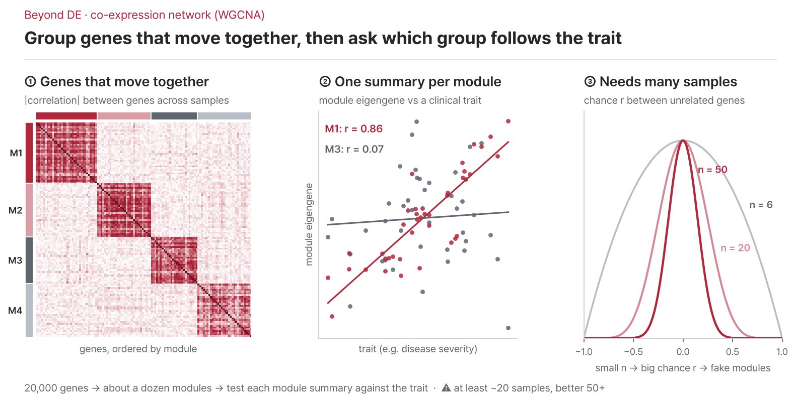{fig-align="center"}

::: {.callout-note collapse="true" icon=false}
## 🔍 더 알아보기 — WGCNA가 유용한 경우

-   ✅ 명확한 두 집단 비교가 없을 때 유용
-   ✅ 유전자 20,000개 → 해석 가능한 module 십여 개로 축소
-   ⚠️ 상관구조를 추정하는 분석이므로 시료가 많이 필요
:::

## 2) ⚠️ Deconvolution — 다시 등장한 조성 문제 {#w4-s6-2}

-   Bulk 발현 = 존재하는 세포 유형들의 **가중평균**
-   질병이 세포 혼합 비율을 바꿈(신경세포 소실, 면역세포 침윤, 섬유화) → 일관되고 매우 유의한 "차등 발현" → **개별 세포의 전사는 아무것도 변하지 않았는데도**
-   ✅ 세포 유형 비율을 계산으로 추정(deconvolution)해 보정, 또는 단일세포를 직접 측정 (🔗 W5)

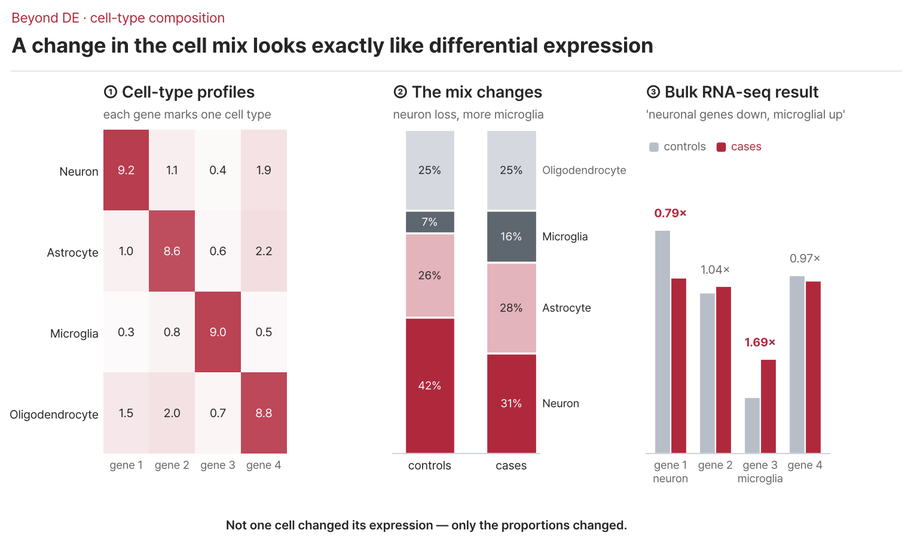{fig-align="center"}

::: {.callout-warning collapse="true"}
## "신경세포 유전자 감소, microglia 유전자 증가"

-   🔗 다른 assay에서 나타난 [W3 §5.3](w3_epigenomics.qmd#w3-s5-3)의 교란과 정확히 같음
-   → 수많은 bulk 조직 연구에서 세포 유형 marker 유전자가 최상위 hit로 보고되는 이유

**대응 방법:**

-   ✅ 계산으로 세포 유형 비율 추정(CIBERSORTx, MuSiC, BayesPrism — 모두 단일세포 참조 필요) → 공변량으로 포함
-   ✅ 또는 단일세포를 직접 측정 (🔗 W5)
:::

## 3) Splicing과 isoform {#w4-s6-3}

-   **차등 발현** — 유전자의 전체 산출량이 변했는가?
-   **차등 splicing** — isoform의 *비율*이 변했는가?
-   → 첫 번째가 변하지 않아도 두 번째는 매우 중요할 수 있음

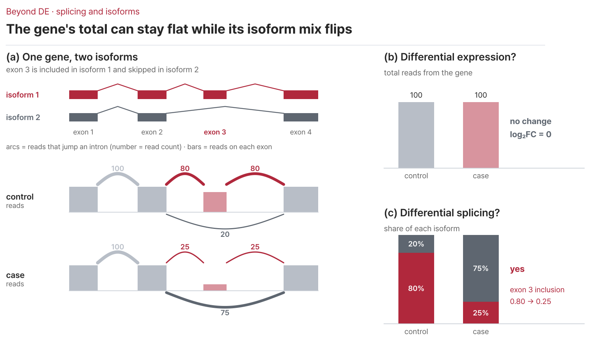{fig-align="center"}

::: {.callout-note collapse="true" icon=false}
## 🔍 더 알아보기 — splicing 분석 도구와 필요 조건

-   도구: DEXSeq(exon usage), rMATS와 LeafCutter(splicing event)
-   ⚠️ 모두 gene-level DE보다 더 깊은 sequencing과 더 많은 반복 필요. Paired-end read가 큰 도움
:::

## 4) 유전 형질로서의 발현 {#w4-s6-4}

-   **eQTL** — 유전자 발현량과 연관된 유전 변이
-   **GTEx** — 수백 명의 기증자에게서 얻은 54개 사람 조직의 eQTL 자료
-   → 비암호화 GWAS hit에서 후보 유전자로 가는 주된 다리 (🔗 [W2 §4.4](w2_genomics.qmd#w2-s4-4))
-   ⚠️ 지금까지 세 장을 연결하는 주의점: **eQTL은 조직 및 세포 유형에 특이적** → 전혈에서 측정한 eQTL만으로는 변이가 신경세포에서 무엇을 하는지 거의 알 수 없음

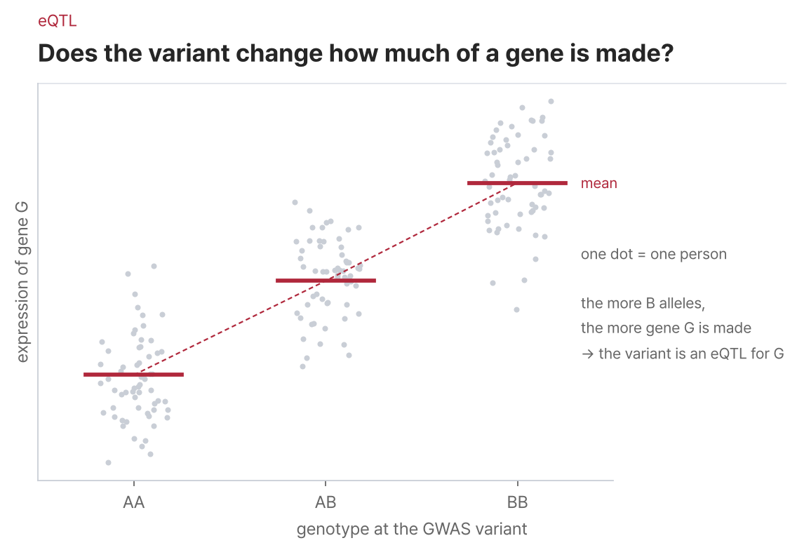{fig-align="center"}

------------------------------------------------------------------------

# 📝 요약

-   RNA-seq = RNA를 cDNA로 바꿔 read를 유전자별로 셈. 측정값 = 한순간, 혼합된 세포 안에 존재하는 정상상태 RNA 양. 합성 속도 x, 단백질 x, 개별 세포 x
-   Poly(A) selection이 기본. FFPE, non-coding RNA, 신생 전사 → rRNA depletion
-   QC는 단계별로: raw read(FastQC) → alignment(mapping rate, rRNA 비율, gene-body coverage) → count matrix. 같은 실험의 다른 시료와 비교
-   Pseudo-alignment = 정량에 빠르고 정확. Read 위치가 중요하면 spliced alignment
-   Raw count는 깊이, 유전자 길이, **조성**의 영향 → 조성까지 보정하는 TMM·RLE가 DE의 표준
-   ⚠️ **정규화된 값을 DESeq2 또는 edgeR에 절대 입력 x**
-   검정 전에 VST·rlog + PCA로 시료부터 확인. Batch effect는 count를 고치지 말고 design formula에 넣기
-   DESeq2 = negative binomial GLM. Count에는 과산포 → negative binomial 필요. 유전자 사이의 shrinkage 덕분에 작은 n도 분석 가능
-   ⚠️ n = 3은 관례일 뿐. 깊이는 약 20–30 M read에서 포화, 반복 수는 포화 x
-   **MA plot**이 volcano plot보다 더 나은 진단 도구
-   GSEA는 순위가 있는 전체 목록 사용, ORA는 나머지를 버림. ⚠️ 잘못된 배경 집합 = enrichment analysis에서 가장 흔한 오류
-   ⚠️ Bulk 발현 차이 = 흔히 **조성 차이** → deconvolution 또는 단일세포 측정

------------------------------------------------------------------------

# 🔑 핵심 용어

| 용어 | 한 줄 설명 |
|-------------------------|------------------------------------------------|
| Poly(A) selection | Oligo-dT로 polyadenylated transcript를 포획하는 방법 |
| rRNA depletion | Probe를 사용해 ribosomal RNA를 제거하는 방법 |
| Stranded library | Transcript가 어느 strand에서 왔는지 기록하는 library |
| Count matrix | 유전자 × 시료 형태의 read count 표 |
| Gene-body coverage | Transcript의 5′에서 3′까지 read가 깔린 모양. 3′ 쏠림 = RNA 분해 |
| Library size | 한 시료의 전체 read 수 |
| Composition effect | 한 유전자의 증가가 다른 모든 유전자의 비율을 낮추는 현상 |
| CPM / TPM / FPKM | 깊이 또는 길이를 보정한 발현량 단위 |
| TMM / RLE | 조성을 고려한 size factor (edgeR / DESeq2) |
| VST / rlog | 발현량과 상관없이 퍼짐을 맞추는 DESeq2의 변환. 그림과 EDA 전용 |
| Batch effect | 생물학이 아니라 처리 날짜·batch에 따라 생기는 체계적 차이 |
| DEG | 조건 사이에서 발현이 유의하게 달라진 유전자 |
| Design formula | 모형에 넣을 변수를 적은 식 (예: `~ batch + condition`) |
| log₂ fold change | Log 척도로 나타낸 효과 크기 |
| Volcano / MA plot | 유의성 vs 효과 크기 / 효과 크기 vs 발현량 |
| ORA | Threshold를 적용한 유전자 목록의 Fisher test |
| GSEA | 순위가 있는 전체 목록에 대한 enrichment analysis |
| Deconvolution | Bulk 자료에서 세포 유형 비율을 추정하는 방법 |
| eQTL | 유전자 발현과 연관된 변이 |

::: {.callout-note collapse="true" icon=false}
## 🔍 더 알아보기 — 심화 용어

| 용어 | 한 줄 설명 |
|-------------------------|------------------------------------------------|
| Spliced alignment | Exon–exon junction의 gap을 허용하는 alignment |
| Pseudo-alignment | 염기 수준 alignment 없이 transcript 호환성을 판단하는 방법 |
| Overdispersion | 분산이 Poisson 기대값을 초과하는 현상 |
| Dispersion (α) | Poisson 분산에 추가되는 분산 parameter |
| GLM | 선형 회귀의 틀에 count에 맞는 분포와 log 척도를 더한 모형 |
| Design matrix | Design formula를 0/1 숫자로 바꾼 행렬. 열마다 계수 하나 |
| Wald test | 계수를 표준오차로 나눈 값으로 0인지 검정 |
| Shrinkage | 잡음 많은 유전자별 추정값을 전체 추세 방향으로 당기는 방법 |
| WGCNA | 유전자를 공발현 module로 군집화하는 방법 |
:::

------------------------------------------------------------------------

# ➕ 참고문헌

### 모범 사례와 pipeline

Conesa A, et al. [*A survey of best practices for RNA-seq data analysis.*](https://doi.org/10.1186/s13059-016-0881-8) Genome Biol. 2016.\
Stark R, Grzelak M, Hadfield J. [*RNA sequencing: the teenage years.*](https://doi.org/10.1038/s41576-019-0150-2) Nat Rev Genet. 2019.\
Soneson C, Love MI, Robinson MD. [*Differential analyses for RNA-seq: transcript-level estimates improve gene-level inferences.*](https://doi.org/10.12688/f1000research.7563.2) F1000Res. 2015. (tximport)

### RNA-seq 너머의 assay

Core LJ, Waterfall JJ, Lis JT. [*Nascent RNA sequencing reveals widespread pausing and divergent initiation at human promoters.*](https://doi.org/10.1126/science.1162228) Science. 2008. (GRO-seq)\
Schwalb B, et al. [*TT-seq maps the human transient transcriptome.*](https://pubmed.ncbi.nlm.nih.gov/27257258/) Science. 2016.\
Herzog VA, et al. [*Thiol-linked alkylation of RNA to assess expression dynamics.*](https://doi.org/10.1038/nmeth.4435) Nat Methods. 2017. (SLAM-seq)\
Ingolia NT, et al. [*Genome-wide analysis in vivo of translation with nucleotide resolution using ribosome profiling.*](https://doi.org/10.1126/science.1168978) Science. 2009.

### QC와 정량

Ewels P, et al. [*MultiQC: summarize analysis results for multiple tools and samples in a single report.*](https://doi.org/10.1093/bioinformatics/btw354) Bioinformatics. 2016.\
Wang L, Wang S, Li W. [*RSeQC: quality control of RNA-seq experiments.*](https://pubmed.ncbi.nlm.nih.gov/22743226/) Bioinformatics. 2012.\
Dobin A, et al. [*STAR: ultrafast universal RNA-seq aligner.*](https://doi.org/10.1093/bioinformatics/bts635) Bioinformatics. 2013.\
Patro R, et al. [*Salmon provides fast and bias-aware quantification of transcript expression.*](https://doi.org/10.1038/nmeth.4197) Nat Methods. 2017.\
Bray NL, et al. [*Near-optimal probabilistic RNA-seq quantification.*](https://doi.org/10.1038/nbt.3519) Nat Biotechnol. 2016. (kallisto)

### 정규화와 차등 발현

Robinson MD, Oshlack A. [*A scaling normalization method for differential expression analysis of RNA-seq data.*](https://doi.org/10.1186/gb-2010-11-3-r25) Genome Biol. 2010. (TMM)\
Love MI, Huber W, Anders S. [*Moderated estimation of fold change and dispersion for RNA-seq data with DESeq2.*](https://doi.org/10.1186/s13059-014-0550-8) Genome Biol. 2014.\
Love MI, Anders S, Kim V, Huber W. [*RNA-Seq workflow: gene-level exploratory analysis and differential expression.*](https://doi.org/10.12688/f1000research.7035.1) F1000Res. 2015. (VST, PCA, design)\
Robinson MD, McCarthy DJ, Smyth GK. [*edgeR: a Bioconductor package for differential expression analysis of digital gene expression data.*](https://doi.org/10.1093/bioinformatics/btp616) Bioinformatics. 2010.\
Law CW, et al. [*voom: precision weights unlock linear model analysis tools for RNA-seq read counts.*](https://doi.org/10.1186/gb-2014-15-2-r29) Genome Biol. 2014.

### 해석

Subramanian A, et al. [*Gene set enrichment analysis.*](https://doi.org/10.1073/pnas.0506580102) PNAS. 2005.\
Liberzon A, et al. [*The Molecular Signatures Database hallmark gene set collection.*](https://pubmed.ncbi.nlm.nih.gov/?term=The+Molecular+Signatures+Database+hallmark+gene+set+collection) Cell Syst. 2015.\
Timmons JA, Szkop KJ, Gallagher IJ. [*Multiple sources of bias confound functional enrichment analysis of global -omics data.*](https://pubmed.ncbi.nlm.nih.gov/?term=Multiple+sources+of+bias+confound+functional+enrichment+analysis+of+global+-omics+data) Genome Biol. 2015.\
Langfelder P, Horvath S. [*WGCNA: an R package for weighted correlation network analysis.*](https://doi.org/10.1186/1471-2105-9-559) BMC Bioinformatics. 2008.

### Deconvolution과 eQTL

Newman AM, et al. [*Determining cell type abundance and expression from bulk tissues with digital cytometry.*](https://doi.org/10.1038/s41587-019-0114-2) Nat Biotechnol. 2019. (CIBERSORTx)\
[GTEx Portal](https://gtexportal.org/) · GTEx Consortium. *The GTEx Consortium atlas of genetic regulatory effects across human tissues.* Science. 2020.
