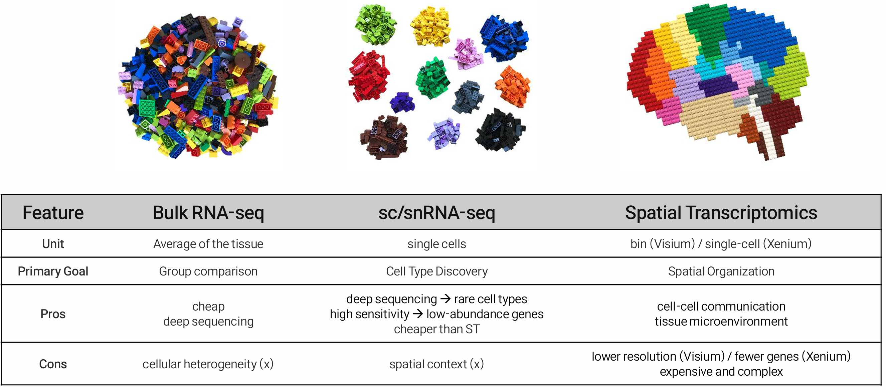
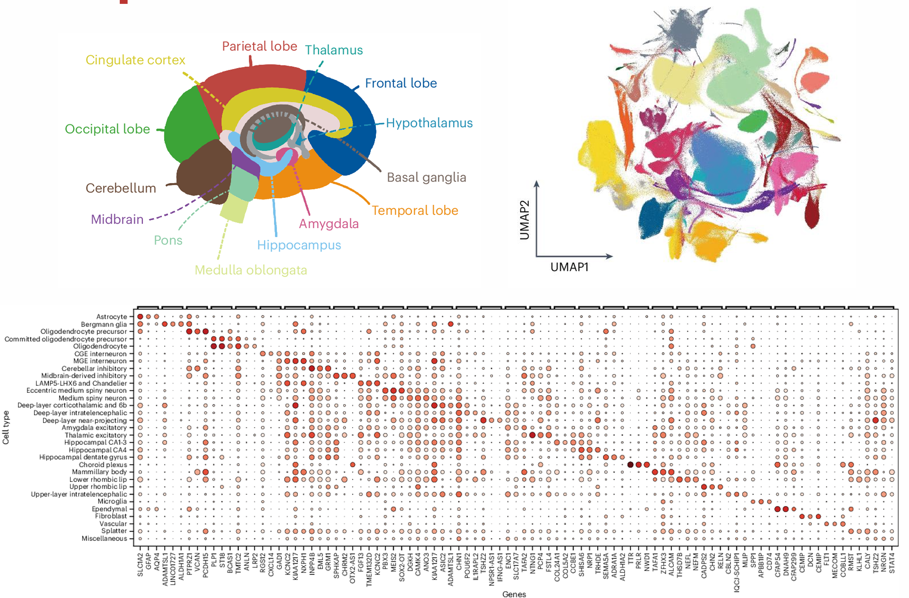

::: {.callout-note collapse="true"}
## 🎯 학습목표

이 장을 마치면 다음을 할 수 있어야 합니다.

-   Bulk로는 답할 수 없지만 single-cell RNA-seq으로 답할 수 있는 질문을 말할 수 있습니다.
-   Droplet 방식과 plate 방식, 세포와 핵 중 연구에 맞는 방법을 선택할 수 있습니다.
-   UMI가 무엇이며 count matrix의 대부분이 0인 이유를 설명할 수 있습니다.
-   Knee plot과 표준 QC scatter plot을 해석하고 각 artifact의 양상을 말할 수 있습니다.
-   ⚠️ UMAP을 책임 있게 읽고 UMAP의 거리가 의미하는 것과 의미하지 않는 것을 말할 수 있습니다.
-   Clustering resolution이 임의적인 이유와 결과를 무엇에 비추어 확인해야 하는지 설명할 수 있습니다.
-   ⚠️ 세포별 차등 발현 검정이 타당하지 않은 이유와 pseudobulk가 대신 무엇을 하는지 설명할 수 있습니다.
:::

> 🤔 **출발 질문**
>
> Bulk RNA-seq에서 명확한 2배 증가가 관찰되었습니다. 모든 세포가 조금씩 변한 것일까요, 5%의 세포가 크게 변한 것일까요, 아니면 어떤 세포도 변하지 않은 것일까요?

{fig-align="center"}

------------------------------------------------------------------------

# 1. 단일세포 분석이 필요한 이유 🔬 {#w5-s1}

## 1) 평균을 내면 사라지는 것 {#w5-s1-1}

{fig-align="center"}

**이 기술이 필요한 이유의 전부입니다.** Bulk 실험은 평균을 보고하지만, 같은 평균이라도 생물학적 상황은 완전히 다를 수 있습니다.

-   **① 전체 세포의 완만한 반응** — 가장 흥미롭지 않은 경우지만 사람들이 암묵적으로 가정하는 경우입니다.
-   **② 반응하는 희귀 하위집단** — 보통 가장 흥미로운 경우입니다. Bulk에서는 아무 반응도 하지 않는 85%의 세포에 의해 희석되어 유의성에 도달하지 못할 때가 많습니다.
-   **③ 조성의 변화** — 어떤 세포도 전사체를 바꾸지 않았습니다(🔗 [W4 §7.2](w4_transcriptomics.qmd#w4-s7-2), 후성유전체학의 같은 문제는 🔗 [W3 §5.3②](w3_epigenomics.qmd#w3-s5-3-2)).

## 2) 단일세포 분석이 실제로 잘하는 것 {#w5-s1-2}

구체적으로 판단해야 합니다. 단일세포 분석은 비싸며 bulk가 더 잘 답할 질문에도 자주 사용됩니다.

**Single-cell이 적합한 경우:**

-   희귀 집단을 포함한 **세포 집단의 발견 또는 특성화**
-   **조성** — 질병에서 어떤 세포 유형의 비율이 변했는가?
-   **세포 유형 특이적 효과** — 한 세포 유형에서는 증가하고 다른 유형에서는 감소하여 bulk에서 보이지 않는 유전자
-   **연속적인 상태** — 분화, 활성화, 탈진처럼 불연속 범주로 설명하기 어려운 과정

**Bulk가 여전히 적합한 경우:**

-   균질한 system(cell line, sorting된 집단)에서 잘 정의된 비교
-   Isoform, 저발현 유전자, splicing과 같은 깊은 transcript-level 분석
-   대규모 cohort — 환자 n = 200에서 단일세포 run을 200번 수행하는 것은 감당하기 어려움

::: {.callout-tip collapse="true"}
## 먼저 sorting하는 방법이 과소평가되어 있습니다

관심 있는 세포 유형을 이미 알고 있나요?

→ FACS로 분리한 뒤 깊은 bulk RNA-seq을 수행하세요. 전체 조직 단일세포 실험보다 **저렴하고, 깊고, 통계적으로 더 깔끔한** 경우가 많습니다.
:::

------------------------------------------------------------------------

# 2. 플랫폼과 시료 선택 🧫 {#w5-s2}

## 1) 근본적인 trade-off {#w5-s2-1}

{fig-align="center"}

-   **Droplet 방식(10x Genomics)** — barcode bead와 함께 세포를 기름방울에 포획합니다. 수만 개 세포에서 세포당 수천 개 유전자를 측정하며 3′ 또는 5′ 말단만 읽습니다. **현재의 기본 방법입니다.**
-   **Plate 방식(Smart-seq2/3)** — well마다 세포 하나를 넣고 full-length transcript를 깊게 읽습니다. 수백 개 세포를 측정합니다. Isoform 또는 매우 민감한 검출이 필요할 때 여전히 선택됩니다.
-   **Combinatorial indexing(sci-, SPLiT-seq)** — 물리적으로 분리하지 않고 split-pool을 반복하며 barcode를 붙입니다. 수백만 개 세포를 매우 얕게 읽습니다. 전 개체 atlas를 가능하게 한 방법입니다.

## 2) ⚠️ 세포와 핵 {#w5-s2-2}

**snRNA-seq**은 온전한 세포 대신 핵을 profiling합니다. scRNA-seq보다 못한 방법이 아니라 많은 조직에서 **유일한 선택지**입니다.

|   | scRNA-seq | snRNA-seq |
|------------------------|------------------------|------------------------|
| 냉동 / 보관 조직 | ❌ 신선한 시료 필요 | ✅ |
| 크거나 약한 세포(신경세포, 지방세포, 근섬유, 심근세포) | ❌ 해리 과정에서 소실 | ✅ |
| 해리 스트레스 반응 | ⚠️ 있음 — protocol 자체가 immediate early gene(*FOS*, *JUN*, heat shock)을 유도 | ✅ 최소 |
| 세포질 transcript | ✅ 포획 | ❌ 놓침 |
| Intron read 비율 | 낮음 | 높음 — 핵에는 splicing되지 않은 pre-mRNA가 많음 |

::: {.callout-warning collapse="true"}
## 해리는 의도하지 않았지만 수행하게 된 실험입니다

**일어나는 일:**

-   37 °C에서 30–60분 동안 효소로 해리합니다.
-   세포는 그 시간 내내 살아서 반응하므로 스트레스 반응 유전자가 유도됩니다.
-   ⚠️ 더 큰 문제는 **해리가 균일하지 않다는 것**입니다. 신경세포, 지방세포, 크거나 약한 세포가 선택적으로 파괴됩니다.

→ 측정한 조성은 조직의 원래 조성이 아니라 **살아남은 세포의 조성**입니다.

💡 “질병에서 세포 유형 X가 감소했다”는 결과를 얻었나요? 질병 조직에서 세포 유형 X를 해리하기가 더 어려웠던 것은 아닌지 물어보세요.
:::

------------------------------------------------------------------------

# 3. Droplet에서 count matrix까지 🧮 {#w5-s3}

## 1) Barcode와 UMI {#w5-s3-1}

포획한 모든 transcript에는 두 종류의 barcode가 붙습니다.

-   **Cell barcode** — droplet, 따라서 세포를 식별합니다.
-   **UMI**(unique molecular identifier) — 원래 mRNA 분자마다 고유한 무작위 서열입니다.

**UMI가 중요한 이유** — PCR 후 하나의 원래 분자가 수백 개 read로 나타날 수 있습니다. 같은 UMI를 공유하는 read를 하나로 합치면 read 수가 아니라 **분자 수**를 복원하여 증폭 편향을 제거합니다.

## 2) Matrix의 90% 이상이 0인 이유 {#w5-s3-2}

일반적인 droplet 실험은 약 20,000개 유전자 중 세포당 1,000–5,000개를 검출합니다.

0은 서로 매우 다른 두 가지 의미를 가집니다.

-   **생물학적 0** — 해당 세포에서 유전자가 실제로 발현되지 않았습니다.
-   **기술적 0(dropout)** — transcript가 있었지만 포획되지 않았습니다. Droplet 포획 효율은 약 10–30%입니다.

💡 이 분야는 대체로 이를 “zero inflation”이라고 부르지 않게 되었습니다. UMI 자료의 0은 별도의 추가 과정이 아니라 낮은 count에서 단순 표본추출 model이 예측하는 결과인 경우가 대부분입니다.

⚠️ 실용적인 결론은 같습니다. **한 세포에서 0이 한 번 나왔다고 유전자가 꺼졌다고 결론 내릴 수 없습니다.**

## 3) 품질 관리 {#w5-s3-3}

{fig-align="center"}

| 문제 | 관찰되는 양상 | 대응 방법 |
|------------------------|------------------------|------------------------|
| **빈 droplet** | Knee 아래의 낮은 UMI barcode | 단순 cutoff 대신 `EmptyDrops` 사용 |
| **Ambient RNA** | 풍부한 세포 유형의 marker 유전자가 모든 곳에서 관찰됨 | `SoupX`, `CellBender` 또는 `DecontX` |
| **Doublet** | 높은 UMI와 높은 유전자 수, 양립할 수 없는 두 marker 집합 | `Scrublet`, `DoubletFinder`. Droplet system에 주입한 세포 1,000개당 약 1% |
| **죽어가는 세포** | 높은 미토콘드리아 분율, 낮은 유전자 수 | 조직 특이적으로 mito % threshold 적용 |

::: {.callout-warning collapse="true"}
## QC threshold는 청소가 아니라 분석상의 결정입니다

-   Mito cutoff 5%가 흔하지만 미토콘드리아가 실제로 풍부한 **심근세포에는 잘못된 기준**입니다.
-   최소 유전자 수 500개라는 threshold는 잔해를 제거하지만 혈소판과 일부 granulocyte처럼 작고 RNA가 적은 세포도 **함께 제거합니다.**

→ **모든 QC threshold는 하나의 세포 집단을 제거합니다.** 제외하기 전에 무엇을 제외하는지 살펴보고 threshold를 보고하세요.
:::

------------------------------------------------------------------------

# 4. 세포 유형 찾기 🗺️ {#w5-s4}

## 1) 표준 pipeline {#w5-s4-1}

```         
정규화  →  highly variable gene 선택  →  PCA
        →  k-nearest-neighbour graph 생성
        →  clustering (Leiden)  →  시각화를 위한 UMAP
        →  cluster annotation
```

⚠️ 순서에 주목하세요. **UMAP은 표시만을 위해 계산합니다.** Clustering은 2차원 embedding이 아니라 PCA/graph에서 수행됩니다.

## 2) ⚠️ UMAP을 책임 있게 읽는 방법 {#w5-s4-2}

UMAP은 수십 차원의 자료를 2차원으로 비선형 투영합니다. 국소 이웃은 비교적 잘 보존하지만 전체 구조는 잘 보존하지 못합니다.

::: {.callout-warning collapse="true"}
## UMAP으로 알 수 *없는* 것

-   **Cluster 사이 거리는 의미가 없습니다.** 멀리 떨어진 두 cluster가 가까운 두 cluster보다 반드시 더 다른 것은 아닙니다.
-   **Cluster 크기는 의미가 없습니다.** 면적은 세포 수가 아니라 embedding을 반영합니다.
-   **겉으로 보이는 연결은 trajectory가 아닙니다.** 가느다란 다리는 doublet, ambient RNA 또는 parameter artifact일 수 있습니다.
-   **Parameter와 random seed에 따라 배치가 달라집니다.** `n_neighbors`와 `min_dist`를 바꾸면 눈에 보이는 형태가 달라집니다.

→ UMAP은 자료의 **그림**이지 **측정값**이 아닙니다. 중요한 주장은 고차원 공간에서 계산한 수치로 뒷받침해야 합니다.
:::

## 3) Clustering resolution은 임의적입니다 {#w5-s4-3}

{fig-align="center"}

Leiden clustering에는 **resolution** parameter가 있습니다.

-   값을 높이면 cluster가 많아지고 낮추면 적어집니다.
-   ⚠️ **정답인 값도, 이를 결정해 주는 통계 기준도 없습니다.** Algorithm은 요청하는 만큼 어떤 cluster든 기꺼이 나눕니다.

💡 값 자체를 고민하는 대신 다음을 확인하세요.

-   점수가 아니라 **marker gene**과 알려진 생물학에 비추어 cluster를 확인합니다.
-   **안정성**을 확인합니다. 다른 resolution, 다른 seed, subsampling한 dataset에서도 cluster가 유지되나요?
-   높은 resolution에서 생긴 “새” cluster가 실제로 고유한 marker를 가지는지, 같은 marker의 정도 차이만 있는지 질문합니다.
-   ✅ **사용한 resolution을 보고하세요.**

::: {.callout-warning collapse="true"}
## Cluster는 세포 유형이 아닙니다

Cluster는 다음을 반영할 수도 있습니다.

-   세포 **상태**(활성 상태 대 휴지 상태)
-   세포주기 단계
-   스트레스 반응
-   Ambient contamination
-   기증자 정체성

→ 가장 높은 marker gene의 이름을 cluster에 붙이고 세포 유형으로 취급하면 문헌에는 **실제로 존재하지 않는 세포 유형**이 쌓이게 됩니다.
:::

## 4) Annotation {#w5-s4-4}

-   **Marker 기반** — cluster별로 알려진 marker를 확인합니다. ✅ 투명합니다. ⚠️ 순환적입니다. 찾으려고 한 세포 유형을 발견하게 됩니다.
-   **참조 기반** — annotation된 atlas에 mapping합니다(Azimuth, SingleR, scANVI). ✅ 빠르고 일관됩니다. ⚠️ 참조의 용어를 그대로 물려받으며 참조에 없는 것은 이름 붙일 수 없습니다.

💡 두 방법을 함께 사용하세요. 서로 일치하지 않는 결과가 유용한 정보를 줍니다.

🗺️ 참조 기반 annotation은 단일세포 분석에서 나타나는 **참조 편향**입니다(🔗 [W1 §2.3③](w1_intro.qmd#w1-s2-3-3)). Atlas에 없는 세포 유형은 보이지 않거나 가장 가까운 이웃으로 잘못 분류됩니다.

------------------------------------------------------------------------

# 5. Batch effect와 integration 🔗 {#w5-s5}

{fig-align="center"}

단일세포 자료에서는 보통 **기증자**가 가장 큰 변이 원인입니다. 세포는 세포 유형보다 먼저 환자에 따라 군집화됩니다.

**Integration 방법**(Harmony, scVI, Seurat CCA/RPCA, scANVI)은 서로 다른 기증자의 같은 세포 유형이 함께 놓이는 공유 표현 공간을 찾습니다.

::: {.callout-warning collapse="true"}
## 과보정

Integration에는 **숨겨진 가정**이 있습니다. 모든 batch에 같은 세포 유형이 존재하며 batch와 연관된 변이는 모두 기술적이라는 가정입니다.

바로 생물학적으로 흥미로운 상황에서 이 가정이 실패합니다.

-   질병 특이적 세포 상태
-   한 조건에만 존재하는 집단

→ 공격적인 integration은 그 집단을 합쳐 없애 버리고, 결과 UMAP은 **아름답게 섞여 보입니다.**

**진단 방법:**

-   ✅ Batch와 세포 유형으로 **각각** 색칠합니다.
-   ✅ 알려진 세포 유형 marker가 integration 후에도 서로 구분되는지 확인합니다.
-   ✅ 한 조건에만 있는 집단이 살아남았는지 확인합니다.
-   ✅ **scIB**와 같은 benchmark는 바로 이 batch 제거와 생물학 보존 사이의 trade-off를 평가합니다.
:::

⚠️ 질병 상태와 batch가 완전히 교락되어 모든 환자군은 하루에, 모든 대조군은 다른 날에 처리했다면 **어떤 integration 방법도 해결할 수 없습니다.** 다시 🔗 [W1 §4.3](w1_intro.qmd#w1-s4-3)의 문제이며 복구할 수 없습니다.

------------------------------------------------------------------------

# 6. 통계 검정 📊 {#w5-s6}

## 1) ⚠️ 세포별 검정이 잘못된 이유 {#w5-s6-1}

{fig-align="center"}

::: {.callout-important collapse="true"}
## 한 기증자에서 나온 세포는 독립적인 시료가 아닙니다

6명의 기증자에서 얻은 5,400개 세포에 Wilcoxon test 또는 t-test를 적용하면 세포를 5,400개의 독립적인 관측값으로 취급합니다.

**그러나 독립적이지 않습니다.** 같은 사람의 세포는 그 사람의 유전적 배경, 환경, 약물, batch와 처리 과정을 공유합니다.

**그 결과:**

-   p-value가 여러 자릿수만큼 과도하게 작아집니다.
-   세포를 추가하면 p-value가 끝없이 작아집니다.
-   → 연구한 사람의 수가 아니라 **주입한 세포 수**를 측정하게 됩니다.

⚠️ Seurat의 기본 `FindMarkers`가 이런 방식으로 작동합니다.

-   ✅ 한 dataset 안에서 *cluster marker를 식별*하는 기술적 목적에는 적합합니다.
-   ❌ **조건 간 비교**에는 적합하지 않습니다.
:::

## 2) Pseudobulk {#w5-s6-2}

**해결책**은 각 **기증자 × 세포 유형**에 대해 세포 전체의 count를 합하는 것입니다.

→ 작은 pseudo-sample matrix를 만들고 🔗 [W4 §5](w4_transcriptomics.qmd#w4-s5)와 똑같이 DESeq2 또는 edgeR로 분석합니다.

-   반복된 benchmark에서 pseudobulk는 세포별 검정보다 위양성을 훨씬 잘 통제합니다.
-   기증자를 random effect로 둔 **mixed model**도 합리적인 대안입니다. 더 많은 검정력을 유지하지만 계산량이 많습니다.

::: {.callout-tip collapse="true"}
## 연구 설계에 미치는 영향

반복의 단위가 기증자라면 **기증자 수가 n입니다.**

환자 3명 대 대조군 3명이면 세포를 3,000개 읽든 300,000개 읽든 **n = 3**입니다.

→ 이는 단일세포 실험의 비용 배분을 바꿉니다. 많은 출판 연구가 두세 명에게서 엄청난 수의 세포를 profiling합니다.

-   ✅ 어떤 세포 유형이 존재하는지 기술하는 데는 매우 좋습니다.
-   ❌ 조건 사이의 차이를 주장하는 데는 정보가 부족합니다.
:::

## 3) Differential abundance {#w5-s6-3}

흔히 흥미로운 결과는 한 세포 유형의 발현이 변한 것이 아니라 그 유형의 **양이 늘거나 줄었다는 것**입니다.

⚠️ 비율은 **조성 자료**입니다. 한 세포 유형이 늘면 산술적으로 다른 모든 유형의 비율이 줄어듭니다. 🔗 [W4 §4.2](w4_transcriptomics.qmd#w4-s4-2)와 같은 문제이며, 다른 형태로는 🔗 [W7 §6](w7_metagenomics.qmd#w7-s6)에서도 나타납니다.

-   ✅ 이를 처리하는 방법: `scCODA`, `miloR`, `propeller`, Dirichlet-multinomial model
-   ❌ 세포 count에 대한 χ² test는 **타당하지 않습니다.**

------------------------------------------------------------------------

# 7. 동역학, 공간과 atlas 🌈 {#w5-s7}

## 1) Trajectory inference {#w5-s7-1}

분화 중간에 포착된 세포는 전사적 유사성에 따라 **pseudotime** 축에 배열할 수 있습니다.

-   도구: Monocle3, Slingshot, PAGA
-   **RNA velocity**(scVelo)는 splicing 전후의 read를 비교해 방향 정보를 추가합니다.

⚠️ 세 가지 주의점을 명확히 알아야 합니다.

-   실제 과정이 전혀 없는 dataset에서도 trajectory algorithm은 **항상** trajectory를 반환합니다.
-   **Pseudotime은 시간이 아닙니다.** 속도도 기간도 측정하지 않습니다.
-   RNA velocity가 가정하는 splicing kinetics는 **논쟁 중**이며 일부 유전자와 system에서 실패한다는 사실이 알려져 있습니다.

→ 가설 생성 도구로 취급하세요. 가설을 검정하려면 lineage tracing 또는 time-course sampling이 필요합니다.

## 2) 세포–세포 communication {#w5-s7-2}

CellPhoneDB, CellChat, NicheNet은 cluster 쌍 사이에서 함께 발현되는 ligand–receptor 쌍에 점수를 매깁니다.

⚠️ 두 세포 유형에서 ligand와 receptor가 함께 발현된다는 사실은 **두 세포가 상호작용한다는 증거가 아닙니다.**

-   두 세포가 서로 인접하지 않을 수 있습니다.
-   Ligand가 분비되지 않을 수 있습니다.
-   단백질이 아예 만들어지지 않을 수도 있습니다(🔗 W6).

→ 이런 예측에는 공간적 또는 기능적 검증이 필요합니다.

## 3) 공간전사체학 — 다음 단계 {#w5-s7-3}

해리하면 세포가 *어디에* 있었는지에 관한 정보가 모두 사라집니다. 공간 방법은 이 정보를 보존합니다.

-   **Spot 기반**(Visium) — 격자 위에서 transcript를 포획합니다. ✅ 전체 전사체를 봅니다. ⚠️ 각 spot에 여러 세포가 들어갈 수 있습니다.
-   **Imaging 기반**(MERFISH, Xenium, CosMx) — 세포 이하 해상도에서 단일 분자를 imaging합니다. ⚠️ 전체 전사체가 아니라 표적 유전자 panel입니다.

→ 이 장의 다른 모든 방법과 같은 trade-off입니다. **해상도 대 범위**입니다.

## 4) 참조 atlas {#w5-s7-4}

{fig-align="center"}

| 자료원 | 제공하는 것 |
|------------------------------------|------------------------------------|
| [**Human Cell Atlas**](https://www.humancellatlas.org/) | 사람 조직 전반에 걸쳐 구축된 단일세포 참조 |
| [**CELLxGENE**](https://cellxgene.cziscience.com/) | 출판된 수백 개 dataset을 대화형으로 탐색, subset 선택, 다운로드 |
| [**Tabula Sapiens**](https://tabula-sapiens.sf.czbiohub.org/) | 같은 기증자에게서 얻은 다장기 atlas |
| [**Azimuth**](https://azimuth.hubmapconsortium.org/) | 브라우저에서 수행하는 참조 기반 annotation |

💡 **단일세포 자료를 만들기 전에 atlas가 이미 질문에 답하는지 확인하세요.** “어떤 세포 유형이 내 유전자를 발현하는가?”라는 질문에는 보통 이미 답이 있습니다.

------------------------------------------------------------------------

# 📝 요약

-   하나의 bulk fold change는 전체 세포의 균일한 변화, 반응하는 희귀 하위집단, 순수한 조성 변화 모두와 일치합니다. Single-cell은 이들을 구분합니다.
-   Droplet, plate, combinatorial 방식은 같은 예산 안에서 세포 수와 깊이를 서로 맞바꿉니다.
-   ⚠️ 냉동 조직과 약한 세포 유형에는 핵이 필요합니다. **해리 자체가 스트레스 유전자를 유도하고 세포를 선택적으로 파괴합니다.**
-   UMI는 read가 아니라 분자를 셉니다. Matrix의 90% 이상이 0이며 0 하나만으로는 거의 아무것도 알 수 없습니다.
-   QC는 빈 droplet, ambient RNA, doublet, 죽어가는 세포를 제거합니다. ⚠️ 모든 threshold는 실제 세포 집단도 함께 제거합니다.
-   ⚠️ UMAP의 거리, cluster 면적과 cluster 사이의 다리는 **해석할 수 없습니다.** Clustering resolution은 임의적이므로 marker와 안정성을 확인해야 합니다.
-   ⚠️ Integration은 찾으려던 생물학적 차이를 지울 수 있습니다. 항상 batch와 세포 유형으로 **각각** 색칠하세요.
-   ⚠️ **조건 간 세포별 차등 발현 검정은 타당하지 않습니다.** Pseudobulk를 사용하세요. n은 **기증자 수**입니다.
-   Trajectory와 세포–세포 communication 예측은 결과가 아니라 가설입니다.
-   자료를 만들기 전에 atlas를 확인하세요.

------------------------------------------------------------------------

# 🔑 핵심 용어

| 용어 | 한 줄 설명 |
|-------------------------|------------------------------------------------|
| Cell barcode | Read가 어느 droplet에서 왔는지 식별하는 서열 |
| UMI | 원래 mRNA 분자 하나를 표시하는 tag |
| Dropout | 발현되었지만 포획되지 않은 transcript, 즉 기술적 0 |
| Knee plot | UMI count의 순위 그림으로 세포와 빈 droplet을 구분하는 데 사용 |
| Ambient RNA | 모든 droplet을 오염시키는 유리 RNA |
| Doublet | 하나의 droplet에 포획된 두 세포 |
| snRNA-seq | 온전한 세포 대신 핵을 profiling하는 방법 |
| HVG | PCA 전에 선택하는 highly variable gene |
| UMAP / t-SNE | 시각화만을 위한 비선형 2차원 embedding |
| Leiden clustering | kNN graph에서 수행하는 graph 기반 community detection |
| Resolution | 얻는 cluster 수를 조절하는 parameter |
| Integration | 공유 세포 유형이 함께 군집화되도록 dataset을 정렬하는 과정 |
| Over-correction | 실제 생물학적 차이를 제거해 버린 integration |
| Pseudobulk | 검정 전에 기증자 × 세포 유형별로 count를 합하는 방법 |
| Differential abundance | 세포 유형 비율의 변화를 검정하는 분석 |
| Pseudotime | 추론한 과정에 따라 세포를 배열한 순서 |
| RNA velocity | Splicing 전후 read로 추론한 방향 |

------------------------------------------------------------------------

# ➕ 참고문헌

### 종설과 모범 사례

Luecken MD, Theis FJ. [*Current best practices in single-cell RNA-seq analysis: a tutorial.*](https://pubmed.ncbi.nlm.nih.gov/?term=Current+best+practices+in+single-cell+RNA-seq+analysis%3A+a+tutorial) Mol Syst Biol. 2019.\
Heumos L, et al. [*Best practices for single-cell analysis across modalities.*](https://doi.org/10.1038/s41576-023-00586-w) Nat Rev Genet. 2023.\
[Single-cell best practices (online book)](https://www.sc-best-practices.org/)

### 기술과 QC

Svensson V, Vento-Tormo R, Teichmann SA. [*Exponential scaling of single-cell RNA-seq in the past decade.*](https://pubmed.ncbi.nlm.nih.gov/?term=Exponential+scaling+of+single-cell+RNA-seq+in+the+past+decade) Nat Protoc. 2018.\
Lun ATL, et al. [*EmptyDrops: distinguishing cells from empty droplets in droplet-based single-cell RNA sequencing data.*](https://pubmed.ncbi.nlm.nih.gov/?term=EmptyDrops%3A+distinguishing+cells+from+empty+droplets+in+droplet-based+single-cell+RNA+sequencing+data) Genome Biol. 2019.\
Young MD, Behjati S. [*SoupX removes ambient RNA contamination.*](https://doi.org/10.1093/gigascience/giaa151) GigaScience. 2020.\
van den Brink SC, et al. [*Single-cell sequencing reveals dissociation-induced gene expression in tissue subpopulations.*](https://pubmed.ncbi.nlm.nih.gov/?term=Single-cell+sequencing+reveals+dissociation-induced+gene+expression+in+tissue+subpopulations) Nat Methods. 2017.

### Clustering, embedding, integration

Becht E, et al. [*Dimensionality reduction for visualizing single-cell data using UMAP.*](https://pubmed.ncbi.nlm.nih.gov/?term=Dimensionality+reduction+for+visualizing+single-cell+data+using+UMAP) Nat Biotechnol. 2019.\
Chari T, Pachter L. [*The specious art of single-cell genomics.*](https://pubmed.ncbi.nlm.nih.gov/?term=The+specious+art+of+single-cell+genomics) PLoS Comput Biol. 2023. (2D embedding에 대한 날카로운 비판)\
Luecken MD, et al. [*Benchmarking atlas-level data integration in single-cell genomics.*](https://doi.org/10.1038/s41592-021-01336-8) Nat Methods. 2022. (scIB)

### 통계

Squair JW, et al. [*Confronting false discoveries in single-cell differential expression.*](https://doi.org/10.1038/s41467-021-25960-2) Nat Commun. 2021.\
Zimmerman KD, Espeland MA, Langefeld CD. [*A practical solution to pseudoreplication bias in single-cell studies.*](https://pubmed.ncbi.nlm.nih.gov/?term=A+practical+solution+to+pseudoreplication+bias+in+single-cell+studies) Nat Commun. 2021.\
Murphy AE, Skene NG. [*A balanced measure shows superior performance of pseudobulk methods.*](https://pubmed.ncbi.nlm.nih.gov/?term=A+balanced+measure+shows+superior+performance+of+pseudobulk+methods) Nat Commun. 2022.\
Büttner M, et al. [*scCODA is a Bayesian model for compositional single-cell data analysis.*](https://doi.org/10.1038/s41467-021-27150-6) Nat Commun. 2021.

### Atlas와 공간 분석

[Human Cell Atlas](https://www.humancellatlas.org/) · [CELLxGENE](https://cellxgene.cziscience.com/) · [Azimuth](https://azimuth.hubmapconsortium.org/)\
Moses L, Pachter L. [*Museum of spatial transcriptomics.*](https://pubmed.ncbi.nlm.nih.gov/?term=Museum+of+spatial+transcriptomics) Nat Methods. 2022.
