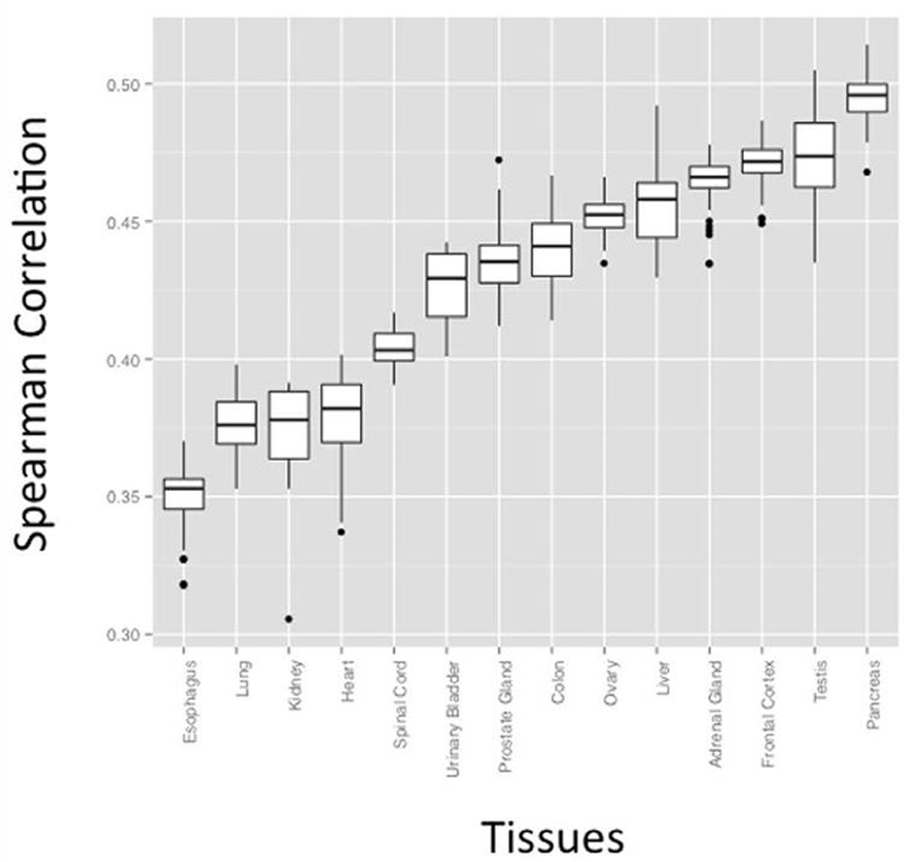
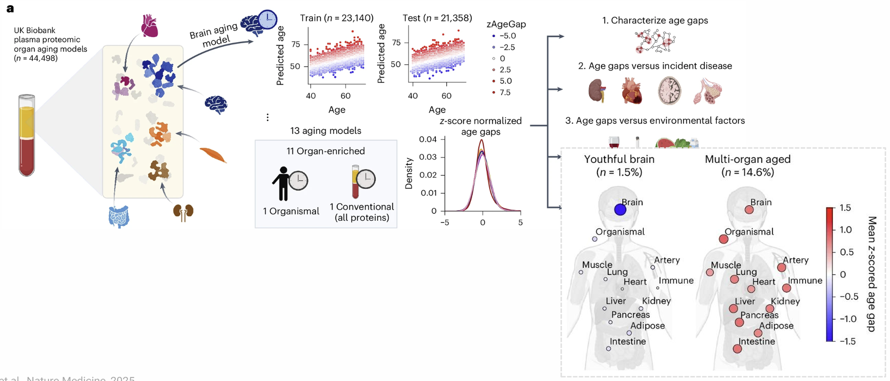

::: {.callout-note collapse="true"}
## 🎯 학습목표

이 장을 마치면 다음을 할 수 있어야 합니다.

-   mRNA가 단백질의 대리값이 아닌 이유와 그 기전을 설명할 수 있습니다.
-   Bottom-up MS 작업 흐름을 설명하고 annotation된 MS2 spectrum을 읽을 수 있습니다.
-   연구 질문에 따라 DDA, DIA, targeted acquisition 중 하나를 선택할 수 있습니다.
-   ⚠️ 단백질 추론 문제와 “protein group”의 의미를 설명할 수 있습니다.
-   LFQ, TMT, SILAC을 구분하고 TMT ratio compression을 설명할 수 있습니다.
-   ⚠️ 단백체 자료에 결측값이 생기는 이유와 단순한 imputation이 위험한 이유를 설명할 수 있습니다.
-   Mass spectrometry를 사용할 때와 affinity platform을 사용할 때를 구분할 수 있습니다.
:::

> 🤔 **출발 질문**
>
> Transcript와 단백질 양의 상관은 대략 r ≈ 0.4입니다. 그렇다면 RNA-seq은 정확히 무엇을 알려준 것일까요?


------------------------------------------------------------------------

# 1. 단백질을 측정해야 하는 이유 💪 {#w6-s1}

## 1) 상관관계의 문제 {#w6-s1-1}

{fig-align="center"}

{fig-align="center"}

-   **실제로 기능을 수행하는 것은 단백질입니다.** 약물 표적, biomarker, 효소가 여기에 해당합니다.
-   RNA-seq은 이들을 **직접 측정하지 않습니다.**

**r ≈ 0.4를 주의 깊게 읽어야 합니다.**

-   수천 개 유전자에서 유전자 A의 mRNA와 유전자 A의 단백질을 비교한 **유전자 간** 상관입니다.
-   한 유전자 안에서 여러 조건을 비교하면 상관이 더 높은 경우가 많습니다.
-   ⚠️ 흔한 질문인 “유전자 X의 transcript가 증가했다. 단백질도 증가했는가?”에 RNA-seq만으로 할 수 있는 정직한 답은 *아마도, 그럴 수도 있다*입니다.

## 2) 나머지 80%는 어디에서 오는가 {#w6-s1-2}

-   **번역 효율** — transcript 사이에서 100배 이상 다릅니다.
-   **단백질 반감기** — 수분에서 수일까지 다양합니다. 안정한 단백질은 적당한 transcript에서도 축적됩니다.
-   **번역 후 변형** — 단백질 양이 전혀 변하지 않아도 활성이 달라집니다.
-   **세포 내 위치** — 단백질 양이 같아도 핵에 있는 것과 세포질에 있는 것은 생물학적으로 다릅니다.
-   **복합체 화학양론** — 조립되지 않은 subunit은 분해되므로 제한적인 partner가 존재량을 결정합니다.

::: {.callout-important collapse="true"}
## 실용적인 원칙

약물 표적, biomarker, 신호전달 사건처럼 결론이 *단백질에 관한 것*이라면

**mRNA 근거는 결과가 아니라 가설입니다.**
:::

------------------------------------------------------------------------

# 2. Mass spectrometry의 기초 ⚗️ {#w6-s2}

## 1) Bottom-up 작업 흐름 {#w6-s2-1}

{fig-align="center"}

온전한 단백질은 너무 크고 이질적이어서 제대로 측정하기 어렵습니다. 따라서 **bottom-up** proteomics는 단백질을 peptide로 분해하고 측정합니다. 거의 항상 lysine과 arginine 뒤를 자르는 trypsin을 사용합니다.

1.  단백질 혼합물을 peptide로 **분해합니다.**
2.  30–120분 동안 liquid chromatography로 **분리합니다.**
3.  **MS1 survey scan** — 이 순간 용출되는 모든 물질의 m/z를 측정합니다.
4.  선택한 peptide를 충돌(HCD/CID)로 **절편화합니다.**
5.  **MS2 spectrum** — 절편 질량을 측정합니다.
6.  **Database search** — spectrum을 peptide 서열과 대응시킵니다.
7.  Peptide가 어느 단백질에서 왔는지 **추론합니다.**

::: {.callout-warning collapse="true"}
## 단백질 자체를 직접 관찰하지는 않습니다

④ 이후의 모든 단계는 **추론**입니다.

-   관찰하는 것은 peptide 절편의 질량입니다.
-   단백질 정체성은 이들로부터 도출한 **결론**입니다.
-   → [§3.2](#w6-s3-2)에서는 이 결론이 모호할 수 있는 이유를 설명합니다.
:::

## 2) MS2 spectrum 읽기 {#w6-s2-2}

절편화는 peptide backbone의 서로 다른 위치를 끊어 사다리 모양을 만듭니다.

-   **b ion** — N-terminus를 유지합니다.
-   **y ion** — C-terminus를 유지합니다.
-   **한 series에서 연속한 ion 사이의 질량 차이는 amino acid 하나입니다.** 이 원리로 서열을 읽습니다.

💡 실제로 search engine은 서열을 *de novo*로 읽기보다 database의 모든 peptide에 대한 이론적 spectrum을 생성한 뒤 관측 spectrum과의 일치도를 계산합니다.

## 3) Acquisition 전략 {#w6-s2-3}

{fig-align="center"}

|   | **DDA** | **DIA** | **Targeted (PRM/MRM)** |
|------------------|------------------|------------------|------------------|
| 절편화 대상 | 신호가 가장 강한 Top-N precursor | 고정된 m/z window 안의 모든 것 | 미리 정의한 목록만 |
| Run당 단백질 수 | 수천 개 | 수천 개, 더 일관됨 | 수십 개 |
| Run 간 결측값 | ⚠️ 많음 | 적음 | 매우 적음 |
| Spectrum | 깨끗하고 각각 peptide 하나 | 복잡하며 deconvolution 필요 | 깨끗함 |
| 정량 정밀도 | 중간 | 좋음 | 매우 좋음 |
| 적합한 용도 | 탐색, 확립된 작업 흐름 | 대규모 cohort, biomarker 연구 | 특정 panel 검증 |

**DDA의 약점은 선택이 확률적이라는 것입니다.**

-   Run 1에서 선택된 저존재량 peptide가 run 2에서는 그 순간 더 강한 다른 물질 때문에 선택되지 않을 수 있습니다.
-   → 임상 시료 100개를 분석하면 구멍이 가득한 matrix가 생깁니다([§4](#w6-s4)).

**DIA의 해결책**은 모든 것을 절편화하는 것입니다. 대신 spectrum이 훨씬 복잡해집니다.

-   DIA-NN과 Spectronaut는 실험으로 얻은 spectral library 대신 machine learning으로 예측한 library를 점점 더 많이 사용합니다.
-   → 이 발전으로 DIA가 실용화되었으며 이제 대규모 cohort 연구의 기본 방법이 되고 있습니다.

------------------------------------------------------------------------

# 3. 식별과 정량 🏷️ {#w6-s3}

## 1) Target–decoy FDR {#w6-s3-1}

**질문** — peptide–spectrum match가 실제라고 어떻게 알 수 있을까요?

**방법:**

-   같은 spectrum을 역순 또는 뒤섞은 서열로 만든 **decoy** database에도 검색합니다.
-   Decoy match는 정의상 거짓입니다.
-   → 특정 score threshold 이상에서 나온 decoy hit의 비율로 target hit의 FDR을 추정합니다.

관례는 **1% FDR**입니다.

⚠️ *Peptide* 수준의 1% FDR이 *단백질* 수준의 1% FDR을 보장하지 않습니다. 단백질 수준에서는 오류가 누적되며 peptide 하나만으로 식별한 단백질의 신뢰도가 가장 낮습니다.

## 2) ⚠️ 단백질 추론 문제 {#w6-s3-2}

{fig-align="center"}

::: {.callout-warning collapse="true"}
## 공유 peptide와 protein group

**문제:**

-   Trypsin은 단백질을 peptide로 자릅니다.
-   관련 단백질, 즉 paralogue, isoform, family 구성원 사이에는 **공유되는** peptide가 많습니다.
-   → 공유 peptide만 검출하면 여러 단백질이 자료와 똑같이 잘 맞습니다.

**Software의 해결 방식**은 구분할 수 없는 단백질 집합을 하나의 대표 accession과 함께 **protein group**으로 보고하는 것입니다.

⚠️ 그 대표 이름 하나만 결과표, 그림과 초록에 전달되는 경우가 많습니다.

**관심 단백질에서 확인할 것:**

-   단백질 특이적인 **unique peptide**가 몇 개나 뒷받침하나요? 하나는 약하고 두 개가 흔히 쓰는 최소 기준입니다.
-   Group의 일부로 보고되었나요? 그렇다면 구성원은 누구인가요?
-   다른 group 구성원이 실제 단백질이어도 생물학적 설명이 유지되나요?
:::

## 3) 정량 전략 {#w6-s3-3}

{fig-align="center"}

|   | **LFQ** | **TMT / iTRAQ** | **SILAC** |
|------------------|------------------|------------------|------------------|
| 방법 | 별도 run에서 intensity 비교 | Isobaric chemical tag, 하나의 run | 세포에 heavy amino acid 공급 |
| Run당 시료 수 | 1 | 최대 18 | 2–3 |
| 시료를 합치는 시점 | 합치지 않음 | Digestion 후 | 배양 중 |
| 적용 대상 | 조직과 혈장을 포함한 모든 시료 | 모든 시료 | 배양 세포만 |
| 주요 약점 | Run 간 drift, 더 많은 결측값 | ⚠️ Ratio compression, batch 구조 | 사람에게 사용 불가 |

### ⚠️ Ratio compression

**기전:**

-   TMT에서는 reporter ion을 이용해 한 MS2 spectrum에서 모든 시료를 측정합니다.
-   장비의 isolation window는 완전히 선택적이지 않습니다.
-   → **함께 용출되는 배경 peptide도 같이 분리**되어 자체 reporter ion을 더합니다.
-   → 배경은 channel 사이에서 대략 같으므로 모든 ratio를 1 방향으로 당깁니다.

**크기** — 실제 8배 변화가 3배 변화로 보고될 수 있습니다.

**해결책** — SPS-MS3 acquisition은 속도와 민감도를 희생하는 대신 이 문제를 대부분 보정합니다.

### ⚠️ TMT batch 구조

-   90개 시료를 분석하는 18-plex TMT 실험에는 **5개 batch**가 필요합니다.
-   환자군과 대조군이 batch에 불균형하게 분배되면 🔗 [W1 §4.3](w1_intro.qmd#w1-s4-3)의 교란 문제가 그대로 재현됩니다.

→ 무작위화하고 모든 batch에 **공통 reference channel**을 포함하여 batch를 정렬할 수 있게 하세요.

------------------------------------------------------------------------

# 4. 결측값 문제 🕳️ {#w6-s4}

{fig-align="center"}

단백체 matrix에는 흔히 **20–50%의 결측값**이 있습니다.

-   RNA-seq 분석가는 놀라지만 단백체 분석가에게는 정상적인 상황입니다.
-   **차이** — sequencing은 0을 세지만 MS는 아무것도 기록하지 못합니다.

## 1) 두 종류의 결측 {#w6-s4-1}

-   **MNAR**(missing not at random) — 단백질이 검출한계 아래여서 빠졌습니다. 결측이라는 사실 자체가 존재량이 낮았음을 알려주는 **정보**입니다.
-   **MAR / MCAR**(missing at random) — DDA가 우연히 선택하지 않았거나 그 run에서 peptide의 retention time이 좋지 않았습니다. 결측 자체에는 정보가 없습니다.

⚠️ 실제 자료에는 두 종류가 섞여 있으며 그 비율은 존재량에 크게 좌우됩니다. 왼쪽 패널이 바로 이를 보여줍니다.

## 2) ⚠️ Imputation이 위험한 이유 {#w6-s4-2}

::: {.callout-warning collapse="true"}
## 단백체학 위양성을 만들어 내는 가장 흔한 방법

**과정:**

-   결측값을 작은 상수 또는 관측된 최소값으로 바꿉니다.
-   → 모든 대조군에서 검출되고 환자군에서는 전혀 검출되지 않은 단백질이 매우 크고 극도로 유의한 fold change를 갖게 됩니다.
-   → **검출한계 부근의 모든 단백질에서** 이 현상이 일어납니다.

**특징적인 양상** — 큰 fold change와 높은 유의성을 보이는 의심스러운 hit 구름이 volcano plot에 나타나며, 모두 실제 측정값이 아니라 imputation된 값에 의해 만들어집니다.

**더 나은 방법:**

-   ✅ **먼저 filtering하세요.** 예를 들어 검정 전에 적어도 한 집단에서 시료의 70% 이상에서 검출된 단백질만 남깁니다.
-   ✅ **결측 기전에 맞는 방법을 선택하세요.** MNAR에는 left-censored imputation(QRILC, MinProb)이 필요하고 MAR에는 kNN과 같은 방법이 필요합니다. Perseus의 “정규분포에서 결측값 대체”는 **MNAR** 방법이므로 구분 없이 적용하면 안 됩니다.
-   ✅ **또는 imputation하지 마세요.** MSstats와 `limma`는 값을 채우는 대신 model 안에서 결측을 처리합니다.
-   ✅ 결측 비율, filtering 방법과 imputation 대상을 **항상 보고하세요.** 그런 다음 imputation **없이도** 최상위 hit가 유지되는지 확인합니다.
:::

------------------------------------------------------------------------

# 5. 통계 분석 📊 {#w6-s5}

🔗 [W4 §5](w4_transcriptomics.qmd#w4-s5)의 많은 내용을 그대로 적용할 수 있습니다. 알아야 할 차이는 세 가지입니다.

**① 정규화**

-   단백체 intensity는 count가 아니라 연속형이므로 negative binomial 방법을 적용하지 않습니다.
-   Log intensity에 median 또는 quantile normalization을 적용하는 것이 표준입니다.
-   ⚠️ 같은 조성 문제가 있습니다. 한 단백질이 지배적이면 모든 측정값이 왜곡됩니다(🔗 [W4 §4.2](w4_transcriptomics.qmd#w4-s4-2)).

**② 더 적은 feature**

-   단백체 실험은 보통 유전자 20,000개가 아니라 **단백질 3,000–9,000개**를 정량합니다.
-   FDR 보정은 여전히 필수지만 다중검정 부담은 더 작습니다.

**③ 작은 n과 큰 변이**

-   단백체 실험은 보통 RNA-seq 실험보다 작고 기술적 변이는 더 큽니다.
-   `limma`의 **moderated t-statistic**은 DESeq2의 dispersion shrinkage와 마찬가지로 feature 사이에서 정보를 빌리는 방법이며(🔗 [W4 §5.2](w4_transcriptomics.qmd#w4-s5-2)) 표준 도구로 사용됩니다.
-   **MSstats**는 peptide에서 단백질로 이어지는 구조를 명시적으로 model합니다.

::: {.callout-tip collapse="true"}
## 단백체 논문을 읽을 때 확인할 것

-   몇 개 단백질을 정량했으며 **얼마나 많은 시료에서** 측정되었나요?
-   결측값을 어떻게 처리했나요?
-   DDA인가요, DIA인가요? TMT라면 batch가 몇 개이고 시료를 어떻게 배치했나요?
-   핵심 단백질을 몇 개의 **unique peptide**가 뒷받침하나요?
-   Western blot, ELISA, targeted MS와 같은 직교적 방법으로 검증했나요?
:::

------------------------------------------------------------------------

# 6. Affinity 기반 및 집단 단백체학 🩸 {#w6-s6}

## 1) Dynamic range 문제 {#w6-s6-1}

{fig-align="center"}

혈장은 임상적으로 가장 매력적인 시료이자 분석하기 가장 어려운 시료입니다.

-   Albumin과 immunoglobulin만으로도 전체 단백질 질량의 약 절반을 차지합니다.
-   상위 20개 단백질이 약 **99%**를 차지합니다.
-   찾고 싶은 biomarker, 즉 cytokine, 조직 유출 단백질, 종양 유래 단백질은 이보다 **10자릿수 이상 아래**에 있습니다.

→ Fractionation하지 않은 MS가 포괄하는 범위는 약 5–6자릿수입니다.

→ 따라서 풍부한 단백질 제거, 광범위한 fractionation 또는 enrichment가 필요하며 모두 변이와 비용을 늘립니다.

## 2) Affinity platform {#w6-s6-2}

대규모 cohort 혈장 단백체학에서는 두 기술이 주로 사용됩니다. **어느 것도 mass spectrometry를 사용하지 않습니다.**

-   **Olink(PEA)** — 항체 한 쌍이 표적에 결합합니다. 두 항체가 모두 결합하면 부착된 DNA oligo가 hybridization되고 증폭된 뒤 sequencing 또는 qPCR로 읽힙니다. **두 번의** 결합을 요구하므로 특이도가 높습니다.
-   **SomaScan** — 변형 DNA aptamer(SOMAmer)가 표적에 결합하며 array에서 aptamer 양을 읽어 존재량을 측정합니다.

|   | Mass spectrometry | Affinity (Olink / SomaScan) |
|------------------------|------------------------|------------------------|
| 표적 | 비편향적 — 존재하는 것을 측정 | 미리 정의한 panel만 측정 |
| 측정 단백질 | 약 3,000개(혈장에서 많은 노력 필요) | 수천 개, 최대 약 11,000개 |
| 민감도 | Dynamic range에 제한됨 | pg/mL까지 측정 |
| 시료량 | µL–mL | 수 µL |
| 처리량 | 중간 | 매우 높음 — biobank 규모 |
| 측정 대상 | Peptide 서열 | Reagent에 대한 **결합** |
| Isoform과 PTM | 검출 가능 | 일반적으로 구분하지 못함 |

::: {.callout-warning collapse="true"}
## Affinity assay는 정체성이 아니라 결합을 측정합니다

Olink 또는 SomaScan의 출력은 **결합 신호**이며 농도 이외의 요인도 결합에 영향을 줍니다.

-   **교차반응** — reagent가 다른 물질에 결합합니다.
-   **Epitope를 바꾸는 변이** — epitope의 missense variant가 결합을 줄여 단백질 양이 감소한 것처럼 보입니다.
    -   ⚠️ pQTL 연구에서 가짜 *cis* 신호를 만듭니다. 반드시 명시적으로 확인해야 하는 알려진 교란요인입니다.
-   **Platform 간 불일치** — 많은 표적에서 같은 단백질에 대한 Olink와 SomaScan 측정값의 상관은 중간 정도에 불과합니다. 어느 쪽이 “맞는지” 해결되지 않은 경우가 많습니다.
:::

## 3) 💊 Proteogenomics와 pQTL {#w6-s6-3}

{fig-align="center"}

**pQTL**은 단백질 존재량과 연관된 유전 변이로, eQTL의 단백질 버전입니다(🔗 [W2 §4.4](w2_genomics.qmd#w2-s4-4), 🔗 [W4 §7.4](w4_transcriptomics.qmd#w4-s7-4)).

수만 명의 biobank 참여자를 대상으로 한 집단 규모 혈장 단백체학 덕분에 대규모 pQTL 자료를 사용할 수 있게 되었습니다.

**이는 이 수업 전체를 관통하는 고리를 완성합니다.**

```         
GWAS hit (W2)        → locus 지목
pQTL (W6)            → 해당 locus가 어느 단백질의 양을 조절하는가?
Colocalization       → 두 신호가 하나의 causal variant를 공유하는가?
Mendelian rand. (W2) → 그 단백질이 질병에 인과적으로 영향을 주는가?
        ↓
유전적으로 검증되고 약물로 표적화할 수 있는 target (🔗 W2 §6.3)
```

⚠️ 다음을 구분해야 합니다.

-   ***cis*****-pQTL** — 단백질 자체의 유전자 근처에 있는 변이입니다. 강한 근거지만 **epitope effect를 확인해야 합니다.**
-   ***trans*****-pQTL** — 다른 위치의 변이입니다. 조절자 또는 제거 기전처럼 생물학적으로 흥미롭지만 해석하기 더 어렵습니다.

------------------------------------------------------------------------

# 7. 최신 영역과 함정 🚧 {#w6-s7}

## 1) 번역 후 변형 {#w6-s7-1}

**Phosphoproteomics**가 대표적인 임상 사례입니다. 신호전달은 phosphorylation으로 조절되며 전체 단백질 양만으로는 이를 알 수 없습니다.

Phosphopeptide는 전체에서 작은 비율만 차지하므로 작업 흐름에 **enrichment 단계**(TiO₂, IMAC)가 추가됩니다.

분석에 특이적인 두 가지 문제가 있습니다.

-   ⚠️ **Site localization** — peptide에 가능한 위치가 여러 개 있지만 spectrum으로 구분하지 못할 수 있습니다. Search engine은 localization probability를 보고하므로 약 0.75 미만의 위치는 불확실한 것으로 취급하세요.
-   ⚠️ **전체 단백질에 대한 정규화** — 단백질 자체가 증가했기 때문에 phosphopeptide가 증가할 수 있습니다. Phosphorylation을 *신호전달*로 해석하려면 단백질 양도 알아야 합니다.

## 2) AlphaFold 시대의 구조 {#w6-s7-2}

정확한 구조 예측은 단백질 목록으로 할 수 있는 일을 바꾸었습니다. 변이 효과 해석, docking, cross-linking MS 해석이 가능해졌습니다.

⚠️ 예측은 **model**입니다.

-   Confidence score(pLDDT)가 중요합니다.
-   무질서 영역은 제대로 예측되지 않습니다.
-   예측 구조는 *in vivo* conformation의 증거가 아닙니다.

## 3) ⚠️ 흔한 함정 {#w6-s7-3}

-   **Keratin 오염** — 피부와 머리카락의 keratin은 단백체학의 고전적인 오염물입니다. Keratin이 최상위 hit에 있다면 실험실 단계의 문제입니다.
-   **Dynamic range** — 혈장에서 depletion 또는 fractionation을 하지 않았다면 **albumin을 측정한 것**입니다.
-   **Digestion 효율** — 불완전한 tryptic digestion은 시료마다 다르며 실제 정량 잡음의 원인이 됩니다.
-   **보관과 freeze–thaw** — 혈장 proteome은 채혈관, 냉동까지 걸린 시간, freeze–thaw 횟수와 같은 전처리 조건에 민감합니다. ⚠️ Biobank 연구에서 집단 간 채취 protocol이 다르면 **체계적인 교란요인**이 됩니다.

------------------------------------------------------------------------

# 📝 요약

-   유전자 전체에서 mRNA는 단백질 존재량의 약 5분의 1을 설명합니다. **단백질에 관한 주장이라면 단백질을 측정하세요.**
-   Bottom-up MS는 **peptide를 측정**하고 단백질을 추론합니다. MS2 절편 사다리에 서열 정보가 담겨 있습니다.
-   DDA는 가장 강한 precursor를 선택하므로 확률적으로 일부를 놓칩니다. DIA는 모든 것을 절편화하여 결측이 훨씬 적습니다. Targeted MS는 검증에 사용합니다.
-   ⚠️ **단백질 추론은 실제로 모호합니다.** Unique peptide 수와 관심 단백질이 group으로 보고되었는지 확인하세요.
-   LFQ, TMT, SILAC은 시료를 *언제* 합치는지가 다릅니다. ⚠️ TMT는 ratio를 압축하며(SPS-MS3가 대부분 보정) batch를 무작위화해야 합니다.
-   ⚠️ 결측값은 대부분 MNAR입니다. Imputation 전에 filtering하고 기전에 맞는 방법을 선택하며 imputation 없이도 hit가 유지되는지 확인하세요.
-   혈장의 dynamic range는 10자릿수보다 넓고 상위 20개 단백질이 질량의 약 99%를 차지합니다.
-   ⚠️ Affinity platform은 **결합**을 측정하므로 교차반응과 epitope 변이가 중요합니다.
-   pQTL은 GWAS hit에서 유전적으로 검증된 약물 표적으로 이어지는 사슬을 완성합니다.

------------------------------------------------------------------------

# 🔑 핵심 용어

| 용어                 | 한 줄 설명                                  |
|----------------------|---------------------------------------------------|
| Bottom-up proteomics | 단백질을 peptide로 분해한 뒤 측정하는 방법 |
| Tryptic peptide      | K/R 뒤에서 절단되어 만들어진 절편 |
| MS1 / MS2            | Precursor survey scan / fragment scan |
| b ion / y ion        | N-terminal / C-terminal 절편 series |
| Target–decoy         | 역순 database를 이용한 FDR 추정 |
| Protein inference    | Peptide가 어느 단백질에서 왔는지 결정하는 과정 |
| Protein group        | 구분할 수 없어 함께 보고되는 단백질 집합 |
| DDA / DIA            | Data-dependent / data-independent acquisition |
| PRM / MRM            | 미리 정의한 목록을 측정하는 targeted acquisition |
| LFQ                  | Label-free quantification |
| TMT / iTRAQ          | 하나의 run에서 multiplex하는 isobaric chemical label |
| SILAC                | Heavy amino acid를 이용한 metabolic labelling |
| Ratio compression    | Co-isolation 때문에 TMT ratio가 1 방향으로 당겨지는 현상 |
| MNAR / MAR           | 낮은 존재량 때문에 결측 / 우연에 의한 결측 |
| Dynamic range        | 가장 많은 단백질과 가장 적은 단백질 사이의 범위 |
| PEA                  | Olink의 dual-antibody DNA readout |
| pQTL                 | 단백질 양과 연관된 변이 |
| Phosphoproteomics    | Phosphopeptide를 농축하여 측정하는 분석 |

------------------------------------------------------------------------

# ➕ 참고문헌

### 종설

Aebersold R, Mann M. [*Mass-spectrometric exploration of proteome structure and function.*](https://pubmed.ncbi.nlm.nih.gov/?term=Mass-spectrometric+exploration+of+proteome+structure+and+function) Nature. 2016.\
Sinitcyn P, Rudolph JD, Cox J. [*Computational methods for understanding mass spectrometry-based shotgun proteomics data.*](https://pubmed.ncbi.nlm.nih.gov/?term=Computational+methods+for+understanding+mass+spectrometry-based+shotgun+proteomics+data) Annu Rev Biomed Data Sci. 2018.\
Liu Y, Beyer A, Aebersold R. [*On the dependency of cellular protein levels on mRNA abundance.*](https://pubmed.ncbi.nlm.nih.gov/?term=On+the+dependency+of+cellular+protein+levels+on+mRNA+abundance) Cell. 2016.

### Acquisition과 정량

Ludwig C, et al. [*Data-independent acquisition-based SWATH-MS for quantitative proteomics: a tutorial.*](https://pubmed.ncbi.nlm.nih.gov/?term=Data-independent+acquisition-based+SWATH-MS+for+quantitative+proteomics%3A+a+tutorial) Mol Syst Biol. 2018.\
Demichev V, et al. [*DIA-NN: neural networks and interference correction enable deep proteome coverage in high throughput.*](https://doi.org/10.1038/s41592-019-0638-x) Nat Methods. 2020.\
Ting L, et al. [*MS3 eliminates ratio distortion in isobaric multiplexed quantitative proteomics.*](https://pubmed.ncbi.nlm.nih.gov/?term=MS3+eliminates+ratio+distortion+in+isobaric+multiplexed+quantitative+proteomics) Nat Methods. 2011.

### 통계와 결측값

Choi M, et al. [*MSstats: an R package for statistical analysis of quantitative mass spectrometry-based proteomic experiments.*](https://doi.org/10.1093/bioinformatics/btu305) Bioinformatics. 2014.\
Lazar C, et al. [*Accounting for the multiple natures of missing values in label-free quantitative proteomics data sets.*](https://pubmed.ncbi.nlm.nih.gov/?term=Accounting+for+the+multiple+natures+of+missing+values+in+label-free+quantitative+proteomics+data+sets) J Proteome Res. 2016.\
Nesvizhskii AI, Aebersold R. [*Interpretation of shotgun proteomic data: the protein inference problem.*](https://pubmed.ncbi.nlm.nih.gov/?term=Interpretation+of+shotgun+proteomic+data%3A+the+protein+inference+problem) Mol Cell Proteomics. 2005.

### 혈장 및 affinity proteomics

Geyer PE, et al. [*Revisiting biomarker discovery by plasma proteomics.*](https://pubmed.ncbi.nlm.nih.gov/?term=Revisiting+biomarker+discovery+by+plasma+proteomics) Mol Syst Biol. 2017.\
Sun BB, et al. [*Plasma proteomic associations with genetics and health in the UK Biobank.*](https://doi.org/10.1038/s41586-023-06592-6) Nature. 2023.\
Katz DH, et al. [*Proteomic profiling platforms head to head: comparison of Olink and SomaScan.*](https://pubmed.ncbi.nlm.nih.gov/?term=Proteomic+profiling+platforms+head+to+head%3A+comparison+of+Olink+and+SomaScan) Cell Rep Med. 2022.

### 자료원

[PRIDE](https://www.ebi.ac.uk/pride/) · [Human Protein Atlas](https://www.proteinatlas.org/) · [AlphaFold DB](https://alphafold.ebi.ac.uk/) · [PeptideAtlas](http://www.peptideatlas.org/)
