::: {.callout-note collapse="true"}
## 🎯 학습목표

이 장을 마치면:

-   mRNA가 단백질의 대리값이 될 수 없는 이유
-   Bottom-up MS 작업 흐름 — peptide를 측정하고 단백질을 추론
-   DDA, DIA, targeted acquisition 구분, LFQ, TMT, SILAC 구분
-   Mass spectrometry와 affinity platform을 각각 언제 쓰는지
-   Spectrum에서 단백질 행렬까지의 pipeline을 따라가고, QC 지표로 문제 run 찾기
-   ⚠️ 단백질 추론 문제와 "protein group"의 의미
-   ⚠️ 단백체 자료에 결측값이 생기는 이유, 단순한 imputation이 위험한 이유
-   차등 존재량 검정(`limma`, MSstats)의 원리, enrichment의 background가 검출된 단백질이어야 하는 이유
:::

> 🤔 **출발 질문**\
> Transcript와 단백질 양의 상관 = 대략 r ≈ 0.4\
> → 그렇다면 RNA-seq이 정확히 알려준 것은 무엇인가?

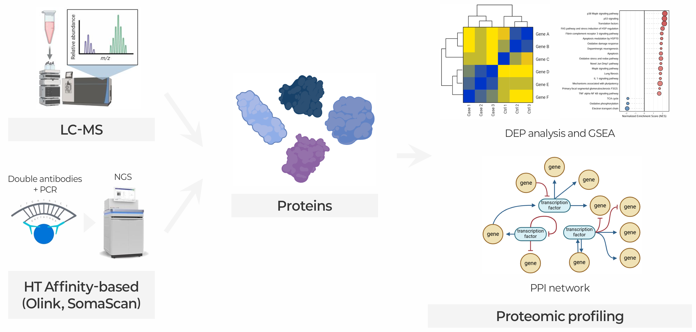

💡 각 절의 본문 = 꼭 알아야 할 기초. **🔍 더 알아보기**는 관심 있을 때 펼쳐 보는 심화 내용

------------------------------------------------------------------------

# 1. 단백질을 측정해야 하는 이유 💪 {#w6-s1}

> 🔑 **핵심** — 실제로 일하는 것은 단백질, 그런데 RNA-seq은 단백질을 측정하지 않음. mRNA로는 단백질을 대략적으로만 예측 → 단백질에 관한 주장에는 단백질 측정 필요

## 1) 상관관계의 문제 {#w6-s1-1}

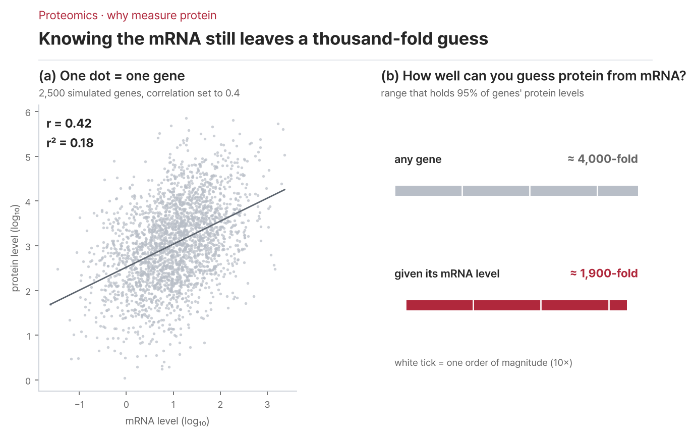{fig-align="center"}

-   **실제로 기능을 수행하는 것 = 단백질** — 약물 표적, biomarker, 효소
-   RNA-seq은 이들을 **직접 측정 x**
-   mRNA vs 단백질: r ≈ 0.4 → 유전자 간 단백질 존재량 차이 중 mRNA가 설명하는 것은 약 **5분의 1**
-   ⚠️ "유전자 X의 transcript 증가 → 단백질도 증가?" → RNA-seq만으로 할 수 있는 정직한 답 = *아마도, 그럴 수도*

::: {.callout-note collapse="true" icon=false}
## 🔍 더 알아보기 — r ≈ 0.4를 주의 깊게 읽기

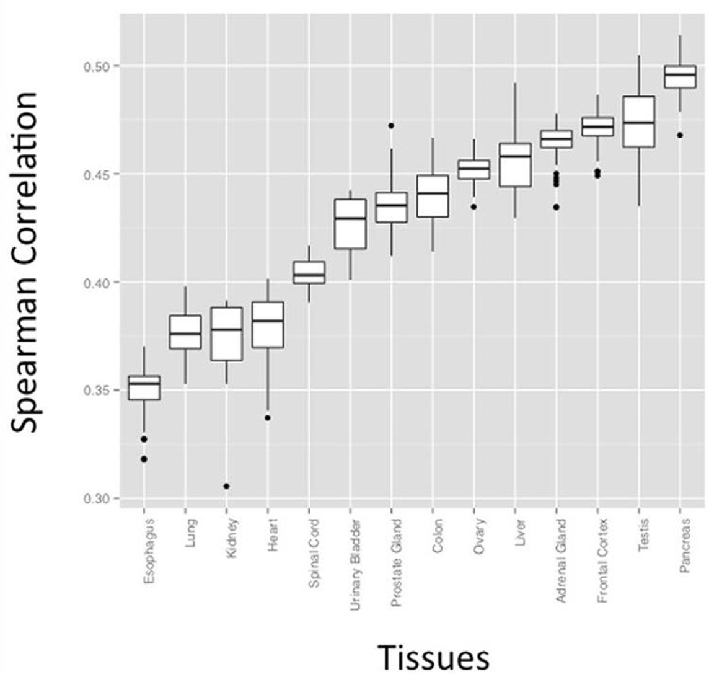{fig-align="center"}

-   **유전자 간** 상관: 수천 개 유전자에서 유전자 A의 mRNA vs 유전자 A의 단백질
-   한 유전자 안에서 여러 조건 비교 → 상관이 더 높은 경우 많음
:::

## 2) 나머지 80%는 어디에서 오는가 {#w6-s1-2}

mRNA와 단백질 사이에서 양 — 또는 활성 — 을 바꾸는 단계:

-   **번역 효율** — transcript 사이에서 100배 이상 차이
-   **단백질 반감기** — 수분~수일 → 안정한 단백질은 적당한 transcript에서도 축적
-   **번역 후 변형** — 단백질 양 변화 없이도 활성이 달라짐

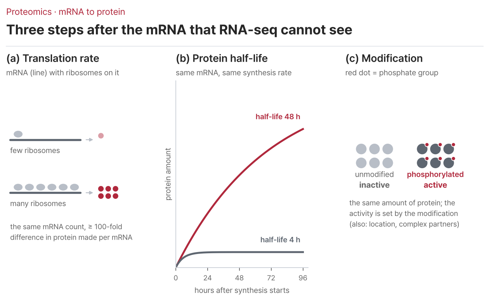{fig-align="center"}

::: {.callout-note collapse="true" icon=false}
## 🔍 더 알아보기 — 세포 내 위치와 복합체 화학양론

-   **세포 내 위치** — 단백질 양이 같아도 핵에 있을 때와 세포질에 있을 때는 생물학적으로 다름
-   **복합체 화학양론** — 조립되지 않은 subunit은 분해 → 제한적인 partner가 존재량 결정
:::

::: {.callout-important collapse="true"}
## 실용적인 원칙

약물 표적, biomarker, 신호전달 사건처럼 결론이 *단백질에 관한 것*이라면

→ **mRNA 근거 = 결과가 아니라 가설**
:::

------------------------------------------------------------------------

# 2. 측정 기술: mass spectrometry와 affinity assay ⚗️ {#w6-s2}

> 🔑 **핵심** — MS는 단백질 전체를 직접 재지 않음. 단백질을 peptide로 자르고, peptide와 그 절편의 질량을 잰 뒤, 단백질을 **추론**. Affinity assay는 reagent에 대한 **결합**을 셈. 어떤 기술을 고르느냐가 볼 수 있는 것과 따라오는 artifact를 정함

-   **Mass spectrometry** — 작동 원리(①–②), 어떤 peptide를 고르나(③), 시료를 어떻게 비교하나(④)
-   **Affinity assay** — 시료가 혈장이고 cohort가 biobank 규모일 때(⑤)
-   **시료 처리** — 장비를 돌리기 전에 생기는 문제(⑥)

## 1) Bottom-up mass spectrometry {#w6-s2-1}

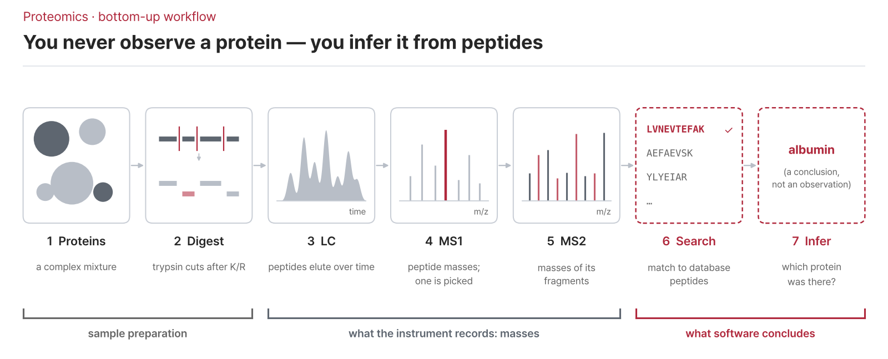{fig-align="center"}

-   온전한 단백질은 너무 크고 이질적이라 제대로 측정하기 어려움 → trypsin(lysine·arginine 뒤를 자름)으로 **peptide**로 분해 = **bottom-up** proteomics
-   Liquid chromatography로 peptide 분리 → 질량 측정(**MS1**) → 절편으로 깨뜨려 다시 질량 측정(**MS2**)
-   절편 pattern을 database의 peptide 서열과 대응 → peptide로부터 단백질 **추론**

::: {.callout-note collapse="true" icon=false}
## 🔍 더 알아보기 — 7단계 전체

1.  단백질 혼합물을 peptide로 **분해** (거의 항상 trypsin)
2.  30–120분 동안 liquid chromatography로 **분리**
3.  **MS1 survey scan** — 이 순간 용출되는 모든 물질의 m/z 측정
4.  선택한 peptide를 충돌(HCD/CID)로 **절편화**
5.  **MS2 spectrum** — 절편 질량 측정
6.  **Database search** — spectrum을 peptide 서열과 대응
7.  Peptide가 어느 단백질에서 왔는지 **추론**
:::

::: {.callout-warning collapse="true"}
## 단백질 자체는 직접 관찰하지 않음

④ 이후의 모든 단계 = **추론**

-   관찰하는 것 = peptide 절편의 질량
-   단백질 정체성 = 이들로부터 도출한 **결론**
-   → 이 결론이 모호할 수 있는 이유는 [§3.3](#w6-s3-3)에서
:::

## 2) MS2 spectrum {#w6-s2-2}

-   절편화 = peptide backbone을 서로 다른 위치에서 끊음 → 절편의 **사다리**
-   **이웃한 칸 사이의 질량 차이 = amino acid 하나** → 이 원리로 서열을 읽음

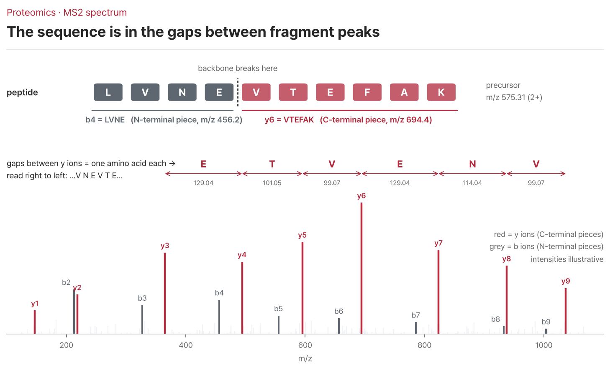{fig-align="center"}

::: {.callout-note collapse="true" icon=false}
## 🔍 더 알아보기 — b ion·y ion, search engine이 spectrum을 읽는 방식

-   **b ion** — N-terminus 유지
-   **y ion** — C-terminus 유지
-   사다리는 **한 series 안에서** 연속한 ion끼리 비교해 읽음
-   💡 실제 search engine은 서열을 *de novo*로 읽지 않음 → database의 모든 peptide에 대해 이론적 spectrum을 생성하고 관측 spectrum과의 일치도를 점수화
:::

## 3) Acquisition: DDA, DIA, targeted {#w6-s2-3}

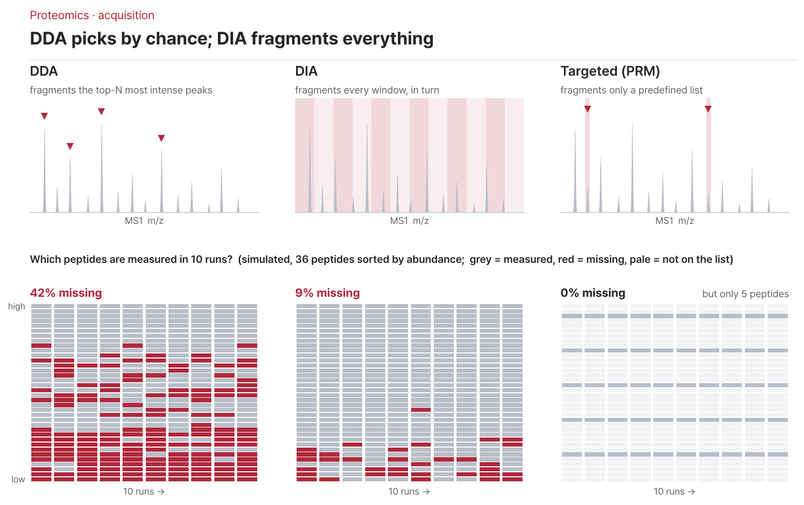{fig-align="center"}

**어떤 peptide를 절편화할지** 정하는 세 가지 방식:

-   **DDA** — 그 순간 신호가 가장 강한 것만 → run마다 선택이 달라짐 → 결측값 많음([§3.6](#w6-s3-6))
-   **DIA** — 정해진 구간(window)별로 전부 → 결측값 훨씬 적음. 대규모 cohort의 기본 방법이 되는 중
-   **Targeted (PRM/MRM)** — 미리 정한 목록만 → 특정 panel 검증용

::: {.callout-note collapse="true" icon=false}
## 🔍 더 알아보기 — 세 전략 비교

|   | **DDA** | **DIA** | **Targeted (PRM/MRM)** |
|------------------|------------------|------------------|------------------|
| 절편화 대상 | 신호가 가장 강한 Top-N precursor | 고정된 m/z window 안의 모든 것 | 미리 정의한 목록만 |
| Run당 단백질 수 | 수천 개 | 수천 개, 더 일관됨 | 수십 개 |
| Run 간 결측값 | ⚠️ 많음 | 적음 | 매우 적음 |
| Spectrum | 깨끗함, 각각 peptide 하나 | 복잡함, deconvolution 필요 | 깨끗함 |
| 정량 정밀도 | 중간 | 좋음 | 매우 좋음 |
| 적합한 용도 | 탐색, 확립된 작업 흐름 | 대규모 cohort, biomarker 연구 | 특정 panel 검증 |
:::

::: {.callout-note collapse="true" icon=false}
## 🔍 더 알아보기 — DDA가 구멍을 남기는 이유, DIA가 실용화된 계기

**DDA의 약점 = 선택이 확률적**

-   Run 1에서 선택된 저존재량 peptide → run 2에서는 그 순간 더 강한 다른 물질 때문에 선택되지 않을 수 있음
-   → 임상 시료 100개를 분석하면 구멍이 가득한 matrix ([§3.6](#w6-s3-6))

**DIA의 해결책** = 모든 것을 절편화. 대가: spectrum이 훨씬 복잡

-   DIA-NN, Spectronaut — 실험으로 얻은 spectral library 대신 machine learning으로 예측한 library를 점점 더 많이 사용
-   → 이 발전으로 DIA가 실용화, 이제 대규모 cohort 연구의 기본 방법이 되는 중
:::

## 4) 정량: LFQ, TMT, SILAC {#w6-s2-4}

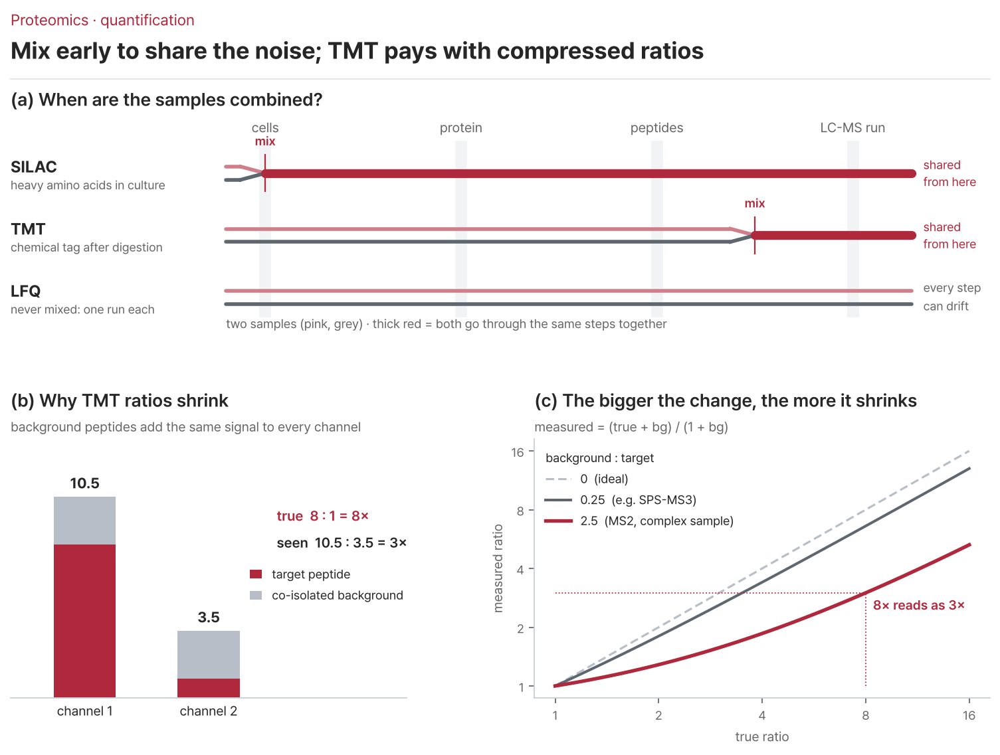{fig-align="center"}

시료 간 단백질 양을 비교하는 세 가지 방법 — 차이 = **시료를 언제 합치나**:

-   **LFQ**(label-free) — 별도 run에서 intensity 비교 → 조직·혈장을 포함한 모든 시료에 적용 가능
-   **TMT** — isobaric chemical tag → 최대 18개 시료를 한 run에. ⚠️ Ratio가 1 방향으로 당겨짐, batch는 무작위화 필요([§4.3](#w6-s4-3))
-   **SILAC** — 세포에 heavy amino acid 공급 → 배양 세포만

::: {.callout-note collapse="true" icon=false}
## 🔍 더 알아보기 — LFQ vs TMT vs SILAC

|   | **LFQ** | **TMT / iTRAQ** | **SILAC** |
|------------------|------------------|------------------|------------------|
| 방법 | 별도 run에서 intensity 비교 | Isobaric chemical tag, 하나의 run | 세포에 heavy amino acid 공급 |
| Run당 시료 수 | 1 | 최대 18 | 2–3 |
| 시료를 합치는 시점 | 합치지 않음 | Digestion 후 | 배양 중 |
| 적용 대상 | 조직과 혈장을 포함한 모든 시료 | 모든 시료 | 배양 세포만 |
| 주요 약점 | Run 간 drift, 더 많은 결측값 | ⚠️ Ratio compression, batch 구조 | 사람에게 사용 불가 |
:::

::: {.callout-note collapse="true" icon=false}
## 🔍 더 알아보기 — TMT ratio compression

⚠️ **기전:**

-   TMT = reporter ion을 이용해 한 MS2 spectrum에서 모든 시료를 측정
-   장비의 isolation window는 완전히 선택적이지 않음
-   → **함께 용출되는 배경 peptide도 같이 분리**되어 자체 reporter ion을 더함
-   → 배경은 channel 사이에서 대략 같음 → 모든 ratio를 1 방향으로 당김

**크기** — 실제 8배 변화가 3배 변화로 보고될 수 있음

**해결책** — SPS-MS3 acquisition: 속도와 민감도를 희생하는 대신 대부분 보정
:::

## 5) Affinity assay: Olink와 SomaScan {#w6-s2-5}

### ① Dynamic range 문제 {#w6-s2-5-1}

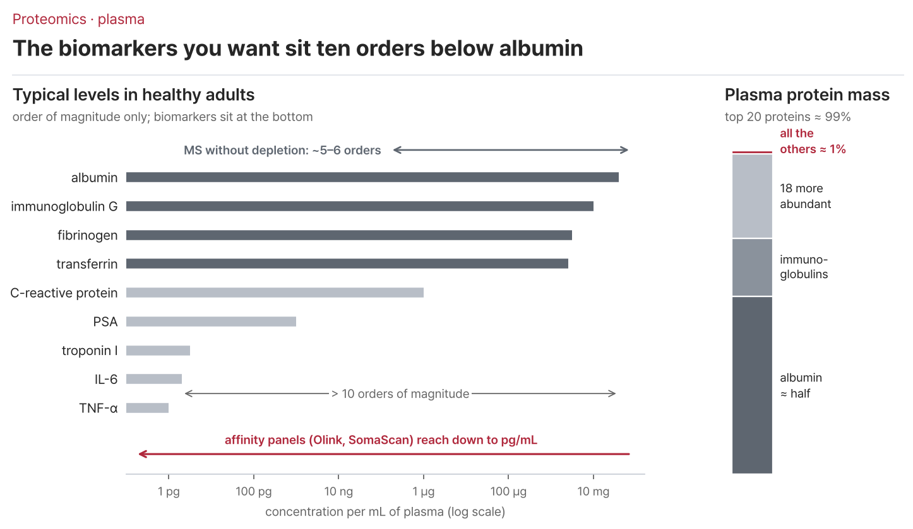{fig-align="center"}

-   혈장 = 임상적으로 가장 매력적인 시료이자 분석하기 가장 어려운 시료
-   상위 20개 단백질 ≈ 전체 단백질 질량의 **99%** (albumin 하나가 약 절반)
-   찾고 싶은 biomarker(cytokine, 조직 유출 단백질, 종양 유래 단백질)는 **10자릿수 이상 아래**
-   → Fractionation하지 않은 MS의 포괄 범위 ≈ 5–6자릿수 → 풍부한 단백질 제거(depletion), fractionation, enrichment 필요. 모두 변이와 비용을 늘림

### ② Affinity platform {#w6-s2-5-2}

대규모 cohort 혈장 단백체학의 주류 기술 두 가지 — **둘 다 mass spectrometry를 쓰지 않음**:

-   **Olink(PEA)** — 항체 한 쌍, **둘 다** 결합해야 신호 → 높은 특이도
-   **SomaScan** — 변형 DNA aptamer(SOMAmer)가 표적에 결합
-   ✅ 수천 개(최대 약 11,000개) 단백질, pg/mL까지, 수 µL 시료로, biobank 규모. ❌ 미리 정의한 panel만
-   ⚠️ 측정하는 것 = peptide 서열이 아니라 reagent에 대한 **결합**

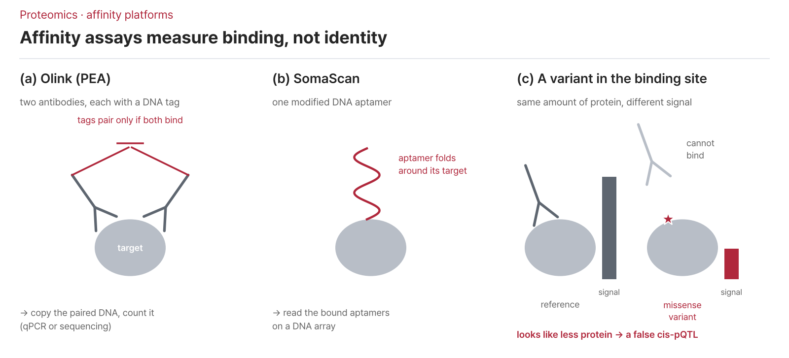{fig-align="center"}

::: {.callout-warning collapse="true"}
## Affinity assay는 정체성이 아니라 결합을 측정

Olink·SomaScan의 출력 = **결합 신호** → 농도 이외의 요인도 결합에 영향:

-   **교차반응** — reagent가 다른 물질에 결합
-   **Epitope를 바꾸는 변이** — epitope의 missense variant가 결합을 줄임 → 단백질 양이 감소한 것처럼 보임
    -   ⚠️ pQTL 연구에서 가짜 *cis* 신호를 만듦. 반드시 명시적으로 확인해야 하는 알려진 교란요인([§5.3](#w6-s5-3))
-   **Platform 간 불일치** — 많은 표적에서 같은 단백질에 대한 Olink와 SomaScan 측정값의 상관은 중간 정도에 불과. 어느 쪽이 "맞는지"는 해결되지 않은 경우가 많음
:::

::: {.callout-note collapse="true" icon=false}
## 🔍 더 알아보기 — Olink와 SomaScan의 측정 원리

-   **Olink(PEA)** — 항체 한 쌍이 표적에 결합. 두 항체가 모두 결합하면 부착된 DNA oligo가 hybridization → 증폭 → sequencing 또는 qPCR로 읽음. **두 번의** 결합을 요구 → 특이도 높음
-   **SomaScan** — 변형 DNA aptamer(SOMAmer)가 표적에 결합, array에서 aptamer 양을 읽어 존재량 측정
:::

::: {.callout-note collapse="true" icon=false}
## 🔍 더 알아보기 — Mass spectrometry vs affinity

|   | Mass spectrometry | Affinity (Olink / SomaScan) |
|------------------------|------------------------|------------------------|
| 표적 | 비편향적 — 존재하는 것을 측정 | 미리 정의한 panel만 측정 |
| 측정 단백질 | 약 3,000개(혈장에서 많은 노력 필요) | 수천 개, 최대 약 11,000개 |
| 민감도 | Dynamic range에 제한됨 | pg/mL까지 측정 |
| 시료량 | µL–mL | 수 µL |
| 처리량 | 중간 | 매우 높음 — biobank 규모 |
| 측정 대상 | Peptide 서열 | Reagent에 대한 **결합** |
| Isoform과 PTM | 검출 가능 | 일반적으로 구분 x |
:::

## 6) ⚠️ 시료 처리 {#w6-s2-6}

단백체학의 많은 오류는 software가 아니라 실험실 단계에서 시작:

-   **Keratin 오염** — 피부·머리카락의 keratin = 단백체학의 고전적인 오염물. 최상위 hit에 keratin → 실험실 단계의 문제 (QC: [§3.1](#w6-s3-1))
-   **Dynamic range** — 혈장에서 depletion 또는 fractionation을 안 했다면 → **albumin을 측정한 것** ([①](#w6-s2-5-1))
-   **보관과 freeze–thaw** — 혈장 proteome은 채혈관, 냉동까지 걸린 시간, freeze–thaw 횟수 같은 전처리 조건에 민감. ⚠️ Biobank 연구에서 집단 간 채취 protocol이 다르면 → **체계적인 교란요인**
-   **Digestion** — 불완전한 tryptic digestion은 시료마다 다름 → 실제 정량 잡음의 원인 (QC: missed cleavage, [§3.1](#w6-s3-1))

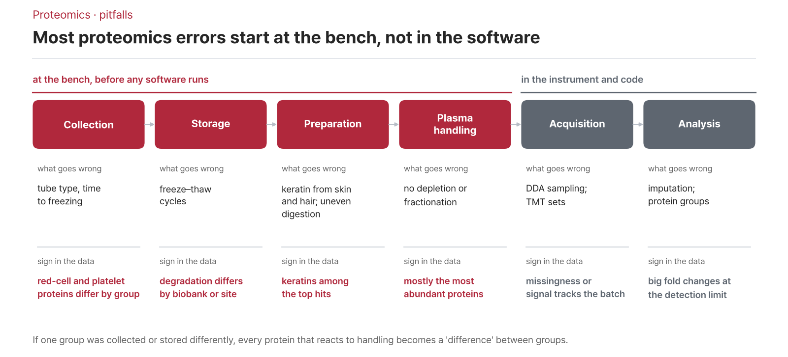{fig-align="center"}

------------------------------------------------------------------------

# 3. Pre-processing: spectrum에서 단백질 행렬까지 🔢 {#w6-s3}

> 🔑 **핵심** — 오류율을 아는 상태로 spectrum을 peptide에 대응 → peptide를 단백질로 묶음 → 시료마다 단백질당 값 하나 → 정규화된 행렬. 단계마다 QC를 확인하고, 빈칸을 어떻게 다룰지 결정

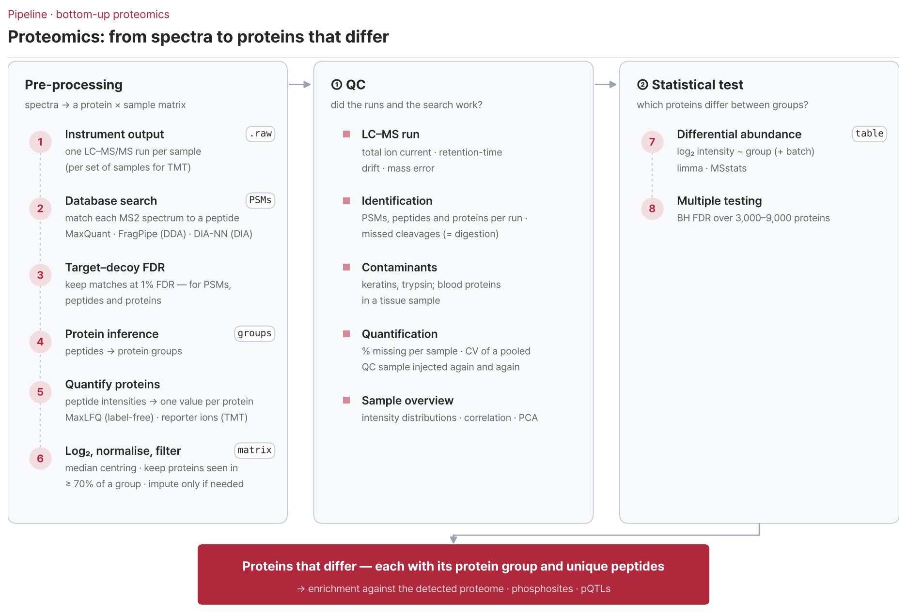{fig-align="center"}

-   검색 software(MaxQuant, FragPipe, DIA-NN, Spectronaut)가 2–5단계를 한 번에 수행 → 출력 = **단백질 × 시료 intensity 행렬**
-   ⚠️ 모든 행렬에는 그 과정에서 내린 결정이 담김: FDR 기준([②](#w6-s3-2)), 공유 peptide 처리([③](#w6-s3-3)), peptide 요약 방식([④](#w6-s3-4)), 시료 정규화([⑤](#w6-s3-5)), 빈칸 처리([⑥](#w6-s3-6))

## 1) QC {#w6-s3-1}

단계마다 그 단계의 지표로 확인:

-   **LC–MS run** — total ion current(TIC)와 retention time: 모든 run에서 chromatography와 장비가 똑같이 작동했나? Mass error: 장비 보정이 유지되나?
-   **식별(identification)** — run당 PSM(peptide–spectrum match), peptide, 단백질 수 → 다른 run보다 크게 낮은 run = 문제 run. **Missed cleavage** — trypsin이 K/R를 자르지 못한 peptide의 비율 → digestion 효율
-   **오염물** — keratin, trypsin 자체, 조직 시료 속 혈액 단백질. 한 시료에서만 높음 → 생물학이 아니라 시료 처리 문제
-   **정량** — 시료별 결측 비율, **pooled QC 시료**(모든 시료를 섞어 batch 내내 반복 주입)의 CV → 기술적 잡음은 생물학적 변이보다 충분히 작아야 함
-   **시료 전체 보기** — intensity 분포, 시료 간 상관, PCA (🔗 [W4 §3.4](w4_transcriptomics.qmd#w4-s3-4)) → 이상 시료, batch, run 순서에 따른 drift

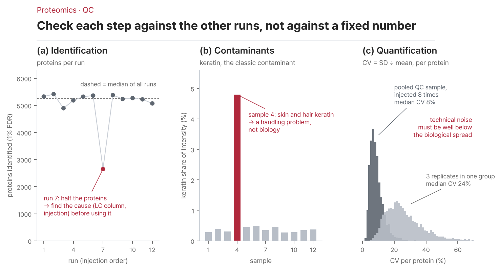{fig-align="center"}

::: {.callout-note collapse="true" icon=false}
## 🔍 더 알아보기 — QC 지표 자세히

| 단계 | 지표 | 알려주는 것 | 경고 신호 |
|------------------|------------------|------------------|------------------|
| **LC–MS run** | TIC, retention time | Chromatography가 안정적이었나 | 한 run의 곡선이 밀리거나 크게 낮음 |
| **LC–MS run** | Mass error (ppm) | 장비 보정 | Batch가 진행되며 0에서 멀어짐 |
| **식별** | Run당 PSM / peptide / 단백질 수 | Run과 검색이 제대로 되었나 | 다른 run보다 확연히 적음 |
| **식별** | Missed cleavage | Digestion이 완전했나 | 다른 시료보다 높음 |
| **오염물** | Keratin, trypsin 비율 | 시료 처리 | 한 시료에서만 높음 |
| **정량** | 시료별 결측 비율 | 검출 깊이 | 다른 시료보다 훨씬 높음 |
| **정량** | Pooled QC 시료의 CV | 기술적 재현성 | 반복 시료 사이 CV에 가까움 |
| **시료 전체 보기** | 상관, PCA | 이상 시료, batch effect | 시료가 run 날짜나 TMT set별로 모임 |

-   어떤 절대 기준보다 **같은 실험의 다른 run과의 비교**가 더 중요
-   도구: 검색 software 자체의 report(MaxQuant, DIA-NN), MaxQuant 결과용 PTXQC
:::

## 2) Target–decoy FDR {#w6-s3-2}

-   **질문** — peptide–spectrum match가 진짜인지 어떻게 아나?
-   **방법** — 같은 spectrum을 역순 또는 뒤섞은 서열로 만든 **decoy** database에도 검색 → decoy match는 정의상 거짓 → decoy hit 비율로 FDR(false discovery rate) 추정
-   관례: **1% FDR**
-   ⚠️ *Peptide* 수준 1% FDR ≠ *단백질* 수준 1% FDR

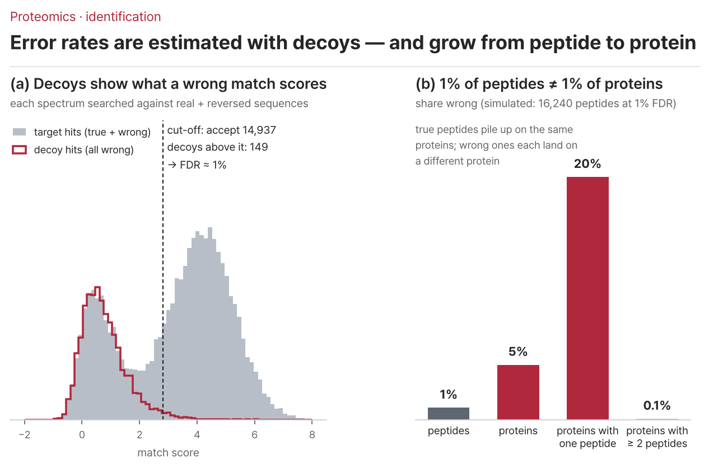{fig-align="center"}

::: {.callout-note collapse="true" icon=false}
## 🔍 더 알아보기 — 단백질 수준 오류가 더 큰 이유

-   Target hit의 FDR = 특정 score threshold **이상**에서 나온 decoy hit의 비율로 추정
-   단백질 수준에서는 오류가 **누적**
-   ⚠️ Peptide 하나만으로 식별한 단백질 = 신뢰도 가장 낮음
:::

## 3) ⚠️ 단백질 추론 {#w6-s3-3}

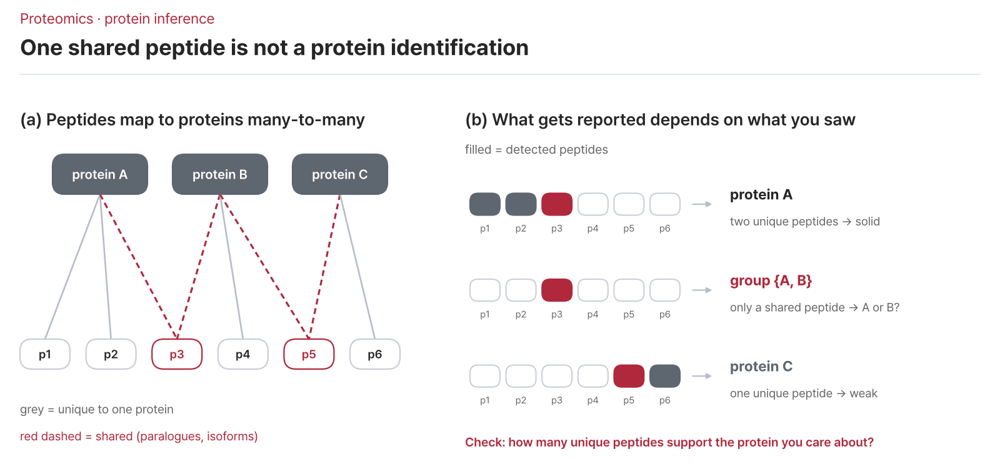{fig-align="center"}

-   관련 단백질(paralogue, isoform, family 구성원) 사이에 **공유되는** peptide가 많음
-   공유 peptide만 검출 → 여러 단백질이 자료와 똑같이 잘 맞음
-   Software는 **protein group**으로 보고 — 구분할 수 없는 단백질 집합 + 대표 이름 하나
-   ✅ 관심 단백질 → 단백질 특이적인 **unique peptide**가 몇 개나 뒷받침하는지 확인

::: {.callout-warning collapse="true"}
## 공유 peptide와 protein group

⚠️ Group의 대표 accession 하나만 결과표, 그림, 초록에 전달되는 경우가 많음

**관심 단백질에서 확인할 것:**

-   **Unique peptide**가 몇 개나 뒷받침하나? 하나는 약함, 두 개가 흔히 쓰는 최소 기준
-   Group의 일부로 보고되었나? 그렇다면 구성원은?
-   다른 group 구성원이 실제 단백질이어도 생물학적 설명이 유지되나?
:::

## 4) 단백질 정량 {#w6-s3-4}

-   단백질 하나는 여러 peptide를 통해 관찰 → peptide intensity를 **시료당 값 하나**로 요약해야 함
-   Peptide마다 이온화 효율이 크게 다름 → 같은 단백질 안에서도 원래 높이가 100배까지 차이 → 원래 값의 합이 아니라 **시료 간 pattern**을 요약
-   흔히 쓰는 방법 — **MaxLFQ**(label-free, 시료 간 peptide 비율로 계산), **Tukey median polish**(MSstats). TMT: peptide별 reporter ion intensity를 단백질별로 합산
-   ✅ Protein group에 고유한 peptide만 사용 — 공유 peptide는 여러 단백질의 신호를 섞음([③](#w6-s3-3))

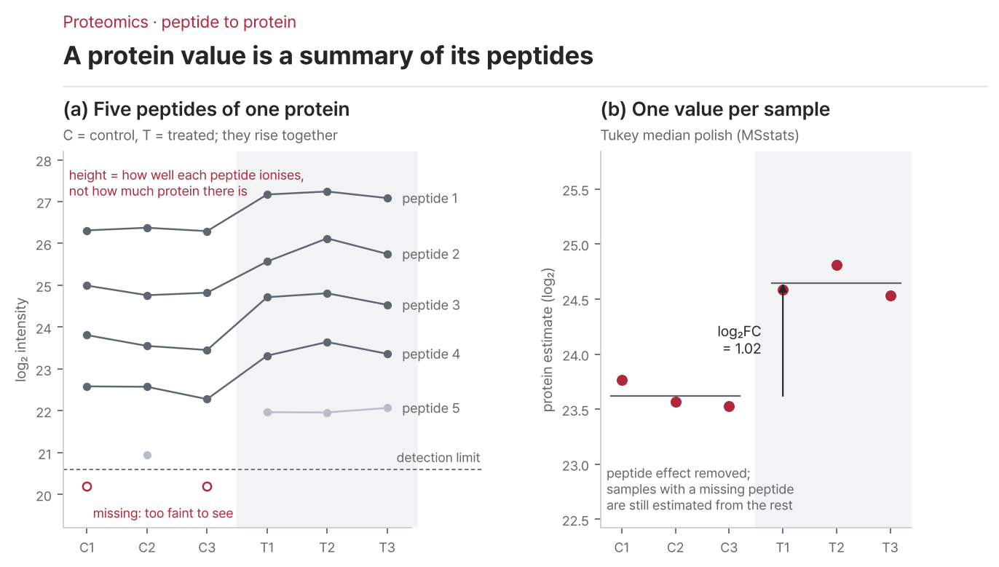{fig-align="center"}

## 5) 정규화 {#w6-s3-5}

-   원래 intensity는 극도로 치우친 분포 → **log₂ 변환**: 분포가 대략 대칭이 되고, 2배 차이는 척도 어디에서나 +1
-   시료마다 넣은 양이 다름 → 한 시료의 모든 단백질이 함께 이동 → log intensity의 **median centering**으로 시료를 맞춤 (더 강한 대안 = quantile normalization)
-   Intensity는 **count가 아니라 연속형** → RNA-seq의 negative binomial 방법(🔗 [W4 §4.3](w4_transcriptomics.qmd#w4-s4-3))은 적용 x
-   ⚠️ TMM·RLE와 같은 가정 — **대부분의 단백질은 변하지 않음**. 한 단백질이 지배적이거나 시료 종류가 크게 다르면 모든 값이 왜곡 (🔗 [W4 §3.3②](w4_transcriptomics.qmd#w4-s3-3-2))
-   TMT — set 안에서 정규화한 뒤, 공통 reference channel로 set 사이를 정렬([§4.3](#w6-s4-3))

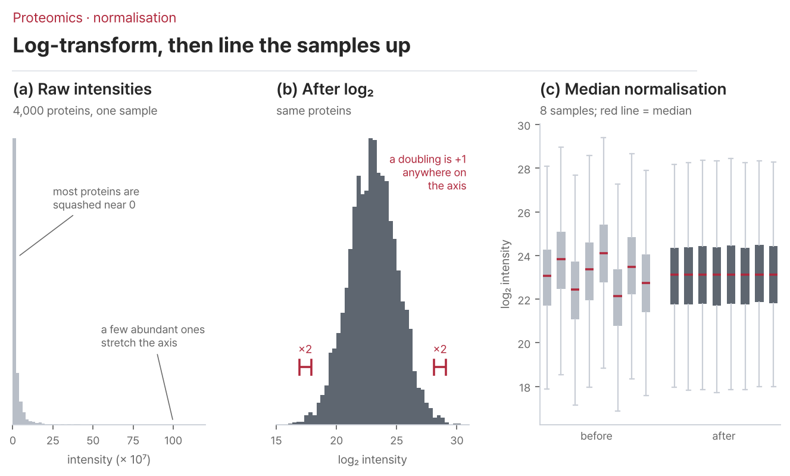{fig-align="center"}

## 6) 결측값 {#w6-s3-6}

-   단백체 matrix에는 흔히 **20–50%의 결측값** — RNA-seq 분석가는 놀라지만 단백체 분석가에게는 정상
-   **차이** — sequencing은 0을 셈, MS는 아무것도 기록하지 못함
-   💡 빈칸 = 대개 "너무 적어서 검출 못 함" → 빈칸을 함부로 채우면 fold change가 부풀려지고 위양성이 만들어짐

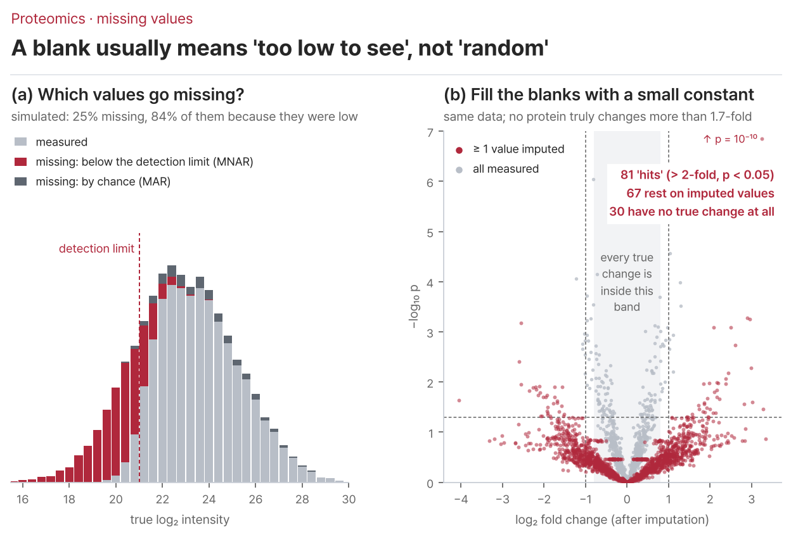{fig-align="center"}

### ① 두 종류의 결측 {#w6-s3-6-1}

-   **MNAR**(missing not at random) — 단백질이 검출한계 아래라서 빠짐 → 결측 자체가 존재량이 낮았음을 알려주는 **정보**
-   **MAR / MCAR**(missing at random) — 우연히 빠짐: DDA가 선택하지 않았거나 그 run에서 peptide의 retention time이 좋지 않았음 → 정보 없음
-   ⚠️ 실제 자료 = 두 종류가 섞여 있음. 그 비율은 존재량에 크게 좌우 — 왼쪽 패널이 바로 이것

### ② ⚠️ Imputation {#w6-s3-6-2}

-   **Imputation** = 결측값을 추정값으로 채워 넣기
-   ⚠️ 작은 상수로 채우면 → 검출한계 부근 단백질의 **fold change가 모두 부풀려짐**: 작은 실제 변화는 크게 보이고, 변화가 전혀 없는 단백질 일부는 "매우 유의한" hit가 됨 = **위양성**
-   ✅ 먼저 filtering, 결측 종류에 맞는 방법 선택, imputation **없이도** 최상위 hit가 유지되는지 확인

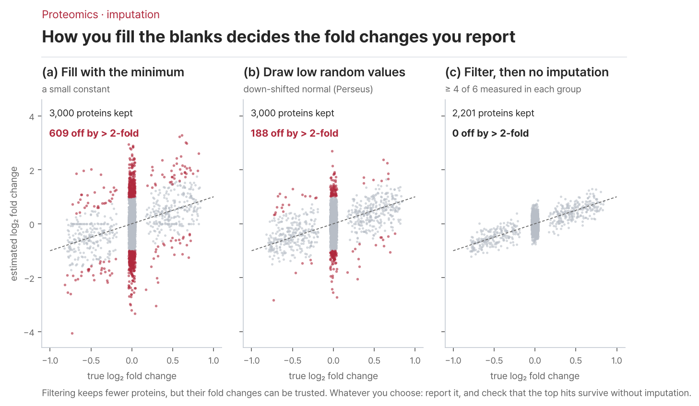{fig-align="center"}

::: {.callout-warning collapse="true"}
## 단백체학 위양성을 만들어 내는 가장 흔한 방법

**과정:**

-   결측값을 작은 상수 또는 관측된 최소값으로 대체
-   → 모든 대조군에서 검출되고 환자군에서는 전혀 검출되지 않은 단백질 → 매우 크고 극도로 유의한 fold change
-   → 그 fold change의 크기를 정하는 것은 자료가 아니라 내가 고른 상수
-   → **검출한계 부근의 모든 단백질에서** 같은 현상

**특징적인 양상** — volcano plot에 큰 fold change와 높은 유의성을 보이는 의심스러운 hit 구름. 대부분 실제 측정값이 아니라 imputation된 값이 만든 것

**더 나은 방법:**

-   ✅ **먼저 filtering** — 예: 검정 전에 적어도 한 집단에서 시료의 70% 이상에서 검출된 단백질만 남김
-   ✅ **결측 기전에 맞는 방법 선택** — MNAR에는 left-censored imputation(QRILC, MinProb), MAR에는 kNN 같은 방법. Perseus의 "정규분포에서 결측값 대체" = **MNAR** 방법 → 구분 없이 적용 x
-   ✅ **또는 imputation 안 함** — MSstats, `limma`는 값을 채우는 대신 model 안에서 결측을 처리
-   ✅ 결측 비율, filtering 방법, imputation 대상을 **항상 보고** → 그다음 imputation **없이도** 최상위 hit가 유지되는지 확인
:::

------------------------------------------------------------------------

# 4. 통계 분석: 차등 존재량 검정 📊 {#w6-s4}

> 🔑 **핵심** — RNA-seq 차등발현(🔗 [W4 §4](w4_transcriptomics.qmd#w4-s4))과 같은 논리를 연속형 log intensity, 더 적은 단백질 수, 작은 n에 적용 → 단백질마다 선형 model, 분산은 단백질 사이에서 빌려 옴

## 1) RNA-seq과의 차이 {#w6-s4-1}

-   **① 연속형 intensity** — log₂ intensity는 대략 정규분포 → negative binomial이 아니라 선형 model(t-test 계열) ([§3.5](#w6-s3-5))
-   **② 더 적은 feature** — 보통 유전자 20,000개가 아니라 **단백질 3,000–9,000개** → FDR 보정은 여전히 필수, 다중검정 부담은 더 작음
-   **③ 작은 n과 큰 변이** → `limma`(moderated t-statistic)와 **MSstats**가 표준 도구

::: {.callout-note collapse="true" icon=false}
## 🔍 더 알아보기 — 작은 n과 큰 변이

-   단백체 실험은 보통 RNA-seq 실험보다 작고 기술적 변이는 더 큼
-   → 3 vs 3 시료로 구한 단백질의 분산 = 잡음이 큰 추정치. 우연히 아주 작게 보이는 분산이 생기고, 작은 분산은 거대한 t 통계량을 만듦
:::

## 2) limma와 MSstats {#w6-s4-2}

-   **`limma`** — 단백질마다 log intensity에 선형 model을 맞춘 뒤, 각 단백질의 분산을 전체 단백질의 전형적인 값 쪽으로 당김 = **moderated t-statistic**
-   DESeq2의 dispersion shrinkage와 같은, feature 사이에서 정보를 빌리는 방법 (🔗 [W4 §4.3④](w4_transcriptomics.qmd#w4-s4-3-4))
-   ✅ 우연히 작게 보이는 분산을 끌어올림 → 가짜 hit는 줄고 진짜 hit는 늘어남
-   **MSstats** — **peptide 수준** intensity에서 시작: peptide를 요약하고([§3.4](#w6-s3-4)) peptide → 단백질 구조를 명시적으로 model

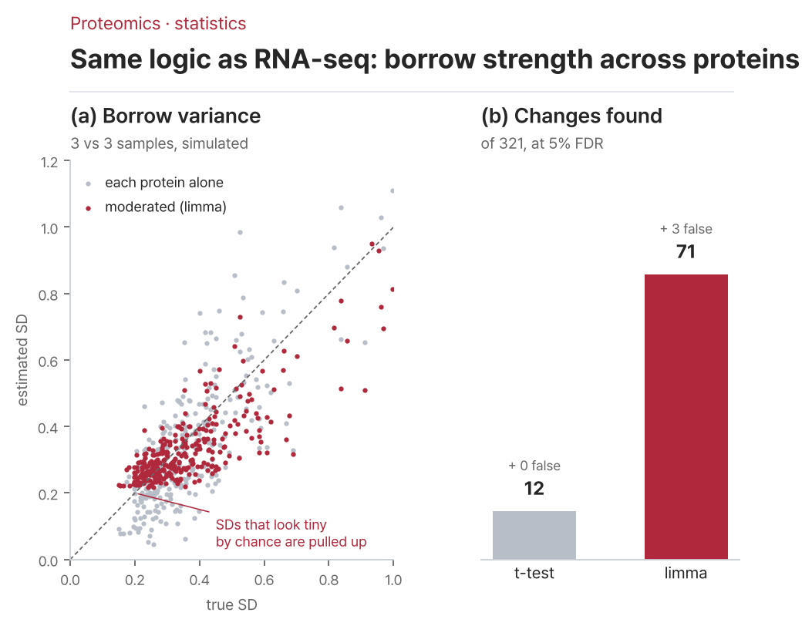{fig-align="center"}

## 3) Batch와 설계 {#w6-s4-3}

-   90개 시료를 분석하는 18-plex TMT 실험 → **5개 set**(batch) 필요. DIA cohort는 몇 주에 걸쳐 측정 → run 순서에 따른 drift
-   ⚠️ 환자군과 대조군이 batch에 불균형하게 분배 → 🔗 [W1 §4.3](w1_intro.qmd#w1-s4-3)의 교란 문제가 그대로 재현
-   ✅ **실험 전에** — 시료를 set과 run 순서에 무작위 배치. 모든 TMT set에 **공통 reference channel**, run 내내 pooled QC 시료 포함
-   ✅ **Model 안에서** — RNA-seq처럼 batch를 설계에 포함(`~ batch + group`) (🔗 [W4 §4.4](w4_transcriptomics.qmd#w4-s4-4))

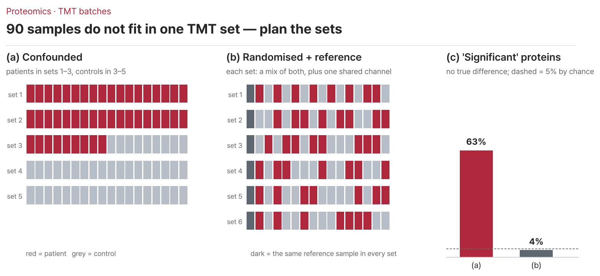{fig-align="center"}

::: {.callout-tip collapse="true"}
## 단백체 논문을 읽을 때 확인할 것

-   몇 개 단백질을 정량했나? **얼마나 많은 시료에서** 측정되었나?
-   결측값은 어떻게 처리했나?
-   DDA인가, DIA인가? TMT라면 batch는 몇 개, 시료 배치는 어떻게?
-   핵심 단백질을 뒷받침하는 **unique peptide**는 몇 개?
-   Western blot, ELISA, targeted MS 같은 직교적 방법으로 검증했나?
:::

------------------------------------------------------------------------

# 5. Downstream analysis: 단백질 목록에서 생물학적 의미로 🧠 {#w6-s5}

> 🔑 **핵심** — 변한 단백질 목록 → pathway, 신호전달, 약물 표적. 단계마다 단백체 특유의 함정: background, phosphosite 밑의 단백질 양, pQTL 밑의 epitope

## 1) Enrichment analysis와 background {#w6-s5-1}

-   RNA-seq과 같은 도구 — ORA, GSEA (🔗 [W4 §5](w4_transcriptomics.qmd#w4-s5))
-   ⚠️ MS는 **풍부한 단백질부터** 봄 — ribosome, 대사 효소, proteasome. 수용체와 전사인자는 거의 검출되지 않음
-   → 유전체 전체와 비교하면 검출된 단백질로 만든 *어떤* 목록이든 ribosome과 glycolysis에 "농축"된 것처럼 보임
-   ✅ **Background = 이 실험에서 정량된 모든 단백질**, 유전체 전체가 아님
-   💡 한 복합체의 단백질은 함께 변하는 경우가 많음 → 복합체 수준(CORUM), 상호작용 network(STRING) 관점이 단백체학에 잘 맞음

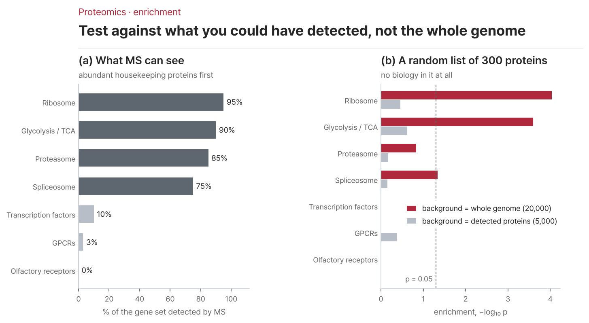{fig-align="center"}

## 2) Phosphorylation과 신호전달 {#w6-s5-2}

-   **Phosphoproteomics** — 대표적인 임상 사례. 신호전달은 phosphorylation으로 조절, 전체 단백질 양만으로는 알 수 없음
-   Phosphopeptide는 전체에서 작은 비율 → MS 전에 **enrichment 단계**(TiO₂, IMAC) 추가
-   ⚠️ 단백질 자체가 증가해서 phosphopeptide가 증가할 수도 → phosphorylation을 *신호전달*로 해석하려면 단백질 양도 알아야 함
-   💡 어떤 kinase가 활성화되었나? → kinase마다 알려진 기질들이 함께 움직였는지 검정 (kinase activity inference)

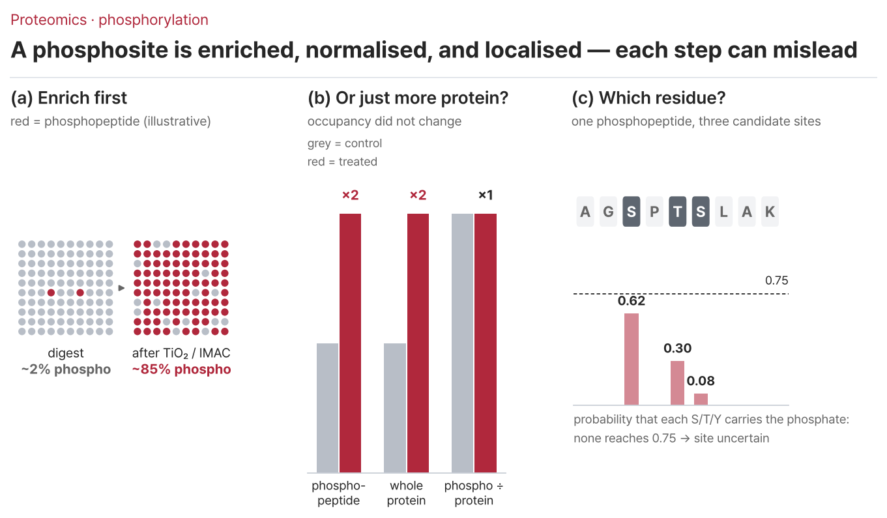{fig-align="center"}

::: {.callout-note collapse="true" icon=false}
## 🔍 더 알아보기 — 어느 위치인가 (site localization)

-   ⚠️ Peptide에 가능한 위치가 여러 개, spectrum으로 구분 못 할 수도
-   Search engine이 localization probability를 보고 → 약 0.75 미만인 위치는 불확실한 것으로 취급
:::

## 3) 💊 pQTL과 약물 표적 {#w6-s5-3}

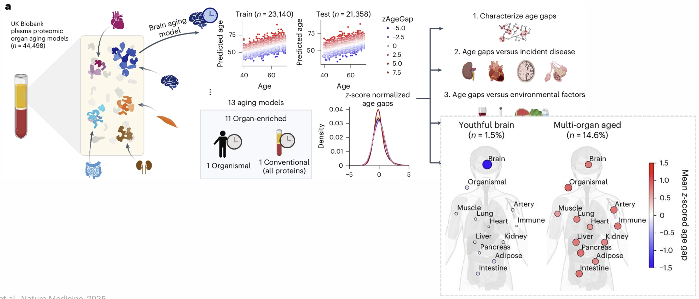{fig-align="center"}

-   **pQTL** = 단백질 존재량과 연관된 유전 변이. eQTL의 단백질 버전 (🔗 [W2 §4.4](w2_genomics.qmd#w2-s4-4), 🔗 [W4 §6.4](w4_transcriptomics.qmd#w4-s6-4))
-   수만 명의 biobank 참여자를 대상으로 한 집단 규모 혈장 단백체학 → 대규모 pQTL 자료 사용 가능
-   💊 이 수업 전체를 관통하는 고리를 완성: GWAS hit → pQTL → 어느 단백질? → 인과적? → **유전적으로 검증되고 약물로 표적화할 수 있는 target**

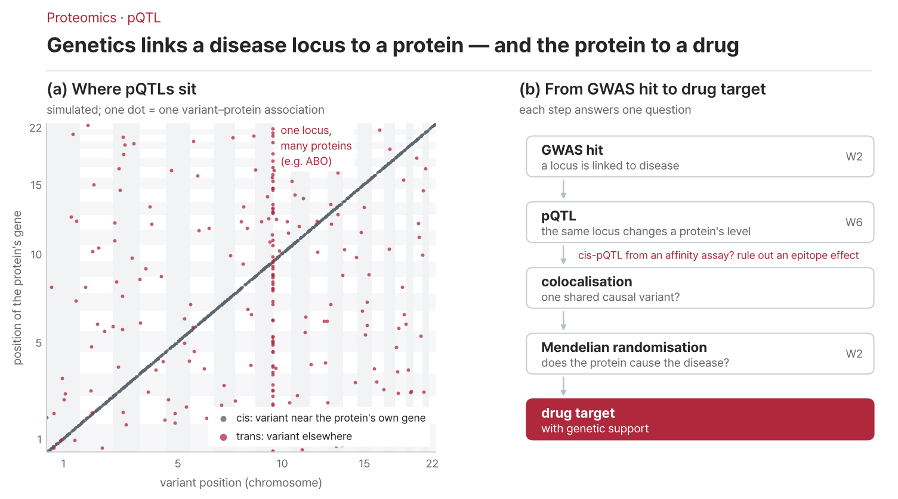{fig-align="center"}

::: {.callout-note collapse="true" icon=false}
## 🔍 더 알아보기 — GWAS hit에서 약물 표적까지, 단계별로

```
GWAS hit (W2)        → locus 지목
pQTL (W6)            → 해당 locus가 어느 단백질의 양을 조절하는가?
Colocalization       → 두 신호가 하나의 causal variant를 공유하는가?
Mendelian rand. (W2) → 그 단백질이 질병에 인과적으로 영향을 주는가?
        ↓
유전적으로 검증되고 약물로 표적화할 수 있는 target (🔗 W2 §6.3)
```
:::

::: {.callout-note collapse="true" icon=false}
## 🔍 더 알아보기 — *cis*-pQTL vs *trans*-pQTL

⚠️ 구분할 것:

-   ***cis*****-pQTL** — 단백질 자체의 유전자 근처에 있는 변이. 강한 근거, 하지만 **epitope effect 확인 필요** ([§2.5②](#w6-s2-5-2))
-   ***trans*****-pQTL** — 다른 위치의 변이. 조절자 또는 제거 기전처럼 생물학적으로 흥미롭지만 해석은 더 어려움
:::

------------------------------------------------------------------------

# 6. 존재량을 넘어서 🔭 {#w6-s6}

> 🔑 **핵심** — bulk 존재량 표에는 구조, 단일세포, 조직 속 위치가 빠져 있음. 각각을 측정하는 기술이 따로 있고, 한계도 따로 있음

## 1) AlphaFold 시대의 구조 {#w6-s6-1}

-   정확한 구조 예측 → 단백질 목록으로 할 수 있는 일이 바뀜: 변이 효과 해석, docking, cross-linking MS 해석
-   ⚠️ 예측 = **model**. 예측 구조 ≠ *in vivo* conformation의 증거

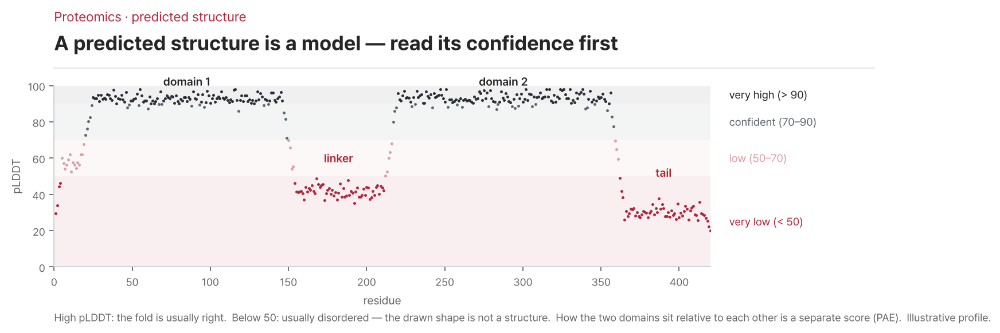{fig-align="center"}

::: {.callout-note collapse="true" icon=false}
## 🔍 더 알아보기 — 예측 구조 읽기

-   Confidence score(pLDDT)가 중요
-   무질서 영역은 제대로 예측되지 않음
:::

## 2) 단일세포 단백체학과 공간 단백체학 {#w6-s6-2}

-   **단일세포 MS**(SCoPE2, plexDIA) — 세포당 수백~수천 개 단백질. Run당 세포 수는 단일세포 RNA-seq보다 훨씬 적음 (🔗 [W5](w5_singlecell.qmd))
-   **항체 기반, 세포 단위** — flow cytometry와 mass cytometry(CyTOF): 수백만 세포에서 수십 개 단백질. CITE-seq: DNA barcode를 붙인 항체를 RNA와 함께 읽음
-   **공간** — imaging mass cytometry, CODEX: 조직 절편에서 40개 이상 단백질을 세포 해상도로. MALDI imaging MS: 비표적, 해상도는 더 낮음
-   ⚠️ 항체 기반 방법 = **결합**을 측정하는 **미리 정의한 panel** — affinity assay와 같은 주의점 ([§2.5](#w6-s2-5))

------------------------------------------------------------------------

# 📝 요약

-   유전자 전체에서 mRNA가 설명하는 것 = 단백질 존재량의 약 5분의 1 → **단백질에 관한 주장이라면 단백질을 측정**
-   Bottom-up MS = **peptide를 측정**하고 단백질을 추론. 서열 정보는 MS2 절편 사다리에 담김
-   DDA = 가장 강한 precursor 선택 → 확률적으로 일부를 놓침. DIA = 모든 것을 절편화 → 결측 훨씬 적음. Targeted MS = 검증용
-   LFQ, TMT, SILAC = 시료를 *언제* 합치는지가 다름. ⚠️ TMT는 ratio를 압축, batch는 무작위화 필요
-   혈장의 dynamic range는 10자릿수보다 넓음, 상위 20개 단백질이 질량의 약 99%. ⚠️ Affinity platform(Olink, SomaScan)은 **결합**을 측정 → 교차반응, epitope 변이가 중요
-   Pre-processing = database search → target–decoy FDR → protein group → 단백질 값 → log₂와 정규화. QC는 **단계별로**, 다른 run과 비교해 확인
-   ⚠️ **단백질 추론은 실제로 모호함** → unique peptide 수, 관심 단백질이 group으로 보고되었는지 확인
-   ⚠️ 결측값은 대부분 MNAR → imputation 전에 filtering, imputation 없이도 hit가 유지되는지 확인
-   통계 = RNA-seq과 같은 논리, 연속형 intensity와 작은 n에 맞춰 조정 → `limma`, MSstats. Batch는 설계에 포함
-   ⚠️ 유전체 전체를 background로 한 enrichment는 풍부한 housekeeping 단백질에 유리 → **검출된 단백질**을 background로
-   pQTL = GWAS hit에서 유전적으로 검증된 약물 표적으로 이어지는 사슬의 완성

------------------------------------------------------------------------

# 🔑 핵심 용어

| 용어 | 한 줄 설명 |
|-------------------------|------------------------------------------------|
| Bottom-up proteomics | 단백질을 peptide로 분해한 뒤 측정하는 방법 |
| Tryptic peptide | K/R 뒤에서 절단되어 만들어진 절편 |
| MS1 / MS2 | Precursor survey scan / fragment scan |
| PSM | Peptide–spectrum match: spectrum 하나를 peptide 하나에 대응한 것 |
| Protein inference | Peptide가 어느 단백질에서 왔는지 결정하는 과정 |
| Protein group | 구분할 수 없어 함께 보고되는 단백질 집합 |
| DDA / DIA | Data-dependent / data-independent acquisition |
| PRM / MRM | 미리 정의한 목록을 측정하는 targeted acquisition |
| LFQ | Label-free quantification |
| TMT / iTRAQ | 하나의 run에서 multiplex하는 isobaric chemical label |
| SILAC | Heavy amino acid를 이용한 metabolic labelling |
| Pooled QC 시료 | 모든 시료를 섞어 반복 측정하는 시료, 기술적 잡음 측정용 |
| MNAR / MAR | 낮은 존재량 때문에 결측 / 우연에 의한 결측 |
| Dynamic range | 가장 많은 단백질과 가장 적은 단백질 사이의 범위 |
| pQTL | 단백질 양과 연관된 변이 |
| Phosphoproteomics | Phosphopeptide를 농축하여 측정하는 분석 |

::: {.callout-note collapse="true" icon=false}
## 🔍 더 알아보기 — 심화 용어

| 용어 | 한 줄 설명 |
|-------------------------|------------------------------------------------|
| b ion / y ion | N-terminal / C-terminal 절편 series |
| Target–decoy | 역순 database를 이용한 FDR 추정 |
| Missed cleavage | Trypsin이 자르지 못한 K/R 위치 |
| MaxLFQ | 시료 간 peptide 비율로 계산하는 label-free 단백질 값 |
| Ratio compression | Co-isolation 때문에 TMT ratio가 1 방향으로 당겨지는 현상 |
| PEA | Olink의 dual-antibody DNA readout |
:::

------------------------------------------------------------------------

# ➕ 참고문헌

### 종설

Aebersold R, Mann M. [*Mass-spectrometric exploration of proteome structure and function.*](https://pubmed.ncbi.nlm.nih.gov/?term=Mass-spectrometric+exploration+of+proteome+structure+and+function) Nature. 2016.\
Sinitcyn P, Rudolph JD, Cox J. [*Computational methods for understanding mass spectrometry-based shotgun proteomics data.*](https://pubmed.ncbi.nlm.nih.gov/?term=Computational+methods+for+understanding+mass+spectrometry-based+shotgun+proteomics+data) Annu Rev Biomed Data Sci. 2018.\
Liu Y, Beyer A, Aebersold R. [*On the dependency of cellular protein levels on mRNA abundance.*](https://pubmed.ncbi.nlm.nih.gov/?term=On+the+dependency+of+cellular+protein+levels+on+mRNA+abundance) Cell. 2016.

### Acquisition과 정량

Ludwig C, et al. [*Data-independent acquisition-based SWATH-MS for quantitative proteomics: a tutorial.*](https://pubmed.ncbi.nlm.nih.gov/?term=Data-independent+acquisition-based+SWATH-MS+for+quantitative+proteomics%3A+a+tutorial) Mol Syst Biol. 2018.\
Demichev V, et al. [*DIA-NN: neural networks and interference correction enable deep proteome coverage in high throughput.*](https://doi.org/10.1038/s41592-019-0638-x) Nat Methods. 2020.\
Ting L, et al. [*MS3 eliminates ratio distortion in isobaric multiplexed quantitative proteomics.*](https://pubmed.ncbi.nlm.nih.gov/?term=MS3+eliminates+ratio+distortion+in+isobaric+multiplexed+quantitative+proteomics) Nat Methods. 2011.\
Cox J, et al. [*Accurate proteome-wide label-free quantification by delayed normalization and maximal peptide ratio extraction, termed MaxLFQ.*](https://pubmed.ncbi.nlm.nih.gov/?term=Accurate+proteome-wide+label-free+quantification+by+delayed+normalization+and+maximal+peptide+ratio+extraction%2C+termed+MaxLFQ) Mol Cell Proteomics. 2014.

### QC, 통계와 결측값

Bielow C, Mastrobuoni G, Kempa S. [*Proteomics quality control: quality control software for MaxQuant results.*](https://pubmed.ncbi.nlm.nih.gov/?term=Proteomics+quality+control%3A+quality+control+software+for+MaxQuant+results) J Proteome Res. 2016. (PTXQC)\
Choi M, et al. [*MSstats: an R package for statistical analysis of quantitative mass spectrometry-based proteomic experiments.*](https://doi.org/10.1093/bioinformatics/btu305) Bioinformatics. 2014.\
Lazar C, et al. [*Accounting for the multiple natures of missing values in label-free quantitative proteomics data sets.*](https://pubmed.ncbi.nlm.nih.gov/?term=Accounting+for+the+multiple+natures+of+missing+values+in+label-free+quantitative+proteomics+data+sets) J Proteome Res. 2016.\
Nesvizhskii AI, Aebersold R. [*Interpretation of shotgun proteomic data: the protein inference problem.*](https://pubmed.ncbi.nlm.nih.gov/?term=Interpretation+of+shotgun+proteomic+data%3A+the+protein+inference+problem) Mol Cell Proteomics. 2005.

### 혈장 및 affinity proteomics

Geyer PE, et al. [*Revisiting biomarker discovery by plasma proteomics.*](https://pubmed.ncbi.nlm.nih.gov/?term=Revisiting+biomarker+discovery+by+plasma+proteomics) Mol Syst Biol. 2017.\
Sun BB, et al. [*Plasma proteomic associations with genetics and health in the UK Biobank.*](https://doi.org/10.1038/s41586-023-06592-6) Nature. 2023.\
Katz DH, et al. [*Proteomic profiling platforms head to head: comparison of Olink and SomaScan.*](https://pubmed.ncbi.nlm.nih.gov/?term=Proteomic+profiling+platforms+head+to+head%3A+comparison+of+Olink+and+SomaScan) Cell Rep Med. 2022.

### 단일세포 단백체학

Specht H, et al. [*Single-cell proteomic and transcriptomic analysis of macrophage heterogeneity using SCoPE2.*](https://pubmed.ncbi.nlm.nih.gov/?term=Single-cell+proteomic+and+transcriptomic+analysis+of+macrophage+heterogeneity+using+SCoPE2) Genome Biol. 2021.

### 자료원

[PRIDE](https://www.ebi.ac.uk/pride/) · [Human Protein Atlas](https://www.proteinatlas.org/) · [AlphaFold DB](https://alphafold.ebi.ac.uk/) · [PeptideAtlas](http://www.peptideatlas.org/)
