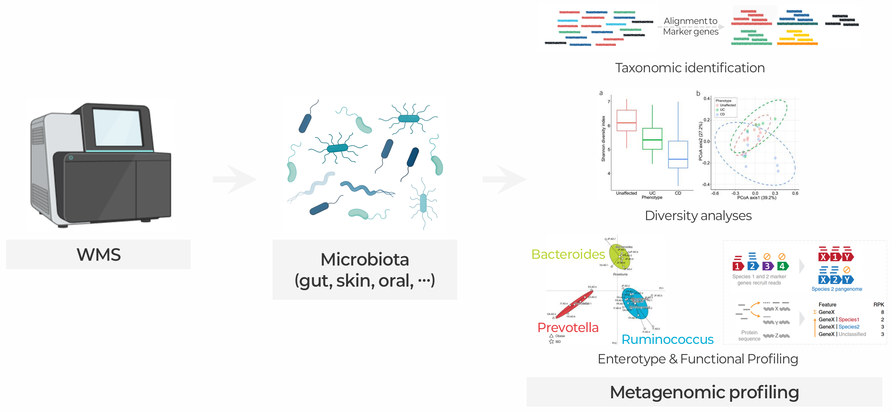
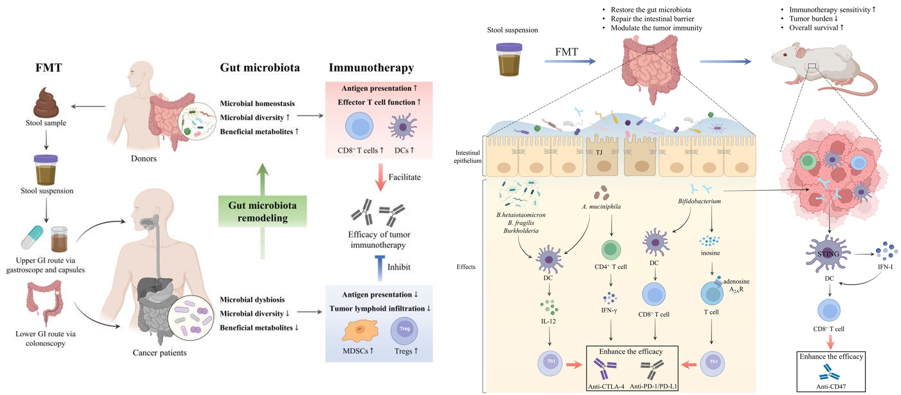

::: {.callout-note collapse="true"}
## 🎯 학습목표

이 장을 마치면 다음을 할 수 있어야 합니다.

-   Microbiome 연구 설계에서 교란요인과 오염이 특히 중요한 이유를 설명할 수 있습니다.
-   연구 질문에 따라 16S amplicon과 shotgun sequencing 중 하나를 선택할 수 있습니다.
-   Alpha diversity와 beta diversity를 구분하고 PERMANOVA와 함께 PCoA를 해석할 수 있습니다.
-   ⚠️ 조성 자료에 표준 통계를 적용하면 문제가 생기는 이유와 CLR의 해결 방식을 설명할 수 있습니다.
-   ⚠️ Differential abundance 방법들이 서로 다른 결과를 내는 이유와 이를 정직하게 보고하는 방법을 설명할 수 있습니다.
-   Microbiome–질병 연관성이 원인, 결과 또는 artifact인지 판단할 수 있습니다.
-   어떤 omics 논문이든 비판적으로 읽을 수 있습니다. 이 수업을 마무리하는 기술입니다.
:::

> 🤔 **출발 질문**
>
> 환자군에는 대조군보다 *Faecalibacterium*이 적습니다. 이것은 원인일까요, 결과일까요, 아니면 artifact일까요?



------------------------------------------------------------------------

# 1. 인간 microbiome 🦠 {#w7-s1}

## 1) 어디에 무엇이 사는가 {#w7-s1-1}

사람의 몸에는 **사람 세포와 거의 같은 수의 세균 세포**가 있습니다. 과거에 널리 인용된 10:1이라는 비율은 과대추정이었고 현재 가장 좋은 추정치는 약 1:1입니다.

-   그중 거의 전부가 대장에 있습니다.

{fig-align="center"}

이 그림의 두 가지 사실이 모든 microbiome 연구의 형태를 결정합니다.

-   **신체 부위끼리는 비교할 수 없습니다.** 장, 구강, 피부, 질, 기도의 군집은 대부분의 질병과 건강 상태 사이의 차이보다 서로 더 크게 다릅니다.
-   ⚠️ **개인 간 변이가 매우 큽니다.** 건강한 성인 두 명이 공유하는 장내 species가 소수에 불과할 수도 있습니다.
    -   → 질병 효과를 탐지하려면 많은 시료가 필요합니다.
    -   → 그러나 출판된 microbiome 연구는 대부분 작습니다.

## 2) 질병 연관성을 정직하게 보기 {#w7-s1-2}


연구된 거의 모든 질병에서 microbiome 차이가 보고되었습니다. **근거의 강도는 매우 다르므로** 어느 단계인지 명확히 해야 합니다.

| 근거 수준 | 예시 |
|------------------------------------|------------------------------------|
| **인과성이 기전적으로 확립됨** | *C. difficile* 감염과 치료로서의 FMT, *H. pylori*와 위암 |
| **강한 근거와 동물 model의 뒷받침** | 식이–microbiome–대사물질 축, 담즙산 대사, 일부 약물 대사(예: digoxin, irinotecan) |
| **재현되는 연관성이 있으나 인과성은 불명확** | IBD, 대장암, 제2형 당뇨병, 비만 |
| **널리 보고되지만 재현성이 낮음** | 대부분의 신경정신 및 행동 관련 “장–뇌” 연관성 |

{fig-align="center"}

💡 Microbiome 논문을 읽을 때는 다른 것을 평가하기 전에 먼저 **이 근거 사다리의 어디에 놓이는지 판단하세요.**

------------------------------------------------------------------------

# 2. 연구 설계와 시료 처리 🧊 {#w7-s2}

## 1) 분석 전 변이 {#w7-s2-1}

Microbiome 측정값은 sequencing **이전**에 일어난 일에 특히 민감합니다.

-   **채취와 보관** — 실온에 둔 시간에 따라 조성이 변합니다. Freeze–thaw 횟수도 중요하며 보존 buffer마다 효과가 다릅니다.
-   ⚠️ **DNA 추출 — 가장 큰 단일 기술적 변이 원인**
    -   Gram-positive 세균은 단단한 세포벽을 가집니다.
    -   → bead-beating protocol은 이를 회수하지만 부드러운 protocol은 그렇지 못합니다.
    -   → **서로 다른 kit를 쓰는 두 실험실은 같은 대변에서도 서로 다른 군집을 보고합니다.**
-   **Primer 선택**([§3.1①](#w7-s3-1-1))과 sequencing platform도 영향을 줍니다.

**실용적인 결론:**

-   ✅ 한 연구 *안에서* 비교 — 합리적입니다.
-   ⚠️ 연구 *사이의* 비교 — 매우 위험합니다. Meta-analysis에서는 연구를 batch 변수로 model해야 합니다.

## 2) ⚠️ 교란요인 {#w7-s2-2}

-   **식이** — 장내 조성을 결정하는 가장 큰 환경 요인이지만 제대로 측정되는 경우가 거의 없습니다.
-   **약물** — proton pump inhibitor, metformin, 항생제, 완하제는 모두 잘 알려진 큰 microbiome 효과를 가집니다.

::: {.callout-warning collapse="true"}
## Metformin이 주는 교훈

-   초기 연구에서는 제2형 당뇨병의 뚜렷한 장내 microbiome signature를 보고했습니다.
-   그 signature의 상당 부분은 당뇨병이 아니라 **metformin의 효과**로 밝혀졌습니다.
-   치료받지 않은 환자를 별도로 분석하자 결과가 크게 달라졌습니다.

**모든 case–control microbiome 연구에서 물어보세요. 환자군이 다른 약물을 복용했나요?**

거의 항상 그렇습니다.
:::

다음 정보도 수집하고 보정해야 합니다. 나이 · 성별 · BMI · 배변 빈도와 대변 굳기(Bristol scale은 놀라울 만큼 강한 공변량입니다) · 장 통과 시간 · 지역.

## 3) ⚠️ Kit-ome {#w7-s2-3}

{fig-align="center"}

**기전** — 추출 kit와 PCR reagent에는 세균 DNA가 들어 있습니다.

-   **대변** → 무시할 만합니다.
-   **혈액, 조직 biopsy, 태반** → 시료 속 세균 세포가 **kit 안의 세균 DNA보다 적을 수 있습니다.**
-   → **Sequencing한 것의 대부분이 kit에서 나온 것**일 수 있습니다.

⚠️ 건강한 태반 microbiome과 일부 종양 microbiome 결과를 포함하여 주목받았던 여러 low-biomass 연구 결과가 이후 대부분 오염으로 설명되었습니다.

::: {.callout-important collapse="true"}
## 신뢰할 수 있는 low-biomass 연구의 조건

-   ✅ 모든 batch에서 **extraction blank와 no-template control을 sequencing합니다.**
-   ✅ 이를 실제로 **사용합니다.** `decontam`과 유사한 도구는 (i) blank에서의 출현 빈도와 (ii) DNA 농도와의 역상관으로 오염물을 식별합니다.
-   ✅ **DNA 농도**를 공변량으로 기록합니다.
-   ✅ 오염 제거 **전후의 결과를 모두** 보고합니다.

⚠️ Negative control을 언급하지 않은 low-biomass 논문이라면 이것을 가장 먼저 지적해야 합니다.
:::

------------------------------------------------------------------------

# 3. 군집을 sequencing하는 두 가지 방법 🧬 {#w7-s3}

{fig-align="center"}

## 1) 16S rRNA amplicon sequencing {#w7-s3-1}

**원리** — 16S rRNA 유전자는 모든 세균과 고세균에 존재하며 다음 두 영역이 번갈아 나타납니다.

-   **보존 영역** — universal primer가 결합합니다.
-   **가변 영역** — taxon에 따라 다릅니다.

→ 한두 개의 가변 영역을 증폭하고 sequencing한 뒤 분류합니다.

### ① ⚠️ Primer와 copy-number 편향 {#w7-s3-1-1}

-   **서로 다른 가변 영역**(V3–V4, V4, V1–V2)은 서로 다른 결과를 만듭니다. 따라서 다른 영역을 사용한 연구끼리는 **직접 비교할 수 없습니다.**
-   **“Universal” primer는 실제로 universal하지 않습니다.** 일부 taxon은 잘 증폭되지 않거나 전혀 증폭되지 않습니다.
-   **16S copy number는** genome당 1개에서 약 15개까지 다양합니다. 따라서 **read 비율은 세포 비율이 아닙니다.**

### ② OTU와 ASV {#w7-s3-1-2}

-   **OTU** — 97% 유사도를 기준으로 read를 군집화합니다. 이 threshold는 sequencing error를 흡수하기 위해 선택되었습니다.
-   **ASV** — amplicon sequence variant(DADA2, Deblur)입니다. 오류 과정을 model하여 **정확한 서열**을 구분합니다.

이제 ASV가 표준이며 한 가지 큰 실용적 장점이 있습니다. ASV는 하나의 dataset에서 정의한 cluster가 아니라 서열이므로 **연구 사이에서 비교할 수 있습니다.**

### ③ 해상도의 한계 {#w7-s3-1-3}

-   16S는 일반적으로 **genus** 수준까지 구분합니다.
-   Species 수준 분류는 신뢰하기 어렵습니다.
-   Strain 수준은 불가능합니다.

⚠️ 16S 결과를 species 수준으로 보고하는 논문은 과도하게 주장하는 것입니다. 이 차이는 중요합니다. *E. coli* strain은 공생균에서 치명적인 병원균까지 다양합니다.

## 2) Shotgun metagenomics {#w7-s3-2}

시료의 모든 DNA를 sequencing합니다.

-   Species, 그리고 종종 strain 수준의 **분류학적 profiling**(MetaPhlAn, Kraken2/Bracken, StrainPhlAn)
-   어떤 유전자와 pathway가 있는지 보는 **기능적 profiling**(HUMAnN)
    -   💡 중요한 추가 정보입니다. 계통적으로 먼 생물도 같은 기능을 가질 때가 많으므로 **정체성보다 기능이 더 중요할 수 있습니다.**
-   Virus, fungus, plasmid와 같은 **비세균 구성원**
-   **MAG assembly** — 배양되지 않은 생물의 genome을 복원

비용과 한계는 다음과 같습니다.

-   ⚠️ 약 10배 더 비쌉니다.
-   ⚠️ 미생물 biomass가 높고 숙주 DNA가 적어야 합니다. 조직 biopsy에서는 read의 99% 이상이 사람 DNA일 수 있습니다.
-   ⚠️ 훨씬 많은 계산이 필요합니다.

## 3) ✅ 선택 기준 {#w7-s3-3}

| 연구 질문                                     | 사용할 방법     |
|---------------------------------------------------|---------|
| 제한된 예산으로 수백 개 시료를 폭넓게 조사 | 16S     |
| PCR 증폭이 필요한 low-biomass 시료     | 16S     |
| Species 또는 strain 해상도                      | Shotgun |
| 누가 있는지가 아니라 군집이 *무엇을 하는지* 분석  | Shotgun |
| Virus, fungus 또는 mobile element                | Shotgun |

------------------------------------------------------------------------

# 4. 참조 database와 한계 📚 {#w7-s4}

| Database | 용도 |
|------------------------------------|------------------------------------|
| **SILVA**, **Greengenes2** | 16S taxonomy 배정 |
| **GTDB** | Genome 기반 taxonomy. 점점 표준이 되고 있으며 명칭이 과거 체계와 다름 |
| **Kraken2 / Bracken** database | Shotgun read 분류. 어떤 database를 구축했는지에 따라 결과가 크게 달라짐 |
| **UHGG**, gene catalogue | 배양되지 않은 장내 생물의 참조 genome과 유전자 |

🗺️ 다시 등장한 **참조 편향**입니다(🔗 [W1 §2.3③](w1_intro.qmd#w1-s2-3-3)).

-   일반적인 장 metagenome에서도 많은 read를 신뢰성 있게 분류할 수 없습니다. 이것이 **microbial dark matter**입니다.
-   비서구권 집단은 참조 collection에 충분히 포함되지 않아 그들의 microbiome을 더 부정확하게 특성화합니다.
-   ⚠️ Taxonomy는 활발히 개정되고 있어 **같은 생물이 두 논문에서 서로 다른 이름을 가질 수 있습니다.**

→ 연구끼리 비교할 때는 database와 version을 확인하세요. Genus 이름이 바뀌기도 합니다.

------------------------------------------------------------------------

# 5. 다양성 🌿 {#w7-s5}

{fig-align="center"}

## 1) Alpha diversity — 한 시료 안의 다양성 {#w7-s5-1}

-   **Richness** — taxon이 몇 개인가? ⚠️ Sequencing 깊이에 크게 좌우됩니다.
-   **Shannon, Simpson** — richness와 **evenness**를 함께 반영합니다. Richness가 같은 두 시료도 Shannon 값은 매우 다를 수 있습니다.
-   **Faith's PD** — 계통발생 거리를 가중한 richness입니다.

💡 최소한 **richness** 계열 지표 하나와 **evenness** 계열 지표 하나를 함께 보고하세요. 두 지표가 다르게 나타날 수 있으며 그 차이 자체가 정보입니다.

## 2) ⚠️ Rarefaction 논쟁 {#w7-s5-2}

**문제** — 시료마다 sequencing 깊이가 다르고 richness는 깊이에 따라 증가합니다. 어떤 방식으로든 처리해야 합니다.

```         
Rarefaction (모든 시료를 같은 깊이로 subsampling)
   → 과거의 표준
   → 자료를 버리므로 통계적으로 낭비라는 비판("waste not, want not")
   → 대신 model 기반 정규화가 제안됨
   → 최근 연구에서는 diversity와 ordination 분석에서
      rarefaction이 실제로 견고하다고 다시 주장
   → 아직 결론이 나지 않음
```

✅ **방어 가능한 입장**은 무언가를 명시적으로 적용하고, 무엇을 했는지 밝히며, 다른 방법에서도 결론이 유지되는지 확인하는 것입니다.

## 3) Beta diversity — 시료 사이의 다양성 {#w7-s5-3}

-   **Bray–Curtis** — 존재량을 가중한 비유사도입니다. 기본적으로 많이 사용합니다.
-   **Jaccard** — 존재 여부만 사용합니다.
-   **UniFrac**(weighted / unweighted) — 계통발생 관계를 포함합니다.

**PCoA**로 시각화하고 **PERMANOVA**로 검정합니다.

::: {.callout-warning collapse="true"}
## p뿐 아니라 R²도 보고하세요

-   수백 개 시료에 PERMANOVA를 적용하면 **거의 모든 것**을 탐지합니다.
-   **p**는 집단이 다르다고 알려줍니다.
-   **R²**는 집단 구분이 **전체 변이의 얼마를 설명하는지** 알려줍니다. Microbiome 연구에서는 일반적으로 **1–8%**입니다.

→ “군집 조성이 유의하게 다르다(p = 0.001)”면서 R² = 0.02라면 질병은 변이의 **2%**를 설명하고 나머지 98%는 다른 요인 때문이라는 뜻입니다.

**두 수치를 모두 초록에 포함해야 합니다.**
:::

------------------------------------------------------------------------

# 6. 조성 자료의 통계 ⚠️ {#w7-s6}

## 1) 문제 {#w7-s6-1}

{fig-align="center"}

**Sequencing은 비율을 측정합니다.** 전체 read 수는 시료에 있던 세균 수가 아니라 구매한 sequencing 양으로 고정됩니다.

-   → 한 taxon이 증가합니다.
-   → 산술적으로 **다른 모든 taxon의 비율이 감소합니다.**
-   → 실제 생물학적 변화가 전혀 없어도 그렇습니다.

🔗 이제 같은 문제를 세 번 만났습니다.

-   RNA-seq 조성 효과([W4 §4.2](w4_transcriptomics.qmd#w4-s4-2))
-   단일세포 differential abundance([W5 §6.3](w5_singlecell.qmd#w5-s6-3))
-   그리고 여기입니다.

⚠️ Microbiome 자료는 변화가 크고 taxon 수가 적어 가장 극단적인 사례입니다.

::: {.callout-tip collapse="true"}
## 문제를 실제로 해결하는 방법

비율만 측정했기 때문에 조성 문제가 생깁니다.

**정량적 microbiome profiling**은 절대 존재량을 복원합니다.

-   양을 알고 있는 표준물질을 spike-in하거나
-   flow cytometry 또는 qPCR로 전체 미생물 load를 측정합니다.

→ 문제 자체가 완전히 사라집니다. 아직 일상적으로 사용되지는 않지만 더 널리 사용해야 합니다.
:::

## 2) CLR 변환 {#w7-s6-2}

절대량을 측정하지 않았다면 비율(proportion) 대신 **비(ratio)**를 사용합니다.

**CLR(centered log-ratio)**은 각 taxon을 해당 시료의 모든 taxon에 대한 기하평균으로 나눈 뒤 log를 취합니다.

-   ✅ 한 시료 안에서 taxon 사이의 ratio는 전체값의 영향을 받지 않으므로 CLR 기반 분석은 고정합에 의해 왜곡되지 않습니다.
-   ⚠️ 0에서는 정의되지 않으므로 pseudocount를 더해야 하는데 microbiome matrix는 극도로 sparse합니다.

## 3) ⚠️ Differential abundance 방법은 서로 동의하지 않습니다 {#w7-s6-3}

{fig-align="center"}

::: {.callout-warning collapse="true"}
## 잘 알려져 있지만 해결되지 않은 문제

수십 개의 실제 dataset을 이용한 대규모 benchmark 결과는 다음과 같습니다.

-   같은 자료에서도 방법에 따라 **결과가 크게 달라집니다.**
-   널리 쓰이는 일부 방법, 특히 **LEfSe와 edgeR**는 다른 방법보다 훨씬 많은 taxon을 유의하다고 판정합니다.
-   → 전반적인 일치도가 낮습니다.

**결과가 다른 이유**는 정규화, 조성 자료의 model 여부, 0 처리와 보수성의 차이입니다.

| 방법 | 접근법 |
|------------------------------------|------------------------------------|
| **ALDEx2** | CLR + Dirichlet posterior의 Monte Carlo sampling. 보수적 |
| **ANCOM-BC** | 시료별 sampling-fraction bias를 추정하고 보정 |
| **LinDA** | Bias correction과 함께 CLR 자료에 선형모형 적용. 빠르고 복잡한 설계 처리 가능 |
| **MaAsLin2** | 유연한 일반 선형모형과 여러 정규화 선택지 |
| **DESeq2 / edgeR** | RNA-seq에서 가져온 방법. ⚠️ 대부분의 feature가 변하지 않는다는 정규화 가정이 여기서는 자주 틀림 |
| **LEfSe** | 널리 사용됨. ⚠️ Liberal한 결과를 내는 것으로 알려짐 |

**정직하게 보고하는 방법:**

-   ✅ 서로 다른 가정을 가진 방법을 **최소 두 개** 사용합니다.
-   ✅ **교집합**은 신뢰도 높은 집합으로, **합집합**은 탐색적 집합으로 보고합니다.
-   ✅ 한 방법에서만 발견된 taxon은 **확인되지 않은 결과**로 취급합니다.
-   ✅ 핵심 결과를 어느 방법에서 얻었는지 밝히고 그 방법만 결과를 내는 것은 아님을 보여줍니다.
:::

🔗 [W4 §5.3](w4_transcriptomics.qmd#w4-s5-3)과 같은 교훈입니다. **사용한 도구에 따라 결론이 달라진다면 아직 결론이 없는 것입니다.** 여기서는 그 문제가 훨씬 더 심각합니다.

------------------------------------------------------------------------

# 7. 연관성에서 인과성으로 🔀 {#w7-s7}

출발 질문으로 돌아가겠습니다. 환자군에는 *Faecalibacterium*이 적습니다. 다음 가능성을 **순서대로** 검토하세요.

## 1) Artifact {#w7-s7-1}

-   서로 다른 추출 batch
-   서로 다른 채취 protocol
-   서로 다른 sequencing run
-   오염
-   불균등한 깊이

→ [§2](#w7-s2)에서 다룬 내용이며 **가장 먼저** 배제해야 합니다.

## 2) 교란 {#w7-s7-2}

식이 · 약물 · BMI · 장 통과 시간 · 나이 · 지역.

→ 환자군과 대조군은 질병 이외에도 여러 면에서 다르며 microbiome은 그 대부분에 반응합니다.

## 3) 역인과성 {#w7-s7-3}

질병이 장내 환경을 바꿉니다.

-   염증 → 산소 장력 변화 → Enterobacteriaceae와 같은 facultative anaerobe에 유리
-   설사 → 장 통과 시간 단축
-   식욕 감소 → 이용 가능한 기질 변화

⚠️ **질병과 연관된 microbiome은 원인만큼이나 결과일 가능성이 높으며**, 단면 연구로는 둘을 구분할 수 없습니다.

## 4) 인과성 {#w7-s7-4}

인과성을 실제로 확립할 수 있는 방법은 다음과 같습니다.

-   **종단적 sampling** — 질병 발생 *전에* microbiome이 변하나요?
-   **Gnotobiotic transfer** — germ-free mouse에 환자의 microbiota를 이식하면 표현형도 전달되나요? 강한 근거지만 ⚠️ 마우스와 사람의 장 환경이 크게 다르다는 한계가 있습니다.
-   **중재** — FMT, 정의된 consortium, 표적 항생제
    -   ✅ 재발성 *C. difficile*에 대한 FMT는 명확한 성공 사례입니다.
    -   ⚠️ 다른 적응증의 결과는 훨씬 더 혼재되어 있습니다.
-   **Mendelian randomization** — 미생물 존재량과 연관된 사람 유전 변이를 instrument로 사용합니다. ⚠️ 원리상 매력적이지만 microbiome에 대한 숙주 유전 효과가 약해 사용할 수 있는 instrument가 적고 약합니다(🔗 [W2 §6.2](w2_genomics.qmd#w2-s6-2)).

::: {.callout-important collapse="true"}
## 정직한 기본 결론

현재 문헌에 있는 대부분의 microbiome–질병 연관성은 **인과관계의 방향을 알 수 없습니다.**

→ 연관성을 기술한 뒤 인과성이 확립된 것처럼 기전을 논의하는 논문이라면 이를 알아차려야 합니다.
:::

------------------------------------------------------------------------

# 8. 세균을 넘어, DNA를 넘어 🔭 {#w7-s8}

-   **Virome** — 대부분 bacteriophage이며 참조 database가 너무 불완전해 상당 부분을 분류할 수 없습니다. 💡 crAssphage는 사람 장에서 가장 풍부한 virus 중 하나이며 배양되기 수년 전에 **자료에서 계산적으로** 발견되었습니다.
-   **Mycobiome** — fungus입니다. 세균보다 biomass가 낮고 오염되기 쉬우며 방법론적으로 어렵습니다.
-   **Metatranscriptomics** — 단지 존재하는 유전자가 아니라 *발현되는* 유전자를 봅니다. ⚠️ Metagenome에서 유전자가 발견되었다고 활성이라고 할 수 없습니다. 🔗 [W4 §1.1](w4_transcriptomics.qmd#w4-s1-1)과 정확히 같은 문제입니다.
-   **Metabolomics** — short-chain fatty acid, secondary bile acid, tryptophan 유도체, TMAO처럼 microbiome이 숙주에 실제로 영향을 전달하는 소분자를 측정합니다. 💡 기전을 이해할 때 더 유용한 층인 경우가 많습니다.

------------------------------------------------------------------------

# 9. 🎓 모든 omics 논문을 비판적으로 읽기 {#w7-s9}

이 장의 모든 내용은 다른 분야에도 일반화되므로 여기서 수업을 마무리합니다. **Assay가 무엇이든 같은 질문을 해야 합니다.**

::: {.callout-note collapse="true"}
## 체크리스트

**연구 설계**

-   정확히 무엇을 비교하며 **반복의 단위**는 무엇인가요?([W1 §5.3](w1_intro.qmd#w1-s5-3), [W5 §6.2](w5_singlecell.qmd#w5-s6-2))
-   생물학적 반복은 몇 개인가요? 충분해 보이나요?([W4 §5.4](w4_transcriptomics.qmd#w4-s5-4))
-   **Batch와 조건이 교락**되어 있나요? 무작위화를 설명했나요?([W1 §4.3](w1_intro.qmd#w1-s4-3))
-   어떤 공변량을 수집했으며, 어떤 명백한 변수를 수집하지 **않았나요?**([W3 §5.3②](w3_epigenomics.qmd#w3-s5-3-2), [W7 §2.2](#w7-s2-2))

**측정**

-   이 assay는 실제로 무엇을 측정하며 무엇을 **볼 수 없나요?**([W2 §1.1](w2_genomics.qmd#w2-s1-1), [W6 §1](w6_proteomics.qmd#w6-s1))
-   어떤 참조, 어떤 annotation, **어떤 version**을 사용했나요?([W1 §2.3](w1_intro.qmd#w1-s2-3))
-   QC 수치는 무엇이며 제시되어 있나요?([W3 §2.3](w3_epigenomics.qmd#w3-s2-3), [W5 §3.3](w5_singlecell.qmd#w5-s3-3))

**분석**

-   자료를 어떻게 정규화했으며 그 방법의 **가정이 성립하나요?**([W4 §4](w4_transcriptomics.qmd#w4-s4), [W7 §6](#w7-s6))
-   다중검정을 어떤 방법과 threshold로 보정했나요?([W1 §4.2](w1_intro.qmd#w1-s4-2))
-   합리적인 **다른 도구**를 사용해도 같은 답을 얻을까요?([W4 §5.3](w4_transcriptomics.qmd#w4-s5-3), [W7 §6.3](#w7-s6-3))
-   결측값 또는 0을 어떻게 처리했나요?([W5 §3.2](w5_singlecell.qmd#w5-s3-2), [W6 §4](w6_proteomics.qmd#w6-s4))

**해석**

-   p-value와 함께 **효과 크기**를 보고했나요?([W1 §4.1](w1_intro.qmd#w1-s4-1))
-   결론이 연구 설계로 뒷받침할 수 없는 **인과성**을 요구하나요?([W2 §6.2](w2_genomics.qmd#w2-s6-2), [W7 §7](#w7-s7))
-   다른 cohort 또는 assay로 독립적으로 검증했나요?
-   자료와 코드를 공개했나요?([W1 §5.2](w1_intro.qmd#w1-s5-2))
:::

자신의 분야 논문에 이 목록을 하나씩 적용할 수 있다면 이 수업은 목적을 달성한 것입니다.

-   **다음 학기의 실습 수업** — 분석을 직접 수행하는 방법을 가르칩니다.
-   **이 수업** — 무엇을 수행하는지, 그리고 왜 잘못될 수 있는지 알게 합니다.

------------------------------------------------------------------------

# 📝 요약

-   신체 부위는 별도의 생태계이며 건강한 사람 사이의 변이도 매우 큽니다. 따라서 작은 연구는 검정력이 부족합니다.
-   ⚠️ **추출 protocol**은 가장 큰 기술적 변수이고 **식이와 약물**은 가장 큰 생물학적 교란요인입니다. Metformin이 대표적인 경고 사례입니다.
-   ⚠️ Low-biomass 시료에서는 reagent kit가 DNA의 대부분을 제공할 수 있습니다. **Negative control은 필수입니다.**
-   16S는 저렴하고 genus 수준까지 구분합니다. Shotgun은 약 10배 비용으로 species/strain 수준과 유전자 기능을 제공합니다.
-   ASV가 OTU를 대체했으며 연구 사이에서 비교할 수 있습니다.
-   Richness 지표와 evenness 지표를 모두 보고하세요. Rarefaction 문제는 결론이 나지 않았으므로 방법을 명확히 밝혀야 합니다.
-   ⚠️ PERMANOVA의 p와 함께 **R²**도 보고하세요. Microbiome 효과는 보통 몇 %만 설명합니다.
-   ⚠️ Sequencing은 **비율**을 측정합니다. CLR은 ratio를 사용하며 전체 미생물 load를 측정하면 문제를 제대로 해결할 수 있습니다.
-   ⚠️ 같은 자료에서도 **differential abundance 방법은 결과가 크게 다릅니다.** 여러 방법을 사용하고 교집합을 보고하세요.
-   대부분의 microbiome–질병 연관성은 인과성이 알려져 있지 않습니다. Artifact, 교란과 역인과성을 먼저 모두 배제해야 합니다.
-   🎓 [§9](#w7-s9)의 비판적 독해 체크리스트는 **이 수업의 모든 장**에 적용됩니다.
-   이제 주요 omics 층을 하나씩 살펴보았습니다. 정말 중요한 것은 이들을 [통합]{.underline}하는 **multi-omics**입니다.


------------------------------------------------------------------------

# 🔑 핵심 용어

| 용어 | 한 줄 설명 |
|--------------------------|----------------------------------------------|
| Microbiome / microbiota | 미생물 군집과 그 집단 유전체 |
| 16S rRNA gene | 가변 영역을 포함하는 보편적인 세균 marker 유전자 |
| OTU / ASV | 97% 유사도 cluster / 정확하게 구분한 서열 |
| Shotgun metagenomics | 시료의 모든 DNA를 sequencing하는 방법 |
| Functional profiling | Taxon뿐 아니라 유전자와 pathway를 목록화하는 분석 |
| MAG | Metagenomic read에서 assembly한 genome |
| Kit-ome | Reagent를 오염시키는 세균 DNA |
| Alpha diversity | 한 시료 안의 다양성 |
| Beta diversity | 시료 사이의 비유사도 |
| Rarefaction | 모든 시료를 같은 깊이로 subsampling하는 방법 |
| Bray–Curtis / UniFrac | 존재량 기반 / 계통발생 관계를 고려한 거리 |
| PCoA | 거리행렬의 ordination |
| PERMANOVA | 군집 거리의 permutation test |
| Compositional data | 고정된 전체합의 제약을 받는 자료 |
| CLR | 각 taxon을 시료의 기하평균으로 나눈 값의 log |
| Differential abundance | 집단 사이에 다른 taxon을 검정하는 분석 |
| Gnotobiotic | 정의된 군집을 이식한 germ-free animal |
| FMT | Faecal microbiota transplantation |

------------------------------------------------------------------------

# ➕ 참고문헌

### 종설

Knight R, et al. [*Best practices for analysing microbiomes.*](https://pubmed.ncbi.nlm.nih.gov/?term=Best+practices+for+analysing+microbiomes) Nat Rev Microbiol. 2018.\
Sender R, Fuchs S, Milo R. [*Revised estimates for the number of human and bacteria cells in the body.*](https://pubmed.ncbi.nlm.nih.gov/?term=Revised+estimates+for+the+number+of+human+and+bacteria+cells+in+the+body) PLoS Biol. 2016.\
Fischbach MA. [*Microbiome: focus on causation and mechanism.*](https://pubmed.ncbi.nlm.nih.gov/?term=Microbiome%3A+focus+on+causation+and+mechanism) Cell. 2018.

### 방법과 함정

Callahan BJ, et al. [*DADA2: high-resolution sample inference from Illumina amplicon data.*](https://doi.org/10.1038/nmeth.3869) Nat Methods. 2016.\
Salter SJ, et al. [*Reagent and laboratory contamination can critically impact sequence-based microbiome analyses.*](https://pubmed.ncbi.nlm.nih.gov/?term=Reagent+and+laboratory+contamination+can+critically+impact+sequence-based+microbiome+analyses) BMC Biol. 2014.\
Davis NM, et al. [*Simple statistical identification and removal of contaminant sequences.*](https://pubmed.ncbi.nlm.nih.gov/?term=Simple+statistical+identification+and+removal+of+contaminant+sequences) Microbiome. 2018. (decontam)\
Gloor GB, et al. [*Microbiome datasets are compositional: and this is not optional.*](https://pubmed.ncbi.nlm.nih.gov/?term=Microbiome+datasets+are+compositional%3A+and+this+is+not+optional) Front Microbiol. 2017.\
Nearing JT, et al. [*Microbiome differential abundance methods produce different results across 38 datasets.*](https://doi.org/10.1038/s41467-022-28034-z) Nat Commun. 2022.\
Lin H, Peddada SD. [*Analysis of compositions of microbiomes with bias correction.*](https://doi.org/10.1038/s41467-020-17041-7) Nat Commun. 2020. (ANCOM-BC)

### 교란과 인과성

Forslund K, et al. [*Disentangling type 2 diabetes and metformin treatment signatures in the human gut microbiota.*](https://pubmed.ncbi.nlm.nih.gov/?term=Disentangling+type+2+diabetes+and+metformin+treatment+signatures+in+the+human+gut+microbiota) Nature. 2015.\
Vandeputte D, et al. [*Quantitative microbiome profiling links gut community variation to microbial load.*](https://pubmed.ncbi.nlm.nih.gov/?term=Quantitative+microbiome+profiling+links+gut+community+variation+to+microbial+load) Nature. 2017.\
Vujkovic-Cvijin I, et al. [*Host variables confound gut microbiota studies of human disease.*](https://pubmed.ncbi.nlm.nih.gov/?term=Host+variables+confound+gut+microbiota+studies+of+human+disease) Nature. 2020.\
Walter J, et al. [*Establishing or exaggerating causality for the gut microbiome: lessons from human microbiota-associated rodents.*](https://pubmed.ncbi.nlm.nih.gov/?term=Establishing+or+exaggerating+causality+for+the+gut+microbiome%3A+lessons+from+human+microbiota-associated+rodents) Cell. 2019.

### 자료원

[Human Microbiome Project](https://portal.hmpdacc.org/) · [curatedMetagenomicData](https://waldronlab.io/curatedMetagenomicData/) · [GTDB](https://gtdb.ecogenomic.org/) · [MGnify](https://www.ebi.ac.uk/metagenomics/) · [QIIME 2](https://qiime2.org/)
