::: {.callout-note collapse="true"}
## 🎯 학습목표

이 장을 마치면:

-   연구 질문에 맞춰 16S amplicon vs shotgun sequencing 선택
-   Microbiome 연구 설계에서 교란요인·오염이 특히 중요한 이유
-   FASTQ에서 feature table까지 따라가고, 각 QC 지표가 무엇을 확인하는지 설명
-   Alpha vs beta diversity 구분, PERMANOVA와 함께 PCoA 해석
-   ⚠️ 조성 자료(비율)에 표준 통계를 쓰면 문제가 생기는 이유와 CLR의 해결 방식
-   ⚠️ Differential abundance 방법들이 서로 다른 결과를 내는 이유와 정직한 보고법
-   군집의 구성원보다 군집이 하는 일(기능)이 더 안정적인 이유
-   Microbiome–질병 연관성 = 원인 / 결과 / artifact 판단
-   어떤 omics 논문이든 비판적으로 읽기 — 이 수업을 마무리하는 기술
:::

> 🤔 **출발 질문**\
> 환자군에서 대조군보다 *Faecalibacterium*이 적음\
> → 원인? 결과? 아니면 artifact?

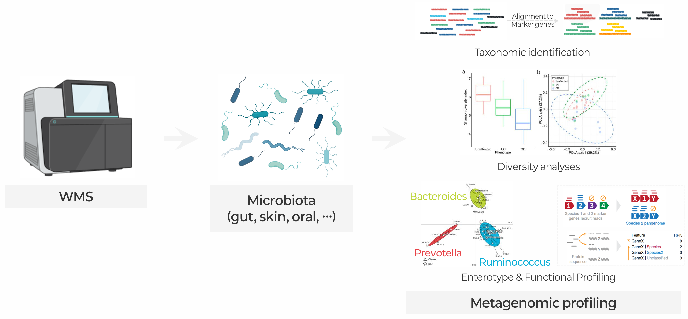

💡 각 절의 본문 = 꼭 알아야 할 기초. **🔍 더 알아보기**는 관심 있을 때 펼쳐 보는 심화 내용

------------------------------------------------------------------------

# 1. 인간 microbiome 🦠 {#w7-s1}

> 🔑 **핵심** — 신체 부위마다 별개의 생태계, 건강한 사람끼리도 차이가 매우 큼 → microbiome 차이는 찾기는 쉽고 해석은 어려움

## 1) 어디에 무엇이 사는가 {#w7-s1-1}

-   몸속 세균 세포 수 ≈ **사람 세포 수** — 그중 거의 전부가 대장에
-   **신체 부위끼리 비교 x** — 장, 구강, 피부, 질, 기도의 군집 = 사실상 서로 다른 생태계
-   ⚠️ **개인 간 변이가 매우 큼** → 질병 효과를 잡으려면 시료가 많아야 함. 그런데 출판된 연구는 대부분 소규모

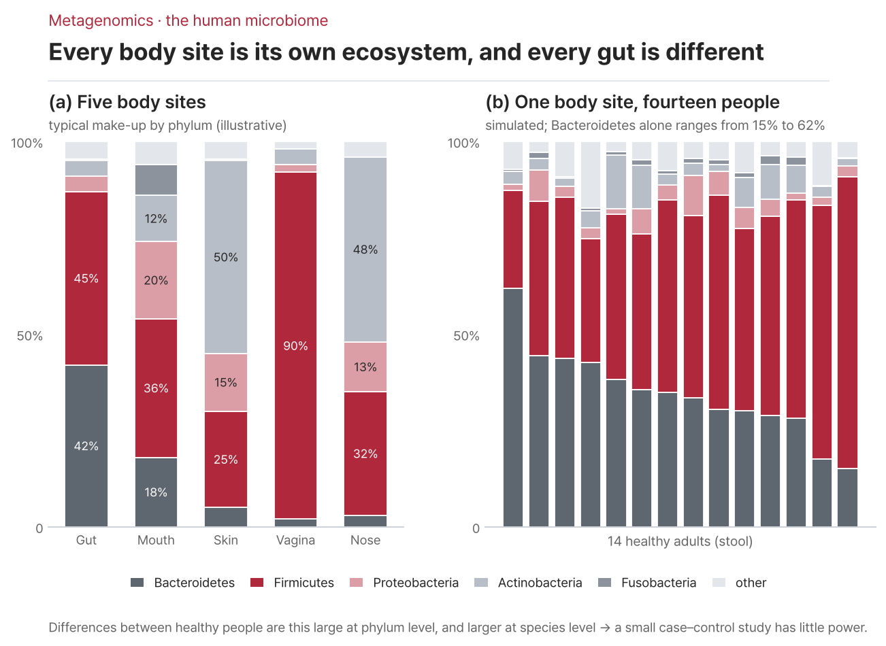{fig-align="center"}

::: {.callout-note collapse="true" icon=false}
## 🔍 더 알아보기 — 차이는 얼마나 큰가

-   과거에 널리 인용된 세균:사람 = 10:1은 과대추정. 현재 가장 좋은 추정치 ≈ 1:1
-   신체 부위 간 군집 차이 > **대부분의 질병–건강 상태 간 차이**
-   건강한 성인 두 명이 공유하는 장내 species가 **소수에 불과**할 수도
:::

## 2) 질병 연관성을 정직하게 보기 {#w7-s1-2}

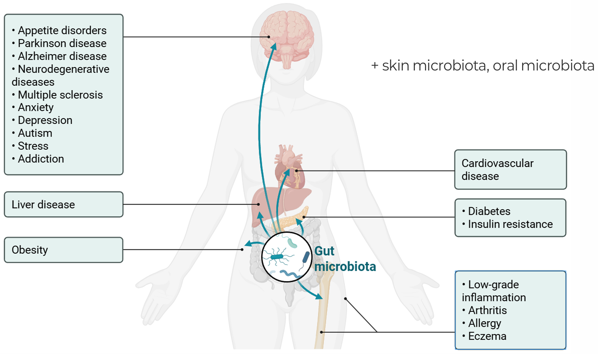

-   연구된 거의 모든 질병에서 microbiome 차이가 보고됨
-   ⚠️ 그러나 **근거의 강도는 천차만별** → 어느 단계인지 명확히

| 근거 수준 | 예시 |
|------------------------------------|------------------------------------|
| **인과성이 기전적으로 확립됨** | *C. difficile* 감염과 치료로서의 FMT, *H. pylori*와 위암 |
| **강한 근거 + 동물 model의 뒷받침** | 식이–microbiome–대사물질 축, 담즙산 대사, 일부 약물 대사(예: digoxin, irinotecan) |
| **재현되는 연관성, 인과성은 불명확** | IBD, 대장암, 제2형 당뇨병, 비만 |
| **널리 보고되지만 재현성 낮음** | 대부분의 신경정신·행동 관련 “장–뇌” 연관성 |

💡 Microbiome 논문을 읽을 때 → 다른 것을 평가하기 전에 먼저 **이 근거 사다리의 어디인지 판단**

::: {.callout-note collapse="true" icon=false}
## 🔍 더 알아보기 — 문헌 속 예시: FMT, 장내 미생물과 면역항암치료

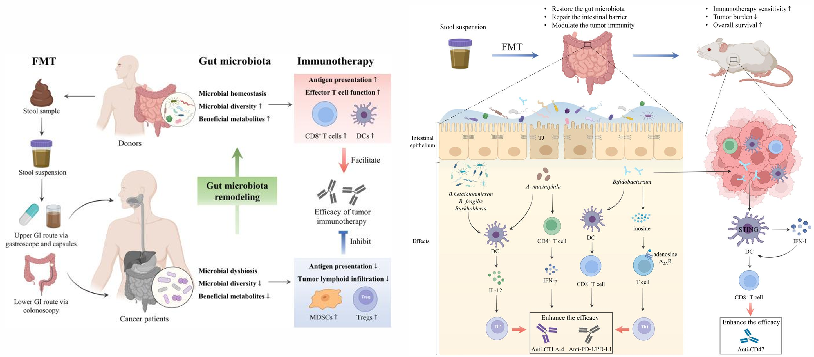{fig-align="center"}
:::

------------------------------------------------------------------------

# 2. Sequencing 기술과 연구 설계 🧬 {#w7-s2}

> 🔑 **핵심** — 16S = marker 유전자 하나만 읽음: 저렴, genus 수준까지. Shotgun = 모든 DNA를 읽음: species/strain 수준 + 유전자 기능, 대신 약 10배 비용. 어느 쪽이든 sequencing **이전**에 일어난 일 — 시료 처리, 추출, 약물, kit에서 온 DNA — 이 결과를 좌우

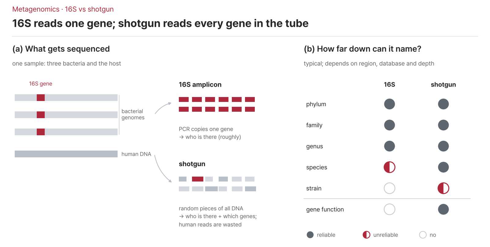{fig-align="center"}

## 1) 16S rRNA amplicon sequencing {#w7-s2-1}

-   16S rRNA 유전자 = 모든 세균과 고세균에 존재
-   **보존 영역**(universal primer가 결합)과 **가변 영역**(taxon마다 다름)이 번갈아 나타남
-   → 가변 영역 한두 개를 증폭 → sequencing → 분류

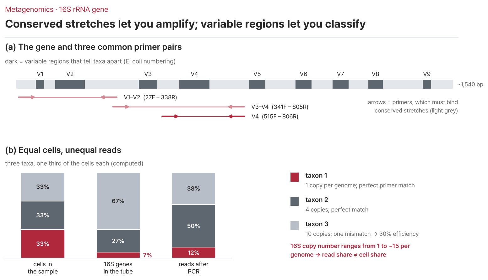{fig-align="center"}

### ① ⚠️ Primer와 copy-number 편향 {#w7-s2-1-1}

-   **가변 영역이 다르면**(V3–V4, V4, V1–V2) 결과도 다름 → 다른 영역을 쓴 연구끼리 **직접 비교 x**
-   **“Universal” primer도 실제로는 universal x** — 일부 taxon은 잘 증폭 안 되거나 전혀 안 됨
-   **16S copy number**가 genome당 1개~약 15개로 다양 → **read 비율 ≠ 세포 비율**

### ② 해상도의 한계 {#w7-s2-1-2}

-   16S는 보통 **genus** 수준까지
-   Species 수준 분류 → 신뢰 어려움. Strain 수준 → 불가능
-   ⚠️ 16S로 species 수준 결과 보고 = 과잉 주장. 이 차이는 중요: *E. coli* strain은 공생균부터 치명적인 병원균까지

## 2) Shotgun metagenomics {#w7-s2-2}

-   시료의 **모든** DNA를 sequencing
-   ✅ **누가** 있는지(species, 종종 strain 수준) + **무엇을 할 수 있는지**(유전자·pathway = 기능적 profiling, [§5.1](#w7-s5-1))
-   ⚠️ 약 10배 비쌈, 숙주 DNA가 방해 — 조직 biopsy는 read의 99% 이상이 사람 DNA일 수도

::: {.callout-note collapse="true" icon=false}
## 🔍 더 알아보기 — shotgun이 더해 주는 것과 비용

-   **분류학적 profiling** — MetaPhlAn, Kraken2/Bracken, StrainPhlAn
-   **기능적 profiling** (HUMAnN) — 💡 계통적으로 먼 생물도 같은 기능을 가진 경우가 많음 → **정체성보다 기능이 더 중요할 수도**
-   **비세균 구성원** — virus, fungus, plasmid
-   **MAG assembly** — 배양되지 않은 생물의 genome 복원
-   비용과 한계: ⚠️ 미생물 biomass가 높고 숙주 DNA가 적어야 함, ⚠️ 훨씬 많은 계산 필요
:::

## 3) 선택 기준 {#w7-s2-3}

| 연구 질문                                         | 사용할 방법 |
|---------------------------------------------------|-------------|
| 제한된 예산으로 수백 개 시료를 폭넓게 조사        | 16S         |
| PCR 증폭이 필요한 low-biomass 시료                | 16S         |
| Species 또는 strain 해상도                        | Shotgun     |
| 누가 있는지가 아니라 군집이 *무엇을 하는지*       | Shotgun     |
| Virus, fungus 또는 mobile element                 | Shotgun     |

## 4) 시료 처리와 DNA 추출 {#w7-s2-4}

-   채취, 보관, DNA 추출, primer 선택 → 모두 결과를 바꿈
-   ⚠️ **DNA 추출 = 가장 큰 단일 기술적 변이 원인** → 다른 kit를 쓰는 두 실험실 = 같은 대변에서도 서로 다른 군집 보고
-   ✅ 한 연구 *안에서* 비교 — 합리적 / ⚠️ 연구 *사이* 비교 — 매우 위험

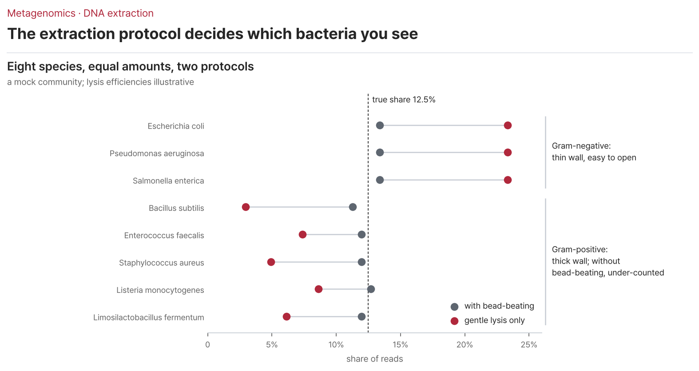{fig-align="center"}

::: {.callout-note collapse="true" icon=false}
## 🔍 더 알아보기 — 변이는 어디서 오나

-   **채취와 보관** — 실온 방치 시간에 따라 조성 변화. Freeze–thaw 횟수도 중요, 보존 buffer마다 효과가 다름
-   **추출이 특히 중요한 이유** — Gram-positive 세균은 세포벽이 단단함 → bead-beating protocol은 회수, 부드러운 protocol은 회수 x
-   **Primer 선택**([§2.1①](#w7-s2-1-1))과 sequencing platform
-   Meta-analysis에서는 연구를 batch 변수로 model해야 함
:::

## 5) ⚠️ 교란요인 {#w7-s2-5}

-   **식이** — 장내 조성을 결정하는 가장 큰 환경 요인. 그런데 제대로 측정되는 경우가 거의 없음
-   **약물** — proton pump inhibitor, metformin, 항생제, 완하제 → 모두 잘 알려진 큰 microbiome 효과
-   ⚠️ 환자군은 거의 항상 대조군과 복용 약물이 다름 → "질병 signature"가 실은 약물 signature일 수도 (아래 metformin)

::: {.callout-warning collapse="true"}
## Metformin이 주는 교훈

-   초기 연구 → 제2형 당뇨병의 뚜렷한 장내 microbiome signature 보고
-   그 signature의 상당 부분 = 당뇨병이 아니라 **metformin의 효과**로 밝혀짐
-   치료받지 않은 환자를 따로 분석 → 결과가 크게 달라짐

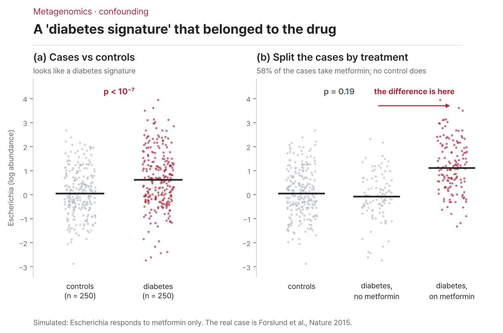{fig-align="center"}

**모든 case–control microbiome 연구에 던질 질문: 환자군이 다른 약물을 복용했나?**

→ 거의 항상 그러함
:::

::: {.callout-note collapse="true" icon=false}
## 🔍 더 알아보기 — 함께 수집·보정할 공변량

나이 · 성별 · BMI · 배변 빈도와 대변 굳기(Bristol scale — 의외로 강한 공변량) · 장 통과 시간 · 지역
:::

**직접 해 보기** — [교란변수와 배치효과 ↗](https://kkonoo.github.io/edu_sims/sims/confounding/?lang=ko){target="_blank"}

::: {.column-page}
```{=html}
<iframe src="https://kkonoo.github.io/edu_sims/sims/confounding/?embed=1&lang=ko" title="교란변수와 배치효과" loading="lazy"
        style="width: 100%; height: 1300px; border: 0;"></iframe>
```
:::

## 6) ⚠️ Low biomass와 kit-ome {#w7-s2-6}

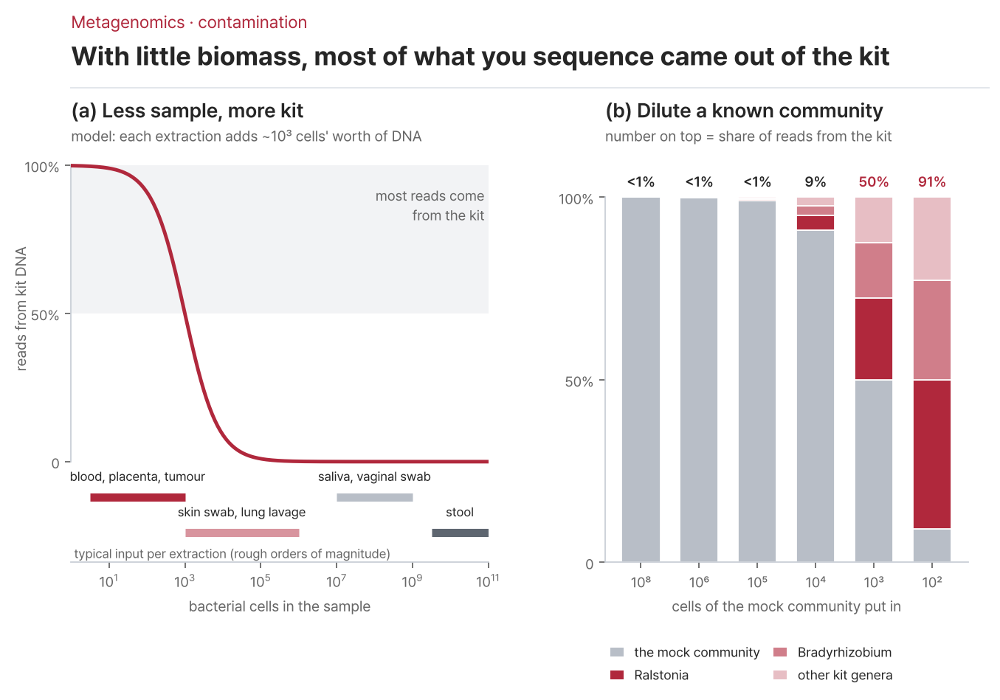{fig-align="center"}

-   추출 kit와 PCR reagent 자체에 세균 DNA가 들어 있음 (= **kit-ome**)
-   **대변** → 무시할 만함
-   **혈액, 조직 biopsy, 태반**(low biomass) → 시료 속 세균 세포가 **kit 안의 세균 DNA보다 적을 수도** → **sequencing한 것의 대부분이 kit에서 나옴**

⚠️ 건강한 태반 microbiome, 일부 종양 microbiome 결과 등 주목받았던 여러 low-biomass 결과 → 이후 대부분 오염으로 설명됨

::: {.callout-important collapse="true"}
## 신뢰할 수 있는 low-biomass 연구의 조건

-   ✅ 모든 batch에서 **extraction blank와 no-template control**을 sequencing
-   ✅ 이를 실제로 **사용** — `decontam` 등은 (i) blank에서의 출현 빈도, (ii) DNA 농도와의 역상관으로 오염물 식별 ([§3.4](#w7-s3-4))
-   ✅ **DNA 농도**를 공변량으로 기록
-   ✅ 오염 제거 **전후 결과를 모두** 보고

⚠️ Negative control 언급이 없는 low-biomass 논문 → 가장 먼저 짚을 점
:::

------------------------------------------------------------------------

# 3. Pre-processing: read에서 feature table까지 🔢 {#w7-s3}

> 🔑 **핵심** — Read를 **feature table**(taxon 또는 pathway × 시료)로 바꾸는 과정: read를 denoising하거나 profiling → database로 이름 붙이기 → 오염물 제거 → 시료마다 다른 깊이 처리. 그리고 단계마다 무엇이 남았는지 확인

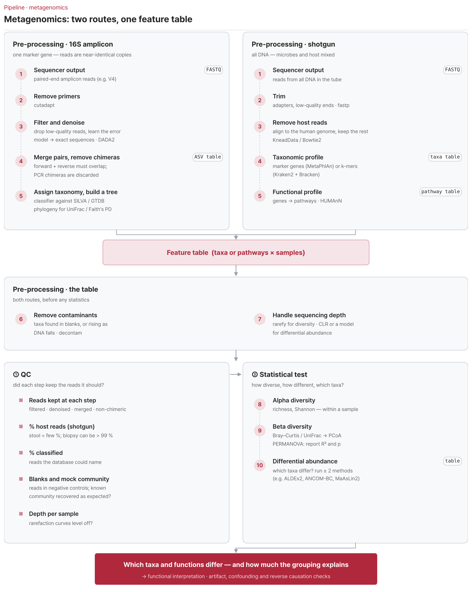{fig-align="center"}

## 1) QC {#w7-s3-1}

단계마다 확인할 지표가 따로 있음:

-   **Raw read** — base quality, 남아 있는 primer·adapter (FastQC, MultiQC)
-   **Denoising과 merging (16S)** — filtering, denoising, 양 끝 read 합치기(merging), chimera 제거 후 남은 read 비율. ⚠️ 한 단계에서 read 대부분을 잃은 시료 → 다음으로 넘어가기 전에 원인부터 확인
-   **숙주 read 제거 (shotgun)** — 사람 read의 비율. 대변: 몇 %. 조직 biopsy: 흔히 99% 이상 → 남는 미생물 자료가 적음
-   **분류** — database가 이름을 붙인 read의 비율 ([§3.3](#w7-s3-3))
-   **Negative control과 mock community** — extraction blank 속 read 수. **Mock community**(구성을 알고 있는 strain 혼합물)가 예상한 비율대로 나오는지
-   **깊이** — 시료당 read 수. Rarefaction curve가 평평해지나? ([§3.5](#w7-s3-5))

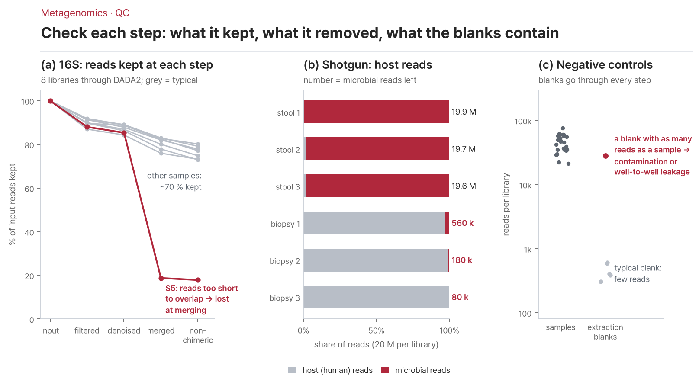{fig-align="center"}

::: {.callout-note collapse="true" icon=false}
## 🔍 더 알아보기 — QC 지표 자세히

| 단계 | 지표 | 경고 신호 |
|------------------------|------------------------|------------------------|
| **Raw read** | Base quality, primer·adapter 함량 | 초반부터 quality 하락, primer가 남아 있음 |
| **Denoising (16S)** | Filter / denoise / merge 후 남은 read | 한 시료만 다른 시료보다 훨씬 많이 잃음 |
| **Chimera 제거 (16S)** | Chimera로 판정된 read 비율 | 비율이 높음 → PCR cycle이 너무 많음 |
| **숙주 read 제거 (shotgun)** | 숙주 read 비율 | 90% 이상 → 질문에 답하기에 미생물 read가 부족 |
| **분류** | 분류된 read 비율 | 다른 시료보다 훨씬 낮음 → 오염, 잘못된 database |
| **Negative control** | Blank 속 read와 taxon | Blank의 read 수가 시료에 가까움 |
| **Mock community** | 관찰된 조성 vs 예상 조성 | 빠진 taxon, 왜곡된 비율 → 추출 또는 PCR 편향 |
| **깊이** | 시료당 read 수, rarefaction curve | 다른 시료보다 read가 훨씬 적음, curve가 여전히 가파르게 상승 |

-   절대적인 기준값보다 **같은 run의 다른 시료와 비교**하는 것이 더 중요
-   도구: FastQC, MultiQC, DADA2의 read 추적 표, KneadData log, QIIME 2 요약
:::

## 2) Denoising: OTU vs ASV {#w7-s3-2}

-   Sequencing 오류 때문에 실제 16S 서열 하나가 조금씩 다른 여러 서열처럼 보임 → 묶거나 교정해야 함
-   **OTU** — 97% 유사도로 read를 묶은 cluster
-   **ASV** — 정확한 서열 단위(DADA2, Deblur) → 현재 표준
-   ✅ ASV = 한 dataset에서 정의한 cluster가 아니라 서열 자체 → **연구 사이 비교 가능**

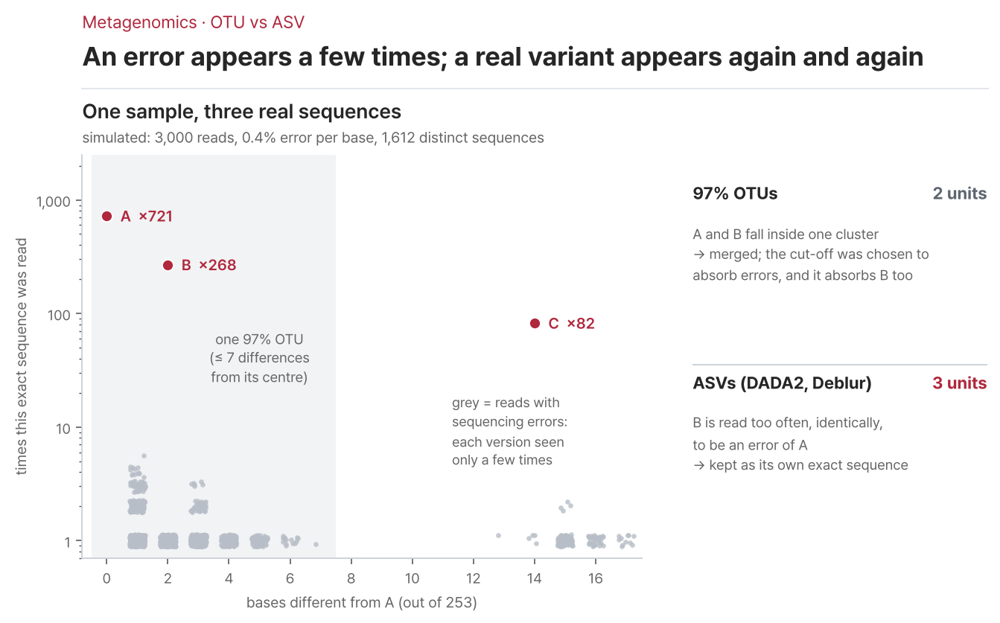{fig-align="center"}

::: {.callout-note collapse="true" icon=false}
## 🔍 더 알아보기 — sequencing error를 다루는 방식

-   **OTU** — 97% threshold = sequencing error를 흡수하려고 고른 값
-   **ASV** (amplicon sequence variant) — 오류 과정을 model해 **정확한 서열**을 구분
:::

## 3) 분류와 참조 database {#w7-s3-3}

-   각 ASV나 read를 참조 database와 비교해 이름을 붙임 → 16S: SILVA나 GTDB에 대한 classifier, shotgun: marker 유전자(MetaPhlAn) 또는 k-mer(Kraken2)
-   ⚠️ Database에 비슷한 것이 있어야 read에 이름을 붙일 수 있음 → 결과는 **어떤 database, 어떤 version**을 썼는지에 좌우됨
-   🗺️ 다시 등장한 **참조 편향**(🔗 [W1 §2.3③](w1_intro.qmd#w1-s2-3-3)) — 일반적인 장 metagenome에서도 많은 read를 신뢰성 있게 분류 x → **microbial dark matter**
-   비서구권 집단은 참조 collection에 충분히 포함되지 않음 → 그들의 microbiome은 더 부정확하게 특성화
-   ⚠️ Taxonomy는 활발히 개정 중 → **같은 생물이 두 논문에서 서로 다른 이름일 수도**
-   → 연구끼리 비교할 때: database와 version 확인. Genus 이름도 바뀜

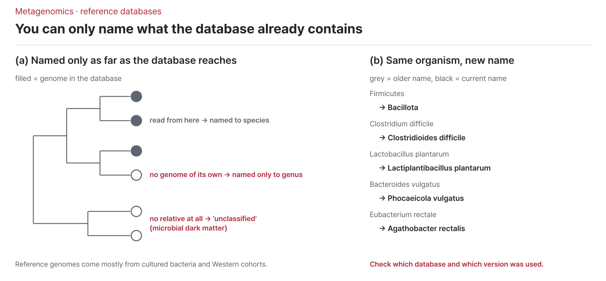{fig-align="center"}

::: {.callout-note collapse="true" icon=false}
## 🔍 더 알아보기 — 주요 참조 database

| Database | 용도 |
|------------------------------------|------------------------------------|
| **SILVA**, **Greengenes2** | 16S taxonomy 배정 |
| **GTDB** | Genome 기반 taxonomy. 점점 표준이 되고 있으며 명칭이 과거 체계와 다름 |
| **Kraken2 / Bracken** database | Shotgun read 분류. 어떤 database를 구축했는지에 따라 결과가 크게 달라짐 |
| **UHGG**, gene catalogue | 배양되지 않은 장내 생물의 참조 genome과 유전자 |
:::

## 4) 오염물 제거 {#w7-s3-4}

-   Low-biomass 시료에는 kit에서 온 DNA가 섞여 있음([§2.6](#w7-s2-6)) → 분석 전에 table에서 제거
-   `decontam`이 찾는 kit DNA의 두 가지 흔적:
    -   **빈도** — 모든 추출에 같은 소량이 더해짐 → 시료 자체의 DNA가 적을수록 비율이 커짐
    -   **출현율** — blank에서는 흔하고 시료에서는 드묾
-   ✅ 오염 제거 **전후 결과를 모두** 보고

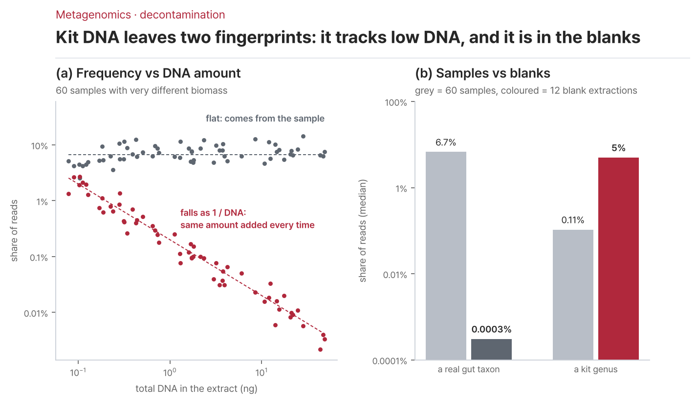{fig-align="center"}

## 5) Sequencing 깊이와 rarefaction {#w7-s3-5}

-   시료마다 sequencing 깊이가 다르고, richness는 깊이에 따라 증가 → 어떤 식으로든 처리 필요
-   **Rarefaction** = 모든 시료를 같은 깊이로 subsampling — 과거의 표준, 지금은 논쟁 중
-   ⚠️ 대가: 기준선 위의 read는 버리고, 기준선 아래의 시료는 탈락
-   ✅ **방어 가능한 입장** — 명시적으로 처리하고, 무엇을 했는지 밝히고, 다른 방법에서도 결론이 유지되는지 확인
-   💡 Rarefaction은 diversity용. Differential abundance에는 대신 CLR이나 model을 사용 ([§4.4](#w7-s4-4), [§4.5](#w7-s4-5))

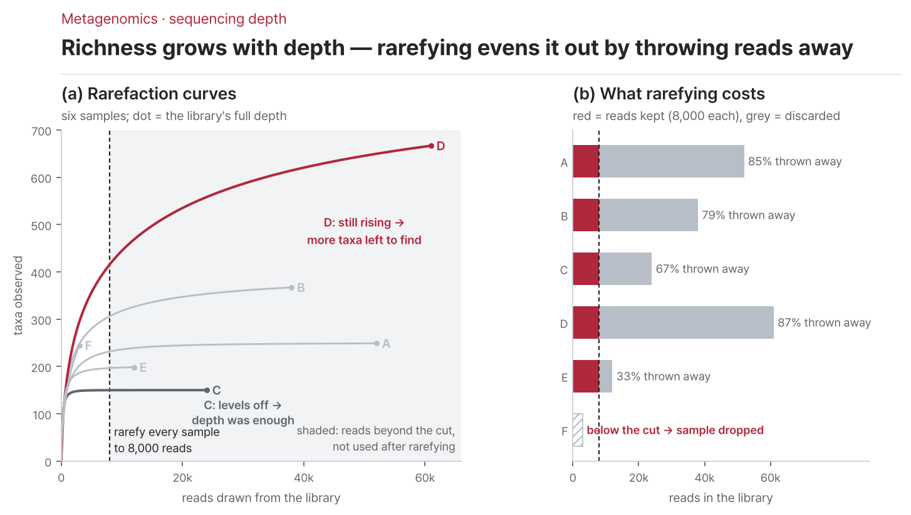{fig-align="center"}

::: {.callout-note collapse="true" icon=false}
## 🔍 더 알아보기 — 논쟁의 흐름

```
Rarefaction (모든 시료를 같은 깊이로 subsampling)
   → 과거의 표준
   → 자료를 버리므로 통계적으로 낭비라는 비판("waste not, want not")
   → 대신 model 기반 정규화가 제안됨
   → 최근 연구에서는 diversity와 ordination 분석에서
      rarefaction이 실제로 견고하다고 다시 주장
   → 아직 결론이 나지 않음
```
:::

------------------------------------------------------------------------

# 4. 통계 분석 📊 {#w7-s4}

> 🔑 **핵심** — Diversity = 군집 전체를 요약(한 시료 안: alpha, 시료 사이: beta), differential abundance = taxon 하나하나를 검정. 둘 다 밑바탕에 같은 사실: sequencing은 양이 아니라 **비율**을 측정

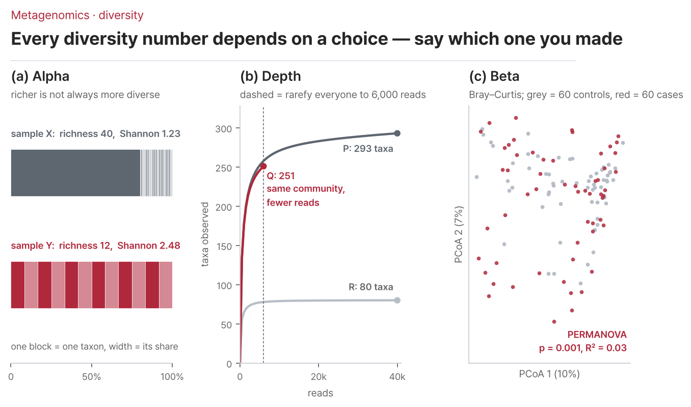{fig-align="center"}

## 1) Alpha diversity {#w7-s4-1}

-   **한 시료** 안이 얼마나 다양한가
-   **Richness** — taxon이 몇 개인가. ⚠️ Sequencing 깊이에 크게 좌우 ([§3.5](#w7-s3-5))
-   **Evenness** — taxon이 얼마나 고르게 분포하나. **Shannon, Simpson** = richness와 evenness를 함께 반영
-   💡 최소한 **richness** 계열 하나 + **evenness** 계열 하나를 함께 보고 — 둘이 엇갈릴 수 있고, 그 차이 자체가 정보

::: {.callout-note collapse="true" icon=false}
## 🔍 더 알아보기 — 지표별 차이

-   Richness가 같은 두 시료도 Shannon 값은 매우 다를 수 있음
-   **Faith's PD** — 계통발생 거리를 가중한 richness
:::

## 2) Beta diversity와 PERMANOVA {#w7-s4-2}

-   **시료끼리** 얼마나 다른가 — 시료 쌍마다 비유사도 계산. 기본값은 **Bray–Curtis**(존재량을 가중한 비유사도)
-   **PCoA**(그 거리를 펼친 지도)로 시각화, **PERMANOVA**로 검정
-   ⚠️ p만이 아니라 **R²**(집단 구분이 설명하는 변이의 비율)도 보고

::: {.callout-note collapse="true" icon=false}
## 🔍 더 알아보기 — 다른 거리 지표

-   **Jaccard** — 존재 여부만 사용
-   **UniFrac**(weighted / unweighted) — 계통발생 관계 포함
:::

::: {.callout-warning collapse="true"}
## p뿐 아니라 R²도 보고

-   수백 개 시료에 PERMANOVA → **거의 모든 것**을 탐지
-   **p** = 집단이 다르다는 것
-   **R²** = 집단 구분이 **전체 변이의 얼마를 설명하는지** — microbiome 연구에서 보통 **1–8%**

→ “군집 조성이 유의하게 다름(p = 0.001)”인데 R² = 0.02 → 질병이 설명하는 변이 = **2%**, 나머지 98%는 다른 요인

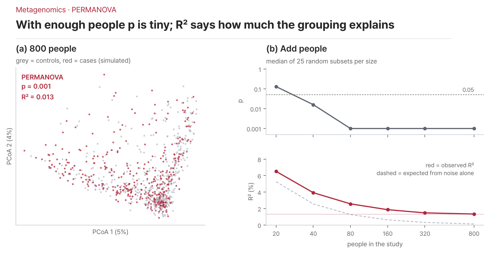{fig-align="center"}

**두 수치 모두 초록에 포함할 것**
:::

## 3) ⚠️ 조성 자료 {#w7-s4-3}

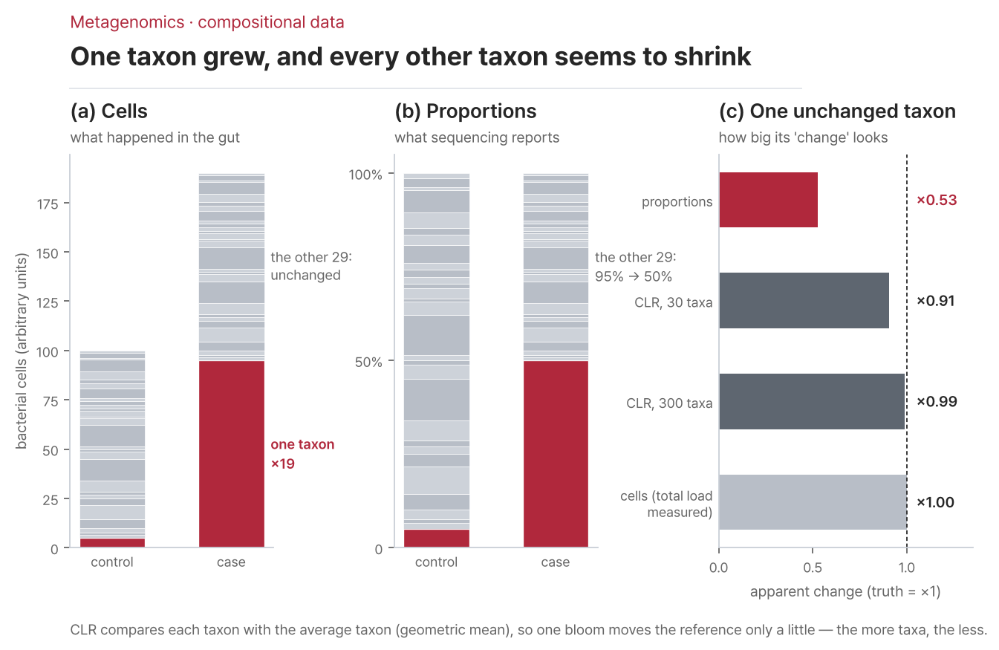{fig-align="center"}

-   전체 read 수 = 시료 속 세균 수가 아니라 구매한 sequencing 양으로 고정
-   한 taxon 증가 → 산술적으로 **다른 모든 taxon의 비율 감소** → 실제 생물학적 변화가 전혀 없어도
-   🔗 같은 문제를 세 번째로 만남: RNA-seq 조성 효과([W4 §3.3②](w4_transcriptomics.qmd#w4-s3-3-2)), 단일세포 differential abundance([W5 §6.3](w5_singlecell.qmd#w5-s6-3)), 그리고 여기
-   ⚠️ Microbiome 자료 = 변화가 크고 taxon 수가 적어 가장 극단적인 사례

::: {.callout-tip collapse="true"}
## 문제를 실제로 해결하는 방법

비율만 측정했기 때문에 생기는 것이 조성 문제

**정량적 microbiome profiling** → 절대 존재량 복원:

-   양을 알고 있는 표준물질을 spike-in, **또는**
-   flow cytometry·qPCR로 전체 미생물 load 측정

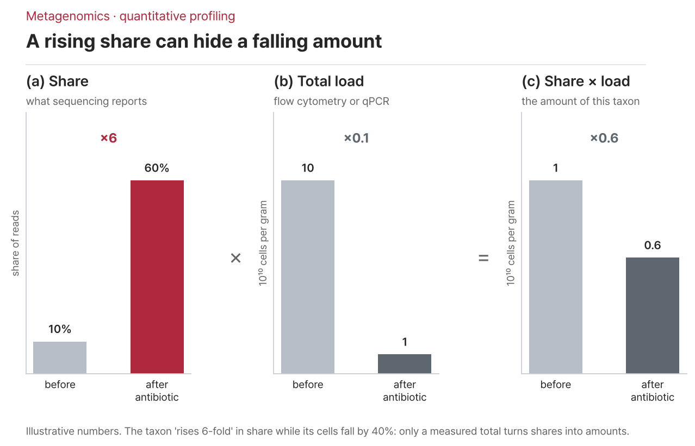{fig-align="center"}

→ 문제 자체가 완전히 사라짐. 아직 일상적이지 않음 — 더 널리 쓰여야 함
:::

## 4) CLR 변환 {#w7-s4-4}

-   절대량 측정이 없다면 → 비율(proportion) 대신 taxon 사이의 **비**(ratio)를 사용
-   **CLR(centered log-ratio)** — 각 taxon을 그 시료 전체 taxon의 기하평균으로 나눈 뒤 log
-   ✅ 한 시료 안의 taxon 간 ratio는 전체값의 영향 x → CLR은 고정합에 좌우되지 않음
-   ⚠️ 다만 각 taxon을 그 시료의 '평균 taxon'과 비교 → 큰 bloom이 있으면 나머지 값도 조금씩 움직임 ([§4.3](#w7-s4-3) 그림 오른쪽)

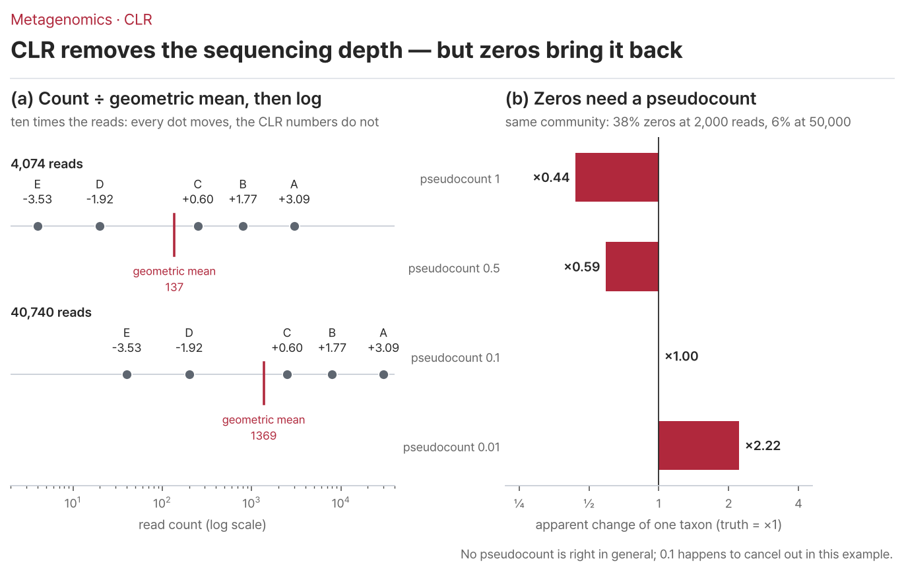{fig-align="center"}

::: {.callout-note collapse="true" icon=false}
## 🔍 더 알아보기 — 0의 문제

-   ⚠️ CLR은 0에서 정의되지 않음 → pseudocount를 더해야 함. 그런데 microbiome matrix는 극도로 sparse
:::

## 5) ⚠️ Differential abundance {#w7-s4-5}

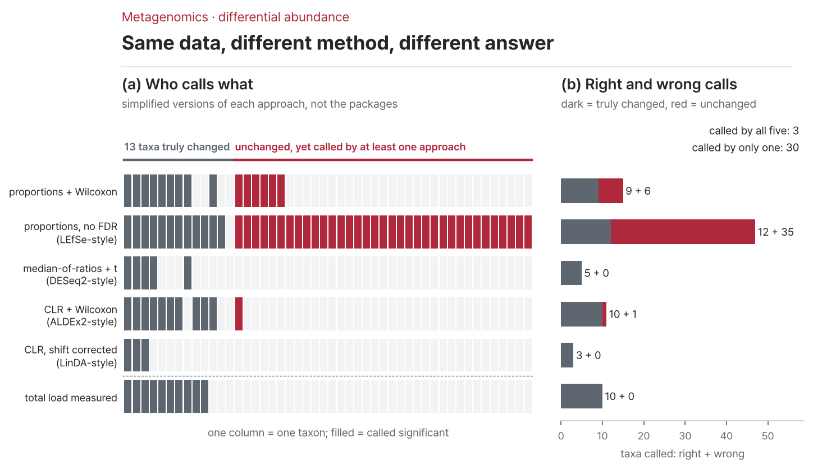{fig-align="center"}

-   Differential abundance = 집단 사이에 차이 나는 taxon을 찾는 검정
-   ⚠️ 같은 자료에서도 방법에 따라 **결과가 크게 다름**
-   ✅ 서로 다른 가정의 방법을 **최소 두 개** 사용 → 공통으로 나온 결과를 신뢰

::: {.callout-warning collapse="true"}
## 잘 알려져 있지만 해결되지 않은 문제

수십 개 실제 dataset을 이용한 대규모 benchmark 결과:

-   같은 자료에서도 방법에 따라 **결과가 크게 달라짐**
-   널리 쓰이는 일부 방법, 특히 **LEfSe와 edgeR** → 다른 방법보다 훨씬 많은 taxon을 유의하다고 판정
-   → 전반적 일치도 낮음

**정직하게 보고하는 법:**

-   ✅ 서로 다른 가정을 가진 방법 **최소 두 개** 사용
-   ✅ **교집합** = 신뢰도 높은 집합, **합집합** = 탐색적 집합으로 보고
-   ✅ 한 방법에서만 나온 taxon = **확인되지 않은 결과**로 취급
-   ✅ 핵심 결과를 어느 방법에서 얻었는지 밝히고, 그 방법만 그 결과를 내는 게 아님을 보여줄 것
:::

::: {.callout-note collapse="true" icon=false}
## 🔍 더 알아보기 — 방법마다 결과가 다른 이유

정규화, 조성 자료의 model 여부, 0 처리, 보수성의 차이:

| 방법 | 접근법 |
|------------------------------------|------------------------------------|
| **ALDEx2** | CLR + Dirichlet posterior의 Monte Carlo sampling. 보수적 |
| **ANCOM-BC** | 시료별 sampling-fraction bias를 추정하고 보정 |
| **LinDA** | Bias correction과 함께 CLR 자료에 선형모형 적용. 빠르고 복잡한 설계 처리 가능 |
| **MaAsLin2** | 유연한 일반 선형모형과 여러 정규화 선택지 |
| **DESeq2 / edgeR** | RNA-seq에서 가져온 방법. ⚠️ 대부분의 feature가 변하지 않는다는 정규화 가정이 여기서는 자주 틀림 |
| **LEfSe** | 널리 사용됨. ⚠️ Liberal한 결과를 내는 것으로 알려짐 |
:::

🔗 [W4 §4.3](w4_transcriptomics.qmd#w4-s4-3)과 같은 교훈 — **사용한 도구에 따라 결론이 달라진다면 아직 결론이 없는 것.** 여기서는 그 문제가 훨씬 더 심각

------------------------------------------------------------------------

# 5. Downstream analysis: taxon에서 생물학적 의미로 🧠 {#w7-s5}

> 🔑 **핵심** — Taxon 목록이 생물학이 되려면 두 가지를 더 물어야 함: 이 생물들이 **무엇을 하나**(기능), 그리고 그 차이가 **원인**인가 다른 것인가(인과성)

## 1) 기능적 profiling {#w7-s5-1}

-   Shotgun read를 유전자에 대응 → 유전자를 pathway로 합산(HUMAnN) → **pathway × 시료** table을 taxon table처럼 분석
-   💡 **기능적 중복성(functional redundancy)** — 계통적으로 먼 생물도 같은 기능을 가진 경우가 많음 → 공유하는 taxon이 거의 없는 두 사람도 pathway profile은 거의 같을 수 있음
-   → 기전을 볼 때는 *누가 있는지*보다 *군집이 무엇을 할 수 있는지*가 더 중요할 수도
-   ⚠️ 유전자가 있음 ≠ 유전자를 사용함 → 발현은 metatranscriptomics, 산물은 metabolomics로 ([§6](#w7-s6))
-   16S는 유전자를 읽지 않음 → 기능은 taxon에서 *예측*만 가능(예: PICRUSt2) → 가설로 취급

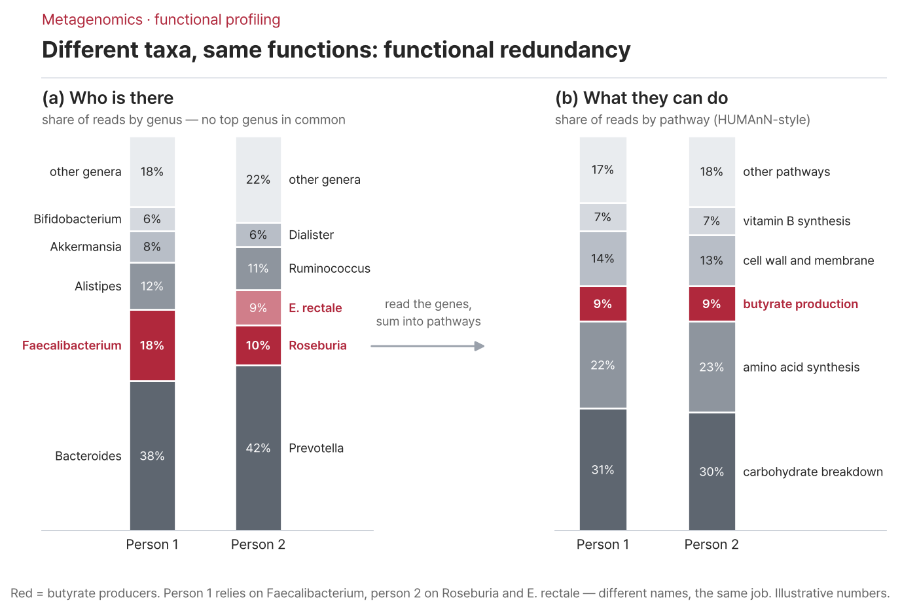{fig-align="center"}

::: {.callout-note collapse="true" icon=false}
## 🔍 더 알아보기 — pathway table 너머

-   **MAG**(metagenome-assembled genome) — read를 assembly하고 조각을 genome 단위로 묶음 → 한 번도 배양되지 않은 생물과 그 생물이 가진 유전자
-   **Strain 추적**(예: StrainPhlAn) — 한 strain이 사람 사이를 오가는 경로를 추적: 어머니에서 아기로, FMT 후 공여자에서 수혜자로
:::

## 2) 연관성에서 인과성으로 {#w7-s5-2}

-   Microbiome 차이를 원인이라 부르기 전에 **artifact → 교란 → 역인과성**을 순서대로 배제
-   출발 질문으로 돌아가기: 환자군에서 *Faecalibacterium*이 적음 → 다음 가능성을 **순서대로** 검토

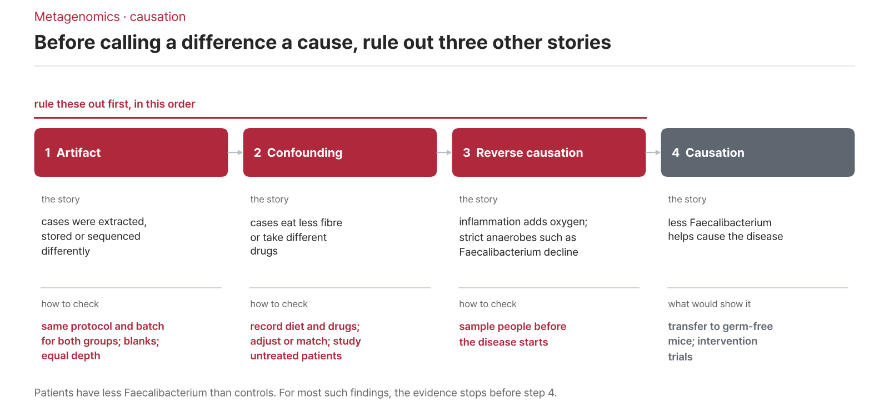{fig-align="center"}

### ① Artifact {#w7-s5-2-1}

-   서로 다른 추출 batch, 채취 protocol, sequencing run; 오염; 불균등한 깊이
-   → [§2](#w7-s2)와 [§3](#w7-s3)에서 다룬 내용. **가장 먼저** 배제

### ② 교란 {#w7-s5-2-2}

-   환자군과 대조군은 질병 외에도 여러 면에서 다름: 식이 · 약물 · BMI · 장 통과 시간 · 나이 · 지역
-   → Microbiome은 그 대부분에 반응 ([§2.5](#w7-s2-5))

### ③ 역인과성 {#w7-s5-2-3}

-   질병 자체가 장내 환경을 바꿈
-   ⚠️ **질병과 연관된 microbiome = 원인만큼이나 결과일 가능성도 높음** — 단면 연구로는 둘을 구분 불가

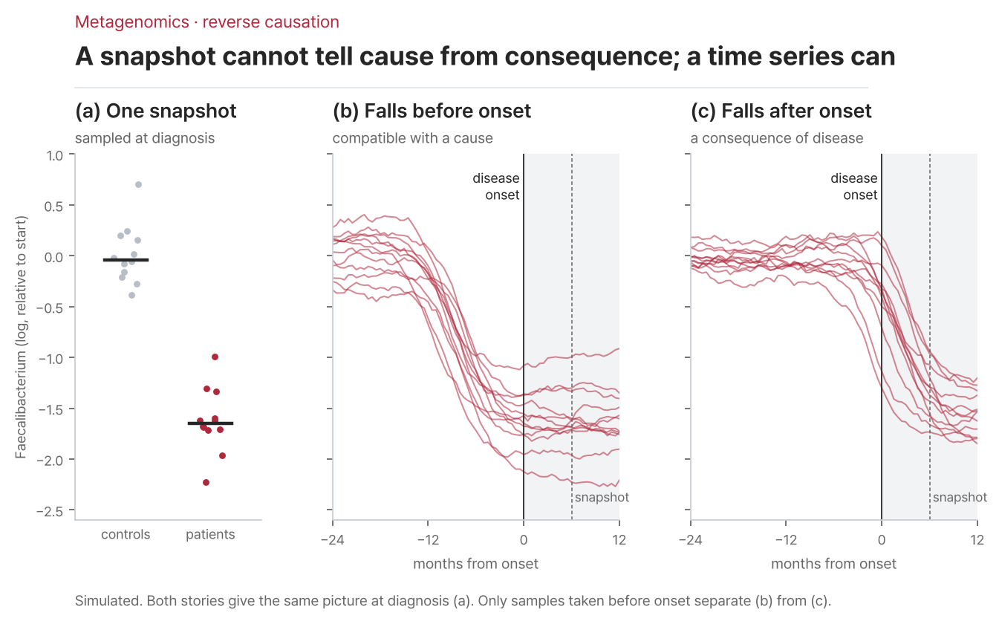{fig-align="center"}

::: {.callout-note collapse="true" icon=false}
## 🔍 더 알아보기 — 질병이 장내 환경을 바꾸는 예

-   염증 → 산소 장력 변화 → Enterobacteriaceae 같은 facultative anaerobe에 유리
-   설사 → 장 통과 시간 단축
-   식욕 감소 → 이용 가능한 기질 변화
:::

### ④ 인과성 {#w7-s5-2-4}

인과성을 실제로 확립하는 방법:

-   **종단적 sampling** — 질병 발생 *전에* microbiome이 변하나?
-   **Gnotobiotic transfer** — germ-free mouse에 환자 microbiota 이식 → 표현형도 전달되나?
-   **중재** — FMT, 정의된 consortium, 표적 항생제. ✅ 재발성 *C. difficile*에 대한 FMT = 명확한 성공 사례

::: {.callout-note collapse="true" icon=false}
## 🔍 더 알아보기 — 각 방법의 한계, Mendelian randomization

-   **Gnotobiotic transfer** — 강한 근거. ⚠️ 단, 마우스와 사람의 장 환경이 크게 다름
-   **중재** — ⚠️ *C. difficile* 외 적응증의 결과는 훨씬 더 혼재
-   **Mendelian randomization** — 미생물 존재량과 연관된 사람 유전 변이를 instrument로 사용. ⚠️ 원리상 매력적이지만 microbiome에 대한 숙주 유전 효과가 약함 → instrument가 적고 약함 (🔗 [W2 §6.2](w2_genomics.qmd#w2-s6-2))
:::

::: {.callout-important collapse="true"}
## 정직한 기본 결론

현재 문헌의 microbiome–질병 연관성 대부분 → **인과관계의 방향을 알 수 없음**

→ 연관성을 기술한 뒤 인과성이 확립된 것처럼 기전을 논의하는 논문 → 알아차려야 할 신호
:::

------------------------------------------------------------------------

# 6. 세균을 넘어, DNA를 넘어 🔭 {#w7-s6}

> 🔑 **핵심** — 세균 DNA는 그림의 일부일 뿐: virus·fungus도 함께 살고, 기전을 볼 때는 실제로 *발현되는* 유전자와 숙주에 *도달하는* 분자가 더 유용한 경우가 많음

-   **Virome** — 대부분 bacteriophage. 참조 database가 너무 불완전해 상당 부분 분류 x
-   **Mycobiome** — fungus. 세균보다 biomass가 낮고 오염되기 쉬움
-   **Metatranscriptomics** — 단지 존재하는 유전자가 아니라 *발현되는* 유전자 (🔗 [W4 §1.1](w4_transcriptomics.qmd#w4-s1-1))
-   **Metabolomics** — microbiome이 숙주에 실제로 영향을 전달하는 소분자 측정 → 기전 이해에 더 유용한 층인 경우가 많음

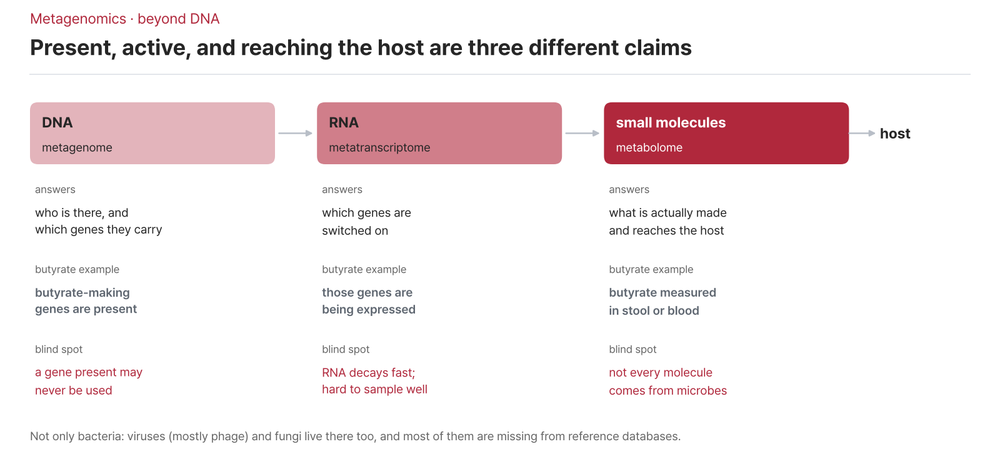{fig-align="center"}

::: {.callout-note collapse="true" icon=false}
## 🔍 더 알아보기 — 층별 세부 내용

-   💡 **crAssphage** — 사람 장에서 가장 풍부한 virus 중 하나. 배양되기 수년 전에 **자료에서 계산적으로** 발견됨
-   **Mycobiome** — 방법론적으로도 어려움
-   ⚠️ Metagenome에서 유전자 발견 ≠ 활성 — W4 §1과 정확히 같은 문제
-   **Metabolomics** 대상 예: short-chain fatty acid, secondary bile acid, tryptophan 유도체, TMAO
:::

------------------------------------------------------------------------

# 7. 🎓 모든 omics 논문을 비판적으로 읽기 {#w7-s7}

> 🔑 **핵심** — Assay가 무엇이든 같은 질문을 던질 것. 아래 체크리스트 = 이 수업 전체의 정리

이 장의 모든 내용은 다른 분야에도 일반화됨 → 여기서 수업을 마무리

::: {.callout-note}
## 체크리스트

**연구 설계**

-   정확히 무엇을 비교? **반복의 단위**는? ([W1 §5.3](w1_intro.qmd#w1-s5-3), [W5 §6.2](w5_singlecell.qmd#w5-s6-2))
-   생물학적 반복은 몇 개? 충분해 보이나? ([W4 §4.3④](w4_transcriptomics.qmd#w4-s4-3-4))
-   **Batch와 조건이 교락**되어 있나? 무작위화 설명은? ([W1 §4.3](w1_intro.qmd#w1-s4-3))
-   어떤 공변량을 수집? 명백한데 수집하지 **않은** 변수는? ([W3 §5.3](w3_epigenomics.qmd#w3-s5-3), [W7 §2.5](#w7-s2-5))

**측정**

-   이 assay가 실제로 측정하는 것은? **볼 수 없는** 것은? ([W2 §1.1](w2_genomics.qmd#w2-s1-1), [W6 §1](w6_proteomics.qmd#w6-s1))
-   어떤 참조, 어떤 annotation, **어떤 version**? ([W1 §2.3](w1_intro.qmd#w1-s2-3), [W7 §3.3](#w7-s3-3))
-   QC 수치는? 제시되어 있나? ([W3 §3.2①](w3_epigenomics.qmd#w3-s3-2-1), [W5 §3.3](w5_singlecell.qmd#w5-s3-3), [W7 §3.1](#w7-s3-1))

**분석**

-   정규화 방법은? 그 방법의 **가정이 성립**하나? ([W4 §3.3](w4_transcriptomics.qmd#w4-s3-3), [W7 §4.3](#w7-s4-3))
-   다중검정 보정 방법과 threshold는? ([W1 §4.2](w1_intro.qmd#w1-s4-2))
-   합리적인 **다른 도구**로도 같은 답이 나오나? ([W4 §4.3](w4_transcriptomics.qmd#w4-s4-3), [W7 §4.5](#w7-s4-5))
-   결측값·0 처리 방법은? ([W5 §3.2](w5_singlecell.qmd#w5-s3-2), [W6 §3.6](w6_proteomics.qmd#w6-s3-6))

**해석**

-   p-value와 함께 **효과 크기**도 보고? ([W1 §4.1](w1_intro.qmd#w1-s4-1))
-   결론이 연구 설계로 뒷받침할 수 없는 **인과성**을 요구하나? ([W2 §6.2](w2_genomics.qmd#w2-s6-2), [W7 §5.2](#w7-s5-2))
-   다른 cohort·assay로 독립 검증?
-   자료와 코드 공개? ([W1 §5.2](w1_intro.qmd#w1-s5-2))
:::

자기 분야 논문에 이 목록을 하나씩 적용할 수 있다면 → 이 수업의 목적 달성

-   **다음 학기 실습 수업** — 분석을 직접 수행하는 법
-   **이 수업** — 무엇을 수행하는지, 그리고 왜 틀릴 수 있는지 아는 것

------------------------------------------------------------------------

# 📝 요약

-   신체 부위 = 별개의 생태계, 건강한 사람 사이 변이도 매우 큼 → 작은 연구는 검정력 부족
-   16S = 저렴, genus 수준까지. Shotgun = species/strain 수준 + 유전자 기능, 약 10배 비용
-   ⚠️ **추출 protocol** = 가장 큰 기술적 변수, **식이·약물** = 가장 큰 생물학적 교란요인. Metformin = 대표적 경고 사례
-   ⚠️ Low-biomass 시료 → reagent kit가 DNA의 대부분을 제공할 수도. **Negative control 필수**
-   Pre-processing = read를 feature table로 바꾸는 과정 → 단계마다 무엇이 남았는지 확인. ASV가 OTU를 대체, 이름은 database와 version에 좌우
-   Rarefaction = read를 버려 깊이를 맞추는 방법 → 결론 x, 방법을 명확히
-   Richness 지표와 evenness 지표 모두 보고. ⚠️ PERMANOVA는 p와 함께 **R²**도 보고
-   ⚠️ Sequencing = **비율** 측정. CLR = ratio 사용, 전체 미생물 load 측정 = 제대로 된 해결
-   ⚠️ 같은 자료에서도 **differential abundance 방법 간 결과가 크게 다름** → 여러 방법 사용, 교집합 보고
-   서로 다른 taxon이 같은 일을 할 수 있음 → 조성보다 기능이 더 안정적인 경우가 많음
-   대부분의 microbiome–질병 연관성 = 인과성 미확인 → artifact, 교란, 역인과성부터 모두 배제
-   🎓 [§7](#w7-s7)의 비판적 독해 체크리스트 = **이 수업의 모든 장**에 적용
-   지금까지 주요 omics 층을 하나씩 살펴봄. 정말 중요한 것 = 이들을 [통합]{.underline}하는 **multi-omics**

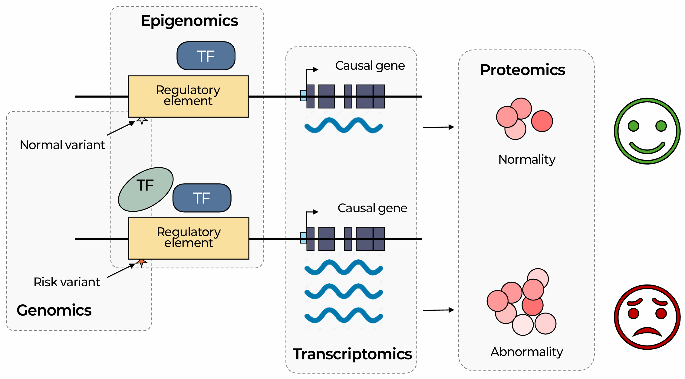

------------------------------------------------------------------------

# 🔑 핵심 용어

| 용어 | 한 줄 설명 |
|--------------------------|----------------------------------------------|
| Microbiome / microbiota | 미생물 군집과 그 집단 유전체 |
| 16S rRNA gene | 가변 영역을 포함하는 보편적인 세균 marker 유전자 |
| Shotgun metagenomics | 시료의 모든 DNA를 sequencing하는 방법 |
| Kit-ome | Reagent를 오염시키는 세균 DNA |
| Feature table | Taxon(또는 pathway) × 시료의 read count 표 |
| OTU / ASV | 97% 유사도 cluster / 정확하게 구분한 서열 |
| Rarefaction | 모든 시료를 같은 깊이로 subsampling하는 방법 |
| Alpha diversity | 한 시료 안의 다양성 |
| Beta diversity | 시료 사이의 비유사도 |
| PCoA | 거리행렬의 ordination |
| PERMANOVA | 군집 거리의 permutation test |
| Compositional data | 고정된 전체합의 제약을 받는 자료 |
| CLR | 각 taxon을 시료의 기하평균으로 나눈 값의 log |
| Differential abundance | 집단 사이에 다른 taxon을 검정하는 분석 |
| Functional redundancy | 서로 다른 taxon이 같은 기능을 가지는 현상 |
| FMT | Faecal microbiota transplantation |

::: {.callout-note collapse="true" icon=false}
## 🔍 더 알아보기 — 심화 용어

| 용어 | 한 줄 설명 |
|--------------------------|----------------------------------------------|
| Mock community | 구성을 알고 있는 strain 혼합물. 양성 대조로 sequencing |
| Host read removal | 사람 genome에 정렬되는 read를 버리는 단계 |
| Functional profiling | Taxon뿐 아니라 유전자와 pathway를 목록화하는 분석 |
| MAG | Metagenomic read에서 assembly한 genome |
| Bray–Curtis / UniFrac | 존재량 기반 / 계통발생 관계를 고려한 거리 |
| Gnotobiotic | 정의된 군집을 이식한 germ-free animal |
:::

------------------------------------------------------------------------

# ➕ 참고문헌

### 종설

Knight R, et al. [*Best practices for analysing microbiomes.*](https://pubmed.ncbi.nlm.nih.gov/?term=Best+practices+for+analysing+microbiomes) Nat Rev Microbiol. 2018.\
Sender R, Fuchs S, Milo R. [*Revised estimates for the number of human and bacteria cells in the body.*](https://pubmed.ncbi.nlm.nih.gov/?term=Revised+estimates+for+the+number+of+human+and+bacteria+cells+in+the+body) PLoS Biol. 2016.\
Fischbach MA. [*Microbiome: focus on causation and mechanism.*](https://pubmed.ncbi.nlm.nih.gov/?term=Microbiome%3A+focus+on+causation+and+mechanism) Cell. 2018.

### Pre-processing과 profiling

Callahan BJ, et al. [*DADA2: high-resolution sample inference from Illumina amplicon data.*](https://doi.org/10.1038/nmeth.3869) Nat Methods. 2016.\
Blanco-Míguez A, et al. [*Extending and improving metagenomic taxonomic profiling with uncharacterized species using MetaPhlAn 4.*](https://pubmed.ncbi.nlm.nih.gov/?term=Extending+and+improving+metagenomic+taxonomic+profiling+with+uncharacterized+species+using+MetaPhlAn+4) Nat Biotechnol. 2023.\
Beghini F, et al. [*Integrating taxonomic, functional, and strain-level profiling of diverse microbial communities with bioBakery 3.*](https://pubmed.ncbi.nlm.nih.gov/?term=Integrating+taxonomic%2C+functional%2C+and+strain-level+profiling+of+diverse+microbial+communities+with+bioBakery+3) eLife. 2021. (HUMAnN 3)\
McMurdie PJ, Holmes S. [*Waste not, want not: why rarefying microbiome data is inadmissible.*](https://pubmed.ncbi.nlm.nih.gov/?term=Waste+not%2C+want+not%3A+why+rarefying+microbiome+data+is+inadmissible) PLoS Comput Biol. 2014.\
Schloss PD. [*Rarefaction is currently the best approach to control for uneven sequencing effort in amplicon sequence analyses.*](https://pubmed.ncbi.nlm.nih.gov/?term=Rarefaction+is+currently+the+best+approach+to+control+for+uneven+sequencing+effort+in+amplicon+sequence+analyses) mSphere. 2024.

### 방법과 함정

Salter SJ, et al. [*Reagent and laboratory contamination can critically impact sequence-based microbiome analyses.*](https://pubmed.ncbi.nlm.nih.gov/?term=Reagent+and+laboratory+contamination+can+critically+impact+sequence-based+microbiome+analyses) BMC Biol. 2014.\
Davis NM, et al. [*Simple statistical identification and removal of contaminant sequences.*](https://pubmed.ncbi.nlm.nih.gov/?term=Simple+statistical+identification+and+removal+of+contaminant+sequences) Microbiome. 2018. (decontam)\
Gloor GB, et al. [*Microbiome datasets are compositional: and this is not optional.*](https://pubmed.ncbi.nlm.nih.gov/?term=Microbiome+datasets+are+compositional%3A+and+this+is+not+optional) Front Microbiol. 2017.\
Nearing JT, et al. [*Microbiome differential abundance methods produce different results across 38 datasets.*](https://doi.org/10.1038/s41467-022-28034-z) Nat Commun. 2022.\
Lin H, Peddada SD. [*Analysis of compositions of microbiomes with bias correction.*](https://doi.org/10.1038/s41467-020-17041-7) Nat Commun. 2020. (ANCOM-BC)

### 교란과 인과성

Forslund K, et al. [*Disentangling type 2 diabetes and metformin treatment signatures in the human gut microbiota.*](https://pubmed.ncbi.nlm.nih.gov/?term=Disentangling+type+2+diabetes+and+metformin+treatment+signatures+in+the+human+gut+microbiota) Nature. 2015.\
Vandeputte D, et al. [*Quantitative microbiome profiling links gut community variation to microbial load.*](https://pubmed.ncbi.nlm.nih.gov/?term=Quantitative+microbiome+profiling+links+gut+community+variation+to+microbial+load) Nature. 2017.\
Vujkovic-Cvijin I, et al. [*Host variables confound gut microbiota studies of human disease.*](https://pubmed.ncbi.nlm.nih.gov/?term=Host+variables+confound+gut+microbiota+studies+of+human+disease) Nature. 2020.\
Walter J, et al. [*Establishing or exaggerating causality for the gut microbiome: lessons from human microbiota-associated rodents.*](https://pubmed.ncbi.nlm.nih.gov/?term=Establishing+or+exaggerating+causality+for+the+gut+microbiome%3A+lessons+from+human+microbiota-associated+rodents) Cell. 2019.

### 자료원

[Human Microbiome Project](https://portal.hmpdacc.org/) · [curatedMetagenomicData](https://waldronlab.io/curatedMetagenomicData/) · [GTDB](https://gtdb.ecogenomic.org/) · [MGnify](https://www.ebi.ac.uk/metagenomics/) · [QIIME 2](https://qiime2.org/)
